Graphs DaysMax for pooled age groups
================
Anne Margit
8/12/2020

    ## 
    ## Attaching package: 'dplyr'

    ## The following objects are masked from 'package:stats':
    ## 
    ##     filter, lag

    ## The following objects are masked from 'package:base':
    ## 
    ##     intersect, setdiff, setequal, union

    ## Loading required package: Matrix

    ## 
    ## Attaching package: 'lmerTest'

    ## The following object is masked from 'package:lme4':
    ## 
    ##     lmer

    ## The following object is masked from 'package:stats':
    ## 
    ##     step

    ## ── Attaching packages ────────────────────────────────────────────────────────────────── tidyverse 1.3.0 ──

    ## ✓ tibble  3.0.1     ✓ purrr   0.3.4
    ## ✓ tidyr   1.1.0     ✓ stringr 1.4.0
    ## ✓ readr   1.3.1     ✓ forcats 0.5.0

    ## ── Conflicts ───────────────────────────────────────────────────────────────────── tidyverse_conflicts() ──
    ## x tidyr::expand() masks Matrix::expand()
    ## x dplyr::filter() masks stats::filter()
    ## x dplyr::lag()    masks stats::lag()
    ## x tidyr::pack()   masks Matrix::pack()
    ## x tidyr::unpack() masks Matrix::unpack()

    ## 
    ## Attaching package: 'rockchalk'

    ## The following object is masked from 'package:dplyr':
    ## 
    ##     summarize

This dataset includes measurements from participants that (1) provided
at least 3 measurements, (2) that are residents of the country they
currently live in, (3) from countries with at least 20 participants, (4)
provided data on age, and (5) with imputed Stringency index values that
are (6) centered around country means and (7) a variable called DaysMax
that indicates the days preceding or leading up to the day on which
maximum stringency was reached for the respective country, and (8) from
all waves (baseline through wave 11) for (9) the pooled age groups

\!\!\! DaysMax = 0: Day on which maximum stringency was reached for
country in which participant lives. This is based on available
Stringency Index data, not imputed scores \!\!\!

``` r
load("data_long_min3_str_age_max.Rdata")
```

# Anxiety

Plot Anxiety and DaysMax for different age groups / LOESS plot (doesn’t
work well for large datasets? check
this)

``` r
plot_anx <- ggplot(data = data_long_min3_str_age_max, aes(x = DaysMax, y = Anxiety, group = ID, color = age_new))

plot_anx + stat_smooth(aes(group=age_new), se = FALSE, method = "loess", formula = y ~ x, size = 1, na.rm=TRUE) + scale_colour_discrete(name = "Age", 
labels = c("18-24", "25-44", "45-64", "65+")) + labs(title="LOESS plot of Anxiety by DaysMax for different age groups")
```

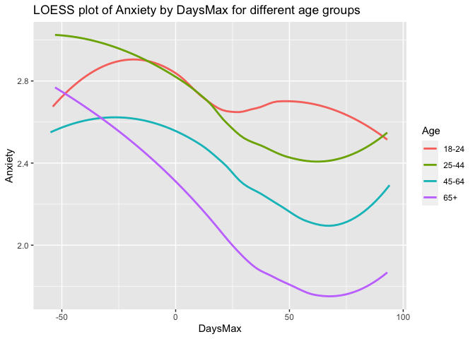<!-- -->
GAM
plot

``` r
plot_anx + stat_smooth(aes(group=age_new), se = FALSE, method = "gam", formula = y ~ x, size = 1, na.rm=TRUE) + scale_colour_discrete(name = "Age", 
labels = c("18-24", "25-44", "45-64", "65+")) + labs(title="GAM plot of Anxiety by DaysMax for different age groups")
```

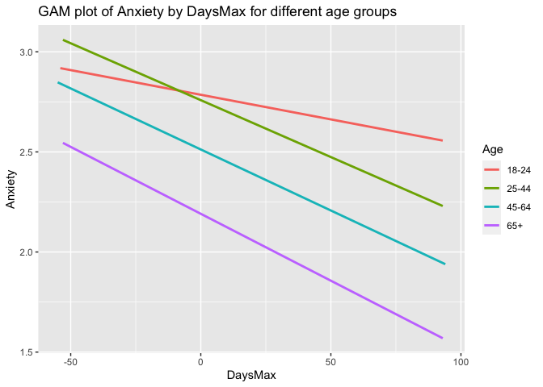<!-- -->

# Anger

LOESS plot Anger and DaysMax for different age
groups

``` r
plot_ang <- ggplot(data = data_long_min3_str_age_max, aes(x = DaysMax, y = Ang, group = ID, color = age_new))

plot_ang + stat_smooth(aes(group=age_new), se = FALSE, method = "loess", formula = y ~ x, size = 1, na.rm=TRUE) + scale_colour_discrete(name = "Age", 
labels = c("18-24", "25-44", "45-64", "65+")) + labs(title="LOESS plot of Anger by DaysMax for different age groups", y ="Anger")
```

<!-- -->
GAM
plot

``` r
plot_ang + stat_smooth(aes(group=age_new), se = FALSE, method = "gam", formula = y ~ x, size = 1, na.rm=TRUE) + scale_colour_discrete(name = "Age", 
labels = c("18-24", "25-44", "45-64", "65+")) + labs(title="GAM plot of Anger by DaysMax for different age groups", y ="Anger")
```

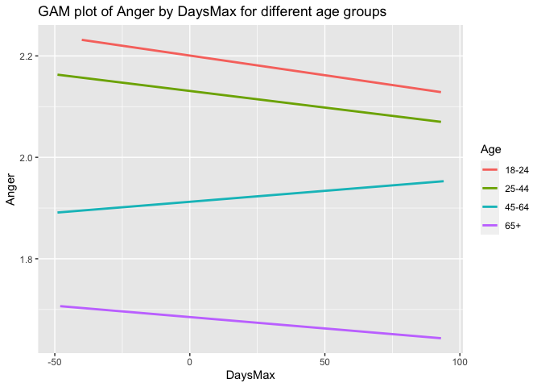<!-- -->

# Bored

LOESS plot Boredom and DaysMax for different age groups / lot of missing
data in
Boredom

``` r
plot_bor <- ggplot(data = data_long_min3_str_age_max, aes(x = DaysMax, y = Bored, group = ID, color = age_new))

plot_bor + stat_smooth(aes(group=age_new), se = FALSE, method = "loess", formula = y ~ x, size = 1, na.rm=TRUE) + scale_colour_discrete(name = "Age", 
labels = c("18-24", "25-44", "45-64", "65+")) + labs(title="LOESS plot of Boredom by DaysMax for different age groups", y ="Boredom")
```

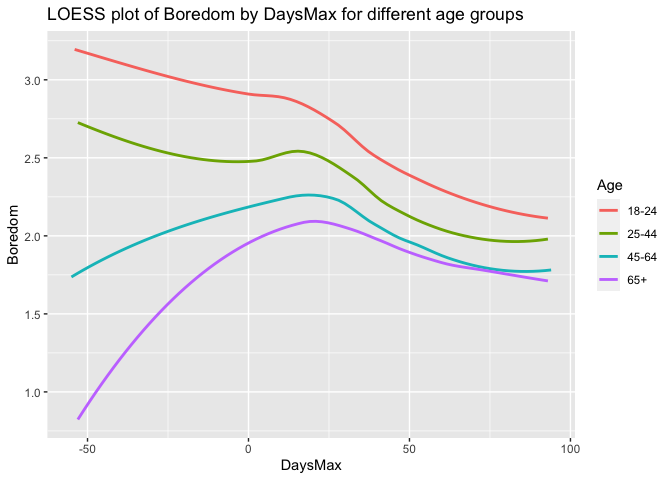<!-- -->
GAM
plot

``` r
plot_bor + stat_smooth(aes(group=age_new), se = FALSE, method = "gam", formula = y ~ x, size = 1, na.rm=TRUE) + scale_colour_discrete(name = "Age", 
labels = c("18-24", "25-44", "45-64", "65+")) + labs(title="GAM plot of Boredom by DaysMax for different age groups", y ="Boredom")
```

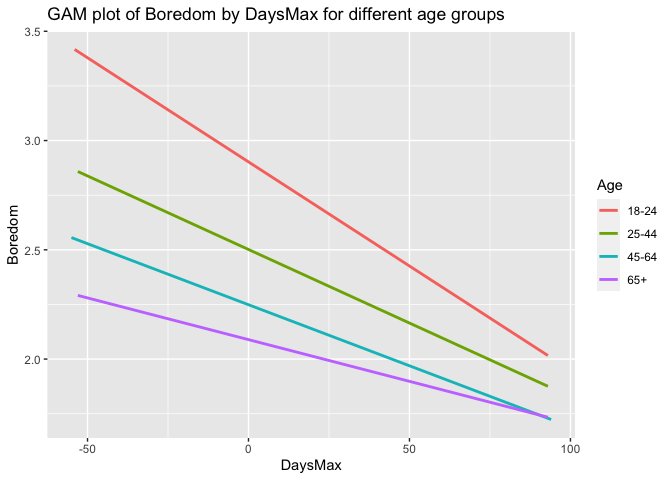<!-- -->

# Calm

LOESS plot Calm and DaysMax for different age
groups

``` r
plot_calm <- ggplot(data = data_long_min3_str_age_max, aes(x = DaysMax, y = Calm, group = ID, color = age_new))

plot_calm + stat_smooth(aes(group=age_new), se = FALSE, method = "loess", formula = y ~ x, size = 1, na.rm=TRUE) + scale_colour_discrete(name = "Age", 
labels = c("18-24", "25-44", "45-64", "65+")) + labs(title="LOESS plot of Calm by DaysMax for different age groups", y ="Calm")
```

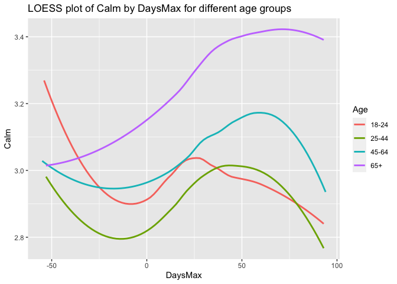<!-- -->

GAM
plot

``` r
plot_calm + stat_smooth(aes(group=age_new), se = FALSE, method = "gam", formula = y ~ x, size = 1) + scale_colour_discrete(name = "Age", 
labels = c("18-24", "25-44", "45-64", "65+")) + labs(title="GAM plot of Calm by DaysMax for different age groups", y ="Calm")
```

    ## Warning: Removed 66033 rows containing non-finite values (stat_smooth).

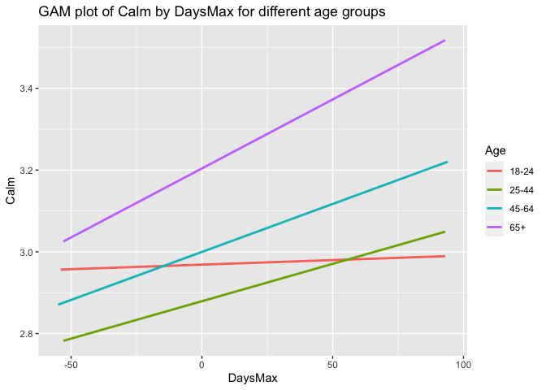<!-- -->

# Depressed

LOESS plot Depressed and DaysMax for different age
groups

``` r
plot_depr <- ggplot(data = data_long_min3_str_age_max, aes(x = DaysMax, y = Depr, group = ID, color = age_new))

plot_depr + stat_smooth(aes(group=age_new), se = FALSE, method = "loess", formula = y ~ x, size = 1, na.rm=TRUE) + scale_colour_discrete(name = "Age", 
labels = c("18-24", "25-44", "45-64", "65+")) + labs(title="LOESS plot of Depressed by DaysMax for different age groups", y ="Depr")
```

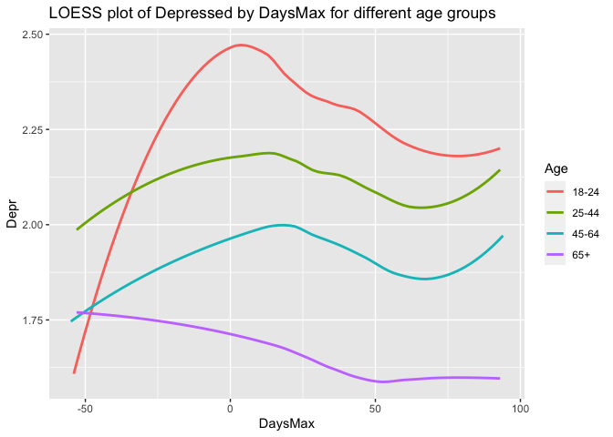<!-- -->
GAM
plot

``` r
plot_depr + stat_smooth(aes(group=age_new), se = FALSE, method = "gam", formula = y ~ x, size = 1, na.rm=TRUE) + scale_colour_discrete(name = "Age", 
labels = c("18-24", "25-44", "45-64", "65+")) + labs(title="GAM plot of Depressed by DaysMax for different age groups", y ="Depr")
```

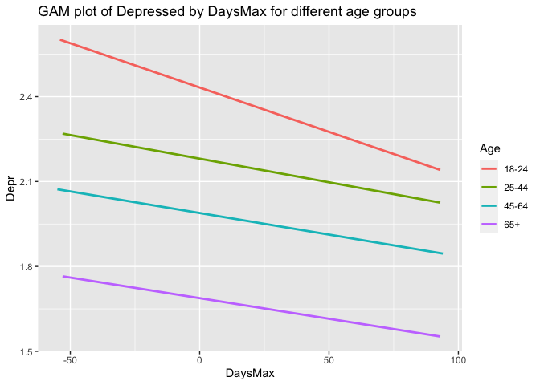<!-- -->

# Energetic

LOESS plot Energetic and DaysMax for different age
groups

``` r
plot_energ <- ggplot(data = data_long_min3_str_age_max, aes(x = DaysMax, y = Energ, group = ID, color = age_new))

plot_energ + stat_smooth(aes(group=age_new), se = FALSE, method = "loess", formula = y ~ x, size = 1, na.rm=TRUE) + scale_colour_discrete(name = "Age", 
labels = c("18-24", "25-44", "45-64", "65+")) + labs(title="LOESS plot of Energetic by DaysMax for different age groups", y ="Energ")
```

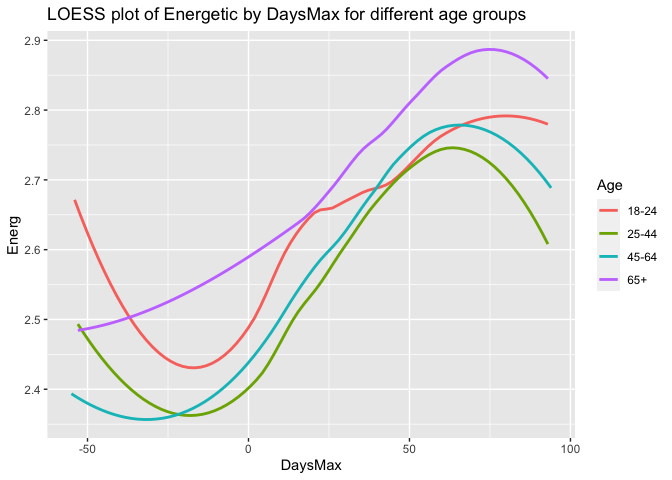<!-- -->
GAM
plot

``` r
plot_energ + stat_smooth(aes(group=age_new), se = FALSE, method = "gam", formula = y ~ x, size = 1, na.rm=TRUE) + scale_colour_discrete(name = "Age", 
labels = c("18-24", "25-44", "45-64", "65+")) + labs(title="GAM plot of Energetic by DaysMax for different age groups", y ="Energ")
```

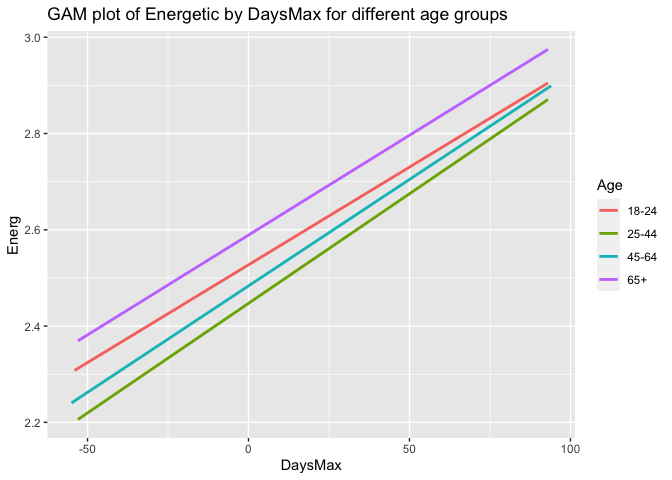<!-- -->

# Exhausted

LOESS plot Exhausted and DaysMax for different age
groups

``` r
plot_exh <- ggplot(data = data_long_min3_str_age_max, aes(x = DaysMax, y = Exh, group = ID, color = age_new))

plot_exh + stat_smooth(aes(group=age_new), se = FALSE, method = "loess", formula = y ~ x, size = 1, na.rm=TRUE) + scale_colour_discrete(name = "Age", 
labels = c("18-24", "25-44", "45-64", "65+")) + labs(title="LOESS plot of Exhausted by DaysMax for different age groups", y ="Exh")
```

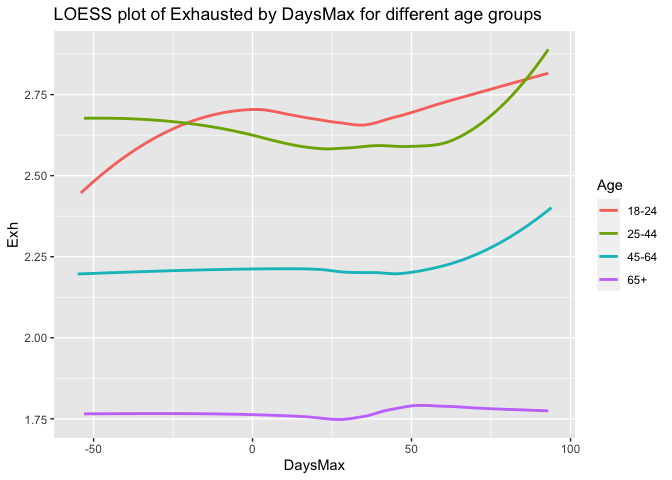<!-- -->
GAM
plot

``` r
plot_exh + stat_smooth(aes(group=age_new), se = FALSE, method = "gam", formula = y ~ x, size = 1, na.rm=TRUE) + scale_colour_discrete(name = "Age", 
labels = c("18-24", "25-44", "45-64", "65+")) + labs(title="GAM plot of Exhausted by DaysMax for different age groups", y ="Exh")
```

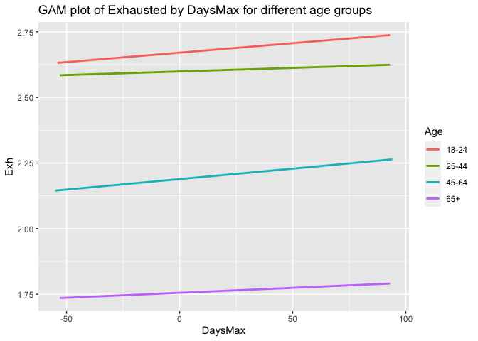<!-- -->

# Inspired

LOESS plot inspired and DaysMax for different age
groups

``` r
plot_insp <- ggplot(data = data_long_min3_str_age_max, aes(x = DaysMax, y = Insp, group = ID, color = age_new))

plot_insp + stat_smooth(aes(group=age_new), se = FALSE, method = "loess", formula = y ~ x, size = 1, na.rm=TRUE) + scale_colour_discrete(name = "Age", 
labels = c("18-24", "25-44", "45-64", "65+")) + labs(title="LOESS plot of Inspired by DaysMax for different age groups", y ="Insp")
```

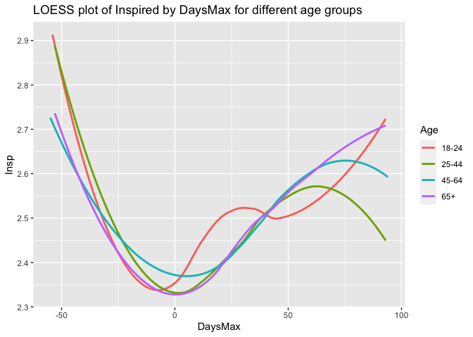<!-- -->
GAM
plot

``` r
plot_insp + stat_smooth(aes(group=age_new), se = FALSE, method = "gam", formula = y ~ x, size = 1, na.rm=TRUE) + scale_colour_discrete(name = "Age", 
labels = c("18-24", "25-44", "45-64", "65+")) + labs(title="GAM plot of Inspired by DaysMax for different age groups", y ="Insp")
```

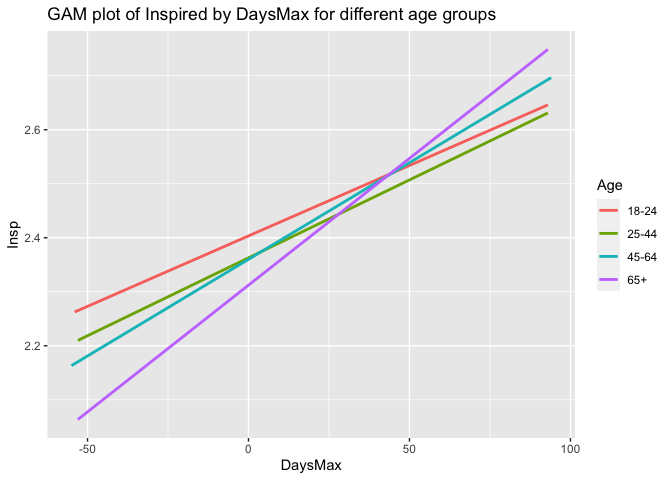<!-- -->

# Loved

LOESS plot Loved and DaysMax for different age
groups

``` r
plot_lov <- ggplot(data = data_long_min3_str_age_max, aes(x = DaysMax, y = Lov, group = ID, color = age_new))

plot_lov + stat_smooth(aes(group=age_new), se = FALSE, method = "loess", formula = y ~ x, size = 1, na.rm=TRUE) + scale_colour_discrete(name = "Age", 
labels = c("18-24", "25-44", "45-64", "65+")) + labs(title="LOESS plot of Loved by DaysMax for different age groups", y ="Lov")
```

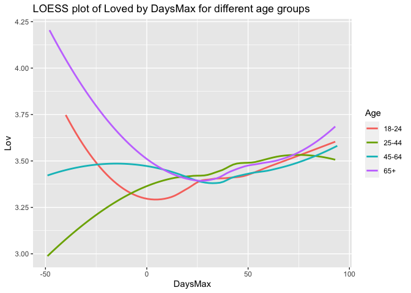<!-- -->
GAM
plot

``` r
plot_lov + stat_smooth(aes(group=age_new), se = FALSE, method = "gam", formula = y ~ x, size = 1, na.rm=TRUE) + scale_colour_discrete(name = "Age", 
labels = c("18-24", "25-44", "45-64", "65+")) + labs(title="GAM plot of Inspired by DaysMax for different age groups", y ="Lov")
```

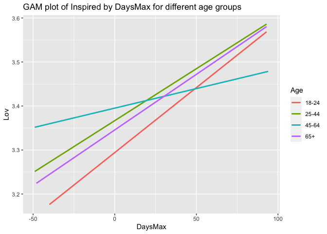<!-- -->

# Nervous

LOESS plot Nervous and DaysMax for different age
groups

``` r
plot_nerv <- ggplot(data = data_long_min3_str_age_max, aes(x = DaysMax, y = Nerv, group = ID, color = age_new))

plot_nerv + stat_smooth(aes(group=age_new), se = FALSE, method = "loess", formula = y ~ x, size = 1, na.rm=TRUE) + scale_colour_discrete(name = "Age", 
labels = c("18-24", "25-44", "45-64", "65+")) + labs(title="LOESS plot of Nervousness by DaysMax for different age groups", y ="Nerv")
```

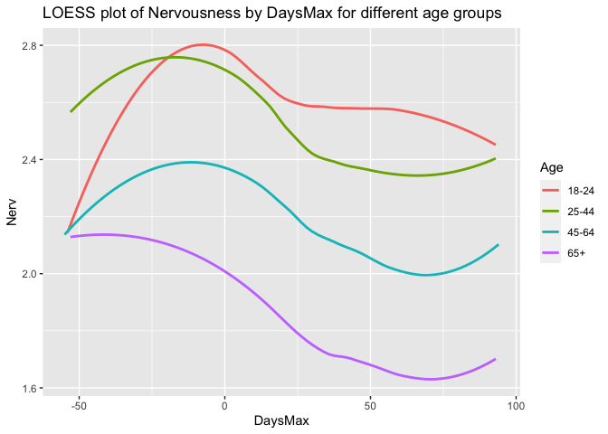<!-- -->
GAM
plot

``` r
plot_nerv + stat_smooth(aes(group=age_new), se = FALSE, method = "gam", formula = y ~ x, size = 1, na.rm=TRUE) + scale_colour_discrete(name = "Age", 
labels = c("18-24", "25-44", "45-64", "65+")) + labs(title="GAM plot of Nervousness by DaysMax for different age groups", y ="Nerv")
```

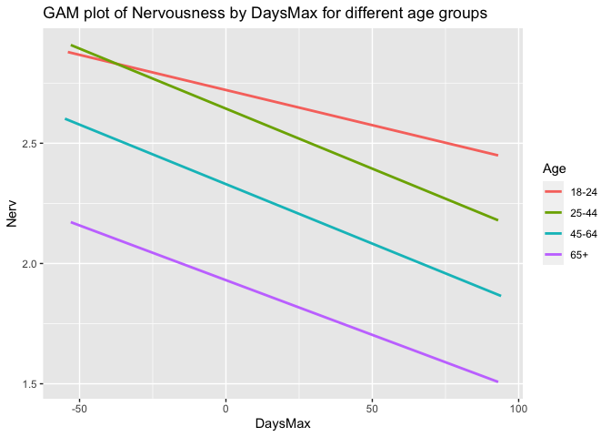<!-- -->

# Relaxed

LOESS plot Relaxed and DaysMax for different age
groups

``` r
plot_rel <- ggplot(data = data_long_min3_str_age_max, aes(x = DaysMax, y = Rel, group = ID, color = age_new))

plot_rel + stat_smooth(aes(group=age_new), se = FALSE, method = "loess", formula = y ~ x, size = 1, na.rm=TRUE) + scale_colour_discrete(name = "Age", 
labels = c("18-24", "25-44", "45-64", "65+")) + labs(title="LOESS plot of Relaxed by DaysMax for different age groups", y ="Rel")
```

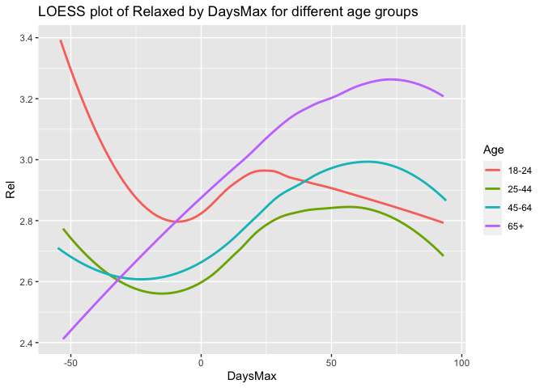<!-- -->
GAM
plot

``` r
plot_rel + stat_smooth(aes(group=age_new), se = FALSE, method = "gam", formula = y ~ x, size = 1, na.rm=TRUE) + scale_colour_discrete(name = "Age", 
labels =  c("18-24", "25-44", "45-64", "65+")) + labs(title="GAM plot of Relaxed by DaysMax for different age groups", y ="Rel")
```

<!-- -->
