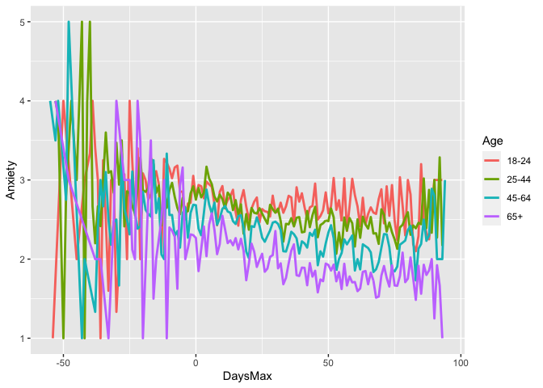
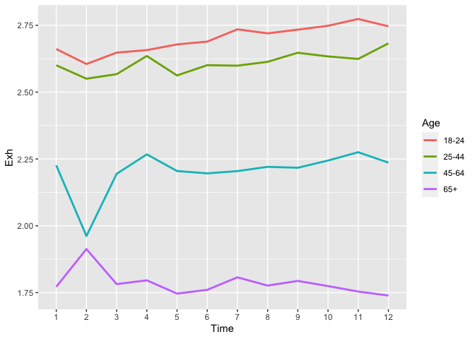
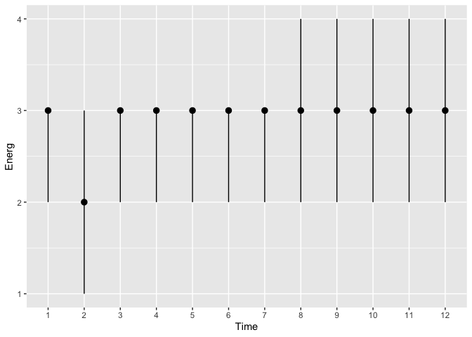
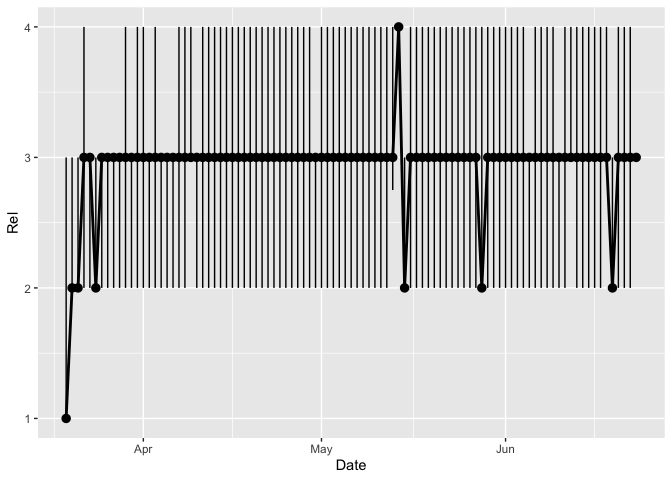

200821 Plots of emotions against stringency or time for different age
groups
================
Anne Margit
8/21/2020

*New output of plots to show emotions against time (date), and against
days before/ after maximum stringency, pooled for the 4 age groups*

This dataset includes measurements from participants that (1) provided
at least 3 measurements, (2) that are residents of the country they
currently live in, (3) from countries with at least 20 participants, (4)
provided data on age, and (5) with imputed Stringency index values that
are (6) centered around country means and (7) a variable called DaysMax
that indicates the days preceding or leading up to the day on which
maximum stringency was reached for the respective country, and (8) from
all waves (baseline through wave 11) for (9) the pooled age groups

\!\!\! DaysMax = 0: Day on which maximum stringency was reached for
country in which participant lives. This is based on available
Stringency Index data, not imputed scores \!\!\!

``` r
load("data_long_min3_str_age_max.Rdata")
```

# Anger

**Median anger against date**

``` r
plot_ang <- ggplot(data_long_min3_str_age_max, aes(x=Date, y=Ang))

plot_ang +  stat_summary(geom = "line", fun = median, size=1) + stat_summary(fun.data = median_hilow, 
                                                                    fun.args = (conf.int=.5))
```

<!-- -->

**Median anger against wave**

``` r
plot_ang <- ggplot(data_long_min3_str_age_max, aes(x=Time, y=Ang))

plot_ang +  stat_summary(geom = "line", fun = median, size=1) + stat_summary(fun.data = median_hilow, 
                                                                    fun.args = (conf.int=.5))
```

<!-- -->

**Median anger against maximum stringency**

``` r
plot_ang <- ggplot(data_long_min3_str_age_max, aes(x=DaysMax, y=Ang))

plot_ang +  stat_summary(geom = "line", fun = median, size=1) + stat_summary(fun.data = median_hilow, 
                                                                    fun.args = (conf.int=.5))
```

<!-- -->

**Mean anger against date in different age
groups**

``` r
plot_ang <- ggplot(data_long_min3_str_age_max, aes(x=Date, y=Ang, group = Age_new, color = Age_new))

plot_ang +  stat_summary(geom = "line", fun = mean, size=1) + scale_colour_discrete(name = "Age", 
labels = c("18-24", "25-44", "45-64", "65+"))
```

<!-- -->

**Mean anger against wave in different age
groups**

``` r
plot_ang <- ggplot(data_long_min3_str_age_max, aes(x=Time, y=Ang, group = Age_new, color = Age_new))

plot_ang +  stat_summary(geom = "line", fun = mean, size=1) + scale_colour_discrete(name = "Age", 
labels = c("18-24", "25-44", "45-64", "65+"))
```

<!-- -->

**Mean anger against maximum stringency in different age
groups**

``` r
plot_ang <- ggplot(data_long_min3_str_age_max, aes(x=DaysMax, y=Ang, group = Age_new, color = Age_new))

plot_ang +  stat_summary(geom = "line", fun = mean, size=1) + scale_colour_discrete(name = "Age", 
labels = c("18-24", "25-44", "45-64", "65+"))
```

<!-- -->

# Anxiety

**Median anxiety against date**

``` r
plot_anx <- ggplot(data_long_min3_str_age_max, aes(x=Date, y=Anxiety))

plot_anx +  stat_summary(geom = "line", fun = median, size=1) + stat_summary(fun.data = median_hilow, 
                                                                    fun.args = (conf.int=.5))
```

<!-- -->

**Median anxiety against wave**

``` r
plot_anx <- ggplot(data_long_min3_str_age_max, aes(x=Time, y=Anxiety))

plot_anx +  stat_summary(geom = "line", fun = median, size=1) + stat_summary(fun.data = median_hilow, 
                                                                    fun.args = (conf.int=.5))
```

<!-- -->

**Median anxiety against maximum
stringency**

``` r
plot_anx <- ggplot(data_long_min3_str_age_max, aes(x=DaysMax, y=Anxiety))

plot_anx +  stat_summary(geom = "line", fun = median, size=1) + stat_summary(fun.data = median_hilow, 
                                                                    fun.args = (conf.int=.5))
```

<!-- -->

**Mean anxiety against date in different age
groups**

``` r
plot_anx <- ggplot(data_long_min3_str_age_max, aes(x=Date, y=Anxiety, group = Age_new, color = Age_new))

plot_anx +  stat_summary(geom = "line", fun = mean, size=1) + scale_colour_discrete(name = "Age", 
labels = c("18-24", "25-44", "45-64", "65+"))
```

<!-- -->
**Mean anxiety against wave in different age
groups**

``` r
plot_anx <- ggplot(data_long_min3_str_age_max, aes(x=Time, y=Anxiety, group = Age_new, color = Age_new))

plot_anx +  stat_summary(geom = "line", fun = mean, size=1) + scale_colour_discrete(name = "Age", 
labels = c("18-24", "25-44", "45-64", "65+"))
```

<!-- -->

**Mean anxiety against maximum stringency in different age
groups**

``` r
plot_anx <- ggplot(data_long_min3_str_age_max, aes(x=DaysMax, y=Anxiety, group = Age_new, color = Age_new))

plot_anx +  stat_summary(geom = "line", fun = mean, size=1) + scale_colour_discrete(name = "Age", 
labels = c("18-24", "25-44", "45-64", "65+"))
```

<!-- -->

# Nervous

**Median nervous against date**

``` r
plot_nerv <- ggplot(data_long_min3_str_age_max, aes(x=Date, y=Nerv))

plot_nerv +  stat_summary(geom = "line", fun = median, size=1) + stat_summary(fun.data = median_hilow, 
                                                                    fun.args = (conf.int=.5))
```

<!-- -->

**Median nervous against wave**

``` r
plot_nerv <- ggplot(data_long_min3_str_age_max, aes(x=Time, y=Nerv))

plot_nerv +  stat_summary(geom = "line", fun = median, size=1) + stat_summary(fun.data = median_hilow, 
                                                                    fun.args = (conf.int=.5))
```

<!-- -->

**Median nervous against maximum stringency**

``` r
plot_nerv <- ggplot(data_long_min3_str_age_max, aes(x=DaysMax, y=Nerv))

plot_nerv +  stat_summary(geom = "line", fun = median, size=1) + stat_summary(fun.data = median_hilow, 
                                                                    fun.args = (conf.int=.5))
```

<!-- -->

**Mean nervous against date in different age
groups**

``` r
plot_nerv <- ggplot(data_long_min3_str_age_max, aes(x=Date, y=Nerv, group = Age_new, color = Age_new))

plot_nerv +  stat_summary(geom = "line", fun = mean, size=1) + scale_colour_discrete(name = "Age", 
labels = c("18-24", "25-44", "45-64", "65+"))
```

<!-- -->

**Mean nervous against wave in different age
groups**

``` r
plot_nerv <- ggplot(data_long_min3_str_age_max, aes(x=Time, y=Nerv, group = Age_new, color = Age_new))

plot_nerv +  stat_summary(geom = "line", fun = mean, size=1) + scale_colour_discrete(name = "Age", 
labels = c("18-24", "25-44", "45-64", "65+"))
```

<!-- -->

**Mean nervous against maximum stringency in different age
groups**

``` r
plot_nerv <- ggplot(data_long_min3_str_age_max, aes(x=DaysMax, y=Nerv, group = Age_new, color = Age_new))

plot_nerv +  stat_summary(geom = "line", fun = mean, size=1) + scale_colour_discrete(name = "Age", 
labels = c("18-24", "25-44", "45-64", "65+"))
```

<!-- -->

# Depressed

**Median depressed against date**

``` r
plot_dep <- ggplot(data_long_min3_str_age_max, aes(x=Date, y=Depr))

plot_dep +  stat_summary(geom = "line", fun = median, size=1) + stat_summary(fun.data = median_hilow, 
                                                                    fun.args = (conf.int=.5))
```

<!-- -->

**Median depressed against wave**

``` r
plot_dep <- ggplot(data_long_min3_str_age_max, aes(x=Time, y=Depr))

plot_dep +  stat_summary(geom = "line", fun = median, size=1) + stat_summary(fun.data = median_hilow, 
                                                                    fun.args = (conf.int=.5))
```

<!-- -->

**Median depressed against maximum stringency**

``` r
plot_dep <- ggplot(data_long_min3_str_age_max, aes(x=DaysMax, y=Depr))

plot_dep +  stat_summary(geom = "line", fun = median, size=1) + stat_summary(fun.data = median_hilow, 
                                                                    fun.args = (conf.int=.5))
```

<!-- -->

**Mean depressed against date in different age
groups**

``` r
plot_dep <- ggplot(data_long_min3_str_age_max, aes(x=Date, y=Depr, group = Age_new, color = Age_new))

plot_dep +  stat_summary(geom = "line", fun = mean, size=1) + scale_colour_discrete(name = "Age", 
labels = c("18-24", "25-44", "45-64", "65+"))
```

<!-- -->

**Mean depressed against wave in different age
groups**

``` r
plot_dep <- ggplot(data_long_min3_str_age_max, aes(x=Time, y=Depr, group = Age_new, color = Age_new))

plot_dep +  stat_summary(geom = "line", fun = mean, size=1) + scale_colour_discrete(name = "Age", 
labels = c("18-24", "25-44", "45-64", "65+"))
```

<!-- -->

**Mean depressed against maximum stringency in different age
groups**

``` r
plot_dep <- ggplot(data_long_min3_str_age_max, aes(x=DaysMax, y=Depr, group = Age_new, color = Age_new))

plot_dep +  stat_summary(geom = "line", fun = mean, size=1) + scale_colour_discrete(name = "Age", 
labels = c("18-24", "25-44", "45-64", "65+"))
```

<!-- -->

# Exhausted

**Median exhausted against date**

``` r
plot_dep <- ggplot(data_long_min3_str_age_max, aes(x=Date, y=Exh))

plot_dep +  stat_summary(geom = "line", fun = median, size=1) + stat_summary(fun.data = median_hilow, 
                                                                    fun.args = (conf.int=.5))
```

<!-- -->

**Median exhausted against wave**

``` r
plot_dep <- ggplot(data_long_min3_str_age_max, aes(x=Time, y=Exh))

plot_dep +  stat_summary(geom = "line", fun = median, size=1) + stat_summary(fun.data = median_hilow, 
                                                                    fun.args = (conf.int=.5))
```

<!-- -->

**Median exhausted against maximum stringency**

``` r
plot_exh <- ggplot(data_long_min3_str_age_max, aes(x=DaysMax, y=Exh))

plot_exh +  stat_summary(geom = "line", fun = median, size=1) + stat_summary(fun.data = median_hilow, 
                                                                    fun.args = (conf.int=.5))
```

<!-- -->

**Mean exhausted against date in different age
groups**

``` r
plot_exh <- ggplot(data_long_min3_str_age_max, aes(x=Date, y=Exh, group = Age_new, color = Age_new))

plot_exh +  stat_summary(geom = "line", fun = mean, size=1) + scale_colour_discrete(name = "Age", 
labels = c("18-24", "25-44", "45-64", "65+"))
```

<!-- -->

**Mean exhausted against wave in different age
groups**

``` r
plot_exh <- ggplot(data_long_min3_str_age_max, aes(x=Time, y=Exh, group = Age_new, color = Age_new))

plot_exh +  stat_summary(geom = "line", fun = mean, size=1) + scale_colour_discrete(name = "Age", 
labels = c("18-24", "25-44", "45-64", "65+"))
```

<!-- -->

**Mean exhausted against maximum stringency in different age
groups**

``` r
plot_exh <- ggplot(data_long_min3_str_age_max, aes(x=DaysMax, y=Exh, group = Age_new, color = Age_new))

plot_exh +  stat_summary(geom = "line", fun = mean, size=1) + scale_colour_discrete(name = "Age", 
labels = c("18-24", "25-44", "45-64", "65+"))
```

<!-- -->

# Energetic

**Median energetic against date**

``` r
plot_energ <- ggplot(data_long_min3_str_age_max, aes(x=Date, y=Energ))

plot_energ +  stat_summary(geom = "line", fun = median, size=1) + stat_summary(fun.data = median_hilow, 
                                                                    fun.args = (conf.int=.5))
```

<!-- -->

**Median energetic against wave**

``` r
plot_energ <- ggplot(data_long_min3_str_age_max, aes(x=Time, y=Energ))

plot_energ +  stat_summary(geom = "line", fun = median, size=1) + stat_summary(fun.data = median_hilow, 
                                                                    fun.args = (conf.int=.5))
```

<!-- -->

**Median energetic against maximum
stringency**

``` r
plot_energ <- ggplot(data_long_min3_str_age_max, aes(x=DaysMax, y=Energ))

plot_energ +  stat_summary(geom = "line", fun = median, size=1) + stat_summary(fun.data = median_hilow, 
                                                                    fun.args = (conf.int=.5))
```

<!-- -->

**Mean energetic against date in different age
groups**

``` r
plot_energ <- ggplot(data_long_min3_str_age_max, aes(x=Date, y=Energ, group = Age_new, color = Age_new))

plot_energ +  stat_summary(geom = "line", fun = mean, size=1) + scale_colour_discrete(name = "Age", 
labels = c("18-24", "25-44", "45-64", "65+"))
```

<!-- -->

**Mean energetic against wave in different age
groups**

``` r
plot_energ <- ggplot(data_long_min3_str_age_max, aes(x=Time, y=Energ, group = Age_new, color = Age_new))

plot_energ +  stat_summary(geom = "line", fun = mean, size=1) + scale_colour_discrete(name = "Age", 
labels = c("18-24", "25-44", "45-64", "65+"))
```

<!-- -->

**Mean energetic against maximum stringency in different age
groups**

``` r
plot_energ <- ggplot(data_long_min3_str_age_max, aes(x=DaysMax, y=Energ, group = Age_new, color = Age_new))

plot_energ +  stat_summary(geom = "line", fun = mean, size=1) + scale_colour_discrete(name = "Age", 
labels = c("18-24", "25-44", "45-64", "65+"))
```

<!-- -->

# Inspired

**Median inspired against date**

``` r
plot_insp <- ggplot(data_long_min3_str_age_max, aes(x=Date, y=Insp))

plot_insp +  stat_summary(geom = "line", fun = median, size=1) + stat_summary(fun.data = median_hilow, 
                                                                    fun.args = (conf.int=.5))
```

<!-- -->

**Median inspired against wave**

``` r
plot_insp <- ggplot(data_long_min3_str_age_max, aes(x=Time, y=Insp))

plot_insp +  stat_summary(geom = "line", fun = median, size=1) + stat_summary(fun.data = median_hilow, 
                                                                    fun.args = (conf.int=.5))
```

<!-- -->

**Median inspired against maximum stringency**

``` r
plot_insp <- ggplot(data_long_min3_str_age_max, aes(x=DaysMax, y=Insp))

plot_insp +  stat_summary(geom = "line", fun = median, size=1) + stat_summary(fun.data = median_hilow, 
                                                                    fun.args = (conf.int=.5))
```

<!-- -->

**Mean inspired against date in different age
groups**

``` r
plot_insp <- ggplot(data_long_min3_str_age_max, aes(x=Date, y=Insp, group = Age_new, color = Age_new))

plot_insp +  stat_summary(geom = "line", fun = mean, size=1) + scale_colour_discrete(name = "Age", 
labels = c("18-24", "25-44", "45-64", "65+"))
```

<!-- -->

**Mean inspired against wave in different age
groups**

``` r
plot_insp <- ggplot(data_long_min3_str_age_max, aes(x=Time, y=Insp, group = Age_new, color = Age_new))

plot_insp +  stat_summary(geom = "line", fun = mean, size=1) + scale_colour_discrete(name = "Age", 
labels = c("18-24", "25-44", "45-64", "65+"))
```

<!-- -->

**Mean inspired against maximum stringency in different age
groups**

``` r
plot_insp <- ggplot(data_long_min3_str_age_max, aes(x=DaysMax, y=Insp, group = Age_new, color = Age_new))

plot_insp +  stat_summary(geom = "line", fun = mean, size=1) + scale_colour_discrete(name = "Age", 
labels = c("18-24", "25-44", "45-64", "65+"))
```

<!-- -->

# Calm

**Median calm against date**

``` r
plot_calm <- ggplot(data_long_min3_str_age_max, aes(x=Date, y=Calm))

plot_calm +  stat_summary(geom = "line", fun = median, size=1) + stat_summary(fun.data = median_hilow, 
                                                                    fun.args = (conf.int=.5))
```

<!-- -->

**Median calm against wave**

``` r
plot_calm <- ggplot(data_long_min3_str_age_max, aes(x=Time, y=Calm))

plot_calm +  stat_summary(geom = "line", fun = median, size=1) + stat_summary(fun.data = median_hilow, 
                                                                    fun.args = (conf.int=.5))
```

<!-- -->

**Median calm against maximum stringency**

``` r
plot_calm <- ggplot(data_long_min3_str_age_max, aes(x=DaysMax, y=Calm))

plot_calm +  stat_summary(geom = "line", fun = median, size=1) + stat_summary(fun.data = median_hilow, 
                                                                    fun.args = (conf.int=.5))
```

<!-- -->

**Mean calm against date in different age
groups**

``` r
plot_calm <- ggplot(data_long_min3_str_age_max, aes(x=Date, y=Calm, group = Age_new, color = Age_new))

plot_calm +  stat_summary(geom = "line", fun = mean, size=1) + scale_colour_discrete(name = "Age", 
labels = c("18-24", "25-44", "45-64", "65+"))
```

<!-- -->

**Mean calm against wave in different age
groups**

``` r
plot_calm <- ggplot(data_long_min3_str_age_max, aes(x=Time, y=Calm, group = Age_new, color = Age_new))

plot_calm +  stat_summary(geom = "line", fun = mean, size=1) + scale_colour_discrete(name = "Age", 
labels = c("18-24", "25-44", "45-64", "65+"))
```

<!-- -->

**Mean calm against maximum stringency in different age
groups**

``` r
plot_calm <- ggplot(data_long_min3_str_age_max, aes(x=DaysMax, y=Calm, group = Age_new, color = Age_new))

plot_calm +  stat_summary(geom = "line", fun = mean, size=1) + scale_colour_discrete(name = "Age", 
labels = c("18-24", "25-44", "45-64", "65+"))
```

<!-- -->

# Relaxed

**Median relaxed against date**

``` r
plot_rel <- ggplot(data_long_min3_str_age_max, aes(x=Date, y=Rel))

plot_rel +  stat_summary(geom = "line", fun = median, size=1) + stat_summary(fun.data = median_hilow, 
                                                                    fun.args = (conf.int=.5))
```

<!-- -->

**Median relaxed against wave**

``` r
plot_rel <- ggplot(data_long_min3_str_age_max, aes(x=Time, y=Rel))

plot_rel +  stat_summary(geom = "line", fun = median, size=1) + stat_summary(fun.data = median_hilow, 
                                                                    fun.args = (conf.int=.5))
```

<!-- -->

**Median relaxed against maximum stringency**

``` r
plot_rel <- ggplot(data_long_min3_str_age_max, aes(x=DaysMax, y=Rel))

plot_rel +  stat_summary(geom = "line", fun = median, size=1) + stat_summary(fun.data = median_hilow, 
                                                                    fun.args = (conf.int=.5))
```

<!-- -->

**Mean relaxed against date in different age
groups**

``` r
plot_rel <- ggplot(data_long_min3_str_age_max, aes(x=Date, y=Rel, group = Age_new, color = Age_new))

plot_rel +  stat_summary(geom = "line", fun = mean, size=1) + scale_colour_discrete(name = "Age", 
labels = c("18-24", "25-44", "45-64", "65+"))
```

<!-- -->

**Mean relaxed against wave (= “Time”) in different age
groups**

``` r
plot_rel <- ggplot(data_long_min3_str_age_max, aes(x=Time, y=Rel, group = Age_new, color = Age_new))

plot_rel +  stat_summary(geom = "line", fun = mean, size=1) + scale_colour_discrete(name = "Age", 
labels = c("18-24", "25-44", "45-64", "65+"))
```

<!-- -->

**Mean relaxed against maximum stringency in different age
groups**

``` r
plot_rel <- ggplot(data_long_min3_str_age_max, aes(x=DaysMax, y=Rel, group = Age_new, color = Age_new))

plot_rel +  stat_summary(geom = "line", fun = mean, size=1) + scale_colour_discrete(name = "Age", 
labels = c("18-24", "25-44", "45-64", "65+"))
```

<!-- -->
