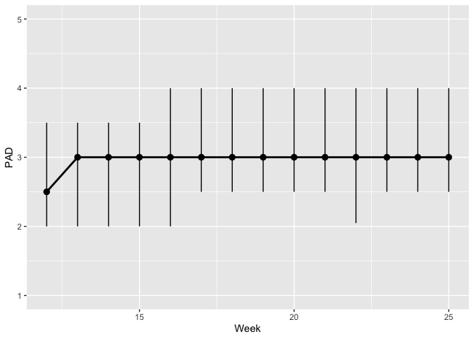

Plots of emotion means against stringency or time in weeks
================
Anne Margit
8/26/2020

This dataset includes:

1.  Data from all weekly measurement waves (baseline through wave 11,
    Time 1 through 12)
2.  Participants who provided at least 3 measurements
3.  Participants who are residents of the country they currently live in
4.  Participants who provided info on age
5.  Participants who provided info on gender (either male or female)
6.  Data from countries with at least 20 participants
7.  Pooled age groups
8.  Imputed missing emotion scores
9.  Combined emotion scores (NAA, NAD, PAA, PAD)
10. An imputed Stringency index (StringencyIndex\_imp)
11. A variable indicating the number of days before and after the day on
    which maximum stringency was reached for the respective country
    (DaysMax)
12. A variable indicating the number of weeks before and after the day
    on which maximum stringency was reached for the respective country
    (WeeksMax)
13. A variable indicating the date on which maximum Stringency was
    reached for that country (DateMaxStr)

<!-- end list -->

``` r
load("data_imputed_emomeans_maxweeks.Rdata")
```

# Negative affect high arousal

**Median NAA against week**

``` r
plot_NAA <- ggplot(data_imputed_emomeans_maxweeks, aes(x=Week, y=NAA))

plot_NAA +  stat_summary(geom = "line", fun = median, size=1) + stat_summary(fun.data = median_hilow, 
                                                                    fun.args = (conf.int=.5)) + expand_limits(y=c(1, 5))
```

<!-- -->

**Median NAA against maximum stringency in
weeks**

``` r
plot_NAA <- ggplot(data_imputed_emomeans_maxweeks, aes(x=WeeksMax, y=NAA))

plot_NAA +  stat_summary(geom = "line", fun = median, size=1) + stat_summary(fun.data = median_hilow, 
                                                                    fun.args = (conf.int=.5)) + expand_limits(y=c(1, 5))
```

<!-- -->

**Mean NAA against week in different age
groups**

``` r
plot_NAA <- ggplot(data_imputed_emomeans_maxweeks, aes(x=Week, y=NAA, group = Age_new, color = Age_new))

plot_NAA + stat_summary(fun.y=mean, geom="line", size=1) + geom_errorbar(stat="summary", fun.data="mean_se", width=0) + scale_colour_discrete(name = "Age", labels = c("18-24", "25-44", "45-64", "65+")) + expand_limits(y=c(1, 5))
```

<!-- -->

**Mean NAA against maximum stringency in
weeks**

``` r
plot_NAA <- ggplot(data_imputed_emomeans_maxweeks, aes(x=WeeksMax, y=NAA))

plot_NAA + stat_summary(fun.y=mean, geom="line", size=1) + geom_errorbar(stat="summary", fun.data="mean_se", width=0) + expand_limits(y=c(1, 5))
```

<!-- -->

**Mean NAA against maximum stringency in weeks in different age
groups**

``` r
plot_NAA <- ggplot(data_imputed_emomeans_maxweeks, aes(x=WeeksMax, y=NAA, group = Age_new, color = Age_new))

plot_NAA + stat_summary(fun.y=mean, geom="line", size=1) + geom_errorbar(stat="summary", fun.data="mean_se", width=0) + scale_colour_discrete(name = "Age", labels = c("18-24", "25-44", "45-64", "65+")) + expand_limits(y=c(1, 5))
```

<!-- -->

# Negative affect low arousal

**Median NAD against week**

``` r
plot_NAD <- ggplot(data_imputed_emomeans_maxweeks, aes(x=Week, y=NAD))

plot_NAD +  stat_summary(geom = "line", fun = median, size=1) + stat_summary(fun.data = median_hilow, 
                                                                    fun.args = (conf.int=.5)) + expand_limits(y=c(1, 5))
```

<!-- -->

**Median NAD against maximum stringency in
weeks**

``` r
plot_NAD <- ggplot(data_imputed_emomeans_maxweeks, aes(x=WeeksMax, y=NAD))

plot_NAD +  stat_summary(geom = "line", fun = median, size=1) + stat_summary(fun.data = median_hilow, 
                                                                    fun.args = (conf.int=.5)) + expand_limits(y=c(1, 5))
```

<!-- -->

**Mean NAD against week in different age
groups**

``` r
plot_NAD <- ggplot(data_imputed_emomeans_maxweeks, aes(x=Week, y=NAD, group = Age_new, color = Age_new))

plot_NAD + stat_summary(fun.y=mean, geom="line", size=1) + geom_errorbar(stat="summary", fun.data="mean_se", width=0) + scale_colour_discrete(name = "Age", labels = c("18-24", "25-44", "45-64", "65+")) + expand_limits(y=c(1, 5))
```

<!-- -->

**Mean NAD against maximum stringency in
weeks**

``` r
plot_NAD <- ggplot(data_imputed_emomeans_maxweeks, aes(x=WeeksMax, y=NAD))

plot_NAD + stat_summary(fun.y=mean, geom="line", size=1) + geom_errorbar(stat="summary", fun.data="mean_se", width=0) + expand_limits(y=c(1, 5))
```

<!-- -->

**Mean NAD against maximum stringency in weeks in different age
groups**

``` r
plot_NAD <- ggplot(data_imputed_emomeans_maxweeks, aes(x=WeeksMax, y=NAD, group = Age_new, color = Age_new))

plot_NAD + stat_summary(fun.y=mean, geom="line", size=1) + geom_errorbar(stat="summary", fun.data="mean_se", width=0) + scale_colour_discrete(name = "Age", labels = c("18-24", "25-44", "45-64", "65+")) + expand_limits(y=c(1, 5))
```

<!-- -->

# Positive affect high arousal

**Median PAA against week**

``` r
plot_PAA <- ggplot(data_imputed_emomeans_maxweeks, aes(x=Week, y=PAA))

plot_PAA +  stat_summary(geom = "line", fun = median, size=1) + stat_summary(fun.data = median_hilow, 
                                                                    fun.args = (conf.int=.5)) + expand_limits(y=c(1, 5))
```

<!-- -->

**Median PAA against maximum stringency in
weeks**

``` r
plot_PAA <- ggplot(data_imputed_emomeans_maxweeks, aes(x=WeeksMax, y=PAA))

plot_PAA +  stat_summary(geom = "line", fun = median, size=1) + stat_summary(fun.data = median_hilow, 
                                                                    fun.args = (conf.int=.5)) + expand_limits(y=c(1, 5))
```

<!-- -->

**Mean PAA against week in different age
groups**

``` r
plot_PAA <- ggplot(data_imputed_emomeans_maxweeks, aes(x=Week, y=PAA, group = Age_new, color = Age_new))

plot_PAA + stat_summary(fun.y=mean, geom="line", size=1) + geom_errorbar(stat="summary", fun.data="mean_se", width=0) + scale_colour_discrete(name = "Age", labels = c("18-24", "25-44", "45-64", "65+")) + expand_limits(y=c(1, 5))
```

<!-- -->

**Mean PAA against maximum stringency in different age
groups**

``` r
plot_PAA <- ggplot(data_imputed_emomeans_maxweeks, aes(x=WeeksMax, y=PAA, group = Age_new, color = Age_new))

plot_PAA + stat_summary(fun.y=mean, geom="line", size=1) + geom_errorbar(stat="summary", fun.data="mean_se", width=0) + scale_colour_discrete(name = "Age", labels = c("18-24", "25-44", "45-64", "65+")) + expand_limits(y=c(1, 5))
```

<!-- -->

# Positive affect low arousal

**Median PAD against week**

``` r
plot_PAD <- ggplot(data_imputed_emomeans_maxweeks, aes(x=Week, y=PAD))

plot_PAD +  stat_summary(geom = "line", fun = median, size=1) + stat_summary(fun.data = median_hilow, 
                                                                    fun.args = (conf.int=.5)) + expand_limits(y=c(1, 5))
```

<!-- -->

**Median PAD against maximum
stringency**

``` r
plot_PAD <- ggplot(data_imputed_emomeans_maxweeks, aes(x=WeeksMax, y=PAD))

plot_PAD +  stat_summary(geom = "line", fun = median, size=1) + stat_summary(fun.data = median_hilow, 
                                                                    fun.args = (conf.int=.5)) + expand_limits(y=c(1, 5))
```

<!-- -->

**Mean PAD against week in different age
groups**

``` r
plot_PAD <- ggplot(data_imputed_emomeans_maxweeks, aes(x=Week, y=PAD, group = Age_new, color = Age_new))

plot_PAD + stat_summary(fun.y=mean, geom="line", size=1) + geom_errorbar(stat="summary", fun.data="mean_se", width=0) + scale_colour_discrete(name = "Age", labels = c("18-24", "25-44", "45-64", "65+")) + expand_limits(y=c(1, 5))
```

<!-- -->

**Mean PAD against maximum stringency in different age
groups**

``` r
plot_PAD <- ggplot(data_imputed_emomeans_maxweeks, aes(x=WeeksMax, y=PAD, group = Age_new, color = Age_new))

plot_PAD + stat_summary(fun.y=mean, geom="line", size=1) + geom_errorbar(stat="summary", fun.data="mean_se", width=0) + scale_colour_discrete(name = "Age", labels = c("18-24", "25-44", "45-64", "65+")) + expand_limits(y=c(1, 5))
```

<!-- -->
