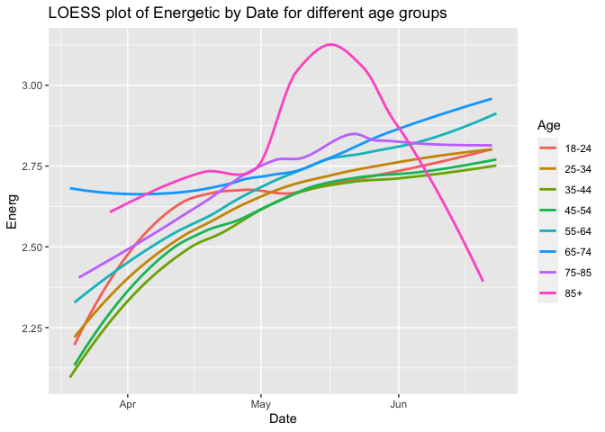

200617 Multilevel models emotions
================
Anne Margit
08/07/2020

    ## 
    ## Attaching package: 'dplyr'

    ## The following objects are masked from 'package:stats':
    ## 
    ##     filter, lag

    ## The following objects are masked from 'package:base':
    ## 
    ##     intersect, setdiff, setequal, union

    ## Loading required package: Matrix

    ## 
    ## Attaching package: 'lmerTest'

    ## The following object is masked from 'package:lme4':
    ## 
    ##     lmer

    ## The following object is masked from 'package:stats':
    ## 
    ##     step

    ## ── Attaching packages ────────────────────────────────────────────────────────────────── tidyverse 1.3.0 ──

    ## ✓ tibble  3.0.1     ✓ purrr   0.3.4
    ## ✓ tidyr   1.1.0     ✓ stringr 1.4.0
    ## ✓ readr   1.3.1     ✓ forcats 0.5.0

    ## ── Conflicts ───────────────────────────────────────────────────────────────────── tidyverse_conflicts() ──
    ## x tidyr::expand() masks Matrix::expand()
    ## x dplyr::filter() masks stats::filter()
    ## x dplyr::lag()    masks stats::lag()
    ## x tidyr::pack()   masks Matrix::pack()
    ## x tidyr::unpack() masks Matrix::unpack()

    ## 
    ## Attaching package: 'rockchalk'

    ## The following object is masked from 'package:dplyr':
    ## 
    ##     summarize

This dataset includes measurements from participants that (1) provided
at least 3 measurements, (2) that are residents of the country they
currently live in, (3) from countries with at least 20 participants, (4)
provided data on age, and (5) with imputed Stringency index values that
are (6) centered around country means and (7) from all waves (baseline
through wave 11)

``` r
load("data_long_min3_strc.Rdata")
```

# Anxiety

Multilevel anxiety random
intercept

``` r
model.anx0 <- lmer(Anxiety ~ 1 + (1 | Country/ID), data=data_long_min3_strc, na.action=na.exclude)
summary(model.anx0)
```

    ## Linear mixed model fit by REML. t-tests use Satterthwaite's method [
    ## lmerModLmerTest]
    ## Formula: Anxiety ~ 1 + (1 | Country/ID)
    ##    Data: data_long_min3_strc
    ## 
    ## REML criterion at convergence: 155436.4
    ## 
    ## Scaled residuals: 
    ##     Min      1Q  Median      3Q     Max 
    ## -4.2707 -0.5602 -0.1261  0.5577  4.4400 
    ## 
    ## Random effects:
    ##  Groups     Name        Variance Std.Dev.
    ##  ID:Country (Intercept) 0.7538   0.8682  
    ##  Country    (Intercept) 0.1049   0.3240  
    ##  Residual               0.5929   0.7700  
    ## Number of obs: 58071, groups:  ID:Country, 10341; Country, 33
    ## 
    ## Fixed effects:
    ##             Estimate Std. Error       df t value Pr(>|t|)    
    ## (Intercept)  2.47419    0.05848 31.51694   42.31   <2e-16 ***
    ## ---
    ## Signif. codes:  0 '***' 0.001 '**' 0.01 '*' 0.05 '.' 0.1 ' ' 1

Variance in anxiety explained by country is pretty low, equal variance
explained between and within persons

Two level models using uncentered
Stringency:

``` r
model.anx1 <- lmer(Anxiety ~ StringencyIndex + (1 | ID), data=data_long_min3_strc, na.action=na.exclude)
summary(model.anx1)
```

    ## Linear mixed model fit by REML. t-tests use Satterthwaite's method [
    ## lmerModLmerTest]
    ## Formula: Anxiety ~ StringencyIndex + (1 | ID)
    ##    Data: data_long_min3_strc
    ## 
    ## REML criterion at convergence: 156209.5
    ## 
    ## Scaled residuals: 
    ##     Min      1Q  Median      3Q     Max 
    ## -4.2532 -0.5593 -0.1291  0.5572  4.4350 
    ## 
    ## Random effects:
    ##  Groups   Name        Variance Std.Dev.
    ##  ID       (Intercept) 0.8511   0.9225  
    ##  Residual             0.5905   0.7684  
    ## Number of obs: 58063, groups:  ID, 10341
    ## 
    ## Fixed effects:
    ##                  Estimate Std. Error        df t value Pr(>|t|)    
    ## (Intercept)     2.050e+00  2.693e-02 5.775e+04   76.12   <2e-16 ***
    ## StringencyIndex 4.897e-03  3.308e-04 5.476e+04   14.80   <2e-16 ***
    ## ---
    ## Signif. codes:  0 '***' 0.001 '**' 0.01 '*' 0.05 '.' 0.1 ' ' 1
    ## 
    ## Correlation of Fixed Effects:
    ##             (Intr)
    ## StrngncyInd -0.933

``` r
model.anx2 <- lmer(Anxiety ~ StringencyIndex + age + (1 | ID), data=data_long_min3_strc, na.action=na.exclude)
summary(model.anx2)
```

    ## Linear mixed model fit by REML. t-tests use Satterthwaite's method [
    ## lmerModLmerTest]
    ## Formula: Anxiety ~ StringencyIndex + age + (1 | ID)
    ##    Data: data_long_min3_strc
    ## 
    ## REML criterion at convergence: 155498.1
    ## 
    ## Scaled residuals: 
    ##     Min      1Q  Median      3Q     Max 
    ## -4.2410 -0.5629 -0.1261  0.5569  4.4447 
    ## 
    ## Random effects:
    ##  Groups   Name        Variance Std.Dev.
    ##  ID       (Intercept) 0.7834   0.8851  
    ##  Residual             0.5905   0.7685  
    ## Number of obs: 58063, groups:  ID, 10341
    ## 
    ## Fixed effects:
    ##                   Estimate Std. Error         df t value Pr(>|t|)    
    ## (Intercept)      2.373e+00  3.697e-02  3.015e+04  64.185  < 2e-16 ***
    ## StringencyIndex  4.482e-03  3.303e-04  5.496e+04  13.572  < 2e-16 ***
    ## age2            -4.578e-02  3.410e-02  1.046e+04  -1.343 0.179416    
    ## age3            -1.532e-01  3.430e-02  1.044e+04  -4.465  8.1e-06 ***
    ## age4            -2.970e-01  3.439e-02  1.038e+04  -8.635  < 2e-16 ***
    ## age5            -4.828e-01  3.456e-02  1.034e+04 -13.970  < 2e-16 ***
    ## age6            -7.578e-01  3.668e-02  1.030e+04 -20.660  < 2e-16 ***
    ## age7            -8.691e-01  7.425e-02  9.892e+03 -11.704  < 2e-16 ***
    ## age8            -9.858e-01  2.715e-01  9.614e+03  -3.630 0.000285 ***
    ## ---
    ## Signif. codes:  0 '***' 0.001 '**' 0.01 '*' 0.05 '.' 0.1 ' ' 1
    ## 
    ## Correlation of Fixed Effects:
    ##             (Intr) StrngI age2   age3   age4   age5   age6   age7  
    ## StrngncyInd -0.704                                                 
    ## age2        -0.559  0.018                                          
    ## age3        -0.563  0.028  0.590                                   
    ## age4        -0.566  0.034  0.588  0.585                            
    ## age5        -0.564  0.036  0.585  0.582  0.581                     
    ## age6        -0.539  0.044  0.552  0.549  0.548  0.545              
    ## age7        -0.267  0.023  0.273  0.271  0.271  0.269  0.254       
    ## age8        -0.077  0.011  0.075  0.074  0.074  0.074  0.070  0.034

``` r
model.anx3 <- lmer(Anxiety ~ StringencyIndex + age + StringencyIndex*age + (1 | ID), data=data_long_min3_strc, na.action=na.exclude)
summary(model.anx3)
```

    ## Linear mixed model fit by REML. t-tests use Satterthwaite's method [
    ## lmerModLmerTest]
    ## Formula: Anxiety ~ StringencyIndex + age + StringencyIndex * age + (1 |  
    ##     ID)
    ##    Data: data_long_min3_strc
    ## 
    ## REML criterion at convergence: 155514.8
    ## 
    ## Scaled residuals: 
    ##     Min      1Q  Median      3Q     Max 
    ## -4.2374 -0.5628 -0.1257  0.5553  4.4636 
    ## 
    ## Random effects:
    ##  Groups   Name        Variance Std.Dev.
    ##  ID       (Intercept) 0.783    0.8849  
    ##  Residual             0.590    0.7681  
    ## Number of obs: 58063, groups:  ID, 10341
    ## 
    ## Fixed effects:
    ##                        Estimate Std. Error         df t value Pr(>|t|)    
    ## (Intercept)           2.692e+00  7.106e-02  5.740e+04  37.884  < 2e-16 ***
    ## StringencyIndex       4.293e-04  8.379e-04  5.530e+04   0.512  0.60840    
    ## age2                 -2.266e-01  9.622e-02  5.764e+04  -2.355  0.01852 *  
    ## age3                 -3.833e-01  9.740e-02  5.781e+04  -3.935 8.33e-05 ***
    ## age4                 -6.694e-01  9.491e-02  5.772e+04  -7.052 1.78e-12 ***
    ## age5                 -9.887e-01  9.401e-02  5.750e+04 -10.518  < 2e-16 ***
    ## age6                 -1.347e+00  1.007e-01  5.748e+04 -13.374  < 2e-16 ***
    ## age7                 -1.498e+00  2.386e-01  5.786e+04  -6.277 3.48e-10 ***
    ## age8                 -9.946e-01  7.944e-01  5.762e+04  -1.252  0.21061    
    ## StringencyIndex:age2  2.252e-03  1.154e-03  5.542e+04   1.950  0.05113 .  
    ## StringencyIndex:age3  2.877e-03  1.178e-03  5.497e+04   2.442  0.01459 *  
    ## StringencyIndex:age4  4.756e-03  1.146e-03  5.475e+04   4.150 3.34e-05 ***
    ## StringencyIndex:age5  6.537e-03  1.133e-03  5.509e+04   5.767 8.09e-09 ***
    ## StringencyIndex:age6  7.698e-03  1.231e-03  5.529e+04   6.255 3.99e-10 ***
    ## StringencyIndex:age7  8.251e-03  3.062e-03  5.625e+04   2.694  0.00705 ** 
    ## StringencyIndex:age8 -4.108e-04  1.072e-02  5.588e+04  -0.038  0.96943    
    ## ---
    ## Signif. codes:  0 '***' 0.001 '**' 0.01 '*' 0.05 '.' 0.1 ' ' 1

    ## 
    ## Correlation matrix not shown by default, as p = 16 > 12.
    ## Use print(x, correlation=TRUE)  or
    ##     vcov(x)        if you need it

plot anxiety and stringency for different age groups / LOESS plot
(doesn’t work well for large datasets? check
this)

``` r
plot_anx <- ggplot(data = data_long_min3_strc, aes(x = StringencyIndex, y = Anxiety, group = ID, color = age))

plot_anx + stat_smooth(aes(group=age), se = FALSE, method = "loess", formula = y ~ x, size = 1, na.rm=TRUE) + scale_colour_discrete(name = "Age", 
labels = c("18-24", "25-34", "35-44", "45-54", "55-64", "65-74", "75-85", "85+")) + labs(title="LOESS plot of Anxiety by Stringency for different age groups")
```

<!-- -->
GAM
plot

``` r
plot_anx + stat_smooth(aes(group=age), se = FALSE, method = "gam", formula = y ~ x, size = 1, na.rm=TRUE) + scale_colour_discrete(name = "Age", 
labels = c("18-24", "25-34", "35-44", "45-54", "55-64", "65-74", "75-85", "85+")) + labs(title="GAM plot of Anxiety by Stringency for different age groups")
```

<!-- -->

Plot Anxiety by
Date

``` r
plot_anx2 <- ggplot(data = data_long_min3_strc, aes(x = Date, y = Anxiety, group = ID, color = age))

plot_anx2 + stat_smooth(aes(group=age), se = FALSE, method = "loess", formula = y ~ x, size = 1, na.rm=TRUE) + scale_colour_discrete(name = "Age", 
labels = c("18-24", "25-34", "35-44", "45-54", "55-64", "65-74", "75-85", "85+")) + labs(title="LOESS plot of Anxiety by Date for different age groups")
```

<!-- -->
GAM
plot

``` r
plot_anx2 + stat_smooth(aes(group=age), se = FALSE, method = "gam", formula = y ~ x, size = 1, na.rm=TRUE) + scale_colour_discrete(name = "Age", 
labels = c("18-24", "25-34", "35-44", "45-54", "55-64", "65-74", "75-85", "85+")) + labs(title="GAM plot of Anxiety by Date for different age groups")
```

<!-- -->
\#\#\#\#\#\#\#\#\#\#\#\#\#\#\#\#\#\#\#\#\#\#\# Anger
\#\#\#\#\#\#\#\#\#\#\#\#\#\#\#\#\#\#\#\#\#\#\# Multilevel anger random
intercept

``` r
model.ang0 <- lmer(Ang ~ 1 + (1 | Country/ID), data=data_long_min3_strc, na.action=na.exclude)
summary(model.ang0)
```

    ## Linear mixed model fit by REML. t-tests use Satterthwaite's method [
    ## lmerModLmerTest]
    ## Formula: Ang ~ 1 + (1 | Country/ID)
    ##    Data: data_long_min3_strc
    ## 
    ## REML criterion at convergence: 126431.2
    ## 
    ## Scaled residuals: 
    ##     Min      1Q  Median      3Q     Max 
    ## -4.2509 -0.4854 -0.1371  0.4883  4.7334 
    ## 
    ## Random effects:
    ##  Groups     Name        Variance Std.Dev.
    ##  ID:Country (Intercept) 0.67919  0.8241  
    ##  Country    (Intercept) 0.04443  0.2108  
    ##  Residual               0.56132  0.7492  
    ## Number of obs: 47767, groups:  ID:Country, 10337; Country, 33
    ## 
    ## Fixed effects:
    ##             Estimate Std. Error       df t value Pr(>|t|)    
    ## (Intercept)  2.05129    0.03947 28.43221   51.97   <2e-16 ***
    ## ---
    ## Signif. codes:  0 '***' 0.001 '**' 0.01 '*' 0.05 '.' 0.1 ' ' 1

Variance in anger explained by country is pretty low, equal variance
explained between and within persons

Using two level models Predicted by
stringency

``` r
model.ang1 <- lmer(Ang ~ StringencyIndex + (1 | ID), data=data_long_min3_strc, na.action=na.exclude)
summary(model.ang1)
```

    ## Linear mixed model fit by REML. t-tests use Satterthwaite's method [
    ## lmerModLmerTest]
    ## Formula: Ang ~ StringencyIndex + (1 | ID)
    ##    Data: data_long_min3_strc
    ## 
    ## REML criterion at convergence: 126673.8
    ## 
    ## Scaled residuals: 
    ##     Min      1Q  Median      3Q     Max 
    ## -4.2341 -0.4809 -0.1471  0.4834  4.8406 
    ## 
    ## Random effects:
    ##  Groups   Name        Variance Std.Dev.
    ##  ID       (Intercept) 0.7108   0.8431  
    ##  Residual             0.5605   0.7487  
    ## Number of obs: 47759, groups:  ID, 10337
    ## 
    ## Fixed effects:
    ##                  Estimate Std. Error        df t value Pr(>|t|)    
    ## (Intercept)     1.740e+00  2.803e-02 4.776e+04  62.073   <2e-16 ***
    ## StringencyIndex 3.418e-03  3.526e-04 4.513e+04   9.696   <2e-16 ***
    ## ---
    ## Signif. codes:  0 '***' 0.001 '**' 0.01 '*' 0.05 '.' 0.1 ' ' 1
    ## 
    ## Correlation of Fixed Effects:
    ##             (Intr)
    ## StrngncyInd -0.945

``` r
model.ang2 <- lmer(Ang ~ StringencyIndex + age + (1 | ID), data=data_long_min3_strc, na.action=na.exclude)
summary(model.ang2)
```

    ## Linear mixed model fit by REML. t-tests use Satterthwaite's method [
    ## lmerModLmerTest]
    ## Formula: Ang ~ StringencyIndex + age + (1 | ID)
    ##    Data: data_long_min3_strc
    ## 
    ## REML criterion at convergence: 126398.7
    ## 
    ## Scaled residuals: 
    ##     Min      1Q  Median      3Q     Max 
    ## -4.2394 -0.4855 -0.1362  0.4805  4.8598 
    ## 
    ## Random effects:
    ##  Groups   Name        Variance Std.Dev.
    ##  ID       (Intercept) 0.6855   0.8279  
    ##  Residual             0.5606   0.7487  
    ## Number of obs: 47759, groups:  ID, 10337
    ## 
    ## Fixed effects:
    ##                   Estimate Std. Error         df t value Pr(>|t|)    
    ## (Intercept)      1.939e+00  3.749e-02  3.091e+04  51.732  < 2e-16 ***
    ## StringencyIndex  3.057e-03  3.528e-04  4.508e+04   8.666  < 2e-16 ***
    ## age2            -4.357e-02  3.294e-02  1.048e+04  -1.323  0.18592    
    ## age3            -6.710e-02  3.312e-02  1.045e+04  -2.026  0.04278 *  
    ## age4            -1.657e-01  3.317e-02  1.036e+04  -4.994 6.02e-07 ***
    ## age5            -2.751e-01  3.332e-02  1.029e+04  -8.256  < 2e-16 ***
    ## age6            -4.808e-01  3.533e-02  1.022e+04 -13.607  < 2e-16 ***
    ## age7            -4.619e-01  7.105e-02  9.577e+03  -6.501 8.38e-11 ***
    ## age8            -6.932e-01  2.581e-01  9.138e+03  -2.685  0.00726 ** 
    ## ---
    ## Signif. codes:  0 '***' 0.001 '**' 0.01 '*' 0.05 '.' 0.1 ' ' 1
    ## 
    ## Correlation of Fixed Effects:
    ##             (Intr) StrngI age2   age3   age4   age5   age6   age7  
    ## StrngncyInd -0.737                                                 
    ## age2        -0.534  0.018                                          
    ## age3        -0.541  0.031  0.590                                   
    ## age4        -0.547  0.040  0.589  0.586                            
    ## age5        -0.548  0.045  0.587  0.584  0.584                     
    ## age6        -0.527  0.056  0.554  0.551  0.551  0.549              
    ## age7        -0.262  0.028  0.275  0.274  0.274  0.273  0.258       
    ## age8        -0.076  0.013  0.076  0.076  0.076  0.075  0.071  0.035

``` r
model.ang3 <- lmer(Ang ~ StringencyIndex + age + StringencyIndex*age + (1 | ID), data=data_long_min3_strc, na.action=na.exclude)
summary(model.ang3)
```

    ## Linear mixed model fit by REML. t-tests use Satterthwaite's method [
    ## lmerModLmerTest]
    ## Formula: Ang ~ StringencyIndex + age + StringencyIndex * age + (1 | ID)
    ##    Data: data_long_min3_strc
    ## 
    ## REML criterion at convergence: 126467.3
    ## 
    ## Scaled residuals: 
    ##     Min      1Q  Median      3Q     Max 
    ## -4.2419 -0.4833 -0.1375  0.4808  4.8961 
    ## 
    ## Random effects:
    ##  Groups   Name        Variance Std.Dev.
    ##  ID       (Intercept) 0.6855   0.8279  
    ##  Residual             0.5606   0.7487  
    ## Number of obs: 47759, groups:  ID, 10337
    ## 
    ## Fixed effects:
    ##                        Estimate Std. Error         df t value Pr(>|t|)    
    ## (Intercept)           2.021e+00  7.404e-02  4.772e+04  27.303  < 2e-16 ***
    ## StringencyIndex       2.007e-03  8.888e-04  4.509e+04   2.258 0.023949 *  
    ## age2                 -1.363e-01  1.008e-01  4.774e+04  -1.353 0.176209    
    ## age3                 -1.104e-01  1.018e-01  4.773e+04  -1.085 0.278109    
    ## age4                 -2.737e-01  9.928e-02  4.774e+04  -2.757 0.005837 ** 
    ## age5                 -3.457e-01  9.770e-02  4.773e+04  -3.539 0.000403 ***
    ## age6                 -6.635e-01  1.052e-01  4.771e+04  -6.305 2.91e-10 ***
    ## age7                 -4.772e-01  2.506e-01  4.772e+04  -1.905 0.056835 .  
    ## age8                 -2.215e+00  8.025e-01  4.774e+04  -2.760 0.005785 ** 
    ## StringencyIndex:age2  1.187e-03  1.229e-03  4.528e+04   0.966 0.334024    
    ## StringencyIndex:age3  5.349e-04  1.253e-03  4.484e+04   0.427 0.669496    
    ## StringencyIndex:age4  1.397e-03  1.223e-03  4.483e+04   1.142 0.253385    
    ## StringencyIndex:age5  8.943e-04  1.203e-03  4.507e+04   0.743 0.457286    
    ## StringencyIndex:age6  2.436e-03  1.318e-03  4.540e+04   1.848 0.064608 .  
    ## StringencyIndex:age7  1.291e-04  3.291e-03  4.663e+04   0.039 0.968697    
    ## StringencyIndex:age8  2.196e-02  1.103e-02  4.527e+04   1.991 0.046453 *  
    ## ---
    ## Signif. codes:  0 '***' 0.001 '**' 0.01 '*' 0.05 '.' 0.1 ' ' 1

    ## 
    ## Correlation matrix not shown by default, as p = 16 > 12.
    ## Use print(x, correlation=TRUE)  or
    ##     vcov(x)        if you need it

LOESS plot anger and stringency for different age
groups

``` r
plot_ang <- ggplot(data = data_long_min3_strc, aes(x = StringencyIndex, y = Ang, group = ID, color = age))

plot_ang + stat_smooth(aes(group=age), se = FALSE, method = "loess", formula = y ~ x, size = 1, na.rm=TRUE) + scale_colour_discrete(name = "Age", 
labels = c("18-24", "25-34", "35-44", "45-54", "55-64", "65-74", "75-85", "85+")) + labs(title="LOESS plot of Anger by Stringency for different age groups", y ="Anger")
```

<!-- -->
GAM
plot

``` r
plot_ang + stat_smooth(aes(group=age), se = FALSE, method = "gam", formula = y ~ x, size = 1, na.rm=TRUE) + scale_colour_discrete(name = "Age", 
labels = c("18-24", "25-34", "35-44", "45-54", "55-64", "65-74", "75-85", "85+")) + labs(title="GAM plot of Anger by Stringency for different age groups", y ="Anger")
```

<!-- -->

Plot Anger by Date for different age
groups

``` r
plot_ang2 <- ggplot(data = data_long_min3_strc, aes(x = Date, y = Ang, group = ID, color = age))

plot_ang2 + stat_smooth(aes(group=age), se = FALSE, method = "loess", formula = y ~ x, size = 1, na.rm=TRUE) + scale_colour_discrete(name = "Age", 
labels = c("18-24", "25-34", "35-44", "45-54", "55-64", "65-74", "75-85", "85+")) + labs(title="LOESS plot of Anger by Date for different age groups", y ="Anger")
```

<!-- -->
GAM
plot

``` r
plot_ang2 + stat_smooth(aes(group=age), se = FALSE, method = "gam", formula = y ~ x, size = 1, na.rm=TRUE) + scale_colour_discrete(name = "Age", 
labels = c("18-24", "25-34", "35-44", "45-54", "55-64", "65-74", "75-85", "85+")) + labs(title="GAM plot of Anger by Date for different age groups", y ="Anger")
```

<!-- -->

# Bored

Multilevel random
intercept

``` r
model.bor0 <- lmer(Bored ~ 1 + (1 | Country/ID), data=data_long_min3_strc, na.action=na.exclude)
summary(model.bor0)
```

    ## Linear mixed model fit by REML. t-tests use Satterthwaite's method [
    ## lmerModLmerTest]
    ## Formula: Bored ~ 1 + (1 | Country/ID)
    ##    Data: data_long_min3_strc
    ## 
    ## REML criterion at convergence: 117315
    ## 
    ## Scaled residuals: 
    ##     Min      1Q  Median      3Q     Max 
    ## -4.2176 -0.5249 -0.1463  0.5239  4.3497 
    ## 
    ## Random effects:
    ##  Groups     Name        Variance Std.Dev.
    ##  ID:Country (Intercept) 0.7689   0.8769  
    ##  Country    (Intercept) 0.1194   0.3455  
    ##  Residual               0.6127   0.7827  
    ## Number of obs: 42481, groups:  ID:Country, 10337; Country, 33
    ## 
    ## Fixed effects:
    ##             Estimate Std. Error       df t value Pr(>|t|)    
    ## (Intercept)  2.31176    0.06227 30.34656   37.13   <2e-16 ***
    ## ---
    ## Signif. codes:  0 '***' 0.001 '**' 0.01 '*' 0.05 '.' 0.1 ' ' 1

Variance in bored explained by country is pretty low, equal variance
explained between and within persons

Using two level models Predicted by
stringency

``` r
model.bor1 <- lmer(Bored ~ StringencyIndex + (1 | ID), data=data_long_min3_strc, na.action=na.exclude)
summary(model.bor1)
```

    ## Linear mixed model fit by REML. t-tests use Satterthwaite's method [
    ## lmerModLmerTest]
    ## Formula: Bored ~ StringencyIndex + (1 | ID)
    ##    Data: data_long_min3_strc
    ## 
    ## REML criterion at convergence: 117330.7
    ## 
    ## Scaled residuals: 
    ##     Min      1Q  Median      3Q     Max 
    ## -4.3359 -0.5208 -0.1393  0.5192  4.4923 
    ## 
    ## Random effects:
    ##  Groups   Name        Variance Std.Dev.
    ##  ID       (Intercept) 0.8426   0.9180  
    ##  Residual             0.6015   0.7756  
    ## Number of obs: 42474, groups:  ID, 10337
    ## 
    ## Fixed effects:
    ##                  Estimate Std. Error        df t value Pr(>|t|)    
    ## (Intercept)     1.505e+00  2.949e-02 4.236e+04   51.03   <2e-16 ***
    ## StringencyIndex 9.444e-03  3.730e-04 3.871e+04   25.32   <2e-16 ***
    ## ---
    ## Signif. codes:  0 '***' 0.001 '**' 0.01 '*' 0.05 '.' 0.1 ' ' 1
    ## 
    ## Correlation of Fixed Effects:
    ##             (Intr)
    ## StrngncyInd -0.940

``` r
model.bor2 <- lmer(Bored ~ StringencyIndex + age + (1 | ID), data=data_long_min3_strc, na.action=na.exclude)
summary(model.bor2)
```

    ## Linear mixed model fit by REML. t-tests use Satterthwaite's method [
    ## lmerModLmerTest]
    ## Formula: Bored ~ StringencyIndex + age + (1 | ID)
    ##    Data: data_long_min3_strc
    ## 
    ## REML criterion at convergence: 116830.6
    ## 
    ## Scaled residuals: 
    ##     Min      1Q  Median      3Q     Max 
    ## -4.2926 -0.5226 -0.1388  0.5205  4.5022 
    ## 
    ## Random effects:
    ##  Groups   Name        Variance Std.Dev.
    ##  ID       (Intercept) 0.7941   0.8911  
    ##  Residual             0.6009   0.7752  
    ## Number of obs: 42474, groups:  ID, 10337
    ## 
    ## Fixed effects:
    ##                   Estimate Std. Error         df t value Pr(>|t|)    
    ## (Intercept)      1.994e+00  3.994e-02  2.837e+04  49.921  < 2e-16 ***
    ## StringencyIndex  9.109e-03  3.722e-04  3.892e+04  24.475  < 2e-16 ***
    ## age2            -2.892e-01  3.639e-02  1.079e+04  -7.946 2.12e-15 ***
    ## age3            -4.178e-01  3.647e-02  1.063e+04 -11.455  < 2e-16 ***
    ## age4            -5.869e-01  3.637e-02  1.039e+04 -16.135  < 2e-16 ***
    ## age5            -6.435e-01  3.644e-02  1.025e+04 -17.659  < 2e-16 ***
    ## age6            -7.355e-01  3.841e-02  1.000e+04 -19.149  < 2e-16 ***
    ## age7            -7.211e-01  7.645e-02  9.100e+03  -9.433  < 2e-16 ***
    ## age8            -6.602e-01  2.754e-01  8.445e+03  -2.397   0.0166 *  
    ## ---
    ## Signif. codes:  0 '***' 0.001 '**' 0.01 '*' 0.05 '.' 0.1 ' ' 1
    ## 
    ## Correlation of Fixed Effects:
    ##             (Intr) StrngI age2   age3   age4   age5   age6   age7  
    ## StrngncyInd -0.712                                                 
    ## age2        -0.551  0.014                                          
    ## age3        -0.555  0.021  0.593                                   
    ## age4        -0.560  0.027  0.594  0.593                            
    ## age5        -0.559  0.026  0.593  0.592  0.594                     
    ## age6        -0.537  0.034  0.563  0.562  0.564  0.563              
    ## age7        -0.270  0.018  0.283  0.282  0.283  0.283  0.268       
    ## age8        -0.079  0.011  0.079  0.079  0.079  0.079  0.075  0.038

``` r
model.bor3 <- lmer(Bored ~ StringencyIndex + age + StringencyIndex*age + (1 | ID), data=data_long_min3_strc, na.action=na.exclude)
print(summary(model.bor3), digits=2)
```

    ## Linear mixed model fit by REML. t-tests use Satterthwaite's method [
    ## lmerModLmerTest]
    ## Formula: Bored ~ StringencyIndex + age + StringencyIndex * age + (1 |      ID)
    ##    Data: data_long_min3_strc
    ## 
    ## REML criterion at convergence: 116891.3
    ## 
    ## Scaled residuals: 
    ##    Min     1Q Median     3Q    Max 
    ##  -4.31  -0.52  -0.14   0.52   4.51 
    ## 
    ## Random effects:
    ##  Groups   Name        Variance Std.Dev.
    ##  ID       (Intercept) 0.79     0.89    
    ##  Residual             0.60     0.78    
    ## Number of obs: 42474, groups:  ID, 10337
    ## 
    ## Fixed effects:
    ##                      Estimate Std. Error       df t value Pr(>|t|)    
    ## (Intercept)           1.9e+00    7.9e-02  4.2e+04    24.2   <2e-16 ***
    ## StringencyIndex       1.0e-02    9.7e-04  3.9e+04    10.6   <2e-16 ***
    ## age2                 -5.1e-02    1.1e-01  4.2e+04    -0.5     0.63    
    ## age3                 -2.7e-01    1.1e-01  4.2e+04    -2.5     0.01 *  
    ## age4                 -5.6e-01    1.0e-01  4.2e+04    -5.3    1e-07 ***
    ## age5                 -5.5e-01    1.0e-01  4.2e+04    -5.3    1e-07 ***
    ## age6                 -7.7e-01    1.1e-01  4.2e+04    -7.0    2e-12 ***
    ## age7                 -3.1e-01    2.6e-01  4.2e+04    -1.2     0.23    
    ## age8                 -1.7e+00    8.0e-01  4.2e+04    -2.2     0.03 *  
    ## StringencyIndex:age2 -3.2e-03    1.3e-03  3.9e+04    -2.4     0.02 *  
    ## StringencyIndex:age3 -1.9e-03    1.4e-03  3.9e+04    -1.4     0.16    
    ## StringencyIndex:age4 -3.7e-04    1.3e-03  3.9e+04    -0.3     0.78    
    ## StringencyIndex:age5 -1.3e-03    1.3e-03  3.9e+04    -1.0     0.32    
    ## StringencyIndex:age6  5.3e-04    1.4e-03  3.9e+04     0.4     0.70    
    ## StringencyIndex:age7 -5.6e-03    3.4e-03  4.0e+04    -1.7     0.10 .  
    ## StringencyIndex:age8  1.6e-02    1.1e-02  3.9e+04     1.5     0.14    
    ## ---
    ## Signif. codes:  0 '***' 0.001 '**' 0.01 '*' 0.05 '.' 0.1 ' ' 1

    ## 
    ## Correlation matrix not shown by default, as p = 16 > 12.
    ## Use print(summary(model.bor3), correlation=TRUE)  or
    ##     vcov(summary(model.bor3))        if you need it

LOESS plot boredom and stringency for different age groups / lot of
missing data in
Boredom

``` r
plot_bor <- ggplot(data = data_long_min3_strc, aes(x = StringencyIndex, y = Bored, group = ID, color = age))

plot_bor + stat_smooth(aes(group=age), se = FALSE, method = "loess", formula = y ~ x, size = 1, na.rm=TRUE) + scale_colour_discrete(name = "Age", 
labels = c("18-24", "25-34", "35-44", "45-54", "55-64", "65-74", "75-85", "85+")) + labs(title="LOESS plot of Boredom by Stringency for different age groups", y ="Boredom")
```

<!-- -->
GAM
plot

``` r
plot_bor + stat_smooth(aes(group=age), se = FALSE, method = "gam", formula = y ~ x, size = 1, na.rm=TRUE) + scale_colour_discrete(name = "Age", 
labels = c("18-24", "25-34", "35-44", "45-54", "55-64", "65-74", "75-85", "85+")) + labs(title="GAM plot of Boredom by Stringency for different age groups", y ="Boredom")
```

<!-- -->

Plot Boredom by Date for different age groups / lot of missing data in
Boredom

``` r
plot_bor2 <- ggplot(data = data_long_min3_strc, aes(x = Date, y = Bored, group = ID, color = age))

plot_bor2 + stat_smooth(aes(group=age), se = FALSE, method = "loess", formula = y ~ x, size = 1, na.rm=TRUE) + scale_colour_discrete(name = "Age", 
labels = c("18-24", "25-34", "35-44", "45-54", "55-64", "65-74", "75-85", "85+")) + labs(title="LOESS plot of Boredom by Date for different age groups", y ="Boredom")
```

<!-- -->
GAM
plot

``` r
plot_bor2 + stat_smooth(aes(group=age), se = FALSE, method = "gam", formula = y ~ x, size = 1, na.rm=TRUE) + scale_colour_discrete(name = "Age", 
labels = c("18-24", "25-34", "35-44", "45-54", "55-64", "65-74", "75-85", "85+")) + labs(title="GAM plot of Boredom by Date for different age groups", y ="Boredom")
```

<!-- -->

# Calm

Multilevel random
intercept

``` r
model.calm0 <- lmer(Calm ~ 1 + (1 | Country/ID), data=data_long_min3_strc, na.action=na.exclude)
summary(model.calm0)
```

    ## Linear mixed model fit by REML. t-tests use Satterthwaite's method [
    ## lmerModLmerTest]
    ## Formula: Calm ~ 1 + (1 | Country/ID)
    ##    Data: data_long_min3_strc
    ## 
    ## REML criterion at convergence: 146545.8
    ## 
    ## Scaled residuals: 
    ##     Min      1Q  Median      3Q     Max 
    ## -4.6740 -0.5640  0.0518  0.5890  4.1992 
    ## 
    ## Random effects:
    ##  Groups     Name        Variance Std.Dev.
    ##  ID:Country (Intercept) 0.56554  0.7520  
    ##  Country    (Intercept) 0.03694  0.1922  
    ##  Residual               0.52097  0.7218  
    ## Number of obs: 58083, groups:  ID:Country, 10343; Country, 33
    ## 
    ## Fixed effects:
    ##             Estimate Std. Error       df t value Pr(>|t|)    
    ## (Intercept)  3.06754    0.03591 29.55834   85.42   <2e-16 ***
    ## ---
    ## Signif. codes:  0 '***' 0.001 '**' 0.01 '*' 0.05 '.' 0.1 ' ' 1

Using two level models Predicted by
stringency

``` r
model.calm1 <- lmer(Calm ~ StringencyIndex + (1 | ID), data=data_long_min3_strc, na.action=na.exclude)
summary(model.calm1)
```

    ## Linear mixed model fit by REML. t-tests use Satterthwaite's method [
    ## lmerModLmerTest]
    ## Formula: Calm ~ StringencyIndex + (1 | ID)
    ##    Data: data_long_min3_strc
    ## 
    ## REML criterion at convergence: 147053.6
    ## 
    ## Scaled residuals: 
    ##     Min      1Q  Median      3Q     Max 
    ## -4.6522 -0.5713  0.0290  0.5983  4.1950 
    ## 
    ## Random effects:
    ##  Groups   Name        Variance Std.Dev.
    ##  ID       (Intercept) 0.6054   0.7780  
    ##  Residual             0.5209   0.7218  
    ## Number of obs: 58076, groups:  ID, 10343
    ## 
    ## Fixed effects:
    ##                   Estimate Std. Error         df t value Pr(>|t|)    
    ## (Intercept)      3.116e+00  2.482e-02  5.782e+04 125.549  < 2e-16 ***
    ## StringencyIndex -9.900e-04  3.081e-04  5.572e+04  -3.213  0.00131 ** 
    ## ---
    ## Signif. codes:  0 '***' 0.001 '**' 0.01 '*' 0.05 '.' 0.1 ' ' 1
    ## 
    ## Correlation of Fixed Effects:
    ##             (Intr)
    ## StrngncyInd -0.942

``` r
model.calm2 <- lmer(Calm ~ StringencyIndex + age + (1 | ID), data=data_long_min3_strc, na.action=na.exclude)
summary(model.calm2)
```

    ## Linear mixed model fit by REML. t-tests use Satterthwaite's method [
    ## lmerModLmerTest]
    ## Formula: Calm ~ StringencyIndex + age + (1 | ID)
    ##    Data: data_long_min3_strc
    ## 
    ## REML criterion at convergence: 146814.5
    ## 
    ## Scaled residuals: 
    ##     Min      1Q  Median      3Q     Max 
    ## -4.6429 -0.5657  0.0345  0.5909  4.2054 
    ## 
    ## Random effects:
    ##  Groups   Name        Variance Std.Dev.
    ##  ID       (Intercept) 0.5869   0.7661  
    ##  Residual             0.5210   0.7218  
    ## Number of obs: 58076, groups:  ID, 10343
    ## 
    ## Fixed effects:
    ##                   Estimate Std. Error         df t value Pr(>|t|)    
    ## (Intercept)      3.039e+00  3.345e-02  3.202e+04  90.861  < 2e-16 ***
    ## StringencyIndex -7.978e-04  3.082e-04  5.570e+04  -2.589  0.00964 ** 
    ## age2            -4.916e-02  2.989e-02  1.052e+04  -1.645  0.10002    
    ## age3            -6.217e-02  3.006e-02  1.050e+04  -2.068  0.03866 *  
    ## age4             3.611e-02  3.014e-02  1.044e+04   1.198  0.23092    
    ## age5             1.335e-01  3.027e-02  1.038e+04   4.409 1.05e-05 ***
    ## age6             3.319e-01  3.211e-02  1.033e+04  10.333  < 2e-16 ***
    ## age7             3.916e-01  6.495e-02  9.876e+03   6.029 1.71e-09 ***
    ## age8             4.851e-01  2.372e-01  9.563e+03   2.045  0.04089 *  
    ## ---
    ## Signif. codes:  0 '***' 0.001 '**' 0.01 '*' 0.05 '.' 0.1 ' ' 1
    ## 
    ## Correlation of Fixed Effects:
    ##             (Intr) StrngI age2   age3   age4   age5   age6   age7  
    ## StrngncyInd -0.726                                                 
    ## age2        -0.543  0.019                                          
    ## age3        -0.548  0.029  0.590                                   
    ## age4        -0.551  0.036  0.588  0.585                            
    ## age5        -0.550  0.038  0.586  0.583  0.581                     
    ## age6        -0.527  0.047  0.552  0.550  0.549  0.546              
    ## age7        -0.261  0.024  0.273  0.272  0.271  0.270  0.255       
    ## age8        -0.075  0.012  0.075  0.075  0.074  0.074  0.070  0.035

``` r
model.calm3 <- lmer(Calm ~ StringencyIndex + age + StringencyIndex*age + (1 | ID), data=data_long_min3_strc, na.action=na.exclude)
print(summary(model.calm3), digits=2)
```

    ## Linear mixed model fit by REML. t-tests use Satterthwaite's method [
    ## lmerModLmerTest]
    ## Formula: Calm ~ StringencyIndex + age + StringencyIndex * age + (1 | ID)
    ##    Data: data_long_min3_strc
    ## 
    ## REML criterion at convergence: 146846.8
    ## 
    ## Scaled residuals: 
    ##    Min     1Q Median     3Q    Max 
    ##  -4.64  -0.57   0.04   0.59   4.18 
    ## 
    ## Random effects:
    ##  Groups   Name        Variance Std.Dev.
    ##  ID       (Intercept) 0.59     0.77    
    ##  Residual             0.52     0.72    
    ## Number of obs: 58076, groups:  ID, 10343
    ## 
    ## Fixed effects:
    ##                      Estimate Std. Error       df t value Pr(>|t|)    
    ## (Intercept)           2.9e+00    6.6e-02  5.7e+04    43.6   <2e-16 ***
    ## StringencyIndex       1.4e-03    7.8e-04  5.6e+04     1.7    0.083 .  
    ## age2                  7.6e-03    8.9e-02  5.8e+04     0.1    0.932    
    ## age3                 -5.7e-02    9.0e-02  5.8e+04    -0.6    0.525    
    ## age4                  2.6e-01    8.8e-02  5.8e+04     2.9    0.003 ** 
    ## age5                  4.1e-01    8.7e-02  5.8e+04     4.7    2e-06 ***
    ## age6                  7.8e-01    9.3e-02  5.8e+04     8.4   <2e-16 ***
    ## age7                  7.8e-01    2.2e-01  5.8e+04     3.5    5e-04 ***
    ## age8                  4.1e-01    7.4e-01  5.8e+04     0.6    0.581    
    ## StringencyIndex:age2 -6.8e-04    1.1e-03  5.6e+04    -0.6    0.524    
    ## StringencyIndex:age3  1.8e-05    1.1e-03  5.6e+04     0.0    0.987    
    ## StringencyIndex:age4 -2.8e-03    1.1e-03  5.6e+04    -2.6    0.008 ** 
    ## StringencyIndex:age5 -3.6e-03    1.1e-03  5.6e+04    -3.4    7e-04 ***
    ## StringencyIndex:age6 -5.9e-03    1.1e-03  5.6e+04    -5.2    2e-07 ***
    ## StringencyIndex:age7 -5.1e-03    2.9e-03  5.7e+04    -1.8    0.074 .  
    ## StringencyIndex:age8  1.4e-03    1.0e-02  5.7e+04     0.1    0.887    
    ## ---
    ## Signif. codes:  0 '***' 0.001 '**' 0.01 '*' 0.05 '.' 0.1 ' ' 1

    ## 
    ## Correlation matrix not shown by default, as p = 16 > 12.
    ## Use print(summary(model.calm3), correlation=TRUE)  or
    ##     vcov(summary(model.calm3))        if you need it

LOESS plot calm and stringency for different age
groups

``` r
plot_calm <- ggplot(data = data_long_min3_strc, aes(x = StringencyIndex, y = Calm, group = ID, color = age))

plot_calm + stat_smooth(aes(group=age), se = FALSE, method = "loess", formula = y ~ x, size = 1, na.rm=TRUE) + scale_colour_discrete(name = "Age", 
labels = c("18-24", "25-34", "35-44", "45-54", "55-64", "65-74", "75-85", "85+")) + labs(title="LOESS plot of Calm by Stringency for different age groups", y ="Calm")
```

<!-- -->

GAM
plot

``` r
plot_calm + stat_smooth(aes(group=age), se = FALSE, method = "gam", formula = y ~ x, size = 1) + scale_colour_discrete(name = "Age", 
labels = c("18-24", "25-34", "35-44", "45-54", "55-64", "65-74", "75-85", "85+")) + labs(title="GAM plot of Calm by Stringency for different age groups", y ="Calm")
```

    ## Warning: Removed 66040 rows containing non-finite values (stat_smooth).

<!-- -->

LOESS plot calm and date for different age
groups

``` r
plot_calm2 <- ggplot(data = data_long_min3_strc, aes(x = Date, y = Calm, group = ID, color = age))

plot_calm2 + stat_smooth(aes(group=age), se = FALSE, method = "loess", formula = y ~ x, size = 1, na.rm=TRUE) + scale_colour_discrete(name = "Age", 
labels = c("18-24", "25-34", "35-44", "45-54", "55-64", "65-74", "75-85", "85+")) + labs(title="LOESS plot of Calm by Date for different age groups", y ="Calm")
```

<!-- -->

GAM
plot

``` r
plot_calm2 + stat_smooth(aes(group=age), se = FALSE, method = "gam", formula = y ~ x, size = 1) + scale_colour_discrete(name = "Age", 
labels = c("18-24", "25-34", "35-44", "45-54", "55-64", "65-74", "75-85", "85+")) + labs(title="GAM plot of Calm by Date for different age groups", y ="Calm")
```

    ## Warning: Removed 66033 rows containing non-finite values (stat_smooth).

<!-- -->
\#\#\#\#\#\#\#\#\#\#\#\#\#\#\#\#\#\#\#\#\#\#\# Depressed
\#\#\#\#\#\#\#\#\#\#\#\#\#\#\#\#\#\#\#\#\#\#\# Multilevel depressed
random
intercept

``` r
model.depr0 <- lmer(Depr ~ 1 + (1 | Country/ID), data=data_long_min3_strc, na.action=na.exclude)
summary(model.depr0)
```

    ## Linear mixed model fit by REML. t-tests use Satterthwaite's method [
    ## lmerModLmerTest]
    ## Formula: Depr ~ 1 + (1 | Country/ID)
    ##    Data: data_long_min3_strc
    ## 
    ## REML criterion at convergence: 147939.5
    ## 
    ## Scaled residuals: 
    ##     Min      1Q  Median      3Q     Max 
    ## -4.5393 -0.5216 -0.1334  0.5029  4.9167 
    ## 
    ## Random effects:
    ##  Groups     Name        Variance Std.Dev.
    ##  ID:Country (Intercept) 0.71794  0.8473  
    ##  Country    (Intercept) 0.05096  0.2257  
    ##  Residual               0.51445  0.7173  
    ## Number of obs: 58044, groups:  ID:Country, 10341; Country, 33
    ## 
    ## Fixed effects:
    ##             Estimate Std. Error      df t value Pr(>|t|)    
    ## (Intercept)   2.0681     0.0419 24.0815   49.36   <2e-16 ***
    ## ---
    ## Signif. codes:  0 '***' 0.001 '**' 0.01 '*' 0.05 '.' 0.1 ' ' 1

Using two level models Predicted by
stringency

``` r
model.depr1 <- lmer(Depr ~ StringencyIndex + (1 | ID), data=data_long_min3_strc, na.action=na.exclude)
summary(model.depr1)
```

    ## Linear mixed model fit by REML. t-tests use Satterthwaite's method [
    ## lmerModLmerTest]
    ## Formula: Depr ~ StringencyIndex + (1 | ID)
    ##    Data: data_long_min3_strc
    ## 
    ## REML criterion at convergence: 148009.2
    ## 
    ## Scaled residuals: 
    ##     Min      1Q  Median      3Q     Max 
    ## -4.6325 -0.5197 -0.1442  0.5017  4.8900 
    ## 
    ## Random effects:
    ##  Groups   Name        Variance Std.Dev.
    ##  ID       (Intercept) 0.7465   0.8640  
    ##  Residual             0.5124   0.7158  
    ## Number of obs: 58036, groups:  ID, 10341
    ## 
    ## Fixed effects:
    ##                  Estimate Std. Error        df t value Pr(>|t|)    
    ## (Intercept)     1.718e+00  2.511e-02 5.772e+04   68.41   <2e-16 ***
    ## StringencyIndex 4.193e-03  3.084e-04 5.467e+04   13.60   <2e-16 ***
    ## ---
    ## Signif. codes:  0 '***' 0.001 '**' 0.01 '*' 0.05 '.' 0.1 ' ' 1
    ## 
    ## Correlation of Fixed Effects:
    ##             (Intr)
    ## StrngncyInd -0.932

``` r
model.depr2 <- lmer(Depr ~ StringencyIndex + age + (1 | ID), data=data_long_min3_strc, na.action=na.exclude)
summary(model.depr2)
```

    ## Linear mixed model fit by REML. t-tests use Satterthwaite's method [
    ## lmerModLmerTest]
    ## Formula: Depr ~ StringencyIndex + age + (1 | ID)
    ##    Data: data_long_min3_strc
    ## 
    ## REML criterion at convergence: 147463.1
    ## 
    ## Scaled residuals: 
    ##     Min      1Q  Median      3Q     Max 
    ## -4.5968 -0.5255 -0.1359  0.5032  4.9285 
    ## 
    ## Random effects:
    ##  Groups   Name        Variance Std.Dev.
    ##  ID       (Intercept) 0.7002   0.8368  
    ##  Residual             0.5125   0.7159  
    ## Number of obs: 58036, groups:  ID, 10341
    ## 
    ## Fixed effects:
    ##                   Estimate Std. Error         df t value Pr(>|t|)    
    ## (Intercept)      2.071e+00  3.468e-02  2.976e+04  59.720  < 2e-16 ***
    ## StringencyIndex  3.821e-03  3.081e-04  5.479e+04  12.400  < 2e-16 ***
    ## age2            -1.561e-01  3.217e-02  1.042e+04  -4.853 1.23e-06 ***
    ## age3            -2.602e-01  3.236e-02  1.041e+04  -8.039 1.00e-15 ***
    ## age4            -3.216e-01  3.245e-02  1.035e+04  -9.909  < 2e-16 ***
    ## age5            -4.706e-01  3.261e-02  1.031e+04 -14.432  < 2e-16 ***
    ## age6            -7.121e-01  3.461e-02  1.027e+04 -20.574  < 2e-16 ***
    ## age7            -7.161e-01  7.008e-02  9.873e+03 -10.218  < 2e-16 ***
    ## age8            -9.352e-01  2.562e-01  9.573e+03  -3.651 0.000263 ***
    ## ---
    ## Signif. codes:  0 '***' 0.001 '**' 0.01 '*' 0.05 '.' 0.1 ' ' 1
    ## 
    ## Correlation of Fixed Effects:
    ##             (Intr) StrngI age2   age3   age4   age5   age6   age7  
    ## StrngncyInd -0.700                                                 
    ## age2        -0.562  0.018                                          
    ## age3        -0.566  0.027  0.590                                   
    ## age4        -0.568  0.034  0.588  0.585                            
    ## age5        -0.567  0.035  0.585  0.582  0.581                     
    ## age6        -0.542  0.044  0.552  0.549  0.548  0.545              
    ## age7        -0.268  0.023  0.272  0.271  0.270  0.269  0.254       
    ## age8        -0.077  0.012  0.075  0.074  0.074  0.074  0.070  0.034

``` r
model.depr3 <- lmer(Depr ~ StringencyIndex + age + StringencyIndex*age + (1 | ID), data=data_long_min3_strc, na.action=na.exclude)
print(summary(model.depr3), digits=2)
```

    ## Linear mixed model fit by REML. t-tests use Satterthwaite's method [
    ## lmerModLmerTest]
    ## Formula: Depr ~ StringencyIndex + age + StringencyIndex * age + (1 | ID)
    ##    Data: data_long_min3_strc
    ## 
    ## REML criterion at convergence: 147533.7
    ## 
    ## Scaled residuals: 
    ##    Min     1Q Median     3Q    Max 
    ##  -4.60  -0.53  -0.14   0.50   4.92 
    ## 
    ## Random effects:
    ##  Groups   Name        Variance Std.Dev.
    ##  ID       (Intercept) 0.70     0.84    
    ##  Residual             0.51     0.72    
    ## Number of obs: 58036, groups:  ID, 10341
    ## 
    ## Fixed effects:
    ##                      Estimate Std. Error       df t value Pr(>|t|)    
    ## (Intercept)           2.0e+00    6.6e-02  5.7e+04    30.3   <2e-16 ***
    ## StringencyIndex       4.6e-03    7.8e-04  5.5e+04     5.9    4e-09 ***
    ## age2                 -3.8e-02    9.0e-02  5.8e+04    -0.4     0.67    
    ## age3                 -1.3e-01    9.1e-02  5.8e+04    -1.4     0.15    
    ## age4                 -2.2e-01    8.9e-02  5.8e+04    -2.4     0.01 *  
    ## age5                 -4.3e-01    8.8e-02  5.7e+04    -4.9    8e-07 ***
    ## age6                 -7.6e-01    9.4e-02  5.7e+04    -8.1    5e-16 ***
    ## age7                 -5.6e-01    2.2e-01  5.8e+04    -2.5     0.01 *  
    ## age8                 -8.3e-01    7.0e-01  5.8e+04    -1.2     0.23    
    ## StringencyIndex:age2 -1.5e-03    1.1e-03  5.5e+04    -1.4     0.16    
    ## StringencyIndex:age3 -1.7e-03    1.1e-03  5.5e+04    -1.5     0.13    
    ## StringencyIndex:age4 -1.4e-03    1.1e-03  5.5e+04    -1.3     0.21    
    ## StringencyIndex:age5 -4.7e-04    1.1e-03  5.5e+04    -0.4     0.66    
    ## StringencyIndex:age6  7.4e-04    1.1e-03  5.5e+04     0.6     0.52    
    ## StringencyIndex:age7 -2.1e-03    2.9e-03  5.6e+04    -0.7     0.48    
    ## StringencyIndex:age8 -1.4e-03    9.4e-03  5.5e+04    -0.1     0.88    
    ## ---
    ## Signif. codes:  0 '***' 0.001 '**' 0.01 '*' 0.05 '.' 0.1 ' ' 1

    ## 
    ## Correlation matrix not shown by default, as p = 16 > 12.
    ## Use print(summary(model.depr3), correlation=TRUE)  or
    ##     vcov(summary(model.depr3))        if you need it

LOESS plot depressed and stringency for different age
groups

``` r
plot_depr <- ggplot(data = data_long_min3_strc, aes(x = StringencyIndex, y = Depr, group = ID, color = age))

plot_depr + stat_smooth(aes(group=age), se = FALSE, method = "loess", formula = y ~ x, size = 1, na.rm=TRUE) + scale_colour_discrete(name = "Age", 
labels = c("18-24", "25-34", "35-44", "45-54", "55-64", "65-74", "75-85", "85+")) + labs(title="LOESS plot of Depressed by Stringency for different age groups", y ="Depr")
```

<!-- -->
GAM
plot

``` r
plot_depr + stat_smooth(aes(group=age), se = FALSE, method = "gam", formula = y ~ x, size = 1, na.rm=TRUE) + scale_colour_discrete(name = "Age", 
labels = c("18-24", "25-34", "35-44", "45-54", "55-64", "65-74", "75-85", "85+")) + labs(title="GAM plot of Depressed by Stringency for different age groups", y ="Depr")
```

<!-- -->

LOESS plot depressed and stringency for different age
groups

``` r
plot_depr2 <- ggplot(data = data_long_min3_strc, aes(x = Date, y = Depr, group = ID, color = age))

plot_depr2 + stat_smooth(aes(group=age), se = FALSE, method = "loess", formula = y ~ x, size = 1, na.rm=TRUE) + scale_colour_discrete(name = "Age", 
labels = c("18-24", "25-34", "35-44", "45-54", "55-64", "65-74", "75-85", "85+")) + labs(title="LOESS plot of Depressed by Date for different age groups", y ="Depr")
```

<!-- -->
GAM
plot

``` r
plot_depr2 + stat_smooth(aes(group=age), se = FALSE, method = "gam", formula = y ~ x, size = 1, na.rm=TRUE) + scale_colour_discrete(name = "Age", 
labels = c("18-24", "25-34", "35-44", "45-54", "55-64", "65-74", "75-85", "85+")) + labs(title="GAM plot of Depressed by Date for different age groups", y ="Depr")
```

<!-- -->
\#\#\#\#\#\#\#\#\#\#\#\#\#\#\#\#\#\#\#\#\#\#\# Energetic
\#\#\#\#\#\#\#\#\#\#\#\#\#\#\#\#\#\#\#\#\#\#\# Multilevel random
intercept

``` r
model.energ0 <- lmer(Energ ~ 1 + (1 | Country/ID), data=data_long_min3_strc, na.action=na.exclude)
summary(model.energ0)
```

    ## Linear mixed model fit by REML. t-tests use Satterthwaite's method [
    ## lmerModLmerTest]
    ## Formula: Energ ~ 1 + (1 | Country/ID)
    ##    Data: data_long_min3_strc
    ## 
    ## REML criterion at convergence: 146573
    ## 
    ## Scaled residuals: 
    ##     Min      1Q  Median      3Q     Max 
    ## -4.6258 -0.5789  0.0219  0.5966  4.4337 
    ## 
    ## Random effects:
    ##  Groups     Name        Variance Std.Dev.
    ##  ID:Country (Intercept) 0.54333  0.7371  
    ##  Country    (Intercept) 0.06264  0.2503  
    ##  Residual               0.52640  0.7255  
    ## Number of obs: 58018, groups:  ID:Country, 10343; Country, 33
    ## 
    ## Fixed effects:
    ##             Estimate Std. Error       df t value Pr(>|t|)    
    ## (Intercept)  2.69281    0.04554 32.50718   59.13   <2e-16 ***
    ## ---
    ## Signif. codes:  0 '***' 0.001 '**' 0.01 '*' 0.05 '.' 0.1 ' ' 1

Using two level models Predicted by
stringency

``` r
model.energ1 <- lmer(Energ ~ StringencyIndex + (1 | ID), data=data_long_min3_strc, na.action=na.exclude)
summary(model.energ1)
```

    ## Linear mixed model fit by REML. t-tests use Satterthwaite's method [
    ## lmerModLmerTest]
    ## Formula: Energ ~ StringencyIndex + (1 | ID)
    ##    Data: data_long_min3_strc
    ## 
    ## REML criterion at convergence: 147439.2
    ## 
    ## Scaled residuals: 
    ##     Min      1Q  Median      3Q     Max 
    ## -4.6662 -0.5761  0.0454  0.5981  4.5863 
    ## 
    ## Random effects:
    ##  Groups   Name        Variance Std.Dev.
    ##  ID       (Intercept) 0.6253   0.7908  
    ##  Residual             0.5236   0.7236  
    ## Number of obs: 58011, groups:  ID, 10343
    ## 
    ## Fixed effects:
    ##                   Estimate Std. Error         df t value Pr(>|t|)    
    ## (Intercept)      3.019e+00  2.495e-02  5.776e+04  121.00   <2e-16 ***
    ## StringencyIndex -5.026e-03  3.094e-04  5.554e+04  -16.24   <2e-16 ***
    ## ---
    ## Signif. codes:  0 '***' 0.001 '**' 0.01 '*' 0.05 '.' 0.1 ' ' 1
    ## 
    ## Correlation of Fixed Effects:
    ##             (Intr)
    ## StrngncyInd -0.941

``` r
model.energ2 <- lmer(Energ ~ StringencyIndex + age + (1 | ID), data=data_long_min3_strc, na.action=na.exclude)
summary(model.energ2)
```

    ## Linear mixed model fit by REML. t-tests use Satterthwaite's method [
    ## lmerModLmerTest]
    ## Formula: Energ ~ StringencyIndex + age + (1 | ID)
    ##    Data: data_long_min3_strc
    ## 
    ## REML criterion at convergence: 147427.7
    ## 
    ## Scaled residuals: 
    ##     Min      1Q  Median      3Q     Max 
    ## -4.6776 -0.5753  0.0440  0.5951  4.5717 
    ## 
    ## Random effects:
    ##  Groups   Name        Variance Std.Dev.
    ##  ID       (Intercept) 0.6227   0.7891  
    ##  Residual             0.5237   0.7236  
    ## Number of obs: 58011, groups:  ID, 10343
    ## 
    ## Fixed effects:
    ##                   Estimate Std. Error         df t value Pr(>|t|)    
    ## (Intercept)      3.029e+00  3.395e-02  3.145e+04  89.228  < 2e-16 ***
    ## StringencyIndex -4.978e-03  3.098e-04  5.540e+04 -16.069  < 2e-16 ***
    ## age2            -4.516e-02  3.065e-02  1.052e+04  -1.473  0.14073    
    ## age3            -8.627e-02  3.083e-02  1.050e+04  -2.798  0.00515 ** 
    ## age4            -4.461e-02  3.091e-02  1.044e+04  -1.443  0.14906    
    ## age5             2.661e-02  3.106e-02  1.039e+04   0.857  0.39153    
    ## age6             8.852e-02  3.295e-02  1.035e+04   2.686  0.00724 ** 
    ## age7             5.345e-02  6.673e-02  9.928e+03   0.801  0.42312    
    ## age8             9.682e-02  2.436e-01  9.599e+03   0.398  0.69100    
    ## ---
    ## Signif. codes:  0 '***' 0.001 '**' 0.01 '*' 0.05 '.' 0.1 ' ' 1
    ## 
    ## Correlation of Fixed Effects:
    ##             (Intr) StrngI age2   age3   age4   age5   age6   age7  
    ## StrngncyInd -0.719                                                 
    ## age2        -0.548  0.019                                          
    ## age3        -0.553  0.029  0.590                                   
    ## age4        -0.556  0.036  0.588  0.585                            
    ## age5        -0.555  0.037  0.586  0.582  0.581                     
    ## age6        -0.531  0.046  0.552  0.549  0.548  0.546              
    ## age7        -0.263  0.024  0.273  0.271  0.271  0.270  0.254       
    ## age8        -0.076  0.012  0.075  0.074  0.074  0.074  0.070  0.035

``` r
model.energ3 <- lmer(Energ ~ StringencyIndex + age + StringencyIndex*age + (1 | ID), data=data_long_min3_strc, na.action=na.exclude)
print(summary(model.energ3), digits=2)
```

    ## Linear mixed model fit by REML. t-tests use Satterthwaite's method [
    ## lmerModLmerTest]
    ## Formula: Energ ~ StringencyIndex + age + StringencyIndex * age + (1 |      ID)
    ##    Data: data_long_min3_strc
    ## 
    ## REML criterion at convergence: 147472.3
    ## 
    ## Scaled residuals: 
    ##    Min     1Q Median     3Q    Max 
    ##  -4.66  -0.58   0.04   0.60   4.61 
    ## 
    ## Random effects:
    ##  Groups   Name        Variance Std.Dev.
    ##  ID       (Intercept) 0.62     0.79    
    ##  Residual             0.52     0.72    
    ## Number of obs: 58011, groups:  ID, 10343
    ## 
    ## Fixed effects:
    ##                      Estimate Std. Error       df t value Pr(>|t|)    
    ## (Intercept)           2.8e+00    6.6e-02  5.7e+04    42.5   <2e-16 ***
    ## StringencyIndex      -2.3e-03    7.9e-04  5.6e+04    -2.9    0.004 ** 
    ## age2                  6.7e-02    9.0e-02  5.8e+04     0.7    0.457    
    ## age3                  1.3e-01    9.1e-02  5.8e+04     1.4    0.149    
    ## age4                  2.0e-01    8.9e-02  5.8e+04     2.3    0.022 *  
    ## age5                  2.7e-01    8.8e-02  5.7e+04     3.1    0.002 ** 
    ## age6                  5.4e-01    9.4e-02  5.7e+04     5.7    1e-08 ***
    ## age7                  6.5e-01    2.3e-01  5.8e+04     2.9    0.004 ** 
    ## age8                  4.3e-01    7.4e-01  5.8e+04     0.6    0.564    
    ## StringencyIndex:age2 -1.4e-03    1.1e-03  5.6e+04    -1.3    0.199    
    ## StringencyIndex:age3 -2.8e-03    1.1e-03  5.5e+04    -2.5    0.012 *  
    ## StringencyIndex:age4 -3.2e-03    1.1e-03  5.5e+04    -2.9    0.003 ** 
    ## StringencyIndex:age5 -3.1e-03    1.1e-03  5.6e+04    -2.9    0.004 ** 
    ## StringencyIndex:age6 -5.9e-03    1.1e-03  5.6e+04    -5.1    3e-07 ***
    ## StringencyIndex:age7 -7.9e-03    2.9e-03  5.7e+04    -2.7    0.007 ** 
    ## StringencyIndex:age8 -4.4e-03    1.0e-02  5.6e+04    -0.4    0.662    
    ## ---
    ## Signif. codes:  0 '***' 0.001 '**' 0.01 '*' 0.05 '.' 0.1 ' ' 1

    ## 
    ## Correlation matrix not shown by default, as p = 16 > 12.
    ## Use print(summary(model.energ3), correlation=TRUE)  or
    ##     vcov(summary(model.energ3))        if you need it

LOESS plot energetic and stringency for different age
groups

``` r
plot_energ <- ggplot(data = data_long_min3_strc, aes(x = StringencyIndex, y = Energ, group = ID, color = age))

plot_energ + stat_smooth(aes(group=age), se = FALSE, method = "loess", formula = y ~ x, size = 1, na.rm=TRUE) + scale_colour_discrete(name = "Age", 
labels = c("18-24", "25-34", "35-44", "45-54", "55-64", "65-74", "75-85", "85+")) + labs(title="LOESS plot of Energetic by Stringency for different age groups", y ="Energ")
```

<!-- -->
GAM
plot

``` r
plot_energ + stat_smooth(aes(group=age), se = FALSE, method = "gam", formula = y ~ x, size = 1, na.rm=TRUE) + scale_colour_discrete(name = "Age", 
labels = c("18-24", "25-34", "35-44", "45-54", "55-64", "65-74", "75-85", "85+")) + labs(title="GAM plot of Energetic by Stringency for different age groups", y ="Energ")
```

<!-- -->

LOESS plot energetic and date for different age
groups

``` r
plot_energ2 <- ggplot(data = data_long_min3_strc, aes(x = Date, y = Energ, group = ID, color = age))

plot_energ2 + stat_smooth(aes(group=age), se = FALSE, method = "loess", formula = y ~ x, size = 1, na.rm=TRUE) + scale_colour_discrete(name = "Age", 
labels = c("18-24", "25-34", "35-44", "45-54", "55-64", "65-74", "75-85", "85+")) + labs(title="LOESS plot of Energetic by Date for different age groups", y ="Energ")
```

<!-- -->
GAM
plot

``` r
plot_energ2 + stat_smooth(aes(group=age), se = FALSE, method = "gam", formula = y ~ x, size = 1, na.rm=TRUE) + scale_colour_discrete(name = "Age", 
labels = c("18-24", "25-34", "35-44", "45-54", "55-64", "65-74", "75-85", "85+")) + labs(title="GAM plot of Energetic by Date for different age groups", y ="Energ")
```

<!-- -->

# Exhausted

Multilevel random
intercept

``` r
model.exh0 <- lmer(Exh ~ 1 + (1 | Country/ID), data=data_long_min3_strc, na.action=na.exclude)
summary(model.exh0)
```

    ## Linear mixed model fit by REML. t-tests use Satterthwaite's method [
    ## lmerModLmerTest]
    ## Formula: Exh ~ 1 + (1 | Country/ID)
    ##    Data: data_long_min3_strc
    ## 
    ## REML criterion at convergence: 159595.6
    ## 
    ## Scaled residuals: 
    ##     Min      1Q  Median      3Q     Max 
    ## -4.3343 -0.5661 -0.1382  0.5864  4.2734 
    ## 
    ## Random effects:
    ##  Groups     Name        Variance Std.Dev.
    ##  ID:Country (Intercept) 0.76106  0.8724  
    ##  Country    (Intercept) 0.06059  0.2461  
    ##  Residual               0.64607  0.8038  
    ## Number of obs: 58019, groups:  ID:Country, 10340; Country, 33
    ## 
    ## Fixed effects:
    ##             Estimate Std. Error       df t value Pr(>|t|)    
    ## (Intercept)  2.41867    0.04548 28.77206   53.19   <2e-16 ***
    ## ---
    ## Signif. codes:  0 '***' 0.001 '**' 0.01 '*' 0.05 '.' 0.1 ' ' 1

Using two level models Predicted by
stringency

``` r
model.exh1 <- lmer(Exh ~ StringencyIndex + (1 | ID), data=data_long_min3_strc, na.action=na.exclude)
summary(model.exh1)
```

    ## Linear mixed model fit by REML. t-tests use Satterthwaite's method [
    ## lmerModLmerTest]
    ## Formula: Exh ~ StringencyIndex + (1 | ID)
    ##    Data: data_long_min3_strc
    ## 
    ## REML criterion at convergence: 159936.6
    ## 
    ## Scaled residuals: 
    ##     Min      1Q  Median      3Q     Max 
    ## -4.3321 -0.5680 -0.1413  0.5818  4.2851 
    ## 
    ## Random effects:
    ##  Groups   Name        Variance Std.Dev.
    ##  ID       (Intercept) 0.8008   0.8949  
    ##  Residual             0.6458   0.8036  
    ## Number of obs: 58012, groups:  ID, 10340
    ## 
    ## Fixed effects:
    ##                   Estimate Std. Error         df t value Pr(>|t|)    
    ## (Intercept)      2.441e+00  2.781e-02  5.775e+04  87.760  < 2e-16 ***
    ## StringencyIndex -9.403e-04  3.443e-04  5.538e+04  -2.731  0.00632 ** 
    ## ---
    ## Signif. codes:  0 '***' 0.001 '**' 0.01 '*' 0.05 '.' 0.1 ' ' 1
    ## 
    ## Correlation of Fixed Effects:
    ##             (Intr)
    ## StrngncyInd -0.940

``` r
model.exh2 <- lmer(Exh ~ StringencyIndex + age + (1 | ID), data=data_long_min3_strc, na.action=na.exclude)
summary(model.exh2)
```

    ## Linear mixed model fit by REML. t-tests use Satterthwaite's method [
    ## lmerModLmerTest]
    ## Formula: Exh ~ StringencyIndex + age + (1 | ID)
    ##    Data: data_long_min3_strc
    ## 
    ## REML criterion at convergence: 158788.2
    ## 
    ## Scaled residuals: 
    ##     Min      1Q  Median      3Q     Max 
    ## -4.3053 -0.5689 -0.1298  0.5916  4.3278 
    ## 
    ## Random effects:
    ##  Groups   Name        Variance Std.Dev.
    ##  ID       (Intercept) 0.6995   0.8363  
    ##  Residual             0.6460   0.8037  
    ## Number of obs: 58012, groups:  ID, 10340
    ## 
    ## Fixed effects:
    ##                   Estimate Std. Error         df t value Pr(>|t|)    
    ## (Intercept)      2.816e+00  3.695e-02  3.238e+04  76.208  < 2e-16 ***
    ## StringencyIndex -1.458e-03  3.429e-04  5.580e+04  -4.251 2.13e-05 ***
    ## age2            -4.756e-02  3.273e-02  1.048e+04  -1.453 0.146240    
    ## age3            -1.247e-01  3.293e-02  1.046e+04  -3.788 0.000152 ***
    ## age4            -3.420e-01  3.301e-02  1.039e+04 -10.361  < 2e-16 ***
    ## age5            -5.829e-01  3.316e-02  1.034e+04 -17.578  < 2e-16 ***
    ## age6            -9.181e-01  3.519e-02  1.029e+04 -26.091  < 2e-16 ***
    ## age7            -9.394e-01  7.117e-02  9.844e+03 -13.200  < 2e-16 ***
    ## age8            -1.012e+00  2.596e-01  9.498e+03  -3.897 9.80e-05 ***
    ## ---
    ## Signif. codes:  0 '***' 0.001 '**' 0.01 '*' 0.05 '.' 0.1 ' ' 1
    ## 
    ## Correlation of Fixed Effects:
    ##             (Intr) StrngI age2   age3   age4   age5   age6   age7  
    ## StrngncyInd -0.731                                                 
    ## age2        -0.539  0.019                                          
    ## age3        -0.544  0.030  0.590                                   
    ## age4        -0.548  0.037  0.588  0.585                            
    ## age5        -0.546  0.038  0.586  0.583  0.581                     
    ## age6        -0.524  0.048  0.552  0.549  0.548  0.546              
    ## age7        -0.260  0.025  0.273  0.272  0.271  0.270  0.255       
    ## age8        -0.075  0.012  0.075  0.075  0.075  0.074  0.070  0.035

``` r
model.exh3 <- lmer(Exh ~ StringencyIndex + age + StringencyIndex*age + (1 | ID), data=data_long_min3_strc, na.action=na.exclude)
print(summary(model.exh3), digits=2)
```

    ## Linear mixed model fit by REML. t-tests use Satterthwaite's method [
    ## lmerModLmerTest]
    ## Formula: Exh ~ StringencyIndex + age + StringencyIndex * age + (1 | ID)
    ##    Data: data_long_min3_strc
    ## 
    ## REML criterion at convergence: 158850.3
    ## 
    ## Scaled residuals: 
    ##    Min     1Q Median     3Q    Max 
    ##  -4.31  -0.57  -0.13   0.59   4.31 
    ## 
    ## Random effects:
    ##  Groups   Name        Variance Std.Dev.
    ##  ID       (Intercept) 0.70     0.84    
    ##  Residual             0.65     0.80    
    ## Number of obs: 58012, groups:  ID, 10340
    ## 
    ## Fixed effects:
    ##                      Estimate Std. Error       df t value Pr(>|t|)    
    ## (Intercept)           2.9e+00    7.3e-02  5.7e+04    39.2   <2e-16 ***
    ## StringencyIndex      -2.1e-03    8.7e-04  5.6e+04    -2.4    0.017 *  
    ## age2                 -4.7e-03    9.9e-02  5.8e+04     0.0    0.962    
    ## age3                 -1.7e-01    1.0e-01  5.8e+04    -1.7    0.093 .  
    ## age4                 -3.4e-01    9.8e-02  5.8e+04    -3.4    6e-04 ***
    ## age5                 -6.5e-01    9.7e-02  5.8e+04    -6.7    2e-11 ***
    ## age6                 -1.2e+00    1.0e-01  5.7e+04   -11.3   <2e-16 ***
    ## age7                 -1.1e+00    2.5e-01  5.8e+04    -4.4    9e-06 ***
    ## age8                 -2.2e+00    8.2e-01  5.8e+04    -2.7    0.007 ** 
    ## StringencyIndex:age2 -5.7e-04    1.2e-03  5.6e+04    -0.5    0.633    
    ## StringencyIndex:age3  5.5e-04    1.2e-03  5.6e+04     0.5    0.652    
    ## StringencyIndex:age4 -1.1e-04    1.2e-03  5.6e+04    -0.1    0.928    
    ## StringencyIndex:age5  8.1e-04    1.2e-03  5.6e+04     0.7    0.491    
    ## StringencyIndex:age6  3.4e-03    1.3e-03  5.6e+04     2.6    0.008 ** 
    ## StringencyIndex:age7  2.1e-03    3.2e-03  5.7e+04     0.7    0.511    
    ## StringencyIndex:age8  1.7e-02    1.1e-02  5.7e+04     1.6    0.120    
    ## ---
    ## Signif. codes:  0 '***' 0.001 '**' 0.01 '*' 0.05 '.' 0.1 ' ' 1

    ## 
    ## Correlation matrix not shown by default, as p = 16 > 12.
    ## Use print(summary(model.exh3), correlation=TRUE)  or
    ##     vcov(summary(model.exh3))        if you need it

LOESS plot exhausted and stringency for different age
groups

``` r
plot_exh <- ggplot(data = data_long_min3_strc, aes(x = StringencyIndex, y = Exh, group = ID, color = age))

plot_exh + stat_smooth(aes(group=age), se = FALSE, method = "loess", formula = y ~ x, size = 1, na.rm=TRUE) + scale_colour_discrete(name = "Age", 
labels = c("18-24", "25-34", "35-44", "45-54", "55-64", "65-74", "75-85", "85+")) + labs(title="LOESS plot of Exhausted by Stringency for different age groups", y ="Exh")
```

<!-- -->
GAM
plot

``` r
plot_exh + stat_smooth(aes(group=age), se = FALSE, method = "gam", formula = y ~ x, size = 1, na.rm=TRUE) + scale_colour_discrete(name = "Age", 
labels = c("18-24", "25-34", "35-44", "45-54", "55-64", "65-74", "75-85", "85+")) + labs(title="GAM plot of Exhausted by Stringency for different age groups", y ="Exh")
```

<!-- -->

LOESS plot exhausted and date for different age
groups

``` r
plot_exh2 <- ggplot(data = data_long_min3_strc, aes(x = Date, y = Exh, group = ID, color = age))

plot_exh2 + stat_smooth(aes(group=age), se = FALSE, method = "loess", formula = y ~ x, size = 1, na.rm=TRUE) + scale_colour_discrete(name = "Age", 
labels = c("18-24", "25-34", "35-44", "45-54", "55-64", "65-74", "75-85", "85+")) + labs(title="LOESS plot of Exhausted by Date for different age groups", y ="Exh")
```

<!-- -->
GAM
plot

``` r
plot_exh2 + stat_smooth(aes(group=age), se = FALSE, method = "gam", formula = y ~ x, size = 1, na.rm=TRUE) + scale_colour_discrete(name = "Age", 
labels = c("18-24", "25-34", "35-44", "45-54", "55-64", "65-74", "75-85", "85+")) + labs(title="GAM plot of Exhausted by Date for different age groups", y ="Exh")
```

<!-- -->

# Inspired

Multilevel random
intercept

``` r
model.insp0 <- lmer(Insp ~ 1 + (1 | Country/ID), data=data_long_min3_strc, na.action=na.exclude)
summary(model.insp0)
```

    ## Linear mixed model fit by REML. t-tests use Satterthwaite's method [
    ## lmerModLmerTest]
    ## Formula: Insp ~ 1 + (1 | Country/ID)
    ##    Data: data_long_min3_strc
    ## 
    ## REML criterion at convergence: 152057.6
    ## 
    ## Scaled residuals: 
    ##     Min      1Q  Median      3Q     Max 
    ## -4.1319 -0.5885 -0.0511  0.5881  4.2504 
    ## 
    ## Random effects:
    ##  Groups     Name        Variance Std.Dev.
    ##  ID:Country (Intercept) 0.60489  0.7777  
    ##  Country    (Intercept) 0.06111  0.2472  
    ##  Residual               0.57806  0.7603  
    ## Number of obs: 57993, groups:  ID:Country, 10343; Country, 33
    ## 
    ## Fixed effects:
    ##             Estimate Std. Error       df t value Pr(>|t|)    
    ## (Intercept)  2.53987    0.04522 31.40281   56.17   <2e-16 ***
    ## ---
    ## Signif. codes:  0 '***' 0.001 '**' 0.01 '*' 0.05 '.' 0.1 ' ' 1

Using two level models Predicted by
stringency

``` r
model.insp1 <- lmer(Insp ~ StringencyIndex + (1 | ID), data=data_long_min3_strc, na.action=na.exclude)
summary(model.insp1)
```

    ## Linear mixed model fit by REML. t-tests use Satterthwaite's method [
    ## lmerModLmerTest]
    ## Formula: Insp ~ StringencyIndex + (1 | ID)
    ##    Data: data_long_min3_strc
    ## 
    ## REML criterion at convergence: 152617
    ## 
    ## Scaled residuals: 
    ##     Min      1Q  Median      3Q     Max 
    ## -4.2028 -0.5804 -0.0580  0.5838  4.2417 
    ## 
    ## Random effects:
    ##  Groups   Name        Variance Std.Dev.
    ##  ID       (Intercept) 0.6692   0.8180  
    ##  Residual             0.5754   0.7586  
    ## Number of obs: 57986, groups:  ID, 10343
    ## 
    ## Fixed effects:
    ##                   Estimate Std. Error         df t value Pr(>|t|)    
    ## (Intercept)      2.799e+00  2.611e-02  5.773e+04  107.18   <2e-16 ***
    ## StringencyIndex -4.288e-03  3.242e-04  5.564e+04  -13.23   <2e-16 ***
    ## ---
    ## Signif. codes:  0 '***' 0.001 '**' 0.01 '*' 0.05 '.' 0.1 ' ' 1
    ## 
    ## Correlation of Fixed Effects:
    ##             (Intr)
    ## StrngncyInd -0.942

``` r
model.insp2 <- lmer(Insp ~ StringencyIndex + age + (1 | ID), data=data_long_min3_strc, na.action=na.exclude)
summary(model.insp2)
```

    ## Linear mixed model fit by REML. t-tests use Satterthwaite's method [
    ## lmerModLmerTest]
    ## Formula: Insp ~ StringencyIndex + age + (1 | ID)
    ##    Data: data_long_min3_strc
    ## 
    ## REML criterion at convergence: 152632
    ## 
    ## Scaled residuals: 
    ##     Min      1Q  Median      3Q     Max 
    ## -4.1999 -0.5802 -0.0575  0.5845  4.2456 
    ## 
    ## Random effects:
    ##  Groups   Name        Variance Std.Dev.
    ##  ID       (Intercept) 0.6684   0.8176  
    ##  Residual             0.5754   0.7586  
    ## Number of obs: 57986, groups:  ID, 10343
    ## 
    ## Fixed effects:
    ##                   Estimate Std. Error         df t value Pr(>|t|)    
    ## (Intercept)      2.816e+00  3.542e-02  3.170e+04  79.501   <2e-16 ***
    ## StringencyIndex -4.285e-03  3.247e-04  5.549e+04 -13.197   <2e-16 ***
    ## age2            -2.196e-02  3.182e-02  1.051e+04  -0.690   0.4900    
    ## age3            -5.846e-02  3.200e-02  1.049e+04  -1.827   0.0678 .  
    ## age4            -3.803e-02  3.209e-02  1.043e+04  -1.185   0.2360    
    ## age5             1.654e-02  3.224e-02  1.038e+04   0.513   0.6079    
    ## age6             2.682e-02  3.421e-02  1.034e+04   0.784   0.4330    
    ## age7            -1.038e-01  6.926e-02  9.923e+03  -1.499   0.1340    
    ## age8            -4.866e-01  2.527e-01  9.575e+03  -1.926   0.0542 .  
    ## ---
    ## Signif. codes:  0 '***' 0.001 '**' 0.01 '*' 0.05 '.' 0.1 ' ' 1
    ## 
    ## Correlation of Fixed Effects:
    ##             (Intr) StrngI age2   age3   age4   age5   age6   age7  
    ## StrngncyInd -0.722                                                 
    ## age2        -0.546  0.019                                          
    ## age3        -0.550  0.029  0.590                                   
    ## age4        -0.554  0.036  0.588  0.585                            
    ## age5        -0.552  0.037  0.586  0.583  0.581                     
    ## age6        -0.529  0.047  0.552  0.549  0.548  0.546              
    ## age7        -0.262  0.024  0.273  0.271  0.271  0.270  0.254       
    ## age8        -0.076  0.012  0.075  0.075  0.074  0.074  0.070  0.035

``` r
model.insp3 <- lmer(Insp ~ StringencyIndex + age + StringencyIndex*age + (1 | ID), data=data_long_min3_strc, na.action=na.exclude)
print(summary(model.insp3), digits=2)
```

    ## Linear mixed model fit by REML. t-tests use Satterthwaite's method [
    ## lmerModLmerTest]
    ## Formula: Insp ~ StringencyIndex + age + StringencyIndex * age + (1 | ID)
    ##    Data: data_long_min3_strc
    ## 
    ## REML criterion at convergence: 152668.1
    ## 
    ## Scaled residuals: 
    ##    Min     1Q Median     3Q    Max 
    ##  -4.20  -0.58  -0.06   0.58   4.25 
    ## 
    ## Random effects:
    ##  Groups   Name        Variance Std.Dev.
    ##  ID       (Intercept) 0.67     0.82    
    ##  Residual             0.58     0.76    
    ## Number of obs: 57986, groups:  ID, 10343
    ## 
    ## Fixed effects:
    ##                      Estimate Std. Error       df t value Pr(>|t|)    
    ## (Intercept)           2.6e+00    6.9e-02  5.7e+04    37.5   <2e-16 ***
    ## StringencyIndex      -1.5e-03    8.2e-04  5.6e+04    -1.8    0.069 .  
    ## age2                  1.4e-02    9.4e-02  5.8e+04     0.1    0.884    
    ## age3                  1.3e-01    9.5e-02  5.8e+04     1.3    0.179    
    ## age4                  2.9e-01    9.3e-02  5.8e+04     3.2    0.002 ** 
    ## age5                  3.2e-01    9.2e-02  5.7e+04     3.5    5e-04 ***
    ## age6                  4.9e-01    9.8e-02  5.7e+04     5.0    6e-07 ***
    ## age7                  9.9e-02    2.4e-01  5.8e+04     0.4    0.674    
    ## age8                 -1.7e-02    7.7e-01  5.8e+04     0.0    0.982    
    ## StringencyIndex:age2 -4.0e-04    1.1e-03  5.6e+04    -0.3    0.727    
    ## StringencyIndex:age3 -2.4e-03    1.2e-03  5.5e+04    -2.0    0.042 *  
    ## StringencyIndex:age4 -4.3e-03    1.1e-03  5.5e+04    -3.8    2e-04 ***
    ## StringencyIndex:age5 -3.9e-03    1.1e-03  5.6e+04    -3.5    4e-04 ***
    ## StringencyIndex:age6 -6.1e-03    1.2e-03  5.6e+04    -5.0    4e-07 ***
    ## StringencyIndex:age7 -2.6e-03    3.1e-03  5.7e+04    -0.8    0.401    
    ## StringencyIndex:age8 -6.4e-03    1.1e-02  5.6e+04    -0.6    0.544    
    ## ---
    ## Signif. codes:  0 '***' 0.001 '**' 0.01 '*' 0.05 '.' 0.1 ' ' 1

    ## 
    ## Correlation matrix not shown by default, as p = 16 > 12.
    ## Use print(summary(model.insp3), correlation=TRUE)  or
    ##     vcov(summary(model.insp3))        if you need it

LOESS plot inspired and stringency for different age
groups

``` r
plot_insp <- ggplot(data = data_long_min3_strc, aes(x = StringencyIndex, y = Insp, group = ID, color = age))

plot_insp + stat_smooth(aes(group=age), se = FALSE, method = "loess", formula = y ~ x, size = 1, na.rm=TRUE) + scale_colour_discrete(name = "Age", 
labels = c("18-24", "25-34", "35-44", "45-54", "55-64", "65-74", "75-85", "85+")) + labs(title="LOESS plot of Inspired by Stringency for different age groups", y ="Insp")
```

<!-- -->
GAM
plot

``` r
plot_insp + stat_smooth(aes(group=age), se = FALSE, method = "gam", formula = y ~ x, size = 1, na.rm=TRUE) + scale_colour_discrete(name = "Age", 
labels = c("18-24", "25-34", "35-44", "45-54", "55-64", "65-74", "75-85", "85+")) + labs(title="GAM plot of Inspired by Stringency for different age groups", y ="Insp")
```

<!-- -->

LOESS plot inspired and date for different age
groups

``` r
plot_insp2 <- ggplot(data = data_long_min3_strc, aes(x = Date, y = Insp, group = ID, color = age))

plot_insp2 + stat_smooth(aes(group=age), se = FALSE, method = "loess", formula = y ~ x, size = 1, na.rm=TRUE) + scale_colour_discrete(name = "Age", 
labels = c("18-24", "25-34", "35-44", "45-54", "55-64", "65-74", "75-85", "85+")) + labs(title="LOESS plot of Inspired by Date for different age groups", y ="Insp")
```

<!-- -->
GAM
plot

``` r
plot_insp2 + stat_smooth(aes(group=age), se = FALSE, method = "gam", formula = y ~ x, size = 1, na.rm=TRUE) + scale_colour_discrete(name = "Age", 
labels = c("18-24", "25-34", "35-44", "45-54", "55-64", "65-74", "75-85", "85+")) + labs(title="GAM plot of Inspired by Date for different age groups", y ="Insp")
```

<!-- -->

# Loved

Multilevel random
intercept

``` r
model.lov0 <- lmer(Lov ~ 1 + (1 | Country/ID), data=data_long_min3_strc, na.action=na.exclude)
summary(model.lov0)
```

    ## Linear mixed model fit by REML. t-tests use Satterthwaite's method [
    ## lmerModLmerTest]
    ## Formula: Lov ~ 1 + (1 | Country/ID)
    ##    Data: data_long_min3_strc
    ## 
    ## REML criterion at convergence: 110919.3
    ## 
    ## Scaled residuals: 
    ##     Min      1Q  Median      3Q     Max 
    ## -5.9952 -0.4624  0.0617  0.4788  5.1129 
    ## 
    ## Random effects:
    ##  Groups     Name        Variance Std.Dev.
    ##  ID:Country (Intercept) 0.90686  0.9523  
    ##  Country    (Intercept) 0.06314  0.2513  
    ##  Residual               0.35221  0.5935  
    ## Number of obs: 47780, groups:  ID:Country, 10341; Country, 33
    ## 
    ## Fixed effects:
    ##             Estimate Std. Error       df t value Pr(>|t|)    
    ## (Intercept)  3.34811    0.04659 28.95942   71.86   <2e-16 ***
    ## ---
    ## Signif. codes:  0 '***' 0.001 '**' 0.01 '*' 0.05 '.' 0.1 ' ' 1

Using two level models Predicted by
stringency

``` r
model.lov1 <- lmer(Lov ~ StringencyIndex + (1 | ID), data=data_long_min3_strc, na.action=na.exclude)
summary(model.lov1)
```

    ## Linear mixed model fit by REML. t-tests use Satterthwaite's method [
    ## lmerModLmerTest]
    ## Formula: Lov ~ StringencyIndex + (1 | ID)
    ##    Data: data_long_min3_strc
    ## 
    ## REML criterion at convergence: 111208.4
    ## 
    ## Scaled residuals: 
    ##     Min      1Q  Median      3Q     Max 
    ## -6.0032 -0.4537  0.0716  0.4714  5.0217 
    ## 
    ## Random effects:
    ##  Groups   Name        Variance Std.Dev.
    ##  ID       (Intercept) 0.9538   0.9766  
    ##  Residual             0.3513   0.5927  
    ## Number of obs: 47773, groups:  ID, 10341
    ## 
    ## Fixed effects:
    ##                   Estimate Std. Error         df t value Pr(>|t|)    
    ## (Intercept)      3.590e+00  2.386e-02  4.768e+04 150.481  < 2e-16 ***
    ## StringencyIndex -2.328e-03  2.873e-04  4.206e+04  -8.103 5.52e-16 ***
    ## ---
    ## Signif. codes:  0 '***' 0.001 '**' 0.01 '*' 0.05 '.' 0.1 ' ' 1
    ## 
    ## Correlation of Fixed Effects:
    ##             (Intr)
    ## StrngncyInd -0.906

``` r
model.lov2 <- lmer(Lov ~ StringencyIndex + age + (1 | ID), data=data_long_min3_strc, na.action=na.exclude)
summary(model.lov2)
```

    ## Linear mixed model fit by REML. t-tests use Satterthwaite's method [
    ## lmerModLmerTest]
    ## Formula: Lov ~ StringencyIndex + age + (1 | ID)
    ##    Data: data_long_min3_strc
    ## 
    ## REML criterion at convergence: 111229.4
    ## 
    ## Scaled residuals: 
    ##     Min      1Q  Median      3Q     Max 
    ## -6.0012 -0.4540  0.0712  0.4730  5.0214 
    ## 
    ## Random effects:
    ##  Groups   Name        Variance Std.Dev.
    ##  ID       (Intercept) 0.9535   0.9765  
    ##  Residual             0.3513   0.5927  
    ## Number of obs: 47773, groups:  ID, 10341
    ## 
    ## Fixed effects:
    ##                   Estimate Std. Error         df t value Pr(>|t|)    
    ## (Intercept)      3.559e+00  3.615e-02  2.363e+04  98.433  < 2e-16 ***
    ## StringencyIndex -2.320e-03  2.877e-04  4.191e+04  -8.065 7.55e-16 ***
    ## age2             4.002e-02  3.671e-02  1.046e+04   1.090   0.2758    
    ## age3             5.381e-02  3.693e-02  1.045e+04   1.457   0.1451    
    ## age4             3.789e-02  3.704e-02  1.040e+04   1.023   0.3063    
    ## age5            -1.726e-03  3.722e-02  1.036e+04  -0.046   0.9630    
    ## age6             2.485e-02  3.950e-02  1.032e+04   0.629   0.5292    
    ## age7             1.858e-01  8.011e-02  9.981e+03   2.320   0.0204 *  
    ## age8             1.905e-01  2.930e-01  9.699e+03   0.650   0.5157    
    ## ---
    ## Signif. codes:  0 '***' 0.001 '**' 0.01 '*' 0.05 '.' 0.1 ' ' 1
    ## 
    ## Correlation of Fixed Effects:
    ##             (Intr) StrngI age2   age3   age4   age5   age6   age7  
    ## StrngncyInd -0.624                                                 
    ## age2        -0.610  0.014                                          
    ## age3        -0.612  0.023  0.589                                   
    ## age4        -0.615  0.030  0.588  0.585                            
    ## age5        -0.614  0.033  0.585  0.582  0.580                     
    ## age6        -0.585  0.041  0.551  0.549  0.547  0.545              
    ## age7        -0.289  0.021  0.272  0.270  0.270  0.269  0.253       
    ## age8        -0.081  0.009  0.074  0.074  0.074  0.074  0.069  0.034

``` r
model.lov3 <- lmer(Lov ~ StringencyIndex + age + StringencyIndex*age + (1 | ID), data=data_long_min3_strc, na.action=na.exclude)
print(summary(model.lov3), digits=2)
```

    ## Linear mixed model fit by REML. t-tests use Satterthwaite's method [
    ## lmerModLmerTest]
    ## Formula: Lov ~ StringencyIndex + age + StringencyIndex * age + (1 | ID)
    ##    Data: data_long_min3_strc
    ## 
    ## REML criterion at convergence: 111294.8
    ## 
    ## Scaled residuals: 
    ##    Min     1Q Median     3Q    Max 
    ##  -6.00  -0.45   0.07   0.47   5.04 
    ## 
    ## Random effects:
    ##  Groups   Name        Variance Std.Dev.
    ##  ID       (Intercept) 0.95     0.98    
    ##  Residual             0.35     0.59    
    ## Number of obs: 47773, groups:  ID, 10341
    ## 
    ## Fixed effects:
    ##                      Estimate Std. Error       df t value Pr(>|t|)    
    ## (Intercept)           3.6e+00    6.3e-02  4.7e+04    56.2   <2e-16 ***
    ## StringencyIndex      -2.4e-03    7.3e-04  4.2e+04    -3.4    7e-04 ***
    ## age2                  9.0e-03    8.6e-02  4.8e+04     0.1     0.92    
    ## age3                 -6.1e-03    8.7e-02  4.8e+04    -0.1     0.94    
    ## age4                 -8.7e-02    8.5e-02  4.8e+04    -1.0     0.31    
    ## age5                  4.2e-02    8.4e-02  4.7e+04     0.5     0.61    
    ## age6                  1.3e-01    9.0e-02  4.7e+04     1.5     0.14    
    ## age7                  4.5e-01    2.1e-01  4.8e+04     2.1     0.04 *  
    ## age8                  3.4e-01    6.9e-01  4.8e+04     0.5     0.62    
    ## StringencyIndex:age2  4.0e-04    1.0e-03  4.2e+04     0.4     0.69    
    ## StringencyIndex:age3  7.9e-04    1.0e-03  4.2e+04     0.8     0.44    
    ## StringencyIndex:age4  1.7e-03    1.0e-03  4.2e+04     1.7     0.09 .  
    ## StringencyIndex:age5 -6.0e-04    9.8e-04  4.2e+04    -0.6     0.54    
    ## StringencyIndex:age6 -1.5e-03    1.1e-03  4.2e+04    -1.4     0.16    
    ## StringencyIndex:age7 -3.6e-03    2.7e-03  4.3e+04    -1.3     0.18    
    ## StringencyIndex:age8 -2.2e-03    9.0e-03  4.2e+04    -0.2     0.81    
    ## ---
    ## Signif. codes:  0 '***' 0.001 '**' 0.01 '*' 0.05 '.' 0.1 ' ' 1

    ## 
    ## Correlation matrix not shown by default, as p = 16 > 12.
    ## Use print(summary(model.lov3), correlation=TRUE)  or
    ##     vcov(summary(model.lov3))        if you need it

LOESS plot loved and stringency for different age
groups

``` r
plot_lov <- ggplot(data = data_long_min3_strc, aes(x = StringencyIndex, y = Lov, group = ID, color = age))

plot_lov + stat_smooth(aes(group=age), se = FALSE, method = "loess", formula = y ~ x, size = 1, na.rm=TRUE) + scale_colour_discrete(name = "Age", 
labels = c("18-24", "25-34", "35-44", "45-54", "55-64", "65-74", "75-85", "85+")) + labs(title="LOESS plot of Loved by Stringency for different age groups", y ="Lov")
```

<!-- -->
GAM
plot

``` r
plot_lov + stat_smooth(aes(group=age), se = FALSE, method = "gam", formula = y ~ x, size = 1, na.rm=TRUE) + scale_colour_discrete(name = "Age", 
labels = c("18-24", "25-34", "35-44", "45-54", "55-64", "65-74", "75-85", "85+")) + labs(title="GAM plot of Inspired by Stringency for different age groups", y ="Lov")
```

<!-- -->

LOESS plot loved and date for different age
groups

``` r
plot_lov2 <- ggplot(data = data_long_min3_strc, aes(x = Date, y = Lov, group = ID, color = age))

plot_lov2 + stat_smooth(aes(group=age), se = FALSE, method = "loess", formula = y ~ x, size = 1, na.rm=TRUE) + scale_colour_discrete(name = "Age", 
labels = c("18-24", "25-34", "35-44", "45-54", "55-64", "65-74", "75-85", "85+")) + labs(title="LOESS plot of Loved by Date for different age groups", y ="Lov")
```

<!-- -->
GAM
plot

``` r
plot_lov2 + stat_smooth(aes(group=age), se = FALSE, method = "gam", formula = y ~ x, size = 1, na.rm=TRUE) + scale_colour_discrete(name = "Age", 
labels = c("18-24", "25-34", "35-44", "45-54", "55-64", "65-74", "75-85", "85+")) + labs(title="GAM plot of Inspired by Date for different age groups", y ="Lov")
```

<!-- -->

# Nervous

Multilevel random
intercept

``` r
model.nerv0 <- lmer(Nerv ~ 1 + (1 | Country/ID), data=data_long_min3_strc, na.action=na.exclude)
```

    ## Warning in checkConv(attr(opt, "derivs"), opt$par, ctrl = control$checkConv, :
    ## Model failed to converge with max|grad| = 0.00469716 (tol = 0.002, component 1)

``` r
summary(model.nerv0)
```

    ## Linear mixed model fit by REML. t-tests use Satterthwaite's method [
    ## lmerModLmerTest]
    ## Formula: Nerv ~ 1 + (1 | Country/ID)
    ##    Data: data_long_min3_strc
    ## 
    ## REML criterion at convergence: 154006.8
    ## 
    ## Scaled residuals: 
    ##     Min      1Q  Median      3Q     Max 
    ## -3.8934 -0.5601 -0.1291  0.5672  4.5875 
    ## 
    ## Random effects:
    ##  Groups     Name        Variance Std.Dev.
    ##  ID:Country (Intercept) 0.71139  0.8434  
    ##  Country    (Intercept) 0.05338  0.2310  
    ##  Residual               0.58303  0.7636  
    ## Number of obs: 58043, groups:  ID:Country, 10341; Country, 33
    ## 
    ## Fixed effects:
    ##             Estimate Std. Error      df t value Pr(>|t|)    
    ## (Intercept)   2.3378     0.0428 32.9982   54.62   <2e-16 ***
    ## ---
    ## Signif. codes:  0 '***' 0.001 '**' 0.01 '*' 0.05 '.' 0.1 ' ' 1
    ## convergence code: 0
    ## Model failed to converge with max|grad| = 0.00469716 (tol = 0.002, component 1)

Using two level models Predicted by
stringency

``` r
model.nerv1 <- lmer(Nerv ~ StringencyIndex + (1 | ID), data=data_long_min3_strc, na.action=na.exclude)
summary(model.nerv1)
```

    ## Linear mixed model fit by REML. t-tests use Satterthwaite's method [
    ## lmerModLmerTest]
    ## Formula: Nerv ~ StringencyIndex + (1 | ID)
    ##    Data: data_long_min3_strc
    ## 
    ## REML criterion at convergence: 154367.8
    ## 
    ## Scaled residuals: 
    ##     Min      1Q  Median      3Q     Max 
    ## -3.8968 -0.5570 -0.1373  0.5666  4.6120 
    ## 
    ## Random effects:
    ##  Groups   Name        Variance Std.Dev.
    ##  ID       (Intercept) 0.7567   0.8699  
    ##  Residual             0.5819   0.7628  
    ## Number of obs: 58035, groups:  ID, 10341
    ## 
    ## Fixed effects:
    ##                  Estimate Std. Error        df t value Pr(>|t|)    
    ## (Intercept)     2.000e+00  2.650e-02 5.777e+04   75.48   <2e-16 ***
    ## StringencyIndex 3.938e-03  3.274e-04 5.518e+04   12.03   <2e-16 ***
    ## ---
    ## Signif. codes:  0 '***' 0.001 '**' 0.01 '*' 0.05 '.' 0.1 ' ' 1
    ## 
    ## Correlation of Fixed Effects:
    ##             (Intr)
    ## StrngncyInd -0.937

``` r
model.nerv2 <- lmer(Nerv ~ StringencyIndex + age + (1 | ID), data=data_long_min3_strc, na.action=na.exclude)
summary(model.nerv2)
```

    ## Linear mixed model fit by REML. t-tests use Satterthwaite's method [
    ## lmerModLmerTest]
    ## Formula: Nerv ~ StringencyIndex + age + (1 | ID)
    ##    Data: data_long_min3_strc
    ## 
    ## REML criterion at convergence: 153330.2
    ## 
    ## Scaled residuals: 
    ##     Min      1Q  Median      3Q     Max 
    ## -3.9050 -0.5615 -0.1316  0.5649  4.6670 
    ## 
    ## Random effects:
    ##  Groups   Name        Variance Std.Dev.
    ##  ID       (Intercept) 0.6703   0.8187  
    ##  Residual             0.5820   0.7629  
    ## Number of obs: 58035, groups:  ID, 10341
    ## 
    ## Fixed effects:
    ##                   Estimate Std. Error         df t value Pr(>|t|)    
    ## (Intercept)      2.387e+00  3.554e-02  3.167e+04  67.150  < 2e-16 ***
    ## StringencyIndex  3.462e-03  3.262e-04  5.554e+04  10.613  < 2e-16 ***
    ## age2            -7.530e-02  3.188e-02  1.044e+04  -2.362   0.0182 *  
    ## age3            -1.906e-01  3.207e-02  1.042e+04  -5.942 2.91e-09 ***
    ## age4            -3.759e-01  3.215e-02  1.036e+04 -11.691  < 2e-16 ***
    ## age5            -5.706e-01  3.230e-02  1.031e+04 -17.665  < 2e-16 ***
    ## age6            -8.681e-01  3.428e-02  1.027e+04 -25.323  < 2e-16 ***
    ## age7            -9.689e-01  6.933e-02  9.826e+03 -13.975  < 2e-16 ***
    ## age8            -1.129e+00  2.530e-01  9.480e+03  -4.464 8.14e-06 ***
    ## ---
    ## Signif. codes:  0 '***' 0.001 '**' 0.01 '*' 0.05 '.' 0.1 ' ' 1
    ## 
    ## Correlation of Fixed Effects:
    ##             (Intr) StrngI age2   age3   age4   age5   age6   age7  
    ## StrngncyInd -0.723                                                 
    ## age2        -0.545  0.019                                          
    ## age3        -0.550  0.029  0.590                                   
    ## age4        -0.553  0.036  0.588  0.585                            
    ## age5        -0.552  0.037  0.586  0.583  0.581                     
    ## age6        -0.528  0.047  0.552  0.549  0.548  0.546              
    ## age7        -0.262  0.024  0.273  0.272  0.271  0.270  0.255       
    ## age8        -0.076  0.012  0.075  0.075  0.074  0.074  0.070  0.035

``` r
model.nerv3 <- lmer(Nerv ~ StringencyIndex + age + StringencyIndex*age + (1 | ID), data=data_long_min3_strc, na.action=na.exclude)
print(summary(model.nerv3), digits=2)
```

    ## Linear mixed model fit by REML. t-tests use Satterthwaite's method [
    ## lmerModLmerTest]
    ## Formula: Nerv ~ StringencyIndex + age + StringencyIndex * age + (1 | ID)
    ##    Data: data_long_min3_strc
    ## 
    ## REML criterion at convergence: 153375.9
    ## 
    ## Scaled residuals: 
    ##    Min     1Q Median     3Q    Max 
    ##  -3.91  -0.56  -0.13   0.56   4.70 
    ## 
    ## Random effects:
    ##  Groups   Name        Variance Std.Dev.
    ##  ID       (Intercept) 0.67     0.82    
    ##  Residual             0.58     0.76    
    ## Number of obs: 58035, groups:  ID, 10341
    ## 
    ## Fixed effects:
    ##                      Estimate Std. Error       df t value Pr(>|t|)    
    ## (Intercept)           2.6e+00    7.0e-02  5.7e+04    37.3   <2e-16 ***
    ## StringencyIndex       7.9e-04    8.3e-04  5.6e+04     1.0     0.34    
    ## age2                 -1.5e-01    9.4e-02  5.8e+04    -1.6     0.11    
    ## age3                 -3.6e-01    9.6e-02  5.8e+04    -3.7    2e-04 ***
    ## age4                 -6.9e-01    9.3e-02  5.8e+04    -7.4    2e-13 ***
    ## age5                 -9.1e-01    9.2e-02  5.8e+04    -9.8   <2e-16 ***
    ## age6                 -1.2e+00    9.9e-02  5.7e+04   -12.4   <2e-16 ***
    ## age7                 -1.3e+00    2.3e-01  5.8e+04    -5.4    8e-08 ***
    ## age8                 -2.1e-01    7.3e-01  5.8e+04    -0.3     0.77    
    ## StringencyIndex:age2  9.3e-04    1.1e-03  5.6e+04     0.8     0.41    
    ## StringencyIndex:age3  2.1e-03    1.2e-03  5.6e+04     1.8     0.07 .  
    ## StringencyIndex:age4  4.0e-03    1.1e-03  5.5e+04     3.5    4e-04 ***
    ## StringencyIndex:age5  4.3e-03    1.1e-03  5.6e+04     3.9    1e-04 ***
    ## StringencyIndex:age6  4.7e-03    1.2e-03  5.6e+04     3.9    1e-04 ***
    ## StringencyIndex:age7  3.8e-03    3.0e-03  5.7e+04     1.2     0.21    
    ## StringencyIndex:age8 -1.4e-02    9.9e-03  5.6e+04    -1.4     0.17    
    ## ---
    ## Signif. codes:  0 '***' 0.001 '**' 0.01 '*' 0.05 '.' 0.1 ' ' 1

    ## 
    ## Correlation matrix not shown by default, as p = 16 > 12.
    ## Use print(summary(model.nerv3), correlation=TRUE)  or
    ##     vcov(summary(model.nerv3))        if you need it

LOESS plot nervous and stringency for different age
groups

``` r
plot_nerv <- ggplot(data = data_long_min3_strc, aes(x = StringencyIndex, y = Nerv, group = ID, color = age))

plot_nerv + stat_smooth(aes(group=age), se = FALSE, method = "loess", formula = y ~ x, size = 1, na.rm=TRUE) + scale_colour_discrete(name = "Age", 
labels = c("18-24", "25-34", "35-44", "45-54", "55-64", "65-74", "75-85", "85+")) + labs(title="LOESS plot of Nervousness by Stringency for different age groups", y ="Nerv")
```

<!-- -->
GAM
plot

``` r
plot_nerv + stat_smooth(aes(group=age), se = FALSE, method = "gam", formula = y ~ x, size = 1, na.rm=TRUE) + scale_colour_discrete(name = "Age", 
labels = c("18-24", "25-34", "35-44", "45-54", "55-64", "65-74", "75-85", "85+")) + labs(title="GAM plot of Nervousness by Stringency for different age groups", y ="Nerv")
```

<!-- -->

LOESS plot nervous and date for different age
groups

``` r
plot_nerv2 <- ggplot(data = data_long_min3_strc, aes(x = Date, y = Nerv, group = ID, color = age))

plot_nerv2 + stat_smooth(aes(group=age), se = FALSE, method = "loess", formula = y ~ x, size = 1, na.rm=TRUE) + scale_colour_discrete(name = "Age", 
labels = c("18-24", "25-34", "35-44", "45-54", "55-64", "65-74", "75-85", "85+")) + labs(title="LOESS plot of Nervousness by Date for different age groups", y ="Nerv")
```

<!-- -->
GAM
plot

``` r
plot_nerv2 + stat_smooth(aes(group=age), se = FALSE, method = "gam", formula = y ~ x, size = 1, na.rm=TRUE) + scale_colour_discrete(name = "Age", 
labels = c("18-24", "25-34", "35-44", "45-54", "55-64", "65-74", "75-85", "85+")) + labs(title="GAM plot of Nervousness by Date for different age groups", y ="Nerv")
```

<!-- -->

# Relaxed

Multilevel random
intercept

``` r
model.rel0 <- lmer(Rel ~ 1 + (1 | Country/ID), data=data_long_min3_strc, na.action=na.exclude)
summary(model.rel0)
```

    ## Linear mixed model fit by REML. t-tests use Satterthwaite's method [
    ## lmerModLmerTest]
    ## Formula: Rel ~ 1 + (1 | Country/ID)
    ##    Data: data_long_min3_strc
    ## 
    ## REML criterion at convergence: 149353.1
    ## 
    ## Scaled residuals: 
    ##     Min      1Q  Median      3Q     Max 
    ## -4.5629 -0.5785  0.0667  0.5992  4.2239 
    ## 
    ## Random effects:
    ##  Groups     Name        Variance Std.Dev.
    ##  ID:Country (Intercept) 0.58819  0.7669  
    ##  Country    (Intercept) 0.05548  0.2355  
    ##  Residual               0.54873  0.7408  
    ## Number of obs: 58038, groups:  ID:Country, 10343; Country, 33
    ## 
    ## Fixed effects:
    ##             Estimate Std. Error      df t value Pr(>|t|)    
    ## (Intercept)   2.8613     0.0432 32.6280   66.23   <2e-16 ***
    ## ---
    ## Signif. codes:  0 '***' 0.001 '**' 0.01 '*' 0.05 '.' 0.1 ' ' 1

Using two level models Predicted by
stringency

``` r
model.rel1 <- lmer(Rel ~ StringencyIndex + (1 | ID), data=data_long_min3_strc, na.action=na.exclude)
summary(model.rel1)
```

    ## Linear mixed model fit by REML. t-tests use Satterthwaite's method [
    ## lmerModLmerTest]
    ## Formula: Rel ~ StringencyIndex + (1 | ID)
    ##    Data: data_long_min3_strc
    ## 
    ## REML criterion at convergence: 149922.3
    ## 
    ## Scaled residuals: 
    ##     Min      1Q  Median      3Q     Max 
    ## -4.6032 -0.5932  0.0492  0.5933  4.3046 
    ## 
    ## Random effects:
    ##  Groups   Name        Variance Std.Dev.
    ##  ID       (Intercept) 0.6375   0.7984  
    ##  Residual             0.5483   0.7405  
    ## Number of obs: 58031, groups:  ID, 10343
    ## 
    ## Fixed effects:
    ##                   Estimate Std. Error         df t value Pr(>|t|)    
    ## (Intercept)      3.048e+00  2.548e-02  5.777e+04 119.621  < 2e-16 ***
    ## StringencyIndex -2.452e-03  3.163e-04  5.568e+04  -7.752 9.17e-15 ***
    ## ---
    ## Signif. codes:  0 '***' 0.001 '**' 0.01 '*' 0.05 '.' 0.1 ' ' 1
    ## 
    ## Correlation of Fixed Effects:
    ##             (Intr)
    ## StrngncyInd -0.942

``` r
model.rel2 <- lmer(Rel ~ StringencyIndex + age + (1 | ID), data=data_long_min3_strc, na.action=na.exclude)
summary(model.rel2)
```

    ## Linear mixed model fit by REML. t-tests use Satterthwaite's method [
    ## lmerModLmerTest]
    ## Formula: Rel ~ StringencyIndex + age + (1 | ID)
    ##    Data: data_long_min3_strc
    ## 
    ## REML criterion at convergence: 149734.1
    ## 
    ## Scaled residuals: 
    ##     Min      1Q  Median      3Q     Max 
    ## -4.6283 -0.5855  0.0585  0.5962  4.3168 
    ## 
    ## Random effects:
    ##  Groups   Name        Variance Std.Dev.
    ##  ID       (Intercept) 0.6219   0.7886  
    ##  Residual             0.5483   0.7405  
    ## Number of obs: 58031, groups:  ID, 10343
    ## 
    ## Fixed effects:
    ##                   Estimate Std. Error         df t value Pr(>|t|)    
    ## (Intercept)      3.098e+00  3.438e-02  3.196e+04  90.113  < 2e-16 ***
    ## StringencyIndex -2.350e-03  3.165e-04  5.563e+04  -7.424 1.16e-13 ***
    ## age2            -1.569e-01  3.075e-02  1.052e+04  -5.101 3.43e-07 ***
    ## age3            -1.909e-01  3.093e-02  1.050e+04  -6.174 6.92e-10 ***
    ## age4            -1.156e-01  3.101e-02  1.044e+04  -3.727 0.000194 ***
    ## age5            -2.200e-02  3.115e-02  1.039e+04  -0.706 0.479957    
    ## age6             1.896e-01  3.305e-02  1.034e+04   5.736 9.98e-09 ***
    ## age7             2.098e-01  6.687e-02  9.899e+03   3.138 0.001705 ** 
    ## age8             2.224e-01  2.441e-01  9.571e+03   0.911 0.362339    
    ## ---
    ## Signif. codes:  0 '***' 0.001 '**' 0.01 '*' 0.05 '.' 0.1 ' ' 1
    ## 
    ## Correlation of Fixed Effects:
    ##             (Intr) StrngI age2   age3   age4   age5   age6   age7  
    ## StrngncyInd -0.725                                                 
    ## age2        -0.544  0.019                                          
    ## age3        -0.548  0.029  0.590                                   
    ## age4        -0.552  0.036  0.588  0.585                            
    ## age5        -0.550  0.038  0.586  0.583  0.581                     
    ## age6        -0.527  0.047  0.552  0.549  0.548  0.546              
    ## age7        -0.262  0.025  0.273  0.272  0.271  0.270  0.255       
    ## age8        -0.075  0.012  0.075  0.075  0.074  0.074  0.070  0.035

``` r
model.rel3 <- lmer(Rel ~ StringencyIndex + age + StringencyIndex*age + (1 | ID), data=data_long_min3_strc, na.action=na.exclude)
print(summary(model.rel3), digits=2)
```

    ## Linear mixed model fit by REML. t-tests use Satterthwaite's method [
    ## lmerModLmerTest]
    ## Formula: Rel ~ StringencyIndex + age + StringencyIndex * age + (1 | ID)
    ##    Data: data_long_min3_strc
    ## 
    ## REML criterion at convergence: 149725.5
    ## 
    ## Scaled residuals: 
    ##    Min     1Q Median     3Q    Max 
    ##  -4.63  -0.58   0.06   0.60   4.32 
    ## 
    ## Random effects:
    ##  Groups   Name        Variance Std.Dev.
    ##  ID       (Intercept) 0.62     0.79    
    ##  Residual             0.55     0.74    
    ## Number of obs: 58031, groups:  ID, 10343
    ## 
    ## Fixed effects:
    ##                      Estimate Std. Error       df t value Pr(>|t|)    
    ## (Intercept)           2.7e+00    6.7e-02  5.7e+04    40.7   <2e-16 ***
    ## StringencyIndex       2.1e-03    8.0e-04  5.6e+04     2.7    0.008 ** 
    ## age2                  5.6e-02    9.1e-02  5.8e+04     0.6    0.540    
    ## age3                  2.5e-02    9.3e-02  5.8e+04     0.3    0.790    
    ## age4                  3.2e-01    9.0e-02  5.8e+04     3.6    3e-04 ***
    ## age5                  5.1e-01    8.9e-02  5.8e+04     5.7    1e-08 ***
    ## age6                  8.4e-01    9.6e-02  5.7e+04     8.8   <2e-16 ***
    ## age7                  1.2e+00    2.3e-01  5.8e+04     5.1    4e-07 ***
    ## age8                  4.4e-02    7.5e-01  5.8e+04     0.1    0.953    
    ## StringencyIndex:age2 -2.7e-03    1.1e-03  5.6e+04    -2.4    0.016 *  
    ## StringencyIndex:age3 -2.7e-03    1.1e-03  5.6e+04    -2.4    0.018 *  
    ## StringencyIndex:age4 -5.6e-03    1.1e-03  5.5e+04    -5.1    3e-07 ***
    ## StringencyIndex:age5 -6.9e-03    1.1e-03  5.6e+04    -6.4    2e-10 ***
    ## StringencyIndex:age6 -8.5e-03    1.2e-03  5.6e+04    -7.3    4e-13 ***
    ## StringencyIndex:age7 -1.3e-02    3.0e-03  5.7e+04    -4.3    2e-05 ***
    ## StringencyIndex:age8  3.2e-03    1.0e-02  5.7e+04     0.3    0.758    
    ## ---
    ## Signif. codes:  0 '***' 0.001 '**' 0.01 '*' 0.05 '.' 0.1 ' ' 1

    ## 
    ## Correlation matrix not shown by default, as p = 16 > 12.
    ## Use print(summary(model.rel3), correlation=TRUE)  or
    ##     vcov(summary(model.rel3))        if you need it

LOESS plot relaxed and stringency for different age
groups

``` r
plot_rel <- ggplot(data = data_long_min3_strc, aes(x = StringencyIndex, y = Rel, group = ID, color = age))

plot_rel + stat_smooth(aes(group=age), se = FALSE, method = "loess", formula = y ~ x, size = 1, na.rm=TRUE) + scale_colour_discrete(name = "Age", 
labels = c("18-24", "25-34", "35-44", "45-54", "55-64", "65-74", "75-85", "85+")) + labs(title="LOESS plot of Relaxed by Stringency for different age groups", y ="Rel")
```

<!-- -->
GAM
plot

``` r
plot_rel + stat_smooth(aes(group=age), se = FALSE, method = "gam", formula = y ~ x, size = 1, na.rm=TRUE) + scale_colour_discrete(name = "Age", 
labels = c("18-24", "25-34", "35-44", "45-54", "55-64", "65-74", "75-85", "85+")) + labs(title="GAM plot of Relaxed by Stringency for different age groups", y ="Rel")
```

<!-- -->

LOESS plot relaxed and date for different age
groups

``` r
plot_rel2 <- ggplot(data = data_long_min3_strc, aes(x = Date, y = Rel, group = ID, color = age))

plot_rel2 + stat_smooth(aes(group=age), se = FALSE, method = "loess", formula = y ~ x, size = 1, na.rm=TRUE) + scale_colour_discrete(name = "Age", 
labels = c("18-24", "25-34", "35-44", "45-54", "55-64", "65-74", "75-85", "85+")) + labs(title="LOESS plot of Relaxed by Date for different age groups", y ="Rel")
```

<!-- -->
GAM
plot

``` r
plot_rel2 + stat_smooth(aes(group=age), se = FALSE, method = "gam", formula = y ~ x, size = 1, na.rm=TRUE) + scale_colour_discrete(name = "Age", 
labels = c("18-24", "25-34", "35-44", "45-54", "55-64", "65-74", "75-85", "85+")) + labs(title="GAM plot of Relaxed by Date for different age groups", y ="Rel")
```

<!-- -->
