200708 Multilevel models emotions
================
Anne Margit
08/07/2020

    ## 
    ## Attaching package: 'dplyr'

    ## The following objects are masked from 'package:stats':
    ## 
    ##     filter, lag

    ## The following objects are masked from 'package:base':
    ## 
    ##     intersect, setdiff, setequal, union

    ## Loading required package: Matrix

    ## 
    ## Attaching package: 'lmerTest'

    ## The following object is masked from 'package:lme4':
    ## 
    ##     lmer

    ## The following object is masked from 'package:stats':
    ## 
    ##     step

    ## ── Attaching packages ────────────────────────────────────────────────────────────────── tidyverse 1.3.0 ──

    ## ✓ tibble  3.0.1     ✓ purrr   0.3.4
    ## ✓ tidyr   1.1.0     ✓ stringr 1.4.0
    ## ✓ readr   1.3.1     ✓ forcats 0.5.0

    ## ── Conflicts ───────────────────────────────────────────────────────────────────── tidyverse_conflicts() ──
    ## x tidyr::expand() masks Matrix::expand()
    ## x dplyr::filter() masks stats::filter()
    ## x dplyr::lag()    masks stats::lag()
    ## x tidyr::pack()   masks Matrix::pack()
    ## x tidyr::unpack() masks Matrix::unpack()

    ## 
    ## Attaching package: 'rockchalk'

    ## The following object is masked from 'package:dplyr':
    ## 
    ##     summarize

This dataset includes measurements from participants that (1) provided
at least 3 measurements, (2) that are residents of the country they
currently live in, (3) from countries with at least 20 participants, (4)
provided data on age, and (5) with imputed Stringency index values that
are (6) centered around country means and (7) from all waves (baseline
through wave 11)

``` r
load("data_long_min3_strc.Rdata")
```

Drop participants that are in age group 8 (85+)

``` r
data_long_min3_strc <-data_long_min3_strc %>%
filter(age != 8)
```

# Anxiety

Multilevel anxiety random
intercept

``` r
model.anx0 <- lmer(Anxiety ~ 1 + (1 | Country/ID), data=data_long_min3_strc, na.action=na.exclude)
summary(model.anx0)
```

    ## Linear mixed model fit by REML. t-tests use Satterthwaite's method [
    ## lmerModLmerTest]
    ## Formula: Anxiety ~ 1 + (1 | Country/ID)
    ##    Data: data_long_min3_strc
    ## 
    ## REML criterion at convergence: 155224.5
    ## 
    ## Scaled residuals: 
    ##     Min      1Q  Median      3Q     Max 
    ## -4.2706 -0.5602 -0.1261  0.5578  4.4398 
    ## 
    ## Random effects:
    ##  Groups     Name        Variance Std.Dev.
    ##  ID:Country (Intercept) 0.7538   0.8682  
    ##  Country    (Intercept) 0.1049   0.3239  
    ##  Residual               0.5930   0.7700  
    ## Number of obs: 57990, groups:  ID:Country, 10329; Country, 33
    ## 
    ## Fixed effects:
    ##             Estimate Std. Error       df t value Pr(>|t|)    
    ## (Intercept)  2.47472    0.05848 31.51224   42.32   <2e-16 ***
    ## ---
    ## Signif. codes:  0 '***' 0.001 '**' 0.01 '*' 0.05 '.' 0.1 ' ' 1

Variance in anxiety explained by country is pretty low, equal variance
explained between and within persons

Two level models using uncentered
Stringency:

``` r
model.anx1 <- lmer(Anxiety ~ StringencyIndex + (1 | ID), data=data_long_min3_strc, na.action=na.exclude)
summary(model.anx1)
```

    ## Linear mixed model fit by REML. t-tests use Satterthwaite's method [
    ## lmerModLmerTest]
    ## Formula: Anxiety ~ StringencyIndex + (1 | ID)
    ##    Data: data_long_min3_strc
    ## 
    ## REML criterion at convergence: 155997
    ## 
    ## Scaled residuals: 
    ##     Min      1Q  Median      3Q     Max 
    ## -4.2531 -0.5595 -0.1291  0.5576  4.4348 
    ## 
    ## Random effects:
    ##  Groups   Name        Variance Std.Dev.
    ##  ID       (Intercept) 0.8511   0.9225  
    ##  Residual             0.5905   0.7684  
    ## Number of obs: 57982, groups:  ID, 10329
    ## 
    ## Fixed effects:
    ##                  Estimate Std. Error        df t value Pr(>|t|)    
    ## (Intercept)     2.051e+00  2.694e-02 5.768e+04   76.10   <2e-16 ***
    ## StringencyIndex 4.896e-03  3.310e-04 5.468e+04   14.79   <2e-16 ***
    ## ---
    ## Signif. codes:  0 '***' 0.001 '**' 0.01 '*' 0.05 '.' 0.1 ' ' 1
    ## 
    ## Correlation of Fixed Effects:
    ##             (Intr)
    ## StrngncyInd -0.933

``` r
model.anx2 <- lmer(Anxiety ~ StringencyIndex + age + (1 | ID), data=data_long_min3_strc, na.action=na.exclude)
summary(model.anx2)
```

    ## Linear mixed model fit by REML. t-tests use Satterthwaite's method [
    ## lmerModLmerTest]
    ## Formula: Anxiety ~ StringencyIndex + age + (1 | ID)
    ##    Data: data_long_min3_strc
    ## 
    ## REML criterion at convergence: 155291.4
    ## 
    ## Scaled residuals: 
    ##     Min      1Q  Median      3Q     Max 
    ## -4.2409 -0.5628 -0.1262  0.5568  4.4447 
    ## 
    ## Random effects:
    ##  Groups   Name        Variance Std.Dev.
    ##  ID       (Intercept) 0.7838   0.8853  
    ##  Residual             0.5906   0.7685  
    ## Number of obs: 57982, groups:  ID, 10329
    ## 
    ## Fixed effects:
    ##                   Estimate Std. Error         df t value Pr(>|t|)    
    ## (Intercept)      2.372e+00  3.698e-02  3.012e+04  64.150  < 2e-16 ***
    ## StringencyIndex  4.487e-03  3.304e-04  5.488e+04  13.578  < 2e-16 ***
    ## age2            -4.577e-02  3.411e-02  1.044e+04  -1.342     0.18    
    ## age3            -1.531e-01  3.431e-02  1.043e+04  -4.463 8.16e-06 ***
    ## age4            -2.970e-01  3.440e-02  1.037e+04  -8.633  < 2e-16 ***
    ## age5            -4.828e-01  3.457e-02  1.033e+04 -13.965  < 2e-16 ***
    ## age6            -7.578e-01  3.669e-02  1.029e+04 -20.654  < 2e-16 ***
    ## age7            -8.691e-01  7.427e-02  9.882e+03 -11.701  < 2e-16 ***
    ## ---
    ## Signif. codes:  0 '***' 0.001 '**' 0.01 '*' 0.05 '.' 0.1 ' ' 1
    ## 
    ## Correlation of Fixed Effects:
    ##             (Intr) StrngI age2   age3   age4   age5   age6  
    ## StrngncyInd -0.704                                          
    ## age2        -0.559  0.018                                   
    ## age3        -0.563  0.028  0.590                            
    ## age4        -0.566  0.034  0.588  0.585                     
    ## age5        -0.564  0.036  0.585  0.582  0.581              
    ## age6        -0.539  0.044  0.552  0.549  0.548  0.545       
    ## age7        -0.267  0.023  0.273  0.271  0.271  0.269  0.254

``` r
model.anx3 <- lmer(Anxiety ~ StringencyIndex + age + StringencyIndex*age + (1 | ID), data=data_long_min3_strc, na.action=na.exclude)
summary(model.anx3)
```

    ## Linear mixed model fit by REML. t-tests use Satterthwaite's method [
    ## lmerModLmerTest]
    ## Formula: Anxiety ~ StringencyIndex + age + StringencyIndex * age + (1 |  
    ##     ID)
    ##    Data: data_long_min3_strc
    ## 
    ## REML criterion at convergence: 155301
    ## 
    ## Scaled residuals: 
    ##     Min      1Q  Median      3Q     Max 
    ## -4.2374 -0.5626 -0.1259  0.5553  4.4635 
    ## 
    ## Random effects:
    ##  Groups   Name        Variance Std.Dev.
    ##  ID       (Intercept) 0.7835   0.8851  
    ##  Residual             0.5900   0.7681  
    ## Number of obs: 57982, groups:  ID, 10329
    ## 
    ## Fixed effects:
    ##                        Estimate Std. Error         df t value Pr(>|t|)    
    ## (Intercept)           2.692e+00  7.107e-02  5.732e+04  37.881  < 2e-16 ***
    ## StringencyIndex       4.296e-04  8.380e-04  5.522e+04   0.513  0.60815    
    ## age2                 -2.266e-01  9.623e-02  5.757e+04  -2.355  0.01854 *  
    ## age3                 -3.833e-01  9.741e-02  5.773e+04  -3.935 8.34e-05 ***
    ## age4                 -6.693e-01  9.492e-02  5.764e+04  -7.051 1.79e-12 ***
    ## age5                 -9.887e-01  9.401e-02  5.742e+04 -10.517  < 2e-16 ***
    ## age6                 -1.347e+00  1.007e-01  5.740e+04 -13.373  < 2e-16 ***
    ## age7                 -1.498e+00  2.386e-01  5.778e+04  -6.276 3.49e-10 ***
    ## StringencyIndex:age2  2.252e-03  1.155e-03  5.534e+04   1.950  0.05116 .  
    ## StringencyIndex:age3  2.877e-03  1.178e-03  5.489e+04   2.442  0.01460 *  
    ## StringencyIndex:age4  4.756e-03  1.146e-03  5.467e+04   4.149 3.34e-05 ***
    ## StringencyIndex:age5  6.537e-03  1.133e-03  5.501e+04   5.767 8.11e-09 ***
    ## StringencyIndex:age6  7.698e-03  1.231e-03  5.521e+04   6.255 4.00e-10 ***
    ## StringencyIndex:age7  8.250e-03  3.062e-03  5.617e+04   2.694  0.00706 ** 
    ## ---
    ## Signif. codes:  0 '***' 0.001 '**' 0.01 '*' 0.05 '.' 0.1 ' ' 1

    ## 
    ## Correlation matrix not shown by default, as p = 14 > 12.
    ## Use print(x, correlation=TRUE)  or
    ##     vcov(x)        if you need it

plot anxiety and stringency for different age groups / LOESS plot
(doesn’t work well for large datasets? check
this)

``` r
plot_anx <- ggplot(data = data_long_min3_strc, aes(x = StringencyIndex, y = Anxiety, group = ID, color = age))

plot_anx + stat_smooth(aes(group=age), se = FALSE, method = "loess", formula = y ~ x, size = 1, na.rm=TRUE) + scale_colour_discrete(name = "Age", 
labels = c("18-24", "25-34", "35-44", "45-54", "55-64", "65-74", "75-85", "85+")) + labs(title="LOESS plot of Anxiety by Stringency for different age groups")
```

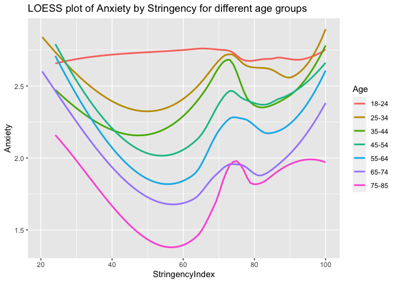<!-- -->
GAM
plot

``` r
plot_anx + stat_smooth(aes(group=age), se = FALSE, method = "gam", formula = y ~ x, size = 1, na.rm=TRUE) + scale_colour_discrete(name = "Age", 
labels = c("18-24", "25-34", "35-44", "45-54", "55-64", "65-74", "75-85", "85+")) + labs(title="GAM plot of Anxiety by Stringency for different age groups")
```

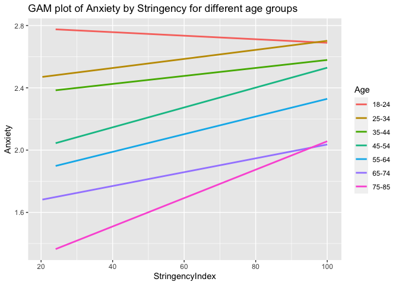<!-- -->

Plot Anxiety by
Date

``` r
plot_anx2 <- ggplot(data = data_long_min3_strc, aes(x = Date, y = Anxiety, group = ID, color = age))

plot_anx2 + stat_smooth(aes(group=age), se = FALSE, method = "loess", formula = y ~ x, size = 1, na.rm=TRUE) + scale_colour_discrete(name = "Age", 
labels = c("18-24", "25-34", "35-44", "45-54", "55-64", "65-74", "75-85", "85+")) + labs(title="LOESS plot of Anxiety by Date for different age groups")
```

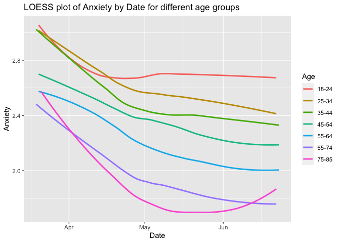<!-- -->
GAM
plot

``` r
plot_anx2 + stat_smooth(aes(group=age), se = FALSE, method = "gam", formula = y ~ x, size = 1, na.rm=TRUE) + scale_colour_discrete(name = "Age", 
labels = c("18-24", "25-34", "35-44", "45-54", "55-64", "65-74", "75-85", "85+")) + labs(title="GAM plot of Anxiety by Date for different age groups")
```

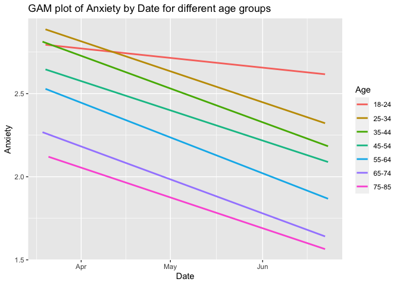<!-- -->
\#\#\#\#\#\#\#\#\#\#\#\#\#\#\#\#\#\#\#\#\#\#\# Anger
\#\#\#\#\#\#\#\#\#\#\#\#\#\#\#\#\#\#\#\#\#\#\# Multilevel anger random
intercept

``` r
model.ang0 <- lmer(Ang ~ 1 + (1 | Country/ID), data=data_long_min3_strc, na.action=na.exclude)
summary(model.ang0)
```

    ## Linear mixed model fit by REML. t-tests use Satterthwaite's method [
    ## lmerModLmerTest]
    ## Formula: Ang ~ 1 + (1 | Country/ID)
    ##    Data: data_long_min3_strc
    ## 
    ## REML criterion at convergence: 126269.8
    ## 
    ## Scaled residuals: 
    ##     Min      1Q  Median      3Q     Max 
    ## -4.2502 -0.4862 -0.1370  0.4881  4.7326 
    ## 
    ## Random effects:
    ##  Groups     Name        Variance Std.Dev.
    ##  ID:Country (Intercept) 0.67963  0.8244  
    ##  Country    (Intercept) 0.04422  0.2103  
    ##  Residual               0.56152  0.7493  
    ## Number of obs: 47698, groups:  ID:Country, 10325; Country, 33
    ## 
    ## Fixed effects:
    ##             Estimate Std. Error       df t value Pr(>|t|)    
    ## (Intercept)  2.05174    0.03939 28.41718   52.09   <2e-16 ***
    ## ---
    ## Signif. codes:  0 '***' 0.001 '**' 0.01 '*' 0.05 '.' 0.1 ' ' 1

Variance in anger explained by country is pretty low, equal variance
explained between and within persons

Using two level models Predicted by
stringency

``` r
model.ang1 <- lmer(Ang ~ StringencyIndex + (1 | ID), data=data_long_min3_strc, na.action=na.exclude)
summary(model.ang1)
```

    ## Linear mixed model fit by REML. t-tests use Satterthwaite's method [
    ## lmerModLmerTest]
    ## Formula: Ang ~ StringencyIndex + (1 | ID)
    ##    Data: data_long_min3_strc
    ## 
    ## REML criterion at convergence: 126511.3
    ## 
    ## Scaled residuals: 
    ##     Min      1Q  Median      3Q     Max 
    ## -4.2335 -0.4814 -0.1469  0.4830  4.8389 
    ## 
    ## Random effects:
    ##  Groups   Name        Variance Std.Dev.
    ##  ID       (Intercept) 0.7110   0.8432  
    ##  Residual             0.5607   0.7488  
    ## Number of obs: 47690, groups:  ID, 10325
    ## 
    ## Fixed effects:
    ##                  Estimate Std. Error        df t value Pr(>|t|)    
    ## (Intercept)     1.743e+00  2.805e-02 4.769e+04  62.116   <2e-16 ***
    ## StringencyIndex 3.391e-03  3.528e-04 4.506e+04   9.611   <2e-16 ***
    ## ---
    ## Signif. codes:  0 '***' 0.001 '**' 0.01 '*' 0.05 '.' 0.1 ' ' 1
    ## 
    ## Correlation of Fixed Effects:
    ##             (Intr)
    ## StrngncyInd -0.945

``` r
model.ang2 <- lmer(Ang ~ StringencyIndex + age + (1 | ID), data=data_long_min3_strc, na.action=na.exclude)
summary(model.ang2)
```

    ## Linear mixed model fit by REML. t-tests use Satterthwaite's method [
    ## lmerModLmerTest]
    ## Formula: Ang ~ StringencyIndex + age + (1 | ID)
    ##    Data: data_long_min3_strc
    ## 
    ## REML criterion at convergence: 126239.3
    ## 
    ## Scaled residuals: 
    ##     Min      1Q  Median      3Q     Max 
    ## -4.2388 -0.4860 -0.1361  0.4814  4.8583 
    ## 
    ## Random effects:
    ##  Groups   Name        Variance Std.Dev.
    ##  ID       (Intercept) 0.6860   0.8282  
    ##  Residual             0.5608   0.7489  
    ## Number of obs: 47690, groups:  ID, 10325
    ## 
    ## Fixed effects:
    ##                   Estimate Std. Error         df t value Pr(>|t|)    
    ## (Intercept)      1.941e+00  3.751e-02  3.089e+04  51.749  < 2e-16 ***
    ## StringencyIndex  3.035e-03  3.530e-04  4.502e+04   8.598  < 2e-16 ***
    ## age2            -4.360e-02  3.295e-02  1.047e+04  -1.323   0.1857    
    ## age3            -6.716e-02  3.313e-02  1.044e+04  -2.027   0.0427 *  
    ## age4            -1.657e-01  3.319e-02  1.035e+04  -4.995 5.99e-07 ***
    ## age5            -2.751e-01  3.333e-02  1.028e+04  -8.256  < 2e-16 ***
    ## age6            -4.809e-01  3.534e-02  1.020e+04 -13.606  < 2e-16 ***
    ## age7            -4.620e-01  7.108e-02  9.566e+03  -6.500 8.41e-11 ***
    ## ---
    ## Signif. codes:  0 '***' 0.001 '**' 0.01 '*' 0.05 '.' 0.1 ' ' 1
    ## 
    ## Correlation of Fixed Effects:
    ##             (Intr) StrngI age2   age3   age4   age5   age6  
    ## StrngncyInd -0.737                                          
    ## age2        -0.534  0.018                                   
    ## age3        -0.540  0.031  0.590                            
    ## age4        -0.547  0.040  0.589  0.586                     
    ## age5        -0.548  0.045  0.587  0.584  0.584              
    ## age6        -0.527  0.056  0.554  0.551  0.551  0.549       
    ## age7        -0.262  0.028  0.275  0.274  0.274  0.273  0.258

``` r
model.ang3 <- lmer(Ang ~ StringencyIndex + age + StringencyIndex*age + (1 | ID), data=data_long_min3_strc, na.action=na.exclude)
summary(model.ang3)
```

    ## Linear mixed model fit by REML. t-tests use Satterthwaite's method [
    ## lmerModLmerTest]
    ## Formula: Ang ~ StringencyIndex + age + StringencyIndex * age + (1 | ID)
    ##    Data: data_long_min3_strc
    ## 
    ## REML criterion at convergence: 126304.4
    ## 
    ## Scaled residuals: 
    ##     Min      1Q  Median      3Q     Max 
    ## -4.2409 -0.4835 -0.1376  0.4816  4.8950 
    ## 
    ## Random effects:
    ##  Groups   Name        Variance Std.Dev.
    ##  ID       (Intercept) 0.6859   0.8282  
    ##  Residual             0.5609   0.7489  
    ## Number of obs: 47690, groups:  ID, 10325
    ## 
    ## Fixed effects:
    ##                        Estimate Std. Error         df t value Pr(>|t|)    
    ## (Intercept)           2.021e+00  7.406e-02  4.766e+04  27.296  < 2e-16 ***
    ## StringencyIndex       2.007e-03  8.890e-04  4.503e+04   2.257 0.023983 *  
    ## age2                 -1.363e-01  1.008e-01  4.768e+04  -1.352 0.176336    
    ## age3                 -1.104e-01  1.019e-01  4.766e+04  -1.084 0.278237    
    ## age4                 -2.737e-01  9.930e-02  4.768e+04  -2.756 0.005850 ** 
    ## age5                 -3.457e-01  9.772e-02  4.766e+04  -3.538 0.000404 ***
    ## age6                 -6.635e-01  1.053e-01  4.764e+04  -6.303 2.94e-10 ***
    ## age7                 -4.772e-01  2.506e-01  4.765e+04  -1.904 0.056908 .  
    ## StringencyIndex:age2  1.187e-03  1.229e-03  4.522e+04   0.966 0.334173    
    ## StringencyIndex:age3  5.349e-04  1.253e-03  4.477e+04   0.427 0.669585    
    ## StringencyIndex:age4  1.397e-03  1.223e-03  4.476e+04   1.142 0.253531    
    ## StringencyIndex:age5  8.943e-04  1.203e-03  4.500e+04   0.743 0.457398    
    ## StringencyIndex:age6  2.436e-03  1.318e-03  4.534e+04   1.848 0.064677 .  
    ## StringencyIndex:age7  1.288e-04  3.291e-03  4.656e+04   0.039 0.968776    
    ## ---
    ## Signif. codes:  0 '***' 0.001 '**' 0.01 '*' 0.05 '.' 0.1 ' ' 1

    ## 
    ## Correlation matrix not shown by default, as p = 14 > 12.
    ## Use print(x, correlation=TRUE)  or
    ##     vcov(x)        if you need it

LOESS plot anger and stringency for different age
groups

``` r
plot_ang <- ggplot(data = data_long_min3_strc, aes(x = StringencyIndex, y = Ang, group = ID, color = age))

plot_ang + stat_smooth(aes(group=age), se = FALSE, method = "loess", formula = y ~ x, size = 1, na.rm=TRUE) + scale_colour_discrete(name = "Age", 
labels = c("18-24", "25-34", "35-44", "45-54", "55-64", "65-74", "75-85", "85+")) + labs(title="LOESS plot of Anger by Stringency for different age groups", y ="Anger")
```

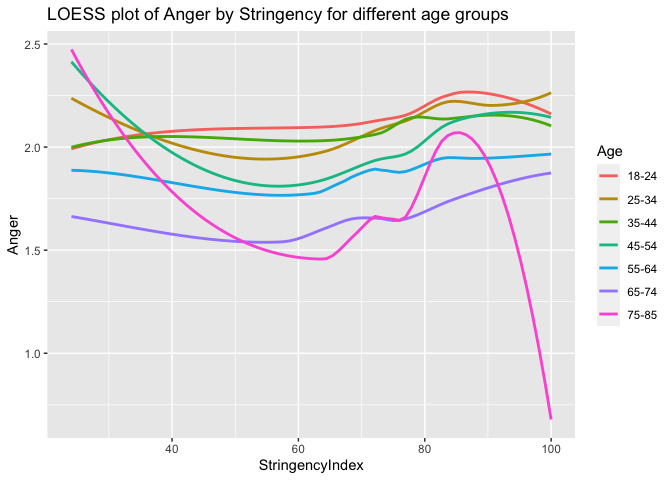<!-- -->
GAM
plot

``` r
plot_ang + stat_smooth(aes(group=age), se = FALSE, method = "gam", formula = y ~ x, size = 1, na.rm=TRUE) + scale_colour_discrete(name = "Age", 
labels = c("18-24", "25-34", "35-44", "45-54", "55-64", "65-74", "75-85", "85+")) + labs(title="GAM plot of Anger by Stringency for different age groups", y ="Anger")
```

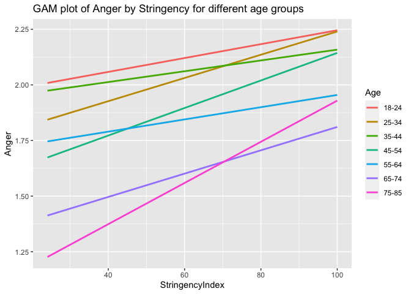<!-- -->

Plot Anger by Date for different age
groups

``` r
plot_ang2 <- ggplot(data = data_long_min3_strc, aes(x = Date, y = Ang, group = ID, color = age))

plot_ang2 + stat_smooth(aes(group=age), se = FALSE, method = "loess", formula = y ~ x, size = 1, na.rm=TRUE) + scale_colour_discrete(name = "Age", 
labels = c("18-24", "25-34", "35-44", "45-54", "55-64", "65-74", "75-85", "85+")) + labs(title="LOESS plot of Anger by Date for different age groups", y ="Anger")
```

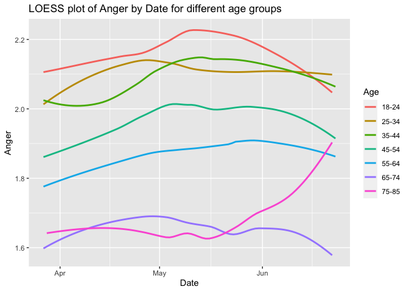<!-- -->
GAM
plot

``` r
plot_ang2 + stat_smooth(aes(group=age), se = FALSE, method = "gam", formula = y ~ x, size = 1, na.rm=TRUE) + scale_colour_discrete(name = "Age", 
labels = c("18-24", "25-34", "35-44", "45-54", "55-64", "65-74", "75-85", "85+")) + labs(title="GAM plot of Anger by Date for different age groups", y ="Anger")
```

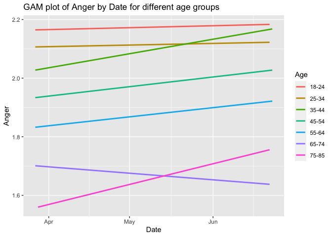<!-- -->

# Bored

Multilevel random
intercept

``` r
model.bor0 <- lmer(Bored ~ 1 + (1 | Country/ID), data=data_long_min3_strc, na.action=na.exclude)
```

    ## Warning in checkConv(attr(opt, "derivs"), opt$par, ctrl = control$checkConv, :
    ## Model failed to converge with max|grad| = 0.0111754 (tol = 0.002, component 1)

``` r
summary(model.bor0)
```

    ## Linear mixed model fit by REML. t-tests use Satterthwaite's method [
    ## lmerModLmerTest]
    ## Formula: Bored ~ 1 + (1 | Country/ID)
    ##    Data: data_long_min3_strc
    ## 
    ## REML criterion at convergence: 117124.9
    ## 
    ## Scaled residuals: 
    ##     Min      1Q  Median      3Q     Max 
    ## -4.2171 -0.5249 -0.1462  0.5238  4.3494 
    ## 
    ## Random effects:
    ##  Groups     Name        Variance Std.Dev.
    ##  ID:Country (Intercept) 0.7685   0.8766  
    ##  Country    (Intercept) 0.1194   0.3456  
    ##  Residual               0.6128   0.7828  
    ## Number of obs: 42411, groups:  ID:Country, 10325; Country, 33
    ## 
    ## Fixed effects:
    ##             Estimate Std. Error       df t value Pr(>|t|)    
    ## (Intercept)  2.31241    0.06227 30.44167   37.13   <2e-16 ***
    ## ---
    ## Signif. codes:  0 '***' 0.001 '**' 0.01 '*' 0.05 '.' 0.1 ' ' 1
    ## convergence code: 0
    ## Model failed to converge with max|grad| = 0.0111754 (tol = 0.002, component 1)

Variance in bored explained by country is pretty low, equal variance
explained between and within persons

Using two level models Predicted by
stringency

``` r
model.bor1 <- lmer(Bored ~ StringencyIndex + (1 | ID), data=data_long_min3_strc, na.action=na.exclude)
summary(model.bor1)
```

    ## Linear mixed model fit by REML. t-tests use Satterthwaite's method [
    ## lmerModLmerTest]
    ## Formula: Bored ~ StringencyIndex + (1 | ID)
    ##    Data: data_long_min3_strc
    ## 
    ## REML criterion at convergence: 117145.5
    ## 
    ## Scaled residuals: 
    ##     Min      1Q  Median      3Q     Max 
    ## -4.3353 -0.5208 -0.1392  0.5199  4.4917 
    ## 
    ## Random effects:
    ##  Groups   Name        Variance Std.Dev.
    ##  ID       (Intercept) 0.8424   0.9178  
    ##  Residual             0.6016   0.7756  
    ## Number of obs: 42404, groups:  ID, 10325
    ## 
    ## Fixed effects:
    ##                  Estimate Std. Error        df t value Pr(>|t|)    
    ## (Intercept)     1.507e+00  2.951e-02 4.229e+04   51.05   <2e-16 ***
    ## StringencyIndex 9.422e-03  3.733e-04 3.865e+04   25.24   <2e-16 ***
    ## ---
    ## Signif. codes:  0 '***' 0.001 '**' 0.01 '*' 0.05 '.' 0.1 ' ' 1
    ## 
    ## Correlation of Fixed Effects:
    ##             (Intr)
    ## StrngncyInd -0.940

``` r
model.bor2 <- lmer(Bored ~ StringencyIndex + age + (1 | ID), data=data_long_min3_strc, na.action=na.exclude)
summary(model.bor2)
```

    ## Linear mixed model fit by REML. t-tests use Satterthwaite's method [
    ## lmerModLmerTest]
    ## Formula: Bored ~ StringencyIndex + age + (1 | ID)
    ##    Data: data_long_min3_strc
    ## 
    ## REML criterion at convergence: 116644.9
    ## 
    ## Scaled residuals: 
    ##     Min      1Q  Median      3Q     Max 
    ## -4.2918 -0.5227 -0.1390  0.5206  4.5016 
    ## 
    ## Random effects:
    ##  Groups   Name        Variance Std.Dev.
    ##  ID       (Intercept) 0.7937   0.8909  
    ##  Residual             0.6010   0.7753  
    ## Number of obs: 42404, groups:  ID, 10325
    ## 
    ## Fixed effects:
    ##                   Estimate Std. Error         df t value Pr(>|t|)    
    ## (Intercept)      1.995e+00  3.995e-02  2.835e+04  49.947  < 2e-16 ***
    ## StringencyIndex  9.088e-03  3.724e-04  3.886e+04  24.405  < 2e-16 ***
    ## age2            -2.892e-01  3.639e-02  1.078e+04  -7.948 2.09e-15 ***
    ## age3            -4.178e-01  3.646e-02  1.062e+04 -11.457  < 2e-16 ***
    ## age4            -5.869e-01  3.637e-02  1.038e+04 -16.138  < 2e-16 ***
    ## age5            -6.436e-01  3.643e-02  1.023e+04 -17.663  < 2e-16 ***
    ## age6            -7.355e-01  3.840e-02  9.986e+03 -19.154  < 2e-16 ***
    ## age7            -7.212e-01  7.643e-02  9.087e+03  -9.436  < 2e-16 ***
    ## ---
    ## Signif. codes:  0 '***' 0.001 '**' 0.01 '*' 0.05 '.' 0.1 ' ' 1
    ## 
    ## Correlation of Fixed Effects:
    ##             (Intr) StrngI age2   age3   age4   age5   age6  
    ## StrngncyInd -0.712                                          
    ## age2        -0.551  0.014                                   
    ## age3        -0.555  0.021  0.593                            
    ## age4        -0.560  0.027  0.594  0.593                     
    ## age5        -0.559  0.026  0.593  0.592  0.594              
    ## age6        -0.537  0.034  0.563  0.562  0.564  0.563       
    ## age7        -0.270  0.018  0.283  0.282  0.283  0.283  0.268

``` r
model.bor3 <- lmer(Bored ~ StringencyIndex + age + StringencyIndex*age + (1 | ID), data=data_long_min3_strc, na.action=na.exclude)
print(summary(model.bor3), digits=2)
```

    ## Linear mixed model fit by REML. t-tests use Satterthwaite's method [
    ## lmerModLmerTest]
    ## Formula: Bored ~ StringencyIndex + age + StringencyIndex * age + (1 |      ID)
    ##    Data: data_long_min3_strc
    ## 
    ## REML criterion at convergence: 116701
    ## 
    ## Scaled residuals: 
    ##    Min     1Q Median     3Q    Max 
    ##  -4.30  -0.52  -0.14   0.52   4.51 
    ## 
    ## Random effects:
    ##  Groups   Name        Variance Std.Dev.
    ##  ID       (Intercept) 0.79     0.89    
    ##  Residual             0.60     0.78    
    ## Number of obs: 42404, groups:  ID, 10325
    ## 
    ## Fixed effects:
    ##                      Estimate Std. Error       df t value Pr(>|t|)    
    ## (Intercept)           1.9e+00    7.9e-02  4.2e+04    24.2   <2e-16 ***
    ## StringencyIndex       1.0e-02    9.7e-04  3.9e+04    10.6   <2e-16 ***
    ## age2                 -5.1e-02    1.1e-01  4.2e+04    -0.5     0.63    
    ## age3                 -2.7e-01    1.1e-01  4.2e+04    -2.5     0.01 *  
    ## age4                 -5.6e-01    1.0e-01  4.2e+04    -5.3    1e-07 ***
    ## age5                 -5.5e-01    1.0e-01  4.2e+04    -5.3    1e-07 ***
    ## age6                 -7.7e-01    1.1e-01  4.2e+04    -7.0    2e-12 ***
    ## age7                 -3.1e-01    2.6e-01  4.2e+04    -1.2     0.23    
    ## StringencyIndex:age2 -3.2e-03    1.3e-03  3.9e+04    -2.4     0.02 *  
    ## StringencyIndex:age3 -1.9e-03    1.4e-03  3.9e+04    -1.4     0.16    
    ## StringencyIndex:age4 -3.7e-04    1.3e-03  3.9e+04    -0.3     0.78    
    ## StringencyIndex:age5 -1.3e-03    1.3e-03  3.9e+04    -1.0     0.32    
    ## StringencyIndex:age6  5.3e-04    1.4e-03  3.9e+04     0.4     0.70    
    ## StringencyIndex:age7 -5.6e-03    3.4e-03  4.0e+04    -1.7     0.10 .  
    ## ---
    ## Signif. codes:  0 '***' 0.001 '**' 0.01 '*' 0.05 '.' 0.1 ' ' 1

    ## 
    ## Correlation matrix not shown by default, as p = 14 > 12.
    ## Use print(summary(model.bor3), correlation=TRUE)  or
    ##     vcov(summary(model.bor3))        if you need it

LOESS plot boredom and stringency for different age groups / lot of
missing data in
Boredom

``` r
plot_bor <- ggplot(data = data_long_min3_strc, aes(x = StringencyIndex, y = Bored, group = ID, color = age))

plot_bor + stat_smooth(aes(group=age), se = FALSE, method = "loess", formula = y ~ x, size = 1, na.rm=TRUE) + scale_colour_discrete(name = "Age", 
labels = c("18-24", "25-34", "35-44", "45-54", "55-64", "65-74", "75-85", "85+")) + labs(title="LOESS plot of Boredom by Stringency for different age groups", y ="Boredom")
```

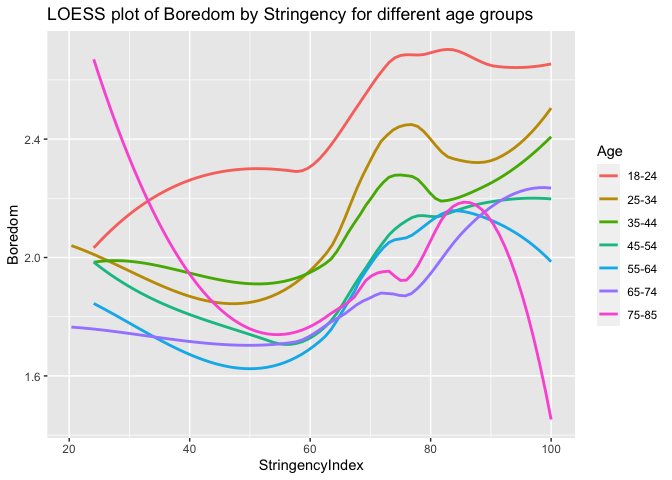<!-- -->
GAM
plot

``` r
plot_bor + stat_smooth(aes(group=age), se = FALSE, method = "gam", formula = y ~ x, size = 1, na.rm=TRUE) + scale_colour_discrete(name = "Age", 
labels = c("18-24", "25-34", "35-44", "45-54", "55-64", "65-74", "75-85", "85+")) + labs(title="GAM plot of Boredom by Stringency for different age groups", y ="Boredom")
```

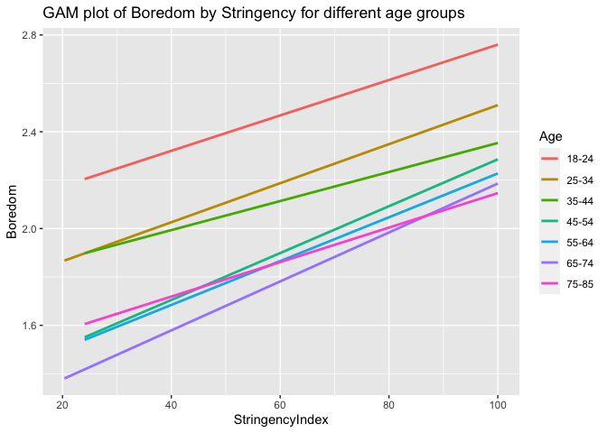<!-- -->

Plot Boredom by Date for different age groups / lot of missing data in
Boredom

``` r
plot_bor2 <- ggplot(data = data_long_min3_strc, aes(x = Date, y = Bored, group = ID, color = age))

plot_bor2 + stat_smooth(aes(group=age), se = FALSE, method = "loess", formula = y ~ x, size = 1, na.rm=TRUE) + scale_colour_discrete(name = "Age", 
labels = c("18-24", "25-34", "35-44", "45-54", "55-64", "65-74", "75-85", "85+")) + labs(title="LOESS plot of Boredom by Date for different age groups", y ="Boredom")
```

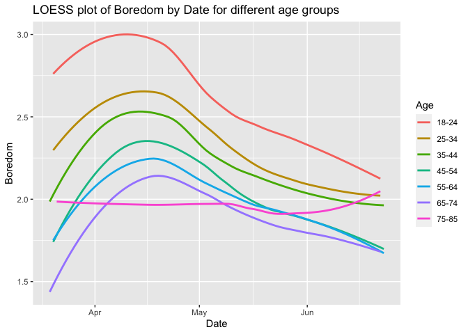<!-- -->
GAM
plot

``` r
plot_bor2 + stat_smooth(aes(group=age), se = FALSE, method = "gam", formula = y ~ x, size = 1, na.rm=TRUE) + scale_colour_discrete(name = "Age", 
labels = c("18-24", "25-34", "35-44", "45-54", "55-64", "65-74", "75-85", "85+")) + labs(title="GAM plot of Boredom by Date for different age groups", y ="Boredom")
```

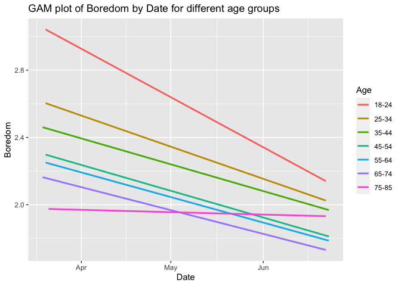<!-- -->

# Calm

Multilevel random
intercept

``` r
model.calm0 <- lmer(Calm ~ 1 + (1 | Country/ID), data=data_long_min3_strc, na.action=na.exclude)
summary(model.calm0)
```

    ## Linear mixed model fit by REML. t-tests use Satterthwaite's method [
    ## lmerModLmerTest]
    ## Formula: Calm ~ 1 + (1 | Country/ID)
    ##    Data: data_long_min3_strc
    ## 
    ## REML criterion at convergence: 146335.2
    ## 
    ## Scaled residuals: 
    ##     Min      1Q  Median      3Q     Max 
    ## -4.6747 -0.5641  0.0520  0.5891  4.2004 
    ## 
    ## Random effects:
    ##  Groups     Name        Variance Std.Dev.
    ##  ID:Country (Intercept) 0.56584  0.7522  
    ##  Country    (Intercept) 0.03692  0.1921  
    ##  Residual               0.52084  0.7217  
    ## Number of obs: 58002, groups:  ID:Country, 10331; Country, 33
    ## 
    ## Fixed effects:
    ##             Estimate Std. Error       df t value Pr(>|t|)    
    ## (Intercept)  3.06711    0.03591 29.56375   85.42   <2e-16 ***
    ## ---
    ## Signif. codes:  0 '***' 0.001 '**' 0.01 '*' 0.05 '.' 0.1 ' ' 1

Using two level models Predicted by
stringency

``` r
model.calm1 <- lmer(Calm ~ StringencyIndex + (1 | ID), data=data_long_min3_strc, na.action=na.exclude)
summary(model.calm1)
```

    ## Linear mixed model fit by REML. t-tests use Satterthwaite's method [
    ## lmerModLmerTest]
    ## Formula: Calm ~ StringencyIndex + (1 | ID)
    ##    Data: data_long_min3_strc
    ## 
    ## REML criterion at convergence: 146842
    ## 
    ## Scaled residuals: 
    ##     Min      1Q  Median      3Q     Max 
    ## -4.6529 -0.5712  0.0293  0.5979  4.1958 
    ## 
    ## Random effects:
    ##  Groups   Name        Variance Std.Dev.
    ##  ID       (Intercept) 0.6056   0.7782  
    ##  Residual             0.5208   0.7217  
    ## Number of obs: 57995, groups:  ID, 10331
    ## 
    ## Fixed effects:
    ##                   Estimate Std. Error         df t value Pr(>|t|)    
    ## (Intercept)      3.115e+00  2.483e-02  5.774e+04 125.458  < 2e-16 ***
    ## StringencyIndex -9.890e-04  3.082e-04  5.564e+04  -3.209  0.00133 ** 
    ## ---
    ## Signif. codes:  0 '***' 0.001 '**' 0.01 '*' 0.05 '.' 0.1 ' ' 1
    ## 
    ## Correlation of Fixed Effects:
    ##             (Intr)
    ## StrngncyInd -0.942

``` r
model.calm2 <- lmer(Calm ~ StringencyIndex + age + (1 | ID), data=data_long_min3_strc, na.action=na.exclude)
summary(model.calm2)
```

    ## Linear mixed model fit by REML. t-tests use Satterthwaite's method [
    ## lmerModLmerTest]
    ## Formula: Calm ~ StringencyIndex + age + (1 | ID)
    ##    Data: data_long_min3_strc
    ## 
    ## REML criterion at convergence: 146605.1
    ## 
    ## Scaled residuals: 
    ##     Min      1Q  Median      3Q     Max 
    ## -4.6437 -0.5656  0.0348  0.5903  4.2062 
    ## 
    ## Random effects:
    ##  Groups   Name        Variance Std.Dev.
    ##  ID       (Intercept) 0.5873   0.7663  
    ##  Residual             0.5209   0.7217  
    ## Number of obs: 57995, groups:  ID, 10331
    ## 
    ## Fixed effects:
    ##                   Estimate Std. Error         df t value Pr(>|t|)    
    ## (Intercept)      3.040e+00  3.346e-02  3.199e+04  90.839  < 2e-16 ***
    ## StringencyIndex -8.011e-04  3.083e-04  5.561e+04  -2.598  0.00937 ** 
    ## age2            -4.917e-02  2.989e-02  1.050e+04  -1.645  0.10006    
    ## age3            -6.218e-02  3.007e-02  1.049e+04  -2.068  0.03867 *  
    ## age4             3.609e-02  3.015e-02  1.042e+04   1.197  0.23125    
    ## age5             1.335e-01  3.028e-02  1.037e+04   4.407 1.06e-05 ***
    ## age6             3.318e-01  3.212e-02  1.032e+04  10.330  < 2e-16 ***
    ## age7             3.916e-01  6.497e-02  9.865e+03   6.027 1.73e-09 ***
    ## ---
    ## Signif. codes:  0 '***' 0.001 '**' 0.01 '*' 0.05 '.' 0.1 ' ' 1
    ## 
    ## Correlation of Fixed Effects:
    ##             (Intr) StrngI age2   age3   age4   age5   age6  
    ## StrngncyInd -0.726                                          
    ## age2        -0.543  0.019                                   
    ## age3        -0.548  0.029  0.590                            
    ## age4        -0.551  0.036  0.588  0.585                     
    ## age5        -0.550  0.038  0.586  0.583  0.581              
    ## age6        -0.527  0.047  0.552  0.550  0.549  0.546       
    ## age7        -0.261  0.024  0.273  0.272  0.271  0.270  0.255

``` r
model.calm3 <- lmer(Calm ~ StringencyIndex + age + StringencyIndex*age + (1 | ID), data=data_long_min3_strc, na.action=na.exclude)
print(summary(model.calm3), digits=2)
```

    ## Linear mixed model fit by REML. t-tests use Satterthwaite's method [
    ## lmerModLmerTest]
    ## Formula: Calm ~ StringencyIndex + age + StringencyIndex * age + (1 | ID)
    ##    Data: data_long_min3_strc
    ## 
    ## REML criterion at convergence: 146630.1
    ## 
    ## Scaled residuals: 
    ##    Min     1Q Median     3Q    Max 
    ##  -4.65  -0.57   0.04   0.59   4.18 
    ## 
    ## Random effects:
    ##  Groups   Name        Variance Std.Dev.
    ##  ID       (Intercept) 0.59     0.77    
    ##  Residual             0.52     0.72    
    ## Number of obs: 57995, groups:  ID, 10331
    ## 
    ## Fixed effects:
    ##                      Estimate Std. Error       df t value Pr(>|t|)    
    ## (Intercept)           2.9e+00    6.6e-02  5.7e+04    43.6   <2e-16 ***
    ## StringencyIndex       1.4e-03    7.8e-04  5.6e+04     1.7    0.083 .  
    ## age2                  7.6e-03    8.9e-02  5.8e+04     0.1    0.932    
    ## age3                 -5.7e-02    9.0e-02  5.8e+04    -0.6    0.525    
    ## age4                  2.6e-01    8.8e-02  5.8e+04     2.9    0.003 ** 
    ## age5                  4.1e-01    8.7e-02  5.7e+04     4.7    2e-06 ***
    ## age6                  7.8e-01    9.3e-02  5.7e+04     8.4   <2e-16 ***
    ## age7                  7.8e-01    2.2e-01  5.8e+04     3.5    5e-04 ***
    ## StringencyIndex:age2 -6.9e-04    1.1e-03  5.6e+04    -0.6    0.524    
    ## StringencyIndex:age3  1.8e-05    1.1e-03  5.6e+04     0.0    0.987    
    ## StringencyIndex:age4 -2.8e-03    1.1e-03  5.5e+04    -2.6    0.008 ** 
    ## StringencyIndex:age5 -3.6e-03    1.1e-03  5.6e+04    -3.4    7e-04 ***
    ## StringencyIndex:age6 -5.9e-03    1.1e-03  5.6e+04    -5.2    2e-07 ***
    ## StringencyIndex:age7 -5.1e-03    2.9e-03  5.7e+04    -1.8    0.074 .  
    ## ---
    ## Signif. codes:  0 '***' 0.001 '**' 0.01 '*' 0.05 '.' 0.1 ' ' 1

    ## 
    ## Correlation matrix not shown by default, as p = 14 > 12.
    ## Use print(summary(model.calm3), correlation=TRUE)  or
    ##     vcov(summary(model.calm3))        if you need it

LOESS plot calm and stringency for different age
groups

``` r
plot_calm <- ggplot(data = data_long_min3_strc, aes(x = StringencyIndex, y = Calm, group = ID, color = age))

plot_calm + stat_smooth(aes(group=age), se = FALSE, method = "loess", formula = y ~ x, size = 1, na.rm=TRUE) + scale_colour_discrete(name = "Age", 
labels = c("18-24", "25-34", "35-44", "45-54", "55-64", "65-74", "75-85", "85+")) + labs(title="LOESS plot of Calm by Stringency for different age groups", y ="Calm")
```

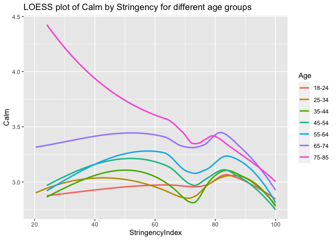<!-- -->

GAM
plot

``` r
plot_calm + stat_smooth(aes(group=age), se = FALSE, method = "gam", formula = y ~ x, size = 1) + scale_colour_discrete(name = "Age", 
labels = c("18-24", "25-34", "35-44", "45-54", "55-64", "65-74", "75-85", "85+")) + labs(title="GAM plot of Calm by Stringency for different age groups", y ="Calm")
```

    ## Warning: Removed 65977 rows containing non-finite values (stat_smooth).

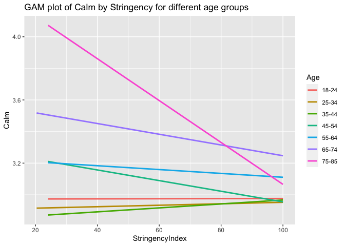<!-- -->

LOESS plot calm and date for different age
groups

``` r
plot_calm2 <- ggplot(data = data_long_min3_strc, aes(x = Date, y = Calm, group = ID, color = age))

plot_calm2 + stat_smooth(aes(group=age), se = FALSE, method = "loess", formula = y ~ x, size = 1, na.rm=TRUE) + scale_colour_discrete(name = "Age", 
labels = c("18-24", "25-34", "35-44", "45-54", "55-64", "65-74", "75-85", "85+")) + labs(title="LOESS plot of Calm by Date for different age groups", y ="Calm")
```

<!-- -->

GAM
plot

``` r
plot_calm2 + stat_smooth(aes(group=age), se = FALSE, method = "gam", formula = y ~ x, size = 1) + scale_colour_discrete(name = "Age", 
labels = c("18-24", "25-34", "35-44", "45-54", "55-64", "65-74", "75-85", "85+")) + labs(title="GAM plot of Calm by Date for different age groups", y ="Calm")
```

    ## Warning: Removed 65970 rows containing non-finite values (stat_smooth).

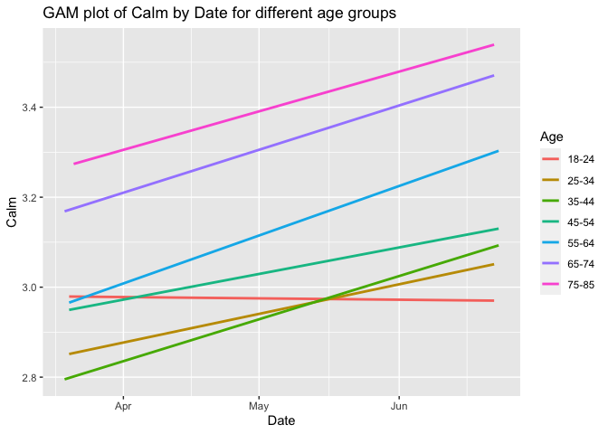<!-- -->
\#\#\#\#\#\#\#\#\#\#\#\#\#\#\#\#\#\#\#\#\#\#\# Depressed
\#\#\#\#\#\#\#\#\#\#\#\#\#\#\#\#\#\#\#\#\#\#\# Multilevel depressed
random
intercept

``` r
model.depr0 <- lmer(Depr ~ 1 + (1 | Country/ID), data=data_long_min3_strc, na.action=na.exclude)
summary(model.depr0)
```

    ## Linear mixed model fit by REML. t-tests use Satterthwaite's method [
    ## lmerModLmerTest]
    ## Formula: Depr ~ 1 + (1 | Country/ID)
    ##    Data: data_long_min3_strc
    ## 
    ## REML criterion at convergence: 147743.9
    ## 
    ## Scaled residuals: 
    ##     Min      1Q  Median      3Q     Max 
    ## -4.5391 -0.5217 -0.1333  0.5024  4.9159 
    ## 
    ## Random effects:
    ##  Groups     Name        Variance Std.Dev.
    ##  ID:Country (Intercept) 0.71830  0.8475  
    ##  Country    (Intercept) 0.05068  0.2251  
    ##  Residual               0.51452  0.7173  
    ## Number of obs: 57962, groups:  ID:Country, 10329; Country, 33
    ## 
    ## Fixed effects:
    ##             Estimate Std. Error      df t value Pr(>|t|)    
    ## (Intercept)   2.0687     0.0418 24.0448   49.49   <2e-16 ***
    ## ---
    ## Signif. codes:  0 '***' 0.001 '**' 0.01 '*' 0.05 '.' 0.1 ' ' 1

Using two level models Predicted by
stringency

``` r
model.depr1 <- lmer(Depr ~ StringencyIndex + (1 | ID), data=data_long_min3_strc, na.action=na.exclude)
summary(model.depr1)
```

    ## Linear mixed model fit by REML. t-tests use Satterthwaite's method [
    ## lmerModLmerTest]
    ## Formula: Depr ~ StringencyIndex + (1 | ID)
    ##    Data: data_long_min3_strc
    ## 
    ## REML criterion at convergence: 147812.8
    ## 
    ## Scaled residuals: 
    ##     Min      1Q  Median      3Q     Max 
    ## -4.6323 -0.5198 -0.1443  0.5016  4.8896 
    ## 
    ## Random effects:
    ##  Groups   Name        Variance Std.Dev.
    ##  ID       (Intercept) 0.7468   0.8642  
    ##  Residual             0.5125   0.7159  
    ## Number of obs: 57954, groups:  ID, 10329
    ## 
    ## Fixed effects:
    ##                  Estimate Std. Error        df t value Pr(>|t|)    
    ## (Intercept)     1.719e+00  2.513e-02 5.764e+04   68.40   <2e-16 ***
    ## StringencyIndex 4.188e-03  3.086e-04 5.459e+04   13.57   <2e-16 ***
    ## ---
    ## Signif. codes:  0 '***' 0.001 '**' 0.01 '*' 0.05 '.' 0.1 ' ' 1
    ## 
    ## Correlation of Fixed Effects:
    ##             (Intr)
    ## StrngncyInd -0.932

``` r
model.depr2 <- lmer(Depr ~ StringencyIndex + age + (1 | ID), data=data_long_min3_strc, na.action=na.exclude)
summary(model.depr2)
```

    ## Linear mixed model fit by REML. t-tests use Satterthwaite's method [
    ## lmerModLmerTest]
    ## Formula: Depr ~ StringencyIndex + age + (1 | ID)
    ##    Data: data_long_min3_strc
    ## 
    ## REML criterion at convergence: 147271.6
    ## 
    ## Scaled residuals: 
    ##     Min      1Q  Median      3Q     Max 
    ## -4.5967 -0.5254 -0.1358  0.5033  4.9282 
    ## 
    ## Random effects:
    ##  Groups   Name        Variance Std.Dev.
    ##  ID       (Intercept) 0.7008   0.8371  
    ##  Residual             0.5125   0.7159  
    ## Number of obs: 57954, groups:  ID, 10329
    ## 
    ## Fixed effects:
    ##                   Estimate Std. Error         df t value Pr(>|t|)    
    ## (Intercept)      2.071e+00  3.470e-02  2.974e+04  59.687  < 2e-16 ***
    ## StringencyIndex  3.822e-03  3.083e-04  5.471e+04  12.396  < 2e-16 ***
    ## age2            -1.561e-01  3.218e-02  1.041e+04  -4.851 1.25e-06 ***
    ## age3            -2.602e-01  3.238e-02  1.039e+04  -8.036 1.03e-15 ***
    ## age4            -3.216e-01  3.246e-02  1.034e+04  -9.905  < 2e-16 ***
    ## age5            -4.706e-01  3.262e-02  1.030e+04 -14.426  < 2e-16 ***
    ## age6            -7.121e-01  3.462e-02  1.026e+04 -20.566  < 2e-16 ***
    ## age7            -7.161e-01  7.011e-02  9.862e+03 -10.214  < 2e-16 ***
    ## ---
    ## Signif. codes:  0 '***' 0.001 '**' 0.01 '*' 0.05 '.' 0.1 ' ' 1
    ## 
    ## Correlation of Fixed Effects:
    ##             (Intr) StrngI age2   age3   age4   age5   age6  
    ## StrngncyInd -0.700                                          
    ## age2        -0.562  0.018                                   
    ## age3        -0.565  0.027  0.590                            
    ## age4        -0.568  0.034  0.588  0.585                     
    ## age5        -0.567  0.035  0.585  0.582  0.581              
    ## age6        -0.542  0.044  0.552  0.549  0.547  0.545       
    ## age7        -0.268  0.023  0.272  0.271  0.270  0.269  0.254

``` r
model.depr3 <- lmer(Depr ~ StringencyIndex + age + StringencyIndex*age + (1 | ID), data=data_long_min3_strc, na.action=na.exclude)
print(summary(model.depr3), digits=2)
```

    ## Linear mixed model fit by REML. t-tests use Satterthwaite's method [
    ## lmerModLmerTest]
    ## Formula: Depr ~ StringencyIndex + age + StringencyIndex * age + (1 | ID)
    ##    Data: data_long_min3_strc
    ## 
    ## REML criterion at convergence: 147334.7
    ## 
    ## Scaled residuals: 
    ##    Min     1Q Median     3Q    Max 
    ##  -4.60  -0.53  -0.14   0.50   4.92 
    ## 
    ## Random effects:
    ##  Groups   Name        Variance Std.Dev.
    ##  ID       (Intercept) 0.70     0.84    
    ##  Residual             0.51     0.72    
    ## Number of obs: 57954, groups:  ID, 10329
    ## 
    ## Fixed effects:
    ##                      Estimate Std. Error       df t value Pr(>|t|)    
    ## (Intercept)           2.0e+00    6.6e-02  5.7e+04    30.2   <2e-16 ***
    ## StringencyIndex       4.6e-03    7.8e-04  5.5e+04     5.9    4e-09 ***
    ## age2                 -3.8e-02    9.0e-02  5.8e+04    -0.4     0.68    
    ## age3                 -1.3e-01    9.1e-02  5.8e+04    -1.4     0.15    
    ## age4                 -2.2e-01    8.9e-02  5.8e+04    -2.4     0.01 *  
    ## age5                 -4.3e-01    8.8e-02  5.7e+04    -4.9    9e-07 ***
    ## age6                 -7.6e-01    9.4e-02  5.7e+04    -8.1    5e-16 ***
    ## age7                 -5.6e-01    2.2e-01  5.8e+04    -2.5     0.01 *  
    ## StringencyIndex:age2 -1.5e-03    1.1e-03  5.5e+04    -1.4     0.16    
    ## StringencyIndex:age3 -1.7e-03    1.1e-03  5.5e+04    -1.5     0.13    
    ## StringencyIndex:age4 -1.4e-03    1.1e-03  5.5e+04    -1.3     0.21    
    ## StringencyIndex:age5 -4.7e-04    1.1e-03  5.5e+04    -0.4     0.66    
    ## StringencyIndex:age6  7.4e-04    1.1e-03  5.5e+04     0.6     0.52    
    ## StringencyIndex:age7 -2.1e-03    2.9e-03  5.6e+04    -0.7     0.48    
    ## ---
    ## Signif. codes:  0 '***' 0.001 '**' 0.01 '*' 0.05 '.' 0.1 ' ' 1

    ## 
    ## Correlation matrix not shown by default, as p = 14 > 12.
    ## Use print(summary(model.depr3), correlation=TRUE)  or
    ##     vcov(summary(model.depr3))        if you need it

LOESS plot depressed and stringency for different age
groups

``` r
plot_depr <- ggplot(data = data_long_min3_strc, aes(x = StringencyIndex, y = Depr, group = ID, color = age))

plot_depr + stat_smooth(aes(group=age), se = FALSE, method = "loess", formula = y ~ x, size = 1, na.rm=TRUE) + scale_colour_discrete(name = "Age", 
labels = c("18-24", "25-34", "35-44", "45-54", "55-64", "65-74", "75-85", "85+")) + labs(title="LOESS plot of Depressed by Stringency for different age groups", y ="Depr")
```

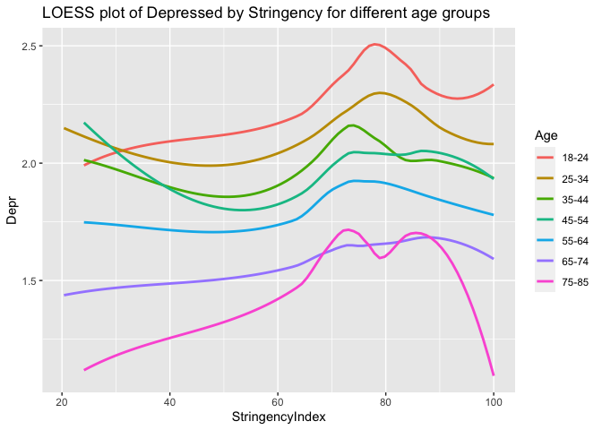<!-- -->
GAM
plot

``` r
plot_depr + stat_smooth(aes(group=age), se = FALSE, method = "gam", formula = y ~ x, size = 1, na.rm=TRUE) + scale_colour_discrete(name = "Age", 
labels = c("18-24", "25-34", "35-44", "45-54", "55-64", "65-74", "75-85", "85+")) + labs(title="GAM plot of Depressed by Stringency for different age groups", y ="Depr")
```

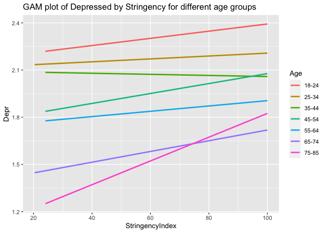<!-- -->

LOESS plot depressed and stringency for different age
groups

``` r
plot_depr2 <- ggplot(data = data_long_min3_strc, aes(x = Date, y = Depr, group = ID, color = age))

plot_depr2 + stat_smooth(aes(group=age), se = FALSE, method = "loess", formula = y ~ x, size = 1, na.rm=TRUE) + scale_colour_discrete(name = "Age", 
labels = c("18-24", "25-34", "35-44", "45-54", "55-64", "65-74", "75-85", "85+")) + labs(title="LOESS plot of Depressed by Date for different age groups", y ="Depr")
```

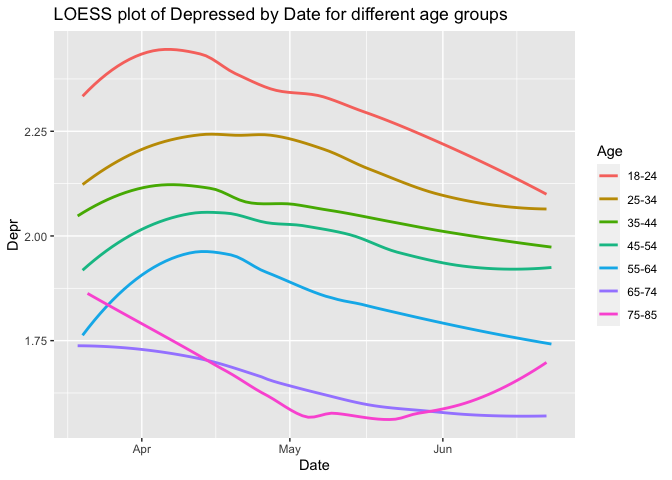<!-- -->
GAM
plot

``` r
plot_depr2 + stat_smooth(aes(group=age), se = FALSE, method = "gam", formula = y ~ x, size = 1, na.rm=TRUE) + scale_colour_discrete(name = "Age", 
labels = c("18-24", "25-34", "35-44", "45-54", "55-64", "65-74", "75-85", "85+")) + labs(title="GAM plot of Depressed by Date for different age groups", y ="Depr")
```

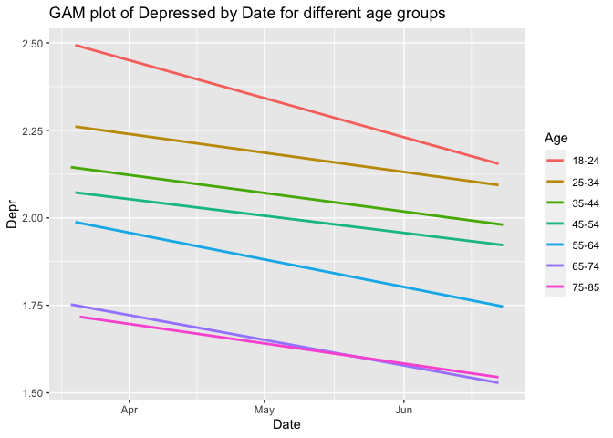<!-- -->
\#\#\#\#\#\#\#\#\#\#\#\#\#\#\#\#\#\#\#\#\#\#\# Energetic
\#\#\#\#\#\#\#\#\#\#\#\#\#\#\#\#\#\#\#\#\#\#\# Multilevel random
intercept

``` r
model.energ0 <- lmer(Energ ~ 1 + (1 | Country/ID), data=data_long_min3_strc, na.action=na.exclude)
summary(model.energ0)
```

    ## Linear mixed model fit by REML. t-tests use Satterthwaite's method [
    ## lmerModLmerTest]
    ## Formula: Energ ~ 1 + (1 | Country/ID)
    ##    Data: data_long_min3_strc
    ## 
    ## REML criterion at convergence: 146359.5
    ## 
    ## Scaled residuals: 
    ##     Min      1Q  Median      3Q     Max 
    ## -4.6261 -0.5792  0.0218  0.5965  4.4343 
    ## 
    ## Random effects:
    ##  Groups     Name        Variance Std.Dev.
    ##  ID:Country (Intercept) 0.54353  0.7372  
    ##  Country    (Intercept) 0.06265  0.2503  
    ##  Residual               0.52624  0.7254  
    ## Number of obs: 57937, groups:  ID:Country, 10331; Country, 33
    ## 
    ## Fixed effects:
    ##             Estimate Std. Error       df t value Pr(>|t|)    
    ## (Intercept)  2.69202    0.04555 32.52479    59.1   <2e-16 ***
    ## ---
    ## Signif. codes:  0 '***' 0.001 '**' 0.01 '*' 0.05 '.' 0.1 ' ' 1

Using two level models Predicted by
stringency

``` r
model.energ1 <- lmer(Energ ~ StringencyIndex + (1 | ID), data=data_long_min3_strc, na.action=na.exclude)
summary(model.energ1)
```

    ## Linear mixed model fit by REML. t-tests use Satterthwaite's method [
    ## lmerModLmerTest]
    ## Formula: Energ ~ StringencyIndex + (1 | ID)
    ##    Data: data_long_min3_strc
    ## 
    ## REML criterion at convergence: 147225.7
    ## 
    ## Scaled residuals: 
    ##     Min      1Q  Median      3Q     Max 
    ## -4.6671 -0.5760  0.0454  0.5976  4.5871 
    ## 
    ## Random effects:
    ##  Groups   Name        Variance Std.Dev.
    ##  ID       (Intercept) 0.6257   0.7910  
    ##  Residual             0.5235   0.7235  
    ## Number of obs: 57930, groups:  ID, 10331
    ## 
    ## Fixed effects:
    ##                   Estimate Std. Error         df t value Pr(>|t|)    
    ## (Intercept)      3.018e+00  2.496e-02  5.768e+04  120.92   <2e-16 ***
    ## StringencyIndex -5.024e-03  3.095e-04  5.545e+04  -16.23   <2e-16 ***
    ## ---
    ## Signif. codes:  0 '***' 0.001 '**' 0.01 '*' 0.05 '.' 0.1 ' ' 1
    ## 
    ## Correlation of Fixed Effects:
    ##             (Intr)
    ## StrngncyInd -0.941

``` r
model.energ2 <- lmer(Energ ~ StringencyIndex + age + (1 | ID), data=data_long_min3_strc, na.action=na.exclude)
summary(model.energ2)
```

    ## Linear mixed model fit by REML. t-tests use Satterthwaite's method [
    ## lmerModLmerTest]
    ## Formula: Energ ~ StringencyIndex + age + (1 | ID)
    ##    Data: data_long_min3_strc
    ## 
    ## REML criterion at convergence: 147213.5
    ## 
    ## Scaled residuals: 
    ##     Min      1Q  Median      3Q     Max 
    ## -4.6785 -0.5754  0.0439  0.5947  4.5724 
    ## 
    ## Random effects:
    ##  Groups   Name        Variance Std.Dev.
    ##  ID       (Intercept) 0.6229   0.7893  
    ##  Residual             0.5235   0.7235  
    ## Number of obs: 57930, groups:  ID, 10331
    ## 
    ## Fixed effects:
    ##                   Estimate Std. Error         df t value Pr(>|t|)    
    ## (Intercept)      3.029e+00  3.396e-02  3.142e+04  89.201  < 2e-16 ***
    ## StringencyIndex -4.977e-03  3.099e-04  5.532e+04 -16.058  < 2e-16 ***
    ## age2            -4.515e-02  3.066e-02  1.051e+04  -1.473  0.14081    
    ## age3            -8.627e-02  3.084e-02  1.049e+04  -2.797  0.00516 ** 
    ## age4            -4.460e-02  3.092e-02  1.043e+04  -1.443  0.14917    
    ## age5             2.662e-02  3.106e-02  1.038e+04   0.857  0.39154    
    ## age6             8.853e-02  3.296e-02  1.034e+04   2.686  0.00724 ** 
    ## age7             5.345e-02  6.674e-02  9.917e+03   0.801  0.42318    
    ## ---
    ## Signif. codes:  0 '***' 0.001 '**' 0.01 '*' 0.05 '.' 0.1 ' ' 1
    ## 
    ## Correlation of Fixed Effects:
    ##             (Intr) StrngI age2   age3   age4   age5   age6  
    ## StrngncyInd -0.719                                          
    ## age2        -0.548  0.019                                   
    ## age3        -0.552  0.029  0.590                            
    ## age4        -0.556  0.036  0.588  0.585                     
    ## age5        -0.555  0.037  0.586  0.582  0.581              
    ## age6        -0.531  0.046  0.552  0.549  0.548  0.546       
    ## age7        -0.263  0.024  0.273  0.271  0.271  0.270  0.254

``` r
model.energ3 <- lmer(Energ ~ StringencyIndex + age + StringencyIndex*age + (1 | ID), data=data_long_min3_strc, na.action=na.exclude)
print(summary(model.energ3), digits=2)
```

    ## Linear mixed model fit by REML. t-tests use Satterthwaite's method [
    ## lmerModLmerTest]
    ## Formula: Energ ~ StringencyIndex + age + StringencyIndex * age + (1 |      ID)
    ##    Data: data_long_min3_strc
    ## 
    ## REML criterion at convergence: 147250.7
    ## 
    ## Scaled residuals: 
    ##    Min     1Q Median     3Q    Max 
    ##  -4.66  -0.58   0.04   0.60   4.61 
    ## 
    ## Random effects:
    ##  Groups   Name        Variance Std.Dev.
    ##  ID       (Intercept) 0.62     0.79    
    ##  Residual             0.52     0.72    
    ## Number of obs: 57930, groups:  ID, 10331
    ## 
    ## Fixed effects:
    ##                      Estimate Std. Error       df t value Pr(>|t|)    
    ## (Intercept)           2.8e+00    6.6e-02  5.7e+04    42.5   <2e-16 ***
    ## StringencyIndex      -2.3e-03    7.9e-04  5.6e+04    -2.9    0.004 ** 
    ## age2                  6.7e-02    9.0e-02  5.8e+04     0.7    0.457    
    ## age3                  1.3e-01    9.1e-02  5.8e+04     1.4    0.149    
    ## age4                  2.0e-01    8.9e-02  5.8e+04     2.3    0.022 *  
    ## age5                  2.7e-01    8.8e-02  5.7e+04     3.1    0.002 ** 
    ## age6                  5.4e-01    9.4e-02  5.7e+04     5.7    1e-08 ***
    ## age7                  6.5e-01    2.3e-01  5.8e+04     2.9    0.004 ** 
    ## StringencyIndex:age2 -1.4e-03    1.1e-03  5.6e+04    -1.3    0.199    
    ## StringencyIndex:age3 -2.8e-03    1.1e-03  5.5e+04    -2.5    0.012 *  
    ## StringencyIndex:age4 -3.2e-03    1.1e-03  5.5e+04    -2.9    0.003 ** 
    ## StringencyIndex:age5 -3.1e-03    1.1e-03  5.5e+04    -2.9    0.004 ** 
    ## StringencyIndex:age6 -5.9e-03    1.1e-03  5.6e+04    -5.1    3e-07 ***
    ## StringencyIndex:age7 -7.9e-03    2.9e-03  5.7e+04    -2.7    0.007 ** 
    ## ---
    ## Signif. codes:  0 '***' 0.001 '**' 0.01 '*' 0.05 '.' 0.1 ' ' 1

    ## 
    ## Correlation matrix not shown by default, as p = 14 > 12.
    ## Use print(summary(model.energ3), correlation=TRUE)  or
    ##     vcov(summary(model.energ3))        if you need it

LOESS plot energetic and stringency for different age
groups

``` r
plot_energ <- ggplot(data = data_long_min3_strc, aes(x = StringencyIndex, y = Energ, group = ID, color = age))

plot_energ + stat_smooth(aes(group=age), se = FALSE, method = "loess", formula = y ~ x, size = 1, na.rm=TRUE) + scale_colour_discrete(name = "Age", 
labels = c("18-24", "25-34", "35-44", "45-54", "55-64", "65-74", "75-85", "85+")) + labs(title="LOESS plot of Energetic by Stringency for different age groups", y ="Energ")
```

<!-- -->
GAM
plot

``` r
plot_energ + stat_smooth(aes(group=age), se = FALSE, method = "gam", formula = y ~ x, size = 1, na.rm=TRUE) + scale_colour_discrete(name = "Age", 
labels = c("18-24", "25-34", "35-44", "45-54", "55-64", "65-74", "75-85", "85+")) + labs(title="GAM plot of Energetic by Stringency for different age groups", y ="Energ")
```

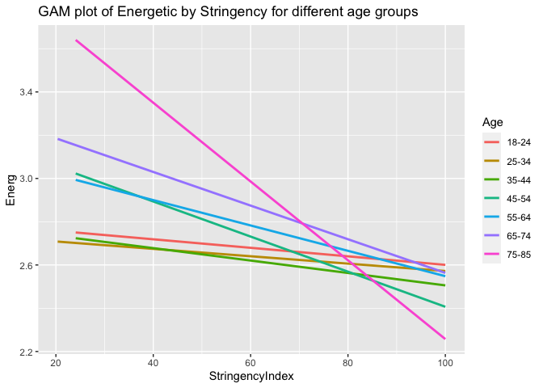<!-- -->

LOESS plot energetic and date for different age
groups

``` r
plot_energ2 <- ggplot(data = data_long_min3_strc, aes(x = Date, y = Energ, group = ID, color = age))

plot_energ2 + stat_smooth(aes(group=age), se = FALSE, method = "loess", formula = y ~ x, size = 1, na.rm=TRUE) + scale_colour_discrete(name = "Age", 
labels = c("18-24", "25-34", "35-44", "45-54", "55-64", "65-74", "75-85", "85+")) + labs(title="LOESS plot of Energetic by Date for different age groups", y ="Energ")
```

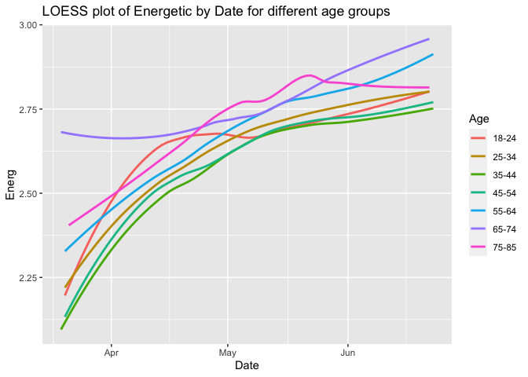<!-- -->
GAM
plot

``` r
plot_energ2 + stat_smooth(aes(group=age), se = FALSE, method = "gam", formula = y ~ x, size = 1, na.rm=TRUE) + scale_colour_discrete(name = "Age", 
labels = c("18-24", "25-34", "35-44", "45-54", "55-64", "65-74", "75-85", "85+")) + labs(title="GAM plot of Energetic by Date for different age groups", y ="Energ")
```

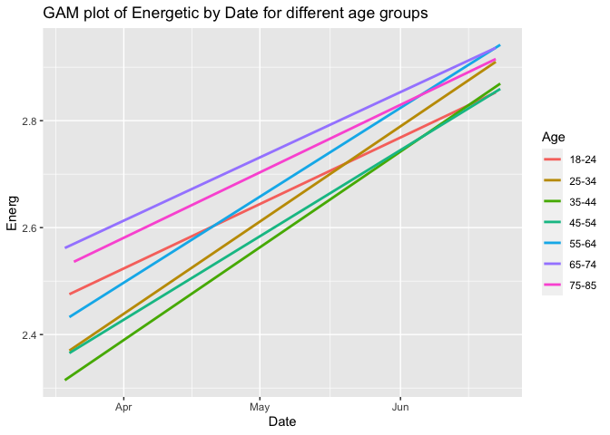<!-- -->

# Exhausted

Multilevel random
intercept

``` r
model.exh0 <- lmer(Exh ~ 1 + (1 | Country/ID), data=data_long_min3_strc, na.action=na.exclude)
summary(model.exh0)
```

    ## Linear mixed model fit by REML. t-tests use Satterthwaite's method [
    ## lmerModLmerTest]
    ## Formula: Exh ~ 1 + (1 | Country/ID)
    ##    Data: data_long_min3_strc
    ## 
    ## REML criterion at convergence: 159391.6
    ## 
    ## Scaled residuals: 
    ##     Min      1Q  Median      3Q     Max 
    ## -4.3336 -0.5661 -0.1380  0.5864  4.2721 
    ## 
    ## Random effects:
    ##  Groups     Name        Variance Std.Dev.
    ##  ID:Country (Intercept) 0.76112  0.8724  
    ##  Country    (Intercept) 0.06001  0.2450  
    ##  Residual               0.64628  0.8039  
    ## Number of obs: 57938, groups:  ID:Country, 10328; Country, 33
    ## 
    ## Fixed effects:
    ##             Estimate Std. Error       df t value Pr(>|t|)    
    ## (Intercept)  2.41924    0.04528 28.75003   53.42   <2e-16 ***
    ## ---
    ## Signif. codes:  0 '***' 0.001 '**' 0.01 '*' 0.05 '.' 0.1 ' ' 1

Using two level models Predicted by
stringency

``` r
model.exh1 <- lmer(Exh ~ StringencyIndex + (1 | ID), data=data_long_min3_strc, na.action=na.exclude)
summary(model.exh1)
```

    ## Linear mixed model fit by REML. t-tests use Satterthwaite's method [
    ## lmerModLmerTest]
    ## Formula: Exh ~ StringencyIndex + (1 | ID)
    ##    Data: data_long_min3_strc
    ## 
    ## REML criterion at convergence: 159729.8
    ## 
    ## Scaled residuals: 
    ##     Min      1Q  Median      3Q     Max 
    ## -4.3314 -0.5681 -0.1410  0.5820  4.2849 
    ## 
    ## Random effects:
    ##  Groups   Name        Variance Std.Dev.
    ##  ID       (Intercept) 0.8006   0.8948  
    ##  Residual             0.6460   0.8038  
    ## Number of obs: 57931, groups:  ID, 10328
    ## 
    ## Fixed effects:
    ##                   Estimate Std. Error         df t value Pr(>|t|)    
    ## (Intercept)      2.443e+00  2.783e-02  5.767e+04  87.785  < 2e-16 ***
    ## StringencyIndex -9.619e-04  3.446e-04  5.530e+04  -2.792  0.00524 ** 
    ## ---
    ## Signif. codes:  0 '***' 0.001 '**' 0.01 '*' 0.05 '.' 0.1 ' ' 1
    ## 
    ## Correlation of Fixed Effects:
    ##             (Intr)
    ## StrngncyInd -0.940

``` r
model.exh2 <- lmer(Exh ~ StringencyIndex + age + (1 | ID), data=data_long_min3_strc, na.action=na.exclude)
summary(model.exh2)
```

    ## Linear mixed model fit by REML. t-tests use Satterthwaite's method [
    ## lmerModLmerTest]
    ## Formula: Exh ~ StringencyIndex + age + (1 | ID)
    ##    Data: data_long_min3_strc
    ## 
    ## REML criterion at convergence: 158586.9
    ## 
    ## Scaled residuals: 
    ##     Min      1Q  Median      3Q     Max 
    ## -4.3045 -0.5690 -0.1297  0.5917  4.3272 
    ## 
    ## Random effects:
    ##  Groups   Name        Variance Std.Dev.
    ##  ID       (Intercept) 0.6996   0.8364  
    ##  Residual             0.6462   0.8038  
    ## Number of obs: 57931, groups:  ID, 10328
    ## 
    ## Fixed effects:
    ##                   Estimate Std. Error         df t value Pr(>|t|)    
    ## (Intercept)      2.817e+00  3.696e-02  3.236e+04  76.211  < 2e-16 ***
    ## StringencyIndex -1.474e-03  3.432e-04  5.572e+04  -4.295 1.75e-05 ***
    ## age2            -4.759e-02  3.274e-02  1.046e+04  -1.454 0.146042    
    ## age3            -1.248e-01  3.293e-02  1.045e+04  -3.789 0.000152 ***
    ## age4            -3.421e-01  3.301e-02  1.038e+04 -10.361  < 2e-16 ***
    ## age5            -5.830e-01  3.317e-02  1.033e+04 -17.578  < 2e-16 ***
    ## age6            -9.182e-01  3.519e-02  1.028e+04 -26.090  < 2e-16 ***
    ## age7            -9.395e-01  7.118e-02  9.833e+03 -13.200  < 2e-16 ***
    ## ---
    ## Signif. codes:  0 '***' 0.001 '**' 0.01 '*' 0.05 '.' 0.1 ' ' 1
    ## 
    ## Correlation of Fixed Effects:
    ##             (Intr) StrngI age2   age3   age4   age5   age6  
    ## StrngncyInd -0.731                                          
    ## age2        -0.539  0.019                                   
    ## age3        -0.544  0.030  0.590                            
    ## age4        -0.547  0.037  0.588  0.585                     
    ## age5        -0.546  0.038  0.586  0.583  0.581              
    ## age6        -0.523  0.048  0.552  0.549  0.548  0.546       
    ## age7        -0.260  0.025  0.273  0.272  0.271  0.270  0.255

``` r
model.exh3 <- lmer(Exh ~ StringencyIndex + age + StringencyIndex*age + (1 | ID), data=data_long_min3_strc, na.action=na.exclude)
print(summary(model.exh3), digits=2)
```

    ## Linear mixed model fit by REML. t-tests use Satterthwaite's method [
    ## lmerModLmerTest]
    ## Formula: Exh ~ StringencyIndex + age + StringencyIndex * age + (1 | ID)
    ##    Data: data_long_min3_strc
    ## 
    ## REML criterion at convergence: 158644.1
    ## 
    ## Scaled residuals: 
    ##    Min     1Q Median     3Q    Max 
    ##  -4.30  -0.57  -0.13   0.59   4.31 
    ## 
    ## Random effects:
    ##  Groups   Name        Variance Std.Dev.
    ##  ID       (Intercept) 0.70     0.84    
    ##  Residual             0.65     0.80    
    ## Number of obs: 57931, groups:  ID, 10328
    ## 
    ## Fixed effects:
    ##                      Estimate Std. Error       df t value Pr(>|t|)    
    ## (Intercept)           2.9e+00    7.3e-02  5.7e+04    39.2   <2e-16 ***
    ## StringencyIndex      -2.1e-03    8.7e-04  5.6e+04    -2.4    0.017 *  
    ## age2                 -4.7e-03    9.9e-02  5.8e+04     0.0    0.962    
    ## age3                 -1.7e-01    1.0e-01  5.8e+04    -1.7    0.093 .  
    ## age4                 -3.4e-01    9.8e-02  5.8e+04    -3.4    6e-04 ***
    ## age5                 -6.5e-01    9.7e-02  5.7e+04    -6.7    2e-11 ***
    ## age6                 -1.2e+00    1.0e-01  5.7e+04   -11.3   <2e-16 ***
    ## age7                 -1.1e+00    2.5e-01  5.8e+04    -4.4    9e-06 ***
    ## StringencyIndex:age2 -5.7e-04    1.2e-03  5.6e+04    -0.5    0.633    
    ## StringencyIndex:age3  5.5e-04    1.2e-03  5.6e+04     0.5    0.652    
    ## StringencyIndex:age4 -1.1e-04    1.2e-03  5.6e+04    -0.1    0.928    
    ## StringencyIndex:age5  8.1e-04    1.2e-03  5.6e+04     0.7    0.491    
    ## StringencyIndex:age6  3.4e-03    1.3e-03  5.6e+04     2.6    0.008 ** 
    ## StringencyIndex:age7  2.1e-03    3.2e-03  5.7e+04     0.7    0.511    
    ## ---
    ## Signif. codes:  0 '***' 0.001 '**' 0.01 '*' 0.05 '.' 0.1 ' ' 1

    ## 
    ## Correlation matrix not shown by default, as p = 14 > 12.
    ## Use print(summary(model.exh3), correlation=TRUE)  or
    ##     vcov(summary(model.exh3))        if you need it

LOESS plot exhausted and stringency for different age
groups

``` r
plot_exh <- ggplot(data = data_long_min3_strc, aes(x = StringencyIndex, y = Exh, group = ID, color = age))

plot_exh + stat_smooth(aes(group=age), se = FALSE, method = "loess", formula = y ~ x, size = 1, na.rm=TRUE) + scale_colour_discrete(name = "Age", 
labels = c("18-24", "25-34", "35-44", "45-54", "55-64", "65-74", "75-85", "85+")) + labs(title="LOESS plot of Exhausted by Stringency for different age groups", y ="Exh")
```

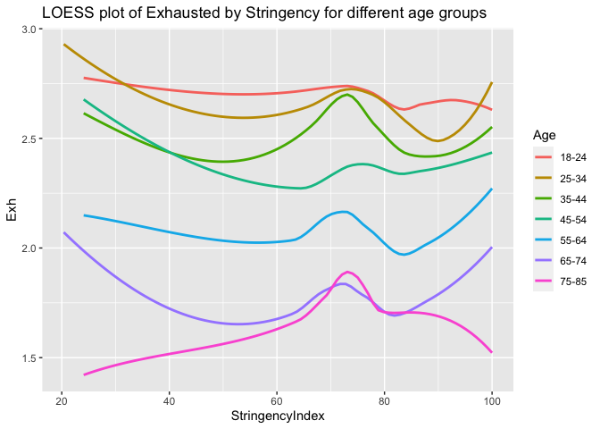<!-- -->
GAM
plot

``` r
plot_exh + stat_smooth(aes(group=age), se = FALSE, method = "gam", formula = y ~ x, size = 1, na.rm=TRUE) + scale_colour_discrete(name = "Age", 
labels = c("18-24", "25-34", "35-44", "45-54", "55-64", "65-74", "75-85", "85+")) + labs(title="GAM plot of Exhausted by Stringency for different age groups", y ="Exh")
```

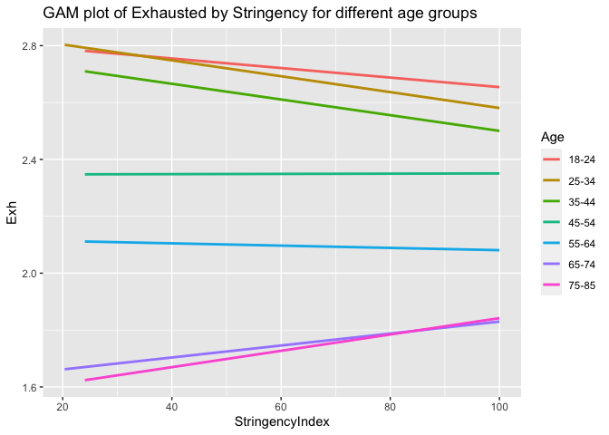<!-- -->

LOESS plot exhausted and date for different age
groups

``` r
plot_exh2 <- ggplot(data = data_long_min3_strc, aes(x = Date, y = Exh, group = ID, color = age))

plot_exh2 + stat_smooth(aes(group=age), se = FALSE, method = "loess", formula = y ~ x, size = 1, na.rm=TRUE) + scale_colour_discrete(name = "Age", 
labels = c("18-24", "25-34", "35-44", "45-54", "55-64", "65-74", "75-85", "85+")) + labs(title="LOESS plot of Exhausted by Date for different age groups", y ="Exh")
```

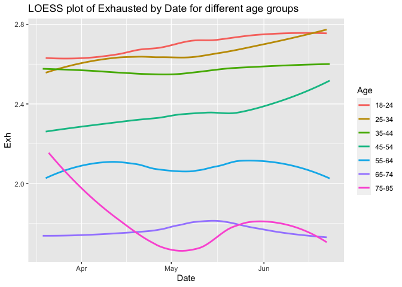<!-- -->
GAM
plot

``` r
plot_exh2 + stat_smooth(aes(group=age), se = FALSE, method = "gam", formula = y ~ x, size = 1, na.rm=TRUE) + scale_colour_discrete(name = "Age", 
labels = c("18-24", "25-34", "35-44", "45-54", "55-64", "65-74", "75-85", "85+")) + labs(title="GAM plot of Exhausted by Date for different age groups", y ="Exh")
```

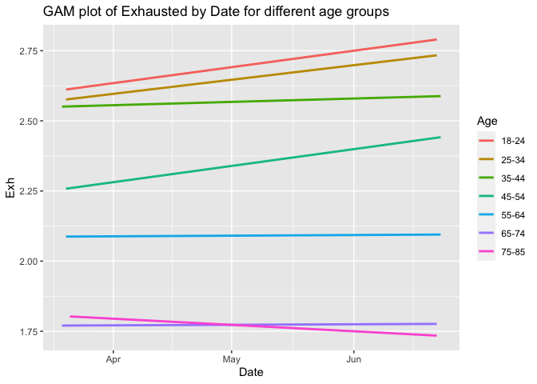<!-- -->

# Inspired

Multilevel random
intercept

``` r
model.insp0 <- lmer(Insp ~ 1 + (1 | Country/ID), data=data_long_min3_strc, na.action=na.exclude)
summary(model.insp0)
```

    ## Linear mixed model fit by REML. t-tests use Satterthwaite's method [
    ## lmerModLmerTest]
    ## Formula: Insp ~ 1 + (1 | Country/ID)
    ##    Data: data_long_min3_strc
    ## 
    ## REML criterion at convergence: 151845.4
    ## 
    ## Scaled residuals: 
    ##     Min      1Q  Median      3Q     Max 
    ## -4.1322 -0.5883 -0.0513  0.5878  4.2504 
    ## 
    ## Random effects:
    ##  Groups     Name        Variance Std.Dev.
    ##  ID:Country (Intercept) 0.60501  0.7778  
    ##  Country    (Intercept) 0.06094  0.2469  
    ##  Residual               0.57801  0.7603  
    ## Number of obs: 57912, groups:  ID:Country, 10331; Country, 33
    ## 
    ## Fixed effects:
    ##             Estimate Std. Error       df t value Pr(>|t|)    
    ## (Intercept)  2.53993    0.04516 31.39714   56.24   <2e-16 ***
    ## ---
    ## Signif. codes:  0 '***' 0.001 '**' 0.01 '*' 0.05 '.' 0.1 ' ' 1

Using two level models Predicted by
stringency

``` r
model.insp1 <- lmer(Insp ~ StringencyIndex + (1 | ID), data=data_long_min3_strc, na.action=na.exclude)
summary(model.insp1)
```

    ## Linear mixed model fit by REML. t-tests use Satterthwaite's method [
    ## lmerModLmerTest]
    ## Formula: Insp ~ StringencyIndex + (1 | ID)
    ##    Data: data_long_min3_strc
    ## 
    ## REML criterion at convergence: 152401
    ## 
    ## Scaled residuals: 
    ##     Min      1Q  Median      3Q     Max 
    ## -4.2030 -0.5807 -0.0580  0.5838  4.2418 
    ## 
    ## Random effects:
    ##  Groups   Name        Variance Std.Dev.
    ##  ID       (Intercept) 0.6690   0.8180  
    ##  Residual             0.5754   0.7586  
    ## Number of obs: 57905, groups:  ID, 10331
    ## 
    ## Fixed effects:
    ##                   Estimate Std. Error         df t value Pr(>|t|)    
    ## (Intercept)      2.799e+00  2.613e-02  5.765e+04  107.15   <2e-16 ***
    ## StringencyIndex -4.290e-03  3.244e-04  5.556e+04  -13.22   <2e-16 ***
    ## ---
    ## Signif. codes:  0 '***' 0.001 '**' 0.01 '*' 0.05 '.' 0.1 ' ' 1
    ## 
    ## Correlation of Fixed Effects:
    ##             (Intr)
    ## StrngncyInd -0.942

``` r
model.insp2 <- lmer(Insp ~ StringencyIndex + age + (1 | ID), data=data_long_min3_strc, na.action=na.exclude)
summary(model.insp2)
```

    ## Linear mixed model fit by REML. t-tests use Satterthwaite's method [
    ## lmerModLmerTest]
    ## Formula: Insp ~ StringencyIndex + age + (1 | ID)
    ##    Data: data_long_min3_strc
    ## 
    ## REML criterion at convergence: 152418.6
    ## 
    ## Scaled residuals: 
    ##     Min      1Q  Median      3Q     Max 
    ## -4.2001 -0.5804 -0.0572  0.5845  4.2457 
    ## 
    ## Random effects:
    ##  Groups   Name        Variance Std.Dev.
    ##  ID       (Intercept) 0.6685   0.8176  
    ##  Residual             0.5754   0.7585  
    ## Number of obs: 57905, groups:  ID, 10331
    ## 
    ## Fixed effects:
    ##                   Estimate Std. Error         df t value Pr(>|t|)    
    ## (Intercept)      2.816e+00  3.543e-02  3.167e+04  79.474   <2e-16 ***
    ## StringencyIndex -4.282e-03  3.248e-04  5.541e+04 -13.181   <2e-16 ***
    ## age2            -2.196e-02  3.182e-02  1.050e+04  -0.690   0.4902    
    ## age3            -5.845e-02  3.201e-02  1.048e+04  -1.826   0.0678 .  
    ## age4            -3.802e-02  3.209e-02  1.042e+04  -1.185   0.2361    
    ## age5             1.655e-02  3.224e-02  1.037e+04   0.513   0.6076    
    ## age6             2.684e-02  3.421e-02  1.033e+04   0.785   0.4327    
    ## age7            -1.038e-01  6.927e-02  9.912e+03  -1.499   0.1340    
    ## ---
    ## Signif. codes:  0 '***' 0.001 '**' 0.01 '*' 0.05 '.' 0.1 ' ' 1
    ## 
    ## Correlation of Fixed Effects:
    ##             (Intr) StrngI age2   age3   age4   age5   age6  
    ## StrngncyInd -0.722                                          
    ## age2        -0.546  0.019                                   
    ## age3        -0.550  0.029  0.590                            
    ## age4        -0.554  0.036  0.588  0.585                     
    ## age5        -0.552  0.037  0.586  0.583  0.581              
    ## age6        -0.529  0.047  0.552  0.549  0.548  0.546       
    ## age7        -0.262  0.024  0.273  0.271  0.271  0.270  0.254

``` r
model.insp3 <- lmer(Insp ~ StringencyIndex + age + StringencyIndex*age + (1 | ID), data=data_long_min3_strc, na.action=na.exclude)
print(summary(model.insp3), digits=2)
```

    ## Linear mixed model fit by REML. t-tests use Satterthwaite's method [
    ## lmerModLmerTest]
    ## Formula: Insp ~ StringencyIndex + age + StringencyIndex * age + (1 | ID)
    ##    Data: data_long_min3_strc
    ## 
    ## REML criterion at convergence: 152447.5
    ## 
    ## Scaled residuals: 
    ##    Min     1Q Median     3Q    Max 
    ##  -4.20  -0.58  -0.06   0.58   4.25 
    ## 
    ## Random effects:
    ##  Groups   Name        Variance Std.Dev.
    ##  ID       (Intercept) 0.67     0.82    
    ##  Residual             0.57     0.76    
    ## Number of obs: 57905, groups:  ID, 10331
    ## 
    ## Fixed effects:
    ##                      Estimate Std. Error       df t value Pr(>|t|)    
    ## (Intercept)           2.6e+00    6.9e-02  5.7e+04    37.5   <2e-16 ***
    ## StringencyIndex      -1.5e-03    8.2e-04  5.6e+04    -1.8    0.069 .  
    ## age2                  1.4e-02    9.4e-02  5.8e+04     0.1    0.884    
    ## age3                  1.3e-01    9.5e-02  5.8e+04     1.3    0.179    
    ## age4                  2.9e-01    9.3e-02  5.8e+04     3.2    0.002 ** 
    ## age5                  3.2e-01    9.2e-02  5.7e+04     3.5    5e-04 ***
    ## age6                  4.9e-01    9.8e-02  5.7e+04     5.0    6e-07 ***
    ## age7                  9.9e-02    2.4e-01  5.8e+04     0.4    0.674    
    ## StringencyIndex:age2 -4.0e-04    1.1e-03  5.6e+04    -0.3    0.727    
    ## StringencyIndex:age3 -2.4e-03    1.2e-03  5.5e+04    -2.0    0.042 *  
    ## StringencyIndex:age4 -4.3e-03    1.1e-03  5.5e+04    -3.8    2e-04 ***
    ## StringencyIndex:age5 -3.9e-03    1.1e-03  5.6e+04    -3.5    4e-04 ***
    ## StringencyIndex:age6 -6.1e-03    1.2e-03  5.6e+04    -5.0    4e-07 ***
    ## StringencyIndex:age7 -2.6e-03    3.1e-03  5.7e+04    -0.8    0.401    
    ## ---
    ## Signif. codes:  0 '***' 0.001 '**' 0.01 '*' 0.05 '.' 0.1 ' ' 1

    ## 
    ## Correlation matrix not shown by default, as p = 14 > 12.
    ## Use print(summary(model.insp3), correlation=TRUE)  or
    ##     vcov(summary(model.insp3))        if you need it

LOESS plot inspired and stringency for different age
groups

``` r
plot_insp <- ggplot(data = data_long_min3_strc, aes(x = StringencyIndex, y = Insp, group = ID, color = age))

plot_insp + stat_smooth(aes(group=age), se = FALSE, method = "loess", formula = y ~ x, size = 1, na.rm=TRUE) + scale_colour_discrete(name = "Age", 
labels = c("18-24", "25-34", "35-44", "45-54", "55-64", "65-74", "75-85", "85+")) + labs(title="LOESS plot of Inspired by Stringency for different age groups", y ="Insp")
```

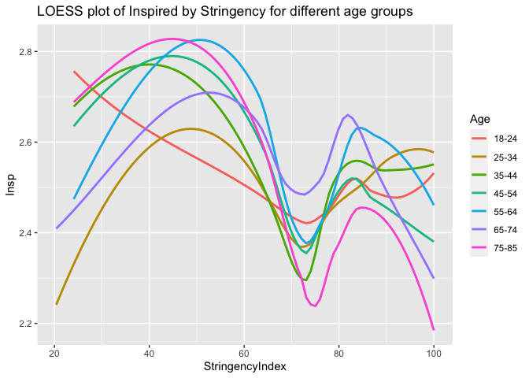<!-- -->
GAM
plot

``` r
plot_insp + stat_smooth(aes(group=age), se = FALSE, method = "gam", formula = y ~ x, size = 1, na.rm=TRUE) + scale_colour_discrete(name = "Age", 
labels = c("18-24", "25-34", "35-44", "45-54", "55-64", "65-74", "75-85", "85+")) + labs(title="GAM plot of Inspired by Stringency for different age groups", y ="Insp")
```

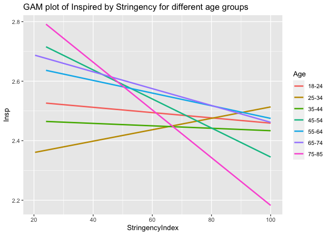<!-- -->

LOESS plot inspired and date for different age
groups

``` r
plot_insp2 <- ggplot(data = data_long_min3_strc, aes(x = Date, y = Insp, group = ID, color = age))

plot_insp2 + stat_smooth(aes(group=age), se = FALSE, method = "loess", formula = y ~ x, size = 1, na.rm=TRUE) + scale_colour_discrete(name = "Age", 
labels = c("18-24", "25-34", "35-44", "45-54", "55-64", "65-74", "75-85", "85+")) + labs(title="LOESS plot of Inspired by Date for different age groups", y ="Insp")
```

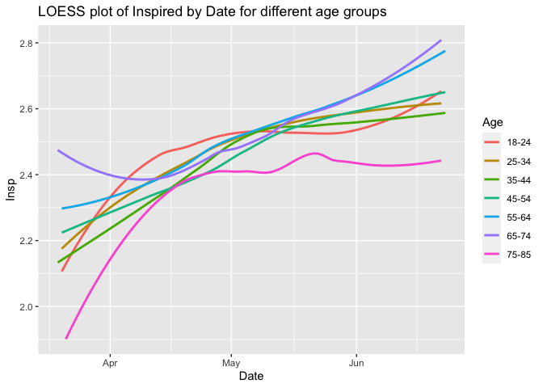<!-- -->
GAM
plot

``` r
plot_insp2 + stat_smooth(aes(group=age), se = FALSE, method = "gam", formula = y ~ x, size = 1, na.rm=TRUE) + scale_colour_discrete(name = "Age", 
labels = c("18-24", "25-34", "35-44", "45-54", "55-64", "65-74", "75-85", "85+")) + labs(title="GAM plot of Inspired by Date for different age groups", y ="Insp")
```

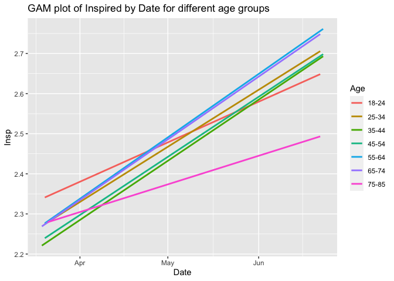<!-- -->

# Loved

Multilevel random
intercept

``` r
model.lov0 <- lmer(Lov ~ 1 + (1 | Country/ID), data=data_long_min3_strc, na.action=na.exclude)
summary(model.lov0)
```

    ## Linear mixed model fit by REML. t-tests use Satterthwaite's method [
    ## lmerModLmerTest]
    ## Formula: Lov ~ 1 + (1 | Country/ID)
    ##    Data: data_long_min3_strc
    ## 
    ## REML criterion at convergence: 110750.8
    ## 
    ## Scaled residuals: 
    ##     Min      1Q  Median      3Q     Max 
    ## -5.9961 -0.4625  0.0620  0.4788  5.1139 
    ## 
    ## Random effects:
    ##  Groups     Name        Variance Std.Dev.
    ##  ID:Country (Intercept) 0.90695  0.9523  
    ##  Country    (Intercept) 0.06375  0.2525  
    ##  Residual               0.35209  0.5934  
    ## Number of obs: 47711, groups:  ID:Country, 10329; Country, 33
    ## 
    ## Fixed effects:
    ##             Estimate Std. Error      df t value Pr(>|t|)    
    ## (Intercept)   3.3470     0.0468 28.9449   71.52   <2e-16 ***
    ## ---
    ## Signif. codes:  0 '***' 0.001 '**' 0.01 '*' 0.05 '.' 0.1 ' ' 1

Using two level models Predicted by
stringency

``` r
model.lov1 <- lmer(Lov ~ StringencyIndex + (1 | ID), data=data_long_min3_strc, na.action=na.exclude)
summary(model.lov1)
```

    ## Linear mixed model fit by REML. t-tests use Satterthwaite's method [
    ## lmerModLmerTest]
    ## Formula: Lov ~ StringencyIndex + (1 | ID)
    ##    Data: data_long_min3_strc
    ## 
    ## REML criterion at convergence: 111040.5
    ## 
    ## Scaled residuals: 
    ##     Min      1Q  Median      3Q     Max 
    ## -6.0043 -0.4539  0.0718  0.4720  5.0228 
    ## 
    ## Random effects:
    ##  Groups   Name        Variance Std.Dev.
    ##  ID       (Intercept) 0.9540   0.9767  
    ##  Residual             0.3512   0.5926  
    ## Number of obs: 47704, groups:  ID, 10329
    ## 
    ## Fixed effects:
    ##                   Estimate Std. Error         df t value Pr(>|t|)    
    ## (Intercept)      3.590e+00  2.387e-02  4.761e+04 150.385  < 2e-16 ***
    ## StringencyIndex -2.325e-03  2.874e-04  4.199e+04  -8.089 6.18e-16 ***
    ## ---
    ## Signif. codes:  0 '***' 0.001 '**' 0.01 '*' 0.05 '.' 0.1 ' ' 1
    ## 
    ## Correlation of Fixed Effects:
    ##             (Intr)
    ## StrngncyInd -0.906

``` r
model.lov2 <- lmer(Lov ~ StringencyIndex + age + (1 | ID), data=data_long_min3_strc, na.action=na.exclude)
summary(model.lov2)
```

    ## Linear mixed model fit by REML. t-tests use Satterthwaite's method [
    ## lmerModLmerTest]
    ## Formula: Lov ~ StringencyIndex + age + (1 | ID)
    ##    Data: data_long_min3_strc
    ## 
    ## REML criterion at convergence: 111061.2
    ## 
    ## Scaled residuals: 
    ##     Min      1Q  Median      3Q     Max 
    ## -6.0023 -0.4541  0.0712  0.4732  5.0224 
    ## 
    ## Random effects:
    ##  Groups   Name        Variance Std.Dev.
    ##  ID       (Intercept) 0.9537   0.9766  
    ##  Residual             0.3512   0.5926  
    ## Number of obs: 47704, groups:  ID, 10329
    ## 
    ## Fixed effects:
    ##                   Estimate Std. Error         df t value Pr(>|t|)    
    ## (Intercept)      3.559e+00  3.616e-02  2.361e+04  98.411  < 2e-16 ***
    ## StringencyIndex -2.318e-03  2.878e-04  4.185e+04  -8.054 8.21e-16 ***
    ## age2             4.002e-02  3.672e-02  1.045e+04   1.090   0.2758    
    ## age3             5.382e-02  3.693e-02  1.043e+04   1.457   0.1451    
    ## age4             3.790e-02  3.704e-02  1.039e+04   1.023   0.3062    
    ## age5            -1.717e-03  3.722e-02  1.035e+04  -0.046   0.9632    
    ## age6             2.486e-02  3.950e-02  1.031e+04   0.629   0.5290    
    ## age7             1.858e-01  8.012e-02  9.970e+03   2.320   0.0204 *  
    ## ---
    ## Signif. codes:  0 '***' 0.001 '**' 0.01 '*' 0.05 '.' 0.1 ' ' 1
    ## 
    ## Correlation of Fixed Effects:
    ##             (Intr) StrngI age2   age3   age4   age5   age6  
    ## StrngncyInd -0.624                                          
    ## age2        -0.610  0.014                                   
    ## age3        -0.612  0.023  0.589                            
    ## age4        -0.615  0.030  0.588  0.585                     
    ## age5        -0.614  0.033  0.585  0.582  0.580              
    ## age6        -0.585  0.041  0.551  0.549  0.547  0.545       
    ## age7        -0.289  0.021  0.272  0.270  0.270  0.269  0.253

``` r
model.lov3 <- lmer(Lov ~ StringencyIndex + age + StringencyIndex*age + (1 | ID), data=data_long_min3_strc, na.action=na.exclude)
print(summary(model.lov3), digits=2)
```

    ## Linear mixed model fit by REML. t-tests use Satterthwaite's method [
    ## lmerModLmerTest]
    ## Formula: Lov ~ StringencyIndex + age + StringencyIndex * age + (1 | ID)
    ##    Data: data_long_min3_strc
    ## 
    ## REML criterion at convergence: 111119.1
    ## 
    ## Scaled residuals: 
    ##    Min     1Q Median     3Q    Max 
    ##  -6.00  -0.45   0.07   0.47   5.04 
    ## 
    ## Random effects:
    ##  Groups   Name        Variance Std.Dev.
    ##  ID       (Intercept) 0.95     0.98    
    ##  Residual             0.35     0.59    
    ## Number of obs: 47704, groups:  ID, 10329
    ## 
    ## Fixed effects:
    ##                      Estimate Std. Error       df t value Pr(>|t|)    
    ## (Intercept)           3.6e+00    6.3e-02  4.7e+04    56.2   <2e-16 ***
    ## StringencyIndex      -2.4e-03    7.2e-04  4.2e+04    -3.4    7e-04 ***
    ## age2                  9.0e-03    8.6e-02  4.8e+04     0.1     0.92    
    ## age3                 -6.1e-03    8.7e-02  4.8e+04    -0.1     0.94    
    ## age4                 -8.7e-02    8.5e-02  4.8e+04    -1.0     0.31    
    ## age5                  4.2e-02    8.4e-02  4.7e+04     0.5     0.61    
    ## age6                  1.3e-01    9.0e-02  4.7e+04     1.5     0.14    
    ## age7                  4.5e-01    2.1e-01  4.8e+04     2.1     0.04 *  
    ## StringencyIndex:age2  4.0e-04    1.0e-03  4.2e+04     0.4     0.69    
    ## StringencyIndex:age3  7.9e-04    1.0e-03  4.2e+04     0.8     0.44    
    ## StringencyIndex:age4  1.7e-03    1.0e-03  4.2e+04     1.7     0.09 .  
    ## StringencyIndex:age5 -6.0e-04    9.8e-04  4.2e+04    -0.6     0.54    
    ## StringencyIndex:age6 -1.5e-03    1.1e-03  4.2e+04    -1.4     0.16    
    ## StringencyIndex:age7 -3.6e-03    2.7e-03  4.3e+04    -1.3     0.18    
    ## ---
    ## Signif. codes:  0 '***' 0.001 '**' 0.01 '*' 0.05 '.' 0.1 ' ' 1

    ## 
    ## Correlation matrix not shown by default, as p = 14 > 12.
    ## Use print(summary(model.lov3), correlation=TRUE)  or
    ##     vcov(summary(model.lov3))        if you need it

LOESS plot loved and stringency for different age
groups

``` r
plot_lov <- ggplot(data = data_long_min3_strc, aes(x = StringencyIndex, y = Lov, group = ID, color = age))

plot_lov + stat_smooth(aes(group=age), se = FALSE, method = "loess", formula = y ~ x, size = 1, na.rm=TRUE) + scale_colour_discrete(name = "Age", 
labels = c("18-24", "25-34", "35-44", "45-54", "55-64", "65-74", "75-85", "85+")) + labs(title="LOESS plot of Loved by Stringency for different age groups", y ="Lov")
```

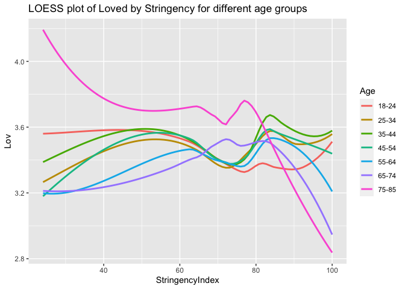<!-- -->
GAM
plot

``` r
plot_lov + stat_smooth(aes(group=age), se = FALSE, method = "gam", formula = y ~ x, size = 1, na.rm=TRUE) + scale_colour_discrete(name = "Age", 
labels = c("18-24", "25-34", "35-44", "45-54", "55-64", "65-74", "75-85", "85+")) + labs(title="GAM plot of Inspired by Stringency for different age groups", y ="Lov")
```

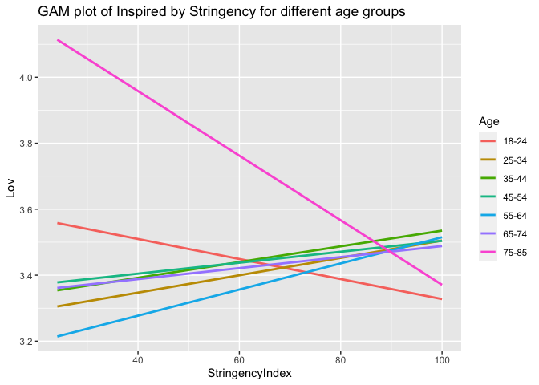<!-- -->

LOESS plot loved and date for different age
groups

``` r
plot_lov2 <- ggplot(data = data_long_min3_strc, aes(x = Date, y = Lov, group = ID, color = age))

plot_lov2 + stat_smooth(aes(group=age), se = FALSE, method = "loess", formula = y ~ x, size = 1, na.rm=TRUE) + scale_colour_discrete(name = "Age", 
labels = c("18-24", "25-34", "35-44", "45-54", "55-64", "65-74", "75-85", "85+")) + labs(title="LOESS plot of Loved by Date for different age groups", y ="Lov")
```

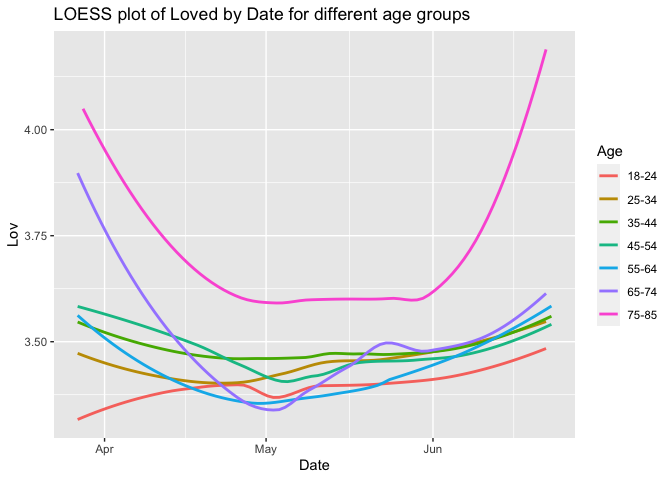<!-- -->
GAM
plot

``` r
plot_lov2 + stat_smooth(aes(group=age), se = FALSE, method = "gam", formula = y ~ x, size = 1, na.rm=TRUE) + scale_colour_discrete(name = "Age", 
labels = c("18-24", "25-34", "35-44", "45-54", "55-64", "65-74", "75-85", "85+")) + labs(title="GAM plot of Inspired by Date for different age groups", y ="Lov")
```

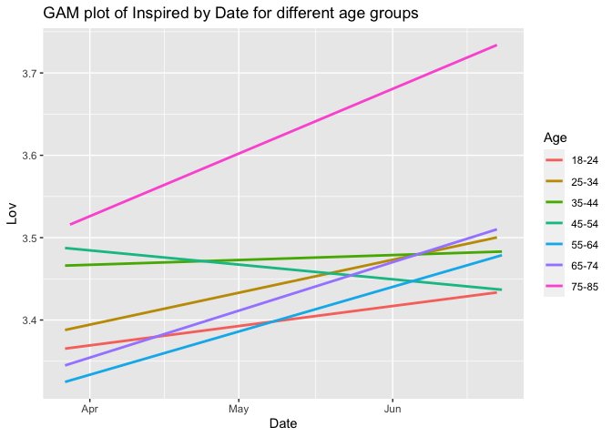<!-- -->

# Nervous

Multilevel random
intercept

``` r
model.nerv0 <- lmer(Nerv ~ 1 + (1 | Country/ID), data=data_long_min3_strc, na.action=na.exclude)
summary(model.nerv0)
```

    ## Linear mixed model fit by REML. t-tests use Satterthwaite's method [
    ## lmerModLmerTest]
    ## Formula: Nerv ~ 1 + (1 | Country/ID)
    ##    Data: data_long_min3_strc
    ## 
    ## REML criterion at convergence: 153821.3
    ## 
    ## Scaled residuals: 
    ##     Min      1Q  Median      3Q     Max 
    ## -3.8923 -0.5601 -0.1293  0.5663  4.5861 
    ## 
    ## Random effects:
    ##  Groups     Name        Variance Std.Dev.
    ##  ID:Country (Intercept) 0.71137  0.8434  
    ##  Country    (Intercept) 0.05314  0.2305  
    ##  Residual               0.58339  0.7638  
    ## Number of obs: 57961, groups:  ID:Country, 10329; Country, 33
    ## 
    ## Fixed effects:
    ##             Estimate Std. Error       df t value Pr(>|t|)    
    ## (Intercept)  2.33833    0.04272 32.96025   54.74   <2e-16 ***
    ## ---
    ## Signif. codes:  0 '***' 0.001 '**' 0.01 '*' 0.05 '.' 0.1 ' ' 1

Using two level models Predicted by
stringency

``` r
model.nerv1 <- lmer(Nerv ~ StringencyIndex + (1 | ID), data=data_long_min3_strc, na.action=na.exclude)
summary(model.nerv1)
```

    ## Linear mixed model fit by REML. t-tests use Satterthwaite's method [
    ## lmerModLmerTest]
    ## Formula: Nerv ~ StringencyIndex + (1 | ID)
    ##    Data: data_long_min3_strc
    ## 
    ## REML criterion at convergence: 154178.8
    ## 
    ## Scaled residuals: 
    ##     Min      1Q  Median      3Q     Max 
    ## -3.8956 -0.5569 -0.1374  0.5666  4.6108 
    ## 
    ## Random effects:
    ##  Groups   Name        Variance Std.Dev.
    ##  ID       (Intercept) 0.7564   0.8697  
    ##  Residual             0.5822   0.7630  
    ## Number of obs: 57953, groups:  ID, 10329
    ## 
    ## Fixed effects:
    ##                  Estimate Std. Error        df t value Pr(>|t|)    
    ## (Intercept)     2.001e+00  2.653e-02 5.769e+04   75.42   <2e-16 ***
    ## StringencyIndex 3.948e-03  3.276e-04 5.510e+04   12.05   <2e-16 ***
    ## ---
    ## Signif. codes:  0 '***' 0.001 '**' 0.01 '*' 0.05 '.' 0.1 ' ' 1
    ## 
    ## Correlation of Fixed Effects:
    ##             (Intr)
    ## StrngncyInd -0.938

``` r
model.nerv2 <- lmer(Nerv ~ StringencyIndex + age + (1 | ID), data=data_long_min3_strc, na.action=na.exclude)
summary(model.nerv2)
```

    ## Linear mixed model fit by REML. t-tests use Satterthwaite's method [
    ## lmerModLmerTest]
    ## Formula: Nerv ~ StringencyIndex + age + (1 | ID)
    ##    Data: data_long_min3_strc
    ## 
    ## REML criterion at convergence: 153149.6
    ## 
    ## Scaled residuals: 
    ##     Min      1Q  Median      3Q     Max 
    ## -3.9039 -0.5615 -0.1317  0.5651  4.6661 
    ## 
    ## Random effects:
    ##  Groups   Name        Variance Std.Dev.
    ##  ID       (Intercept) 0.6707   0.8189  
    ##  Residual             0.5823   0.7631  
    ## Number of obs: 57953, groups:  ID, 10329
    ## 
    ## Fixed effects:
    ##                   Estimate Std. Error         df t value Pr(>|t|)    
    ## (Intercept)      2.385e+00  3.556e-02  3.166e+04  67.073  < 2e-16 ***
    ## StringencyIndex  3.480e-03  3.265e-04  5.546e+04  10.658  < 2e-16 ***
    ## age2            -7.526e-02  3.189e-02  1.043e+04  -2.360   0.0183 *  
    ## age3            -1.905e-01  3.208e-02  1.041e+04  -5.939 2.97e-09 ***
    ## age4            -3.758e-01  3.216e-02  1.035e+04 -11.686  < 2e-16 ***
    ## age5            -5.705e-01  3.231e-02  1.030e+04 -17.658  < 2e-16 ***
    ## age6            -8.680e-01  3.429e-02  1.026e+04 -25.314  < 2e-16 ***
    ## age7            -9.688e-01  6.935e-02  9.815e+03 -13.969  < 2e-16 ***
    ## ---
    ## Signif. codes:  0 '***' 0.001 '**' 0.01 '*' 0.05 '.' 0.1 ' ' 1
    ## 
    ## Correlation of Fixed Effects:
    ##             (Intr) StrngI age2   age3   age4   age5   age6  
    ## StrngncyInd -0.723                                          
    ## age2        -0.545  0.019                                   
    ## age3        -0.549  0.029  0.590                            
    ## age4        -0.553  0.036  0.588  0.585                     
    ## age5        -0.552  0.037  0.586  0.583  0.581              
    ## age6        -0.528  0.047  0.552  0.549  0.548  0.546       
    ## age7        -0.262  0.024  0.273  0.272  0.271  0.270  0.255

``` r
model.nerv3 <- lmer(Nerv ~ StringencyIndex + age + StringencyIndex*age + (1 | ID), data=data_long_min3_strc, na.action=na.exclude)
print(summary(model.nerv3), digits=2)
```

    ## Linear mixed model fit by REML. t-tests use Satterthwaite's method [
    ## lmerModLmerTest]
    ## Formula: Nerv ~ StringencyIndex + age + StringencyIndex * age + (1 | ID)
    ##    Data: data_long_min3_strc
    ## 
    ## REML criterion at convergence: 153190.8
    ## 
    ## Scaled residuals: 
    ##    Min     1Q Median     3Q    Max 
    ##  -3.90  -0.56  -0.13   0.56   4.70 
    ## 
    ## Random effects:
    ##  Groups   Name        Variance Std.Dev.
    ##  ID       (Intercept) 0.67     0.82    
    ##  Residual             0.58     0.76    
    ## Number of obs: 57953, groups:  ID, 10329
    ## 
    ## Fixed effects:
    ##                      Estimate Std. Error       df t value Pr(>|t|)    
    ## (Intercept)           2.6e+00    7.0e-02  5.7e+04    37.3   <2e-16 ***
    ## StringencyIndex       7.9e-04    8.3e-04  5.6e+04     1.0     0.34    
    ## age2                 -1.5e-01    9.4e-02  5.8e+04    -1.6     0.11    
    ## age3                 -3.6e-01    9.6e-02  5.8e+04    -3.7    2e-04 ***
    ## age4                 -6.9e-01    9.3e-02  5.8e+04    -7.4    2e-13 ***
    ## age5                 -9.1e-01    9.2e-02  5.7e+04    -9.8   <2e-16 ***
    ## age6                 -1.2e+00    9.9e-02  5.7e+04   -12.4   <2e-16 ***
    ## age7                 -1.3e+00    2.4e-01  5.8e+04    -5.4    8e-08 ***
    ## StringencyIndex:age2  9.3e-04    1.1e-03  5.6e+04     0.8     0.42    
    ## StringencyIndex:age3  2.1e-03    1.2e-03  5.5e+04     1.8     0.07 .  
    ## StringencyIndex:age4  4.0e-03    1.1e-03  5.5e+04     3.5    4e-04 ***
    ## StringencyIndex:age5  4.3e-03    1.1e-03  5.6e+04     3.9    1e-04 ***
    ## StringencyIndex:age6  4.7e-03    1.2e-03  5.6e+04     3.9    1e-04 ***
    ## StringencyIndex:age7  3.8e-03    3.0e-03  5.7e+04     1.2     0.21    
    ## ---
    ## Signif. codes:  0 '***' 0.001 '**' 0.01 '*' 0.05 '.' 0.1 ' ' 1

    ## 
    ## Correlation matrix not shown by default, as p = 14 > 12.
    ## Use print(summary(model.nerv3), correlation=TRUE)  or
    ##     vcov(summary(model.nerv3))        if you need it

LOESS plot nervous and stringency for different age
groups

``` r
plot_nerv <- ggplot(data = data_long_min3_strc, aes(x = StringencyIndex, y = Nerv, group = ID, color = age))

plot_nerv + stat_smooth(aes(group=age), se = FALSE, method = "loess", formula = y ~ x, size = 1, na.rm=TRUE) + scale_colour_discrete(name = "Age", 
labels = c("18-24", "25-34", "35-44", "45-54", "55-64", "65-74", "75-85", "85+")) + labs(title="LOESS plot of Nervousness by Stringency for different age groups", y ="Nerv")
```

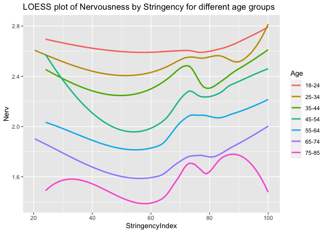<!-- -->
GAM
plot

``` r
plot_nerv + stat_smooth(aes(group=age), se = FALSE, method = "gam", formula = y ~ x, size = 1, na.rm=TRUE) + scale_colour_discrete(name = "Age", 
labels = c("18-24", "25-34", "35-44", "45-54", "55-64", "65-74", "75-85", "85+")) + labs(title="GAM plot of Nervousness by Stringency for different age groups", y ="Nerv")
```

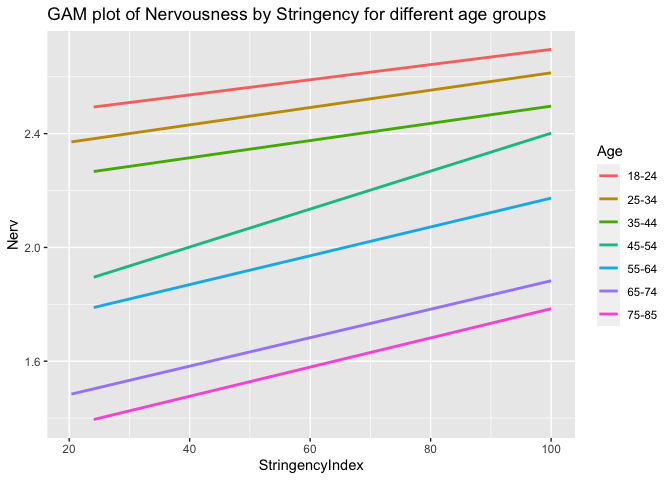<!-- -->

LOESS plot nervous and date for different age
groups

``` r
plot_nerv2 <- ggplot(data = data_long_min3_strc, aes(x = Date, y = Nerv, group = ID, color = age))

plot_nerv2 + stat_smooth(aes(group=age), se = FALSE, method = "loess", formula = y ~ x, size = 1, na.rm=TRUE) + scale_colour_discrete(name = "Age", 
labels = c("18-24", "25-34", "35-44", "45-54", "55-64", "65-74", "75-85", "85+")) + labs(title="LOESS plot of Nervousness by Date for different age groups", y ="Nerv")
```

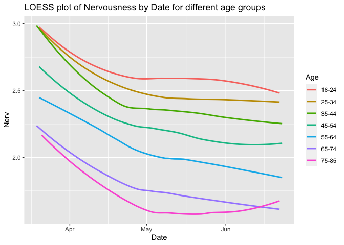<!-- -->
GAM
plot

``` r
plot_nerv2 + stat_smooth(aes(group=age), se = FALSE, method = "gam", formula = y ~ x, size = 1, na.rm=TRUE) + scale_colour_discrete(name = "Age", 
labels = c("18-24", "25-34", "35-44", "45-54", "55-64", "65-74", "75-85", "85+")) + labs(title="GAM plot of Nervousness by Date for different age groups", y ="Nerv")
```

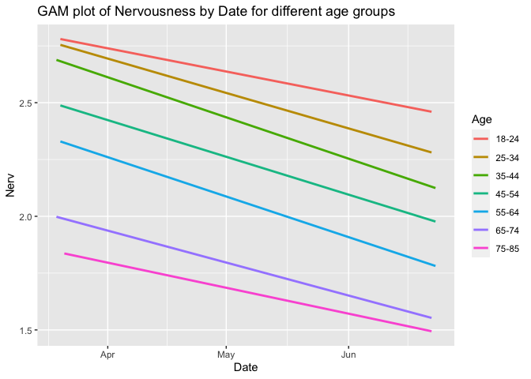<!-- -->

# Relaxed

Multilevel random
intercept

``` r
model.rel0 <- lmer(Rel ~ 1 + (1 | Country/ID), data=data_long_min3_strc, na.action=na.exclude)
summary(model.rel0)
```

    ## Linear mixed model fit by REML. t-tests use Satterthwaite's method [
    ## lmerModLmerTest]
    ## Formula: Rel ~ 1 + (1 | Country/ID)
    ##    Data: data_long_min3_strc
    ## 
    ## REML criterion at convergence: 149160.5
    ## 
    ## Scaled residuals: 
    ##     Min      1Q  Median      3Q     Max 
    ## -4.5622 -0.5787  0.0667  0.5990  4.2233 
    ## 
    ## Random effects:
    ##  Groups     Name        Variance Std.Dev.
    ##  ID:Country (Intercept) 0.5883   0.7670  
    ##  Country    (Intercept) 0.0554   0.2354  
    ##  Residual               0.5489   0.7409  
    ## Number of obs: 57957, groups:  ID:Country, 10331; Country, 33
    ## 
    ## Fixed effects:
    ##             Estimate Std. Error       df t value Pr(>|t|)    
    ## (Intercept)  2.86112    0.04318 32.62721   66.26   <2e-16 ***
    ## ---
    ## Signif. codes:  0 '***' 0.001 '**' 0.01 '*' 0.05 '.' 0.1 ' ' 1

Using two level models Predicted by
stringency

``` r
model.rel1 <- lmer(Rel ~ StringencyIndex + (1 | ID), data=data_long_min3_strc, na.action=na.exclude)
summary(model.rel1)
```

    ## Linear mixed model fit by REML. t-tests use Satterthwaite's method [
    ## lmerModLmerTest]
    ## Formula: Rel ~ StringencyIndex + (1 | ID)
    ##    Data: data_long_min3_strc
    ## 
    ## REML criterion at convergence: 149728.2
    ## 
    ## Scaled residuals: 
    ##     Min      1Q  Median      3Q     Max 
    ## -4.6025 -0.5931  0.0493  0.5932  4.3041 
    ## 
    ## Random effects:
    ##  Groups   Name        Variance Std.Dev.
    ##  ID       (Intercept) 0.6375   0.7985  
    ##  Residual             0.5484   0.7406  
    ## Number of obs: 57950, groups:  ID, 10331
    ## 
    ## Fixed effects:
    ##                   Estimate Std. Error         df t value Pr(>|t|)    
    ## (Intercept)      3.048e+00  2.550e-02  5.770e+04 119.535  < 2e-16 ***
    ## StringencyIndex -2.457e-03  3.165e-04  5.560e+04  -7.762 8.52e-15 ***
    ## ---
    ## Signif. codes:  0 '***' 0.001 '**' 0.01 '*' 0.05 '.' 0.1 ' ' 1
    ## 
    ## Correlation of Fixed Effects:
    ##             (Intr)
    ## StrngncyInd -0.942

``` r
model.rel2 <- lmer(Rel ~ StringencyIndex + age + (1 | ID), data=data_long_min3_strc, na.action=na.exclude)
summary(model.rel2)
```

    ## Linear mixed model fit by REML. t-tests use Satterthwaite's method [
    ## lmerModLmerTest]
    ## Formula: Rel ~ StringencyIndex + age + (1 | ID)
    ##    Data: data_long_min3_strc
    ## 
    ## REML criterion at convergence: 149540.3
    ## 
    ## Scaled residuals: 
    ##     Min      1Q  Median      3Q     Max 
    ## -4.6277 -0.5855  0.0586  0.5961  4.3162 
    ## 
    ## Random effects:
    ##  Groups   Name        Variance Std.Dev.
    ##  ID       (Intercept) 0.6220   0.7886  
    ##  Residual             0.5485   0.7406  
    ## Number of obs: 57950, groups:  ID, 10331
    ## 
    ## Fixed effects:
    ##                   Estimate Std. Error         df t value Pr(>|t|)    
    ## (Intercept)      3.099e+00  3.439e-02  3.195e+04  90.100  < 2e-16 ***
    ## StringencyIndex -2.357e-03  3.167e-04  5.555e+04  -7.442 1.00e-13 ***
    ## age2            -1.569e-01  3.075e-02  1.051e+04  -5.102 3.43e-07 ***
    ## age3            -1.910e-01  3.093e-02  1.049e+04  -6.174 6.91e-10 ***
    ## age4            -1.156e-01  3.101e-02  1.043e+04  -3.728 0.000194 ***
    ## age5            -2.203e-02  3.115e-02  1.038e+04  -0.707 0.479464    
    ## age6             1.895e-01  3.305e-02  1.033e+04   5.734 1.01e-08 ***
    ## age7             2.098e-01  6.687e-02  9.887e+03   3.138 0.001709 ** 
    ## ---
    ## Signif. codes:  0 '***' 0.001 '**' 0.01 '*' 0.05 '.' 0.1 ' ' 1
    ## 
    ## Correlation of Fixed Effects:
    ##             (Intr) StrngI age2   age3   age4   age5   age6  
    ## StrngncyInd -0.725                                          
    ## age2        -0.544  0.019                                   
    ## age3        -0.548  0.029  0.590                            
    ## age4        -0.552  0.036  0.588  0.585                     
    ## age5        -0.550  0.038  0.586  0.583  0.581              
    ## age6        -0.527  0.047  0.552  0.549  0.548  0.546       
    ## age7        -0.261  0.025  0.273  0.272  0.271  0.270  0.255

``` r
model.rel3 <- lmer(Rel ~ StringencyIndex + age + StringencyIndex*age + (1 | ID), data=data_long_min3_strc, na.action=na.exclude)
print(summary(model.rel3), digits=2)
```

    ## Linear mixed model fit by REML. t-tests use Satterthwaite's method [
    ## lmerModLmerTest]
    ## Formula: Rel ~ StringencyIndex + age + StringencyIndex * age + (1 | ID)
    ##    Data: data_long_min3_strc
    ## 
    ## REML criterion at convergence: 149525
    ## 
    ## Scaled residuals: 
    ##    Min     1Q Median     3Q    Max 
    ##  -4.63  -0.58   0.06   0.60   4.32 
    ## 
    ## Random effects:
    ##  Groups   Name        Variance Std.Dev.
    ##  ID       (Intercept) 0.62     0.79    
    ##  Residual             0.55     0.74    
    ## Number of obs: 57950, groups:  ID, 10331
    ## 
    ## Fixed effects:
    ##                      Estimate Std. Error       df t value Pr(>|t|)    
    ## (Intercept)           2.7e+00    6.7e-02  5.7e+04    40.7   <2e-16 ***
    ## StringencyIndex       2.1e-03    8.0e-04  5.6e+04     2.7    0.008 ** 
    ## age2                  5.6e-02    9.1e-02  5.8e+04     0.6    0.540    
    ## age3                  2.5e-02    9.3e-02  5.8e+04     0.3    0.790    
    ## age4                  3.2e-01    9.0e-02  5.8e+04     3.6    3e-04 ***
    ## age5                  5.1e-01    8.9e-02  5.7e+04     5.7    1e-08 ***
    ## age6                  8.4e-01    9.6e-02  5.7e+04     8.8   <2e-16 ***
    ## age7                  1.2e+00    2.3e-01  5.8e+04     5.1    4e-07 ***
    ## StringencyIndex:age2 -2.7e-03    1.1e-03  5.6e+04    -2.4    0.016 *  
    ## StringencyIndex:age3 -2.7e-03    1.1e-03  5.6e+04    -2.4    0.018 *  
    ## StringencyIndex:age4 -5.6e-03    1.1e-03  5.5e+04    -5.1    3e-07 ***
    ## StringencyIndex:age5 -6.9e-03    1.1e-03  5.6e+04    -6.4    2e-10 ***
    ## StringencyIndex:age6 -8.5e-03    1.2e-03  5.6e+04    -7.3    4e-13 ***
    ## StringencyIndex:age7 -1.3e-02    3.0e-03  5.7e+04    -4.3    2e-05 ***
    ## ---
    ## Signif. codes:  0 '***' 0.001 '**' 0.01 '*' 0.05 '.' 0.1 ' ' 1

    ## 
    ## Correlation matrix not shown by default, as p = 14 > 12.
    ## Use print(summary(model.rel3), correlation=TRUE)  or
    ##     vcov(summary(model.rel3))        if you need it

LOESS plot relaxed and stringency for different age
groups

``` r
plot_rel <- ggplot(data = data_long_min3_strc, aes(x = StringencyIndex, y = Rel, group = ID, color = age))

plot_rel + stat_smooth(aes(group=age), se = FALSE, method = "loess", formula = y ~ x, size = 1, na.rm=TRUE) + scale_colour_discrete(name = "Age", 
labels = c("18-24", "25-34", "35-44", "45-54", "55-64", "65-74", "75-85", "85+")) + labs(title="LOESS plot of Relaxed by Stringency for different age groups", y ="Rel")
```

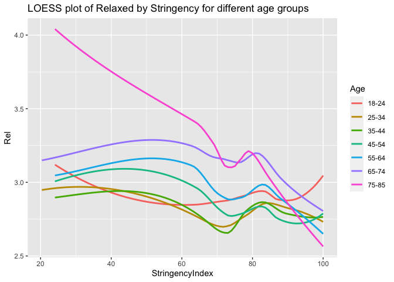<!-- -->
GAM
plot

``` r
plot_rel + stat_smooth(aes(group=age), se = FALSE, method = "gam", formula = y ~ x, size = 1, na.rm=TRUE) + scale_colour_discrete(name = "Age", 
labels = c("18-24", "25-34", "35-44", "45-54", "55-64", "65-74", "75-85", "85+")) + labs(title="GAM plot of Relaxed by Stringency for different age groups", y ="Rel")
```

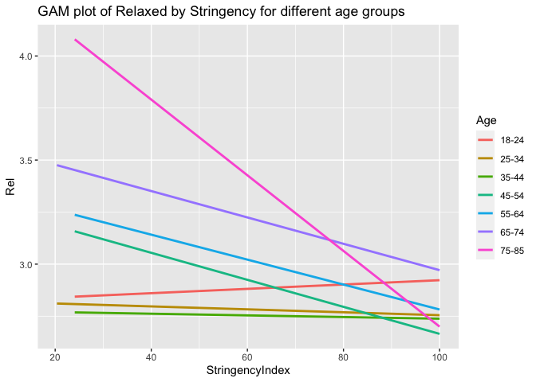<!-- -->

LOESS plot relaxed and date for different age
groups

``` r
plot_rel2 <- ggplot(data = data_long_min3_strc, aes(x = Date, y = Rel, group = ID, color = age))

plot_rel2 + stat_smooth(aes(group=age), se = FALSE, method = "loess", formula = y ~ x, size = 1, na.rm=TRUE) + scale_colour_discrete(name = "Age", 
labels = c("18-24", "25-34", "35-44", "45-54", "55-64", "65-74", "75-85", "85+")) + labs(title="LOESS plot of Relaxed by Date for different age groups", y ="Rel")
```

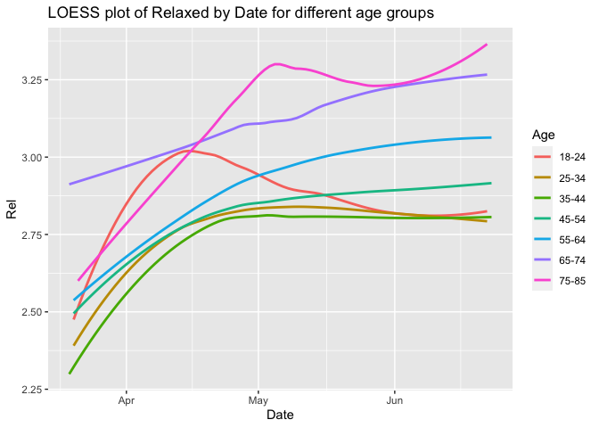<!-- -->
GAM
plot

``` r
plot_rel2 + stat_smooth(aes(group=age), se = FALSE, method = "gam", formula = y ~ x, size = 1, na.rm=TRUE) + scale_colour_discrete(name = "Age", 
labels = c("18-24", "25-34", "35-44", "45-54", "55-64", "65-74", "75-85", "85+")) + labs(title="GAM plot of Relaxed by Date for different age groups", y ="Rel")
```

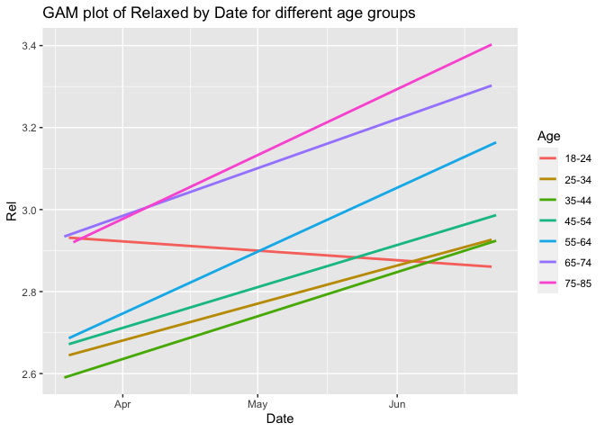<!-- -->
