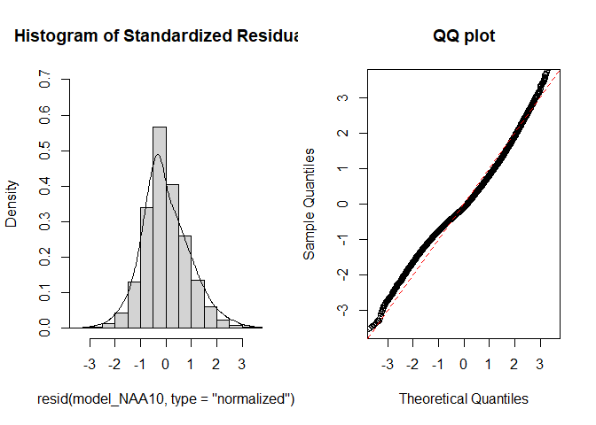
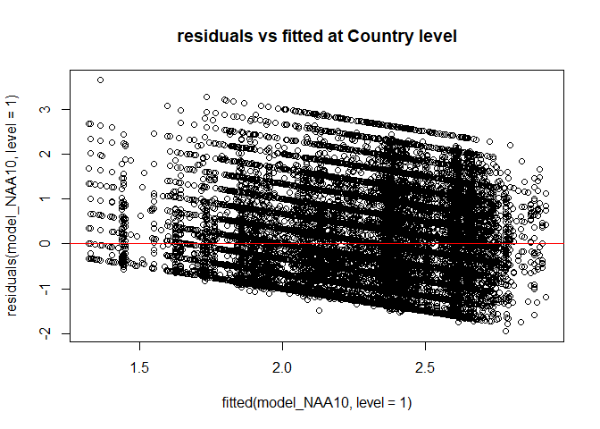
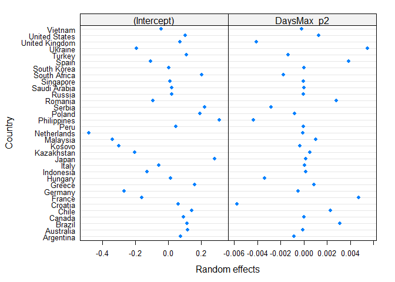
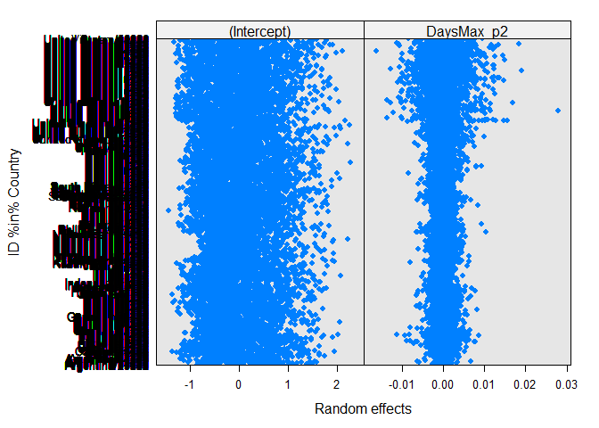
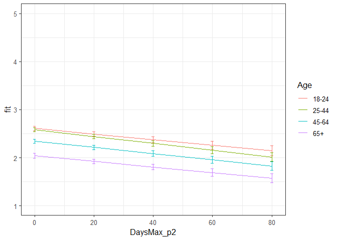

Second analyses NAA Phase 2
================
Anne Margit
9/29/2020

    ## [1] ""

``` r
load("data_analyse2_p2.Rdata")
```

This dataset includes:

1.  Data from all weekly measurement waves (baseline through wave 11,
    Time 1 through 12)
2.  Participants who provided at least 3 measurements
3.  Participants who are residents of the country they currently live in
4.  Participants who provided info on age
5.  Participants who provided info on gender (either male or female)
6.  Data from countries with at least 20 participants
7.  Pooled age groups
8.  Imputed missing emotion scores
9.  Combined emotion scores (NAA, NAD, PAA, PAD)
10. An imputed Stringency index (StringencyIndex\_imp)
11. A variable indicating the number of days before and after the day on
    which maximum stringency was reached for the respective country
    (DaysMax)
12. A variable indicating the number of weeks before and after the day
    on which maximum stringency was reached for the respective country
    (WeeksMax)
13. A variable indicating the date on which maximum Stringency was
    reached for that country (DateMaxStr)
14. A dummy Str\_dummy with 0 = before the peaj, 1 = during peak, 2 =
    after peak
15. Observations during which there was a second peak are excluded
    (N=583)

> My comments are in block quotes such as this.

``` r
library(dplyr)
library(tidyverse)
library(ggpubr)
library(ggplot2)
library(rockchalk)
library(effects)
library(nlme)
library(lattice)
library(broom.mixed)
library(purrr)
```

# Regression models phase 2

**Negative affect high arousal**

*Predictors: DaysMax\_p2, Age, Random: IC for Country*

``` r
model_NAA1 <- lme(fixed = NAA ~ DaysMax_p2 + Age_new + DaysMax_p2*Age_new,
                   random = ~1 | Country, 
                  data = data_analyse2_p2, 
                  na.action = na.omit)

summary(model_NAA1)
```

    Linear mixed-effects model fit by REML
     Data: data_analyse2_p2 
           AIC      BIC    logLik
      79008.94 79091.78 -39494.47
    
    Random effects:
     Formula: ~1 | Country
            (Intercept)  Residual
    StdDev:   0.2030949 0.9300815
    
    Fixed effects: NAA ~ DaysMax_p2 + Age_new + DaysMax_p2 * Age_new 
                             Value  Std.Error    DF   t-value p-value
    (Intercept)          2.5885623 0.04726420 29235  54.76793  0.0000
    DaysMax_p2          -0.0042797 0.00101204 29235  -4.22879  0.0000
    Age_new1            -0.0637241 0.03212560 29235  -1.98359  0.0473
    Age_new2            -0.3154259 0.03365747 29235  -9.37165  0.0000
    Age_new3            -0.5796864 0.04110083 29235 -14.10401  0.0000
    DaysMax_p2:Age_new1  0.0000531 0.00109817 29235   0.04833  0.9615
    DaysMax_p2:Age_new2  0.0010969 0.00111240 29235   0.98607  0.3241
    DaysMax_p2:Age_new3  0.0000679 0.00125358 29235   0.05417  0.9568
     Correlation: 
                        (Intr) DysM_2 Ag_nw1 Ag_nw2 Ag_nw3 DM_2:A_1 DM_2:A_2
    DaysMax_p2          -0.458                                              
    Age_new1            -0.497  0.712                                       
    Age_new2            -0.477  0.689  0.735                                
    Age_new3            -0.391  0.564  0.605  0.600                         
    DaysMax_p2:Age_new1  0.420 -0.889 -0.814 -0.615 -0.505                  
    DaysMax_p2:Age_new2  0.416 -0.884 -0.636 -0.818 -0.509  0.806           
    DaysMax_p2:Age_new3  0.368 -0.786 -0.566 -0.553 -0.827  0.716    0.713  
    
    Standardized Within-Group Residuals:
           Min         Q1        Med         Q3        Max 
    -2.0406700 -0.7799545 -0.1668305  0.6684493  3.9166655 
    
    Number of Observations: 29275
    Number of Groups: 33 

*Predictors: DaysMax\_p1, Age, Random: IC for ID*

``` r
model_NAA2 <- lme(fixed = NAA ~ DaysMax_p2 + Age_new + DaysMax_p2*Age_new,
                  random = ~1 | ID, 
                 data = data_analyse2_p2, 
                 na.action = na.omit)

summary(model_NAA2)
```

    Linear mixed-effects model fit by REML
     Data: data_analyse2_p2 
           AIC     BIC    logLik
      65080.96 65163.8 -32530.48
    
    Random effects:
     Formula: ~1 | ID
            (Intercept)  Residual
    StdDev:    0.768932 0.5482001
    
    Fixed effects: NAA ~ DaysMax_p2 + Age_new + DaysMax_p2 * Age_new 
                             Value  Std.Error    DF   t-value p-value
    (Intercept)          2.6076654 0.02883298 20144  90.44036  0.0000
    DaysMax_p2          -0.0043380 0.00075970 20144  -5.71022  0.0000
    Age_new1            -0.0489821 0.03337916  9123  -1.46745  0.1423
    Age_new2            -0.3023491 0.03403458  9123  -8.88358  0.0000
    Age_new3            -0.6309696 0.04074909  9123 -15.48426  0.0000
    DaysMax_p2:Age_new1 -0.0006506 0.00083976 20144  -0.77478  0.4385
    DaysMax_p2:Age_new2 -0.0003455 0.00084709 20144  -0.40786  0.6834
    DaysMax_p2:Age_new3  0.0001084 0.00095927 20144   0.11297  0.9101
     Correlation: 
                        (Intr) DysM_2 Ag_nw1 Ag_nw2 Ag_nw3 DM_2:A_1 DM_2:A_2
    DaysMax_p2          -0.523                                              
    Age_new1            -0.864  0.452                                       
    Age_new2            -0.847  0.443  0.732                                
    Age_new3            -0.708  0.370  0.611  0.599                         
    DaysMax_p2:Age_new1  0.473 -0.905 -0.518 -0.401 -0.335                  
    DaysMax_p2:Age_new2  0.469 -0.897 -0.405 -0.529 -0.332  0.811           
    DaysMax_p2:Age_new3  0.414 -0.792 -0.358 -0.351 -0.552  0.716    0.710  
    
    Standardized Within-Group Residuals:
            Min          Q1         Med          Q3         Max 
    -4.30775683 -0.52808642 -0.09943471  0.50025081  4.80019094 
    
    Number of Observations: 29275
    Number of Groups: 9127 

*Random: IC for ID and Country*

``` r
model_NAA3 <- lme(fixed = NAA ~ DaysMax_p2 + Age_new + DaysMax_p2*Age_new,
                  random = ~1 | Country/ID, 
                  data = data_analyse2_p2, 
                  na.action = na.omit)

summary(model_NAA3)
```

    Linear mixed-effects model fit by REML
     Data: data_analyse2_p2 
           AIC      BIC    logLik
      64687.34 64778.47 -32332.67
    
    Random effects:
     Formula: ~1 | Country
            (Intercept)
    StdDev:   0.1952286
    
     Formula: ~1 | ID %in% Country
            (Intercept)  Residual
    StdDev:   0.7461653 0.5480955
    
    Fixed effects: NAA ~ DaysMax_p2 + Age_new + DaysMax_p2 * Age_new 
                             Value  Std.Error    DF   t-value p-value
    (Intercept)          2.5927538 0.04720715 20144  54.92290  0.0000
    DaysMax_p2          -0.0045154 0.00076208 20144  -5.92508  0.0000
    Age_new1            -0.0432912 0.03385647  9091  -1.27867  0.2010
    Age_new2            -0.2763237 0.03496624  9091  -7.90259  0.0000
    Age_new3            -0.5708507 0.04196943  9091 -13.60158  0.0000
    DaysMax_p2:Age_new1 -0.0006747 0.00083926 20144  -0.80398  0.4214
    DaysMax_p2:Age_new2 -0.0002961 0.00084722 20144  -0.34944  0.7268
    DaysMax_p2:Age_new3  0.0000217 0.00095943 20144   0.02263  0.9819
     Correlation: 
                        (Intr) DysM_2 Ag_nw1 Ag_nw2 Ag_nw3 DM_2:A_1 DM_2:A_2
    DaysMax_p2          -0.312                                              
    Age_new1            -0.517  0.462                                       
    Age_new2            -0.501  0.451  0.746                                
    Age_new3            -0.420  0.376  0.625  0.626                         
    DaysMax_p2:Age_new1  0.287 -0.903 -0.519 -0.401 -0.335                  
    DaysMax_p2:Age_new2  0.284 -0.896 -0.410 -0.528 -0.334  0.812           
    DaysMax_p2:Age_new3  0.250 -0.791 -0.362 -0.355 -0.549  0.717    0.711  
    
    Standardized Within-Group Residuals:
            Min          Q1         Med          Q3         Max 
    -4.32201762 -0.53185149 -0.09847859  0.49966268  4.79513262 
    
    Number of Observations: 29275
    Number of Groups: 
            Country ID %in% Country 
                 33            9127 

*Random: IC for ID and Country, S for Country*

``` r
model_NAA4 <- lme(fixed = NAA ~ DaysMax_p2 + Age_new + DaysMax_p2*Age_new,
                  random = list (Country = ~DaysMax_p2, ID = ~1), 
                  data = data_analyse2_p2, 
                  na.action = na.omit)

summary(model_NAA4)
```

    Linear mixed-effects model fit by REML
     Data: data_analyse2_p2 
           AIC      BIC    logLik
      64630.64 64738.34 -32302.32
    
    Random effects:
     Formula: ~DaysMax_p2 | Country
     Structure: General positive-definite, Log-Cholesky parametrization
                StdDev      Corr  
    (Intercept) 0.231971042 (Intr)
    DaysMax_p2  0.004314952 -0.616
    
     Formula: ~1 | ID %in% Country
            (Intercept)  Residual
    StdDev:   0.7462943 0.5469041
    
    Fixed effects: NAA ~ DaysMax_p2 + Age_new + DaysMax_p2 * Age_new 
                             Value  Std.Error    DF   t-value p-value
    (Intercept)          2.6078743 0.05297387 20144  49.22944  0.0000
    DaysMax_p2          -0.0057560 0.00123843 20144  -4.64786  0.0000
    Age_new1            -0.0243279 0.03421511  9091  -0.71103  0.4771
    Age_new2            -0.2550857 0.03549871  9091  -7.18577  0.0000
    Age_new3            -0.5584733 0.04256087  9091 -13.12176  0.0000
    DaysMax_p2:Age_new1 -0.0014123 0.00086034 20144  -1.64152  0.1007
    DaysMax_p2:Age_new2 -0.0010729 0.00087517 20144  -1.22591  0.2202
    DaysMax_p2:Age_new3 -0.0004432 0.00099092 20144  -0.44730  0.6547
     Correlation: 
                        (Intr) DysM_2 Ag_nw1 Ag_nw2 Ag_nw3 DM_2:A_1 DM_2:A_2
    DaysMax_p2          -0.551                                              
    Age_new1            -0.452  0.259                                       
    Age_new2            -0.435  0.243  0.752                                
    Age_new3            -0.365  0.200  0.632  0.636                         
    DaysMax_p2:Age_new1  0.245 -0.510 -0.533 -0.424 -0.356                  
    DaysMax_p2:Age_new2  0.240 -0.496 -0.429 -0.547 -0.360  0.822           
    DaysMax_p2:Age_new3  0.212 -0.439 -0.380 -0.380 -0.566  0.728    0.727  
    
    Standardized Within-Group Residuals:
            Min          Q1         Med          Q3         Max 
    -4.31012466 -0.52980297 -0.09464788  0.49801778  4.78362105 
    
    Number of Observations: 29275
    Number of Groups: 
            Country ID %in% Country 
                 33            9127 

*Random: IC for ID and Country, S for ID*

``` r
model_NAA5 <- lme(fixed = NAA ~ DaysMax_p2 + Age_new + DaysMax_p2*Age_new,
                  random = list (Country = ~1, ID = ~DaysMax_p2), 
                  data = data_analyse2_p2, 
                  na.action = na.omit)

summary(model_NAA5)
```

    Linear mixed-effects model fit by REML
     Data: data_analyse2_p2 
           AIC      BIC    logLik
      64212.32 64320.01 -32093.16
    
    Random effects:
     Formula: ~1 | Country
            (Intercept)
    StdDev:   0.1950266
    
     Formula: ~DaysMax_p2 | ID %in% Country
     Structure: General positive-definite, Log-Cholesky parametrization
                StdDev     Corr  
    (Intercept) 0.77837349 (Intr)
    DaysMax_p2  0.01065349 -0.286
    Residual    0.52063090       
    
    Fixed effects: NAA ~ DaysMax_p2 + Age_new + DaysMax_p2 * Age_new 
                             Value  Std.Error    DF   t-value p-value
    (Intercept)          2.6065511 0.04786088 20144  54.46099  0.0000
    DaysMax_p2          -0.0055314 0.00090983 20144  -6.07962  0.0000
    Age_new1            -0.0385908 0.03522524  9091  -1.09554  0.2733
    Age_new2            -0.2814610 0.03647386  9091  -7.71679  0.0000
    Age_new3            -0.5779752 0.04398627  9091 -13.13990  0.0000
    DaysMax_p2:Age_new1 -0.0007370 0.00101737 20144  -0.72445  0.4688
    DaysMax_p2:Age_new2  0.0001392 0.00103076 20144   0.13506  0.8926
    DaysMax_p2:Age_new3  0.0005456 0.00118060 20144   0.46215  0.6440
     Correlation: 
                        (Intr) DysM_2 Ag_nw1 Ag_nw2 Ag_nw3 DM_2:A_1 DM_2:A_2
    DaysMax_p2          -0.352                                              
    Age_new1            -0.529  0.503                                       
    Age_new2            -0.512  0.489  0.739                                
    Age_new3            -0.427  0.406  0.616  0.614                         
    DaysMax_p2:Age_new1  0.319 -0.890 -0.573 -0.430 -0.357                  
    DaysMax_p2:Age_new2  0.314 -0.879 -0.440 -0.583 -0.355  0.785           
    DaysMax_p2:Age_new3  0.272 -0.768 -0.384 -0.375 -0.603  0.685    0.678  
    
    Standardized Within-Group Residuals:
            Min          Q1         Med          Q3         Max 
    -3.96863794 -0.51438292 -0.08310604  0.48839339  4.25287491 
    
    Number of Observations: 29275
    Number of Groups: 
            Country ID %in% Country 
                 33            9127 

*Random slope for Country and ID*

``` r
model_NAA6 <- lme(fixed = NAA ~ DaysMax_p2 + Age_new + DaysMax_p2*Age_new,
                  random = ~DaysMax_p2 | Country/ID, 
                  data = data_analyse2_p2, 
                  na.action = na.omit)

summary(model_NAA6)
```

    Linear mixed-effects model fit by REML
     Data: data_analyse2_p2 
           AIC      BIC    logLik
      64166.64 64290.91 -32068.32
    
    Random effects:
     Formula: ~DaysMax_p2 | Country
     Structure: General positive-definite, Log-Cholesky parametrization
                StdDev      Corr  
    (Intercept) 0.232957776 (Intr)
    DaysMax_p2  0.004338265 -0.619
    
     Formula: ~DaysMax_p2 | ID %in% Country
     Structure: General positive-definite, Log-Cholesky parametrization
                StdDev     Corr  
    (Intercept) 0.77727963 (Intr)
    DaysMax_p2  0.01051464 -0.282
    Residual    0.52002342       
    
    Fixed effects: NAA ~ DaysMax_p2 + Age_new + DaysMax_p2 * Age_new 
                             Value  Std.Error    DF   t-value p-value
    (Intercept)          2.6111729 0.05370619 20144  48.61959  0.0000
    DaysMax_p2          -0.0060113 0.00132503 20144  -4.53669  0.0000
    Age_new1            -0.0217987 0.03571610  9091  -0.61033  0.5417
    Age_new2            -0.2629263 0.03721275  9091  -7.06549  0.0000
    Age_new3            -0.5698883 0.04485073  9091 -12.70633  0.0000
    DaysMax_p2:Age_new1 -0.0014649 0.00104723 20144  -1.39886  0.1619
    DaysMax_p2:Age_new2 -0.0006496 0.00107230 20144  -0.60580  0.5447
    DaysMax_p2:Age_new3  0.0001395 0.00122954 20144   0.11347  0.9097
     Correlation: 
                        (Intr) DysM_2 Ag_nw1 Ag_nw2 Ag_nw3 DM_2:A_1 DM_2:A_2
    DaysMax_p2          -0.565                                              
    Age_new1            -0.465  0.327                                       
    Age_new2            -0.447  0.310  0.748                                
    Age_new3            -0.374  0.257  0.625  0.627                         
    DaysMax_p2:Age_new1  0.277 -0.575 -0.589 -0.457 -0.383                  
    DaysMax_p2:Age_new2  0.270 -0.559 -0.463 -0.604 -0.387  0.799           
    DaysMax_p2:Age_new3  0.236 -0.490 -0.406 -0.406 -0.623  0.700    0.700  
    
    Standardized Within-Group Residuals:
            Min          Q1         Med          Q3         Max 
    -3.96988822 -0.51390298 -0.08127712  0.48837359  4.38458940 
    
    Number of Observations: 29275
    Number of Groups: 
            Country ID %in% Country 
                 33            9127 

> Model with random slopes for Country and ID is better

*Random: IC for ID and Country, S for Country, No correlation between IC
and S for Country*

``` r
model_NAA7 <- lme(fixed = NAA ~ DaysMax_p2 + Age_new + DaysMax_p2*Age_new,
                  random = list(Country = pdDiag(~DaysMax_p2), ID = ~1), 
                  data = data_analyse2_p2, 
                  na.action = na.omit)

summary(model_NAA7)
```

    Linear mixed-effects model fit by REML
     Data: data_analyse2_p2 
           AIC      BIC    logLik
      64635.42 64734.83 -32305.71
    
    Random effects:
     Formula: ~DaysMax_p2 | Country
     Structure: Diagonal
            (Intercept)  DaysMax_p2
    StdDev:   0.2142204 0.003818516
    
     Formula: ~1 | ID %in% Country
            (Intercept)  Residual
    StdDev:   0.7463029 0.5469589
    
    Fixed effects: NAA ~ DaysMax_p2 + Age_new + DaysMax_p2 * Age_new 
                             Value  Std.Error    DF   t-value p-value
    (Intercept)          2.6067063 0.05024435 20144  51.88059  0.0000
    DaysMax_p2          -0.0056992 0.00119141 20144  -4.78357  0.0000
    Age_new1            -0.0281723 0.03415195  9091  -0.82491  0.4094
    Age_new2            -0.2596750 0.03541423  9091  -7.33250  0.0000
    Age_new3            -0.5629887 0.04246663  9091 -13.25720  0.0000
    DaysMax_p2:Age_new1 -0.0013331 0.00085911 20144  -1.55170  0.1207
    DaysMax_p2:Age_new2 -0.0009778 0.00087343 20144  -1.11953  0.2629
    DaysMax_p2:Age_new3 -0.0003442 0.00098889 20144  -0.34804  0.7278
     Correlation: 
                        (Intr) DysM_2 Ag_nw1 Ag_nw2 Ag_nw3 DM_2:A_1 DM_2:A_2
    DaysMax_p2          -0.233                                              
    Age_new1            -0.477  0.272                                       
    Age_new2            -0.459  0.258  0.751                                
    Age_new3            -0.386  0.216  0.630  0.634                         
    DaysMax_p2:Age_new1  0.257 -0.531 -0.530 -0.419 -0.352                  
    DaysMax_p2:Age_new2  0.251 -0.518 -0.425 -0.543 -0.355  0.821           
    DaysMax_p2:Age_new3  0.223 -0.459 -0.376 -0.375 -0.562  0.727    0.726  
    
    Standardized Within-Group Residuals:
           Min         Q1        Med         Q3        Max 
    -4.3087498 -0.5288826 -0.0946379  0.4981969  4.7831664 
    
    Number of Observations: 29275
    Number of Groups: 
            Country ID %in% Country 
                 33            9127 

*Random: IC for ID and Country, S for ID and Country, No correlation
between IC and S for Country*

``` r
model_NAA8 <- lme(fixed = NAA ~ DaysMax_p2 + Age_new + DaysMax_p2*Age_new,
                  random = list(Country = pdDiag(~DaysMax_p2), ID = ~DaysMax_p2), 
                  data = data_analyse2_p2, 
                  na.action = na.omit)

summary(model_NAA8)
```

    Linear mixed-effects model fit by REML
     Data: data_analyse2_p2 
          AIC      BIC   logLik
      64171.6 64287.58 -32071.8
    
    Random effects:
     Formula: ~DaysMax_p2 | Country
     Structure: Diagonal
            (Intercept)  DaysMax_p2
    StdDev:   0.2148678 0.003817363
    
     Formula: ~DaysMax_p2 | ID %in% Country
     Structure: General positive-definite, Log-Cholesky parametrization
                StdDev     Corr  
    (Intercept) 0.77741067 (Intr)
    DaysMax_p2  0.01051622 -0.282
    Residual    0.52007709       
    
    Fixed effects: NAA ~ DaysMax_p2 + Age_new + DaysMax_p2 * Age_new 
                             Value  Std.Error    DF   t-value p-value
    (Intercept)          2.6105694 0.05094324 20144  51.24467  0.0000
    DaysMax_p2          -0.0059939 0.00127802 20144  -4.69001  0.0000
    Age_new1            -0.0260737 0.03562729  9091  -0.73185  0.4643
    Age_new2            -0.2681396 0.03708310  9091  -7.23078  0.0000
    Age_new3            -0.5751085 0.04469971  9091 -12.86605  0.0000
    DaysMax_p2:Age_new1 -0.0013557 0.00104527 20144  -1.29699  0.1946
    DaysMax_p2:Age_new2 -0.0005137 0.00106941 20144  -0.48036  0.6310
    DaysMax_p2:Age_new3  0.0002839 0.00122607 20144   0.23152  0.8169
     Correlation: 
                        (Intr) DysM_2 Ag_nw1 Ag_nw2 Ag_nw3 DM_2:A_1 DM_2:A_2
    DaysMax_p2          -0.272                                              
    Age_new1            -0.490  0.341                                       
    Age_new2            -0.471  0.326  0.746                                
    Age_new3            -0.394  0.273  0.623  0.625                         
    DaysMax_p2:Age_new1  0.290 -0.597 -0.585 -0.452 -0.378                  
    DaysMax_p2:Age_new2  0.283 -0.581 -0.458 -0.599 -0.381  0.798           
    DaysMax_p2:Age_new3  0.248 -0.511 -0.401 -0.400 -0.618  0.699    0.698  
    
    Standardized Within-Group Residuals:
            Min          Q1         Med          Q3         Max 
    -3.96978348 -0.51354187 -0.08118034  0.48859416  4.38195265 
    
    Number of Observations: 29275
    Number of Groups: 
            Country ID %in% Country 
                 33            9127 

*Random: IC for ID and Country, S for ID and Country, No correlation
between IC and S for Country and ID*

``` r
model_NAA9 <- lme(fixed = NAA ~ DaysMax_p2 + Age_new + DaysMax_p2*Age_new,
                  random = list (Country = pdDiag(~DaysMax_p2), ID = pdDiag(~DaysMax_p2)),
                  data = data_analyse2_p2, 
                  na.action = na.omit)

summary(model_NAA9)
```

    Linear mixed-effects model fit by REML
     Data: data_analyse2_p2 
           AIC      BIC    logLik
      64241.16 64348.86 -32107.58
    
    Random effects:
     Formula: ~DaysMax_p2 | Country
     Structure: Diagonal
            (Intercept)  DaysMax_p2
    StdDev:   0.2173531 0.003873501
    
     Formula: ~DaysMax_p2 | ID %in% Country
     Structure: Diagonal
            (Intercept)  DaysMax_p2  Residual
    StdDev:   0.7229871 0.008674059 0.5260949
    
    Fixed effects: NAA ~ DaysMax_p2 + Age_new + DaysMax_p2 * Age_new 
                             Value  Std.Error    DF   t-value p-value
    (Intercept)          2.6089877 0.05045110 20144  51.71320  0.0000
    DaysMax_p2          -0.0058806 0.00126823 20144  -4.63685  0.0000
    Age_new1            -0.0251354 0.03405688  9091  -0.73804  0.4605
    Age_new2            -0.2652738 0.03545802  9091  -7.48135  0.0000
    Age_new3            -0.5738311 0.04274991  9091 -13.42298  0.0000
    DaysMax_p2:Age_new1 -0.0014199 0.00101052 20144  -1.40515  0.1600
    DaysMax_p2:Age_new2 -0.0006872 0.00103185 20144  -0.66598  0.5054
    DaysMax_p2:Age_new3  0.0001977 0.00117912 20144   0.16767  0.8668
     Correlation: 
                        (Intr) DysM_2 Ag_nw1 Ag_nw2 Ag_nw3 DM_2:A_1 DM_2:A_2
    DaysMax_p2          -0.240                                              
    Age_new1            -0.472  0.304                                       
    Age_new2            -0.454  0.289  0.748                                
    Age_new3            -0.379  0.241  0.624  0.626                         
    DaysMax_p2:Age_new1  0.256 -0.583 -0.535 -0.418 -0.350                  
    DaysMax_p2:Age_new2  0.251 -0.569 -0.424 -0.550 -0.352  0.804           
    DaysMax_p2:Age_new3  0.220 -0.501 -0.372 -0.371 -0.568  0.706    0.706  
    
    Standardized Within-Group Residuals:
            Min          Q1         Med          Q3         Max 
    -3.98532198 -0.52186665 -0.08120644  0.49019183  4.45921128 
    
    Number of Observations: 29275
    Number of Groups: 
            Country ID %in% Country 
                 33            9127 

> Best model is NAA8: random IC for ID and Country + S for Country and
> ID + no correlation between IC and S for Country\*

*Autoregressive correlation structure for measurements*

``` r
data_analyse2_p2 <- data_analyse2_p2[with(data_analyse2_p2, order(Country, ID, Time)),]
data_analyse2_p2$Time <- as.numeric(data_analyse2_p2$Time)

model_NAA10 <- lme(fixed = NAA ~ DaysMax_p2 + Age_new + DaysMax_p2*Age_new,
                  random = list(Country = pdDiag(~DaysMax_p2), ID = ~DaysMax_p2),  
                  data = data_analyse2_p2, 
                  na.action = na.omit,
                  correlation = corAR1(form = ~ Time | Country/ID))

summary(model_NAA10)
```

    Linear mixed-effects model fit by REML
     Data: data_analyse2_p2 
        AIC      BIC logLik
      63842 63966.26 -31906
    
    Random effects:
     Formula: ~DaysMax_p2 | Country
     Structure: Diagonal
            (Intercept)  DaysMax_p2
    StdDev:   0.2134751 0.003709884
    
     Formula: ~DaysMax_p2 | ID %in% Country
     Structure: General positive-definite, Log-Cholesky parametrization
                StdDev      Corr  
    (Intercept) 0.738218709 (Intr)
    DaysMax_p2  0.008108856 -0.199
    Residual    0.556424850       
    
    Correlation Structure: ARMA(1,0)
     Formula: ~Time | Country/ID 
     Parameter estimate(s):
         Phi1 
    0.2580137 
    Fixed effects: NAA ~ DaysMax_p2 + Age_new + DaysMax_p2 * Age_new 
                             Value  Std.Error    DF   t-value p-value
    (Intercept)          2.6102770 0.05069817 20144  51.48661  0.0000
    DaysMax_p2          -0.0058116 0.00127406 20144  -4.56150  0.0000
    Age_new1            -0.0283003 0.03554546  9091  -0.79617  0.4260
    Age_new2            -0.2666320 0.03701141  9091  -7.20405  0.0000
    Age_new3            -0.5708654 0.04460953  9091 -12.79694  0.0000
    DaysMax_p2:Age_new1 -0.0012706 0.00104711 20144  -1.21341  0.2250
    DaysMax_p2:Age_new2 -0.0006619 0.00106899 20144  -0.61918  0.5358
    DaysMax_p2:Age_new3  0.0000171 0.00122170 20144   0.01396  0.9889
     Correlation: 
                        (Intr) DysM_2 Ag_nw1 Ag_nw2 Ag_nw3 DM_2:A_1 DM_2:A_2
    DaysMax_p2          -0.276                                              
    Age_new1            -0.491  0.343                                       
    Age_new2            -0.472  0.327  0.747                                
    Age_new3            -0.395  0.273  0.624  0.626                         
    DaysMax_p2:Age_new1  0.291 -0.603 -0.584 -0.454 -0.379                  
    DaysMax_p2:Age_new2  0.285 -0.588 -0.461 -0.599 -0.382  0.805           
    DaysMax_p2:Age_new3  0.250 -0.518 -0.405 -0.403 -0.618  0.707    0.706  
    
    Standardized Within-Group Residuals:
           Min         Q1        Med         Q3        Max 
    -3.9122883 -0.5354423 -0.1007971  0.4821895  4.1740672 
    
    Number of Observations: 29275
    Number of Groups: 
            Country ID %in% Country 
                 33            9127 

> Model NAA10 has the best fit (lowest BIC). Random intercept for ID and
> Country, random slope for Country and ID, no correlation between
> random intercept and slope for Country, AR correlation structure at
> Measuement level

*QQ plot of residuals*

``` r
par(mfrow = c(1,2))
lims <- c(-3.5,3.5)
hist(resid(model_NAA10, type = "normalized"),
freq = FALSE, xlim = lims, ylim =  c(0,.7),main = "Histogram of Standardized Residuals")
lines(density(scale(resid(model_NAA10))))
qqnorm(resid(model_NAA10, type = "normalized"),
xlim = lims, ylim = lims,main = "QQ plot")
abline(0,1, col = "red", lty = 2)
```

<!-- -->

*Residuals vs fitted*

``` r
plot(fitted(model_NAA10, level=2), residuals(model_NAA10, level=2), 
     main="residuals vs fitted at ID level")
abline(a=0, b=0,col="red")
```

<!-- -->

``` r
plot(fitted(model_NAA10, level=1), residuals(model_NAA10, level=1), 
    main="residuals vs fitted at Country level")
abline(a=0, b=0,col="red")
```

<!-- -->

> Residuen zien er allemaal goed uit

*Plot random intercepts and slopes*

``` r
plot(ranef(model_NAA10, level = 1))
```

<!-- -->

``` r
plot(ranef(model_NAA10, level = 2))
```

<!-- -->

*Confidence intervals*

``` r
intervals(model_NAA10)
```

    Approximate 95% confidence intervals
    
     Fixed effects:
                               lower          est.         upper
    (Intercept)          2.510904401  2.610277e+00  2.7096495072
    DaysMax_p2          -0.008308894 -5.811629e-03 -0.0033143640
    Age_new1            -0.097977402 -2.830030e-02  0.0413768101
    Age_new2            -0.339182654 -2.666320e-01 -0.1940812752
    Age_new3            -0.658310072 -5.708654e-01 -0.4834206295
    DaysMax_p2:Age_new1 -0.003322990 -1.270573e-03  0.0007818452
    DaysMax_p2:Age_new2 -0.002757199 -6.618967e-04  0.0014334053
    DaysMax_p2:Age_new3 -0.002377585  1.705214e-05  0.0024116898
    attr(,"label")
    [1] "Fixed effects:"
    
     Random Effects:
      Level: Country 
                          lower        est.      upper
    sd((Intercept)) 0.156922067 0.213475113 0.29040928
    sd(DaysMax_p2)  0.002358815 0.003709884 0.00583481
      Level: ID 
                                       lower         est.        upper
    sd((Intercept))              0.719657421  0.738218709  0.757258726
    sd(DaysMax_p2)               0.007270646  0.008108856  0.009043702
    cor((Intercept),DaysMax_p2) -0.275593741 -0.198522241 -0.118914740
    
     Correlation structure:
             lower      est.     upper
    Phi1 0.2325697 0.2580137 0.2831048
    attr(,"label")
    [1] "Correlation structure:"
    
     Within-group standard error:
        lower      est.     upper 
    0.5486137 0.5564249 0.5643472 

*Plot of predicted values*

``` r
ef_NAA <- effect("DaysMax_p2:Age_new", model_NAA10)

plot_NAA <- ggplot(as.data.frame(ef_NAA), 
       aes(DaysMax_p2, fit, color=Age_new)) + geom_line() + 
  geom_errorbar(aes(ymin=fit-se, ymax=fit+se), width=1) + theme_bw(base_size=12) + scale_color_discrete(name="Age", labels = c("18-24", "25-44", "45-64", "65+")) + expand_limits(y=c(1, 5))
```

``` r
plot_NAA
```

<!-- -->

``` r
coef_NAA = tidy(model_NAA10, 
               effects = "fixed")
```

*Effect sizes* **Within person SD and average within person SD**

``` r
ISDs <- data_analyse2_p2 %>% 
  group_by(ID) %>%
  summarize_at(c("DaysMax_p2", "NAA"), sd, na.rm=TRUE) %>%
  ungroup()

ISDs_av <- ISDs %>%
  summarize_at(c("DaysMax_p2", "NAA"), mean, na.rm=TRUE) %>%
  stack() %>%
  rename(sd=values) 
```

> Effect size = (regression coefficient \* average ISD of X) / average
> ISD of Y)

> For the intercept and the dummy variables (+ interaction) I only
> standardized Y, so the effect size = (regression coefficient / average
> ISD of Y)

``` r
coef_NAA <- coef_NAA %>%
 left_join(., ISDs_av, by=c("term"="ind"))

coef_NAA <- coef_NAA %>%
  mutate(sd = ifelse(is.na(sd), 1, sd))

coef_NAA <- coef_NAA %>%
  mutate(sd = ifelse(row_number()== 6 | row_number()== 7 | row_number()== 8, 12.4844389, sd))

coef_NAA <- coef_NAA %>%
 mutate(e_size = (estimate * sd)/0.4558857)

coef_NAA <- coef_NAA %>%
  rename(isd = sd)
```

``` r
coef_NAA
```

    ## # A tibble: 8 x 8
    ##   term                  estimate std.error    df statistic  p.value   isd    e_size
    ##   <chr>                    <dbl>     <dbl> <dbl>     <dbl>    <dbl> <dbl>     <dbl>
    ## 1 (Intercept)          2.61        0.0507  20144   51.5    0.         1    5.73    
    ## 2 DaysMax_p2          -0.00581     0.00127 20144   -4.56   5.11e- 6  12.5 -0.159   
    ## 3 Age_new1            -0.0283      0.0355   9091   -0.796  4.26e- 1   1   -0.0621  
    ## 4 Age_new2            -0.267       0.0370   9091   -7.20   6.31e-13   1   -0.585   
    ## 5 Age_new3            -0.571       0.0446   9091  -12.8    3.57e-37   1   -1.25    
    ## 6 DaysMax_p2:Age_new1 -0.00127     0.00105 20144   -1.21   2.25e- 1  12.5 -0.0348  
    ## 7 DaysMax_p2:Age_new2 -0.000662    0.00107 20144   -0.619  5.36e- 1  12.5 -0.0181  
    ## 8 DaysMax_p2:Age_new3  0.0000171   0.00122 20144    0.0140 9.89e- 1  12.5  0.000467

> Effect size interpretation: small = 0.1, medium = 0.3, large = 0.5

> There are differences between age groups in intensity but not in rate
> of change dependent on DaysMax
