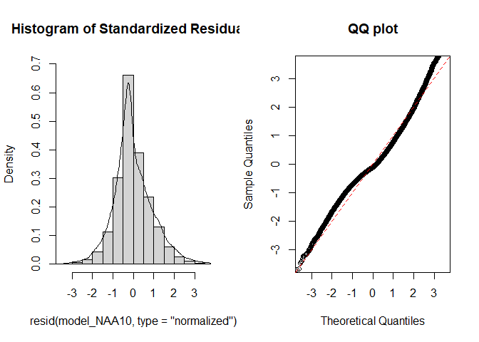
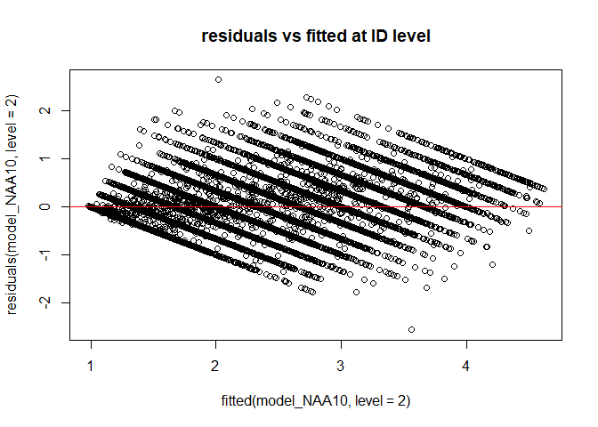
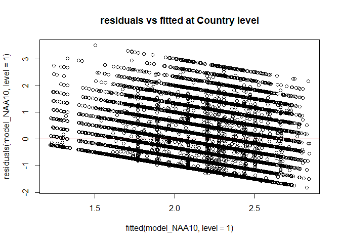
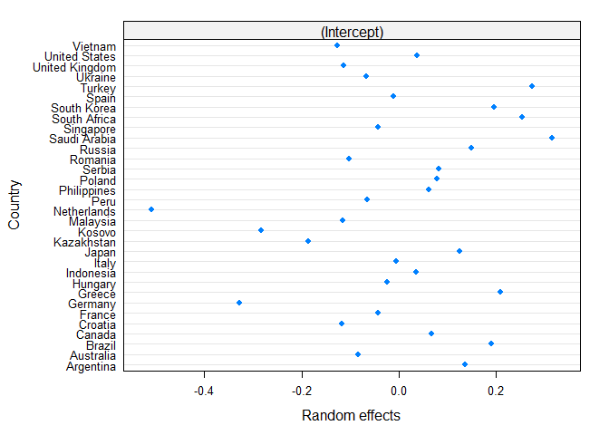
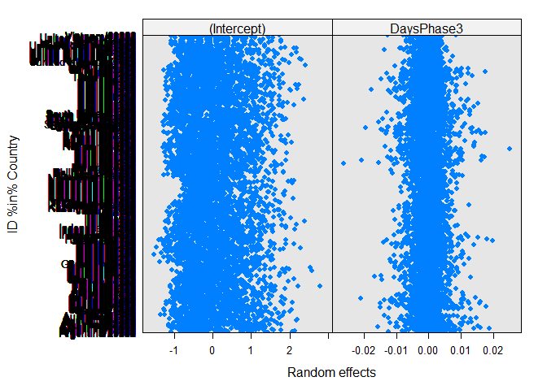
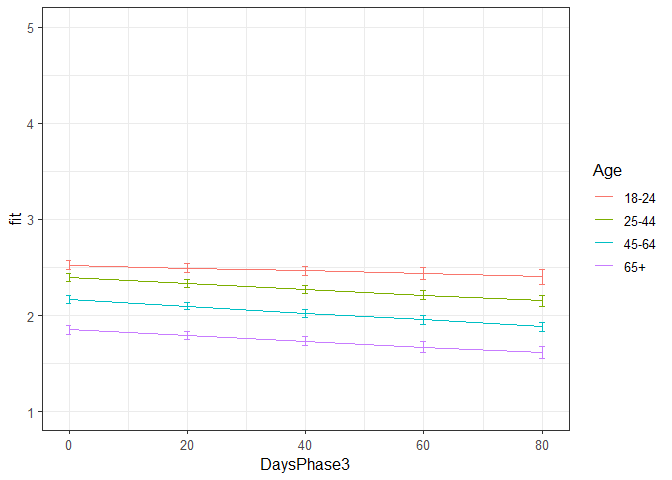

Second analyses NAA Phase 3
================
Anne Margit
9/29/2020

    ## [1] ""

``` r
load("data_analyse2_p3.Rdata")
```

This dataset includes:

1.  Data from all weekly measurement waves (baseline through wave 11,
    Time 1 through 12)
2.  Participants who provided at least 3 measurements
3.  Participants who are residents of the country they currently live in
4.  Participants who provided info on age
5.  Participants who provided info on gender (either male or female)
6.  Data from countries with at least 20 participants
7.  Pooled age groups
8.  Imputed missing emotion scores
9.  Combined emotion scores (NAA, NAD, PAA, PAD)
10. An imputed Stringency index (StringencyIndex\_imp)
11. A variable indicating the number of days before and after the day on
    which maximum stringency was reached for the respective country
    (DaysMax)
12. A variable indicating the number of weeks before and after the day
    on which maximum stringency was reached for the respective country
    (WeeksMax)
13. A variable indicating the date on which maximum Stringency was
    reached for that country (DateMaxStr)
14. A dummy Str\_dummy with 0 = before the peaj, 1 = during peak, 2 =
    after peak
15. Observations during which there was a second peak are excluded
    (N=583)

> My comments are in block quotes such as this.

``` r
library(dplyr)
library(tidyverse)
library(ggpubr)
library(ggplot2)
library(rockchalk)
library(effects)
library(nlme)
library(lattice)
library(broom.mixed)
library(purrr)
```

# Regression models phase 3

**Negative affect high arousal**

*Predictors: DaysPhase3, Age, Random: IC for Country*

``` r
model_NAA1 <- lme(fixed = NAA ~ DaysPhase3 + Age_new + DaysPhase3*Age_new,
                   random = ~1 | Country, 
                  data = data_analyse2_p3, 
                  na.action = na.omit)

summary(model_NAA1)
```

    Linear mixed-effects model fit by REML
     Data: data_analyse2_p3 
           AIC     BIC    logLik
      64316.43 64397.4 -32148.21
    
    Random effects:
     Formula: ~1 | Country
            (Intercept)  Residual
    StdDev:   0.2103828 0.9062819
    
    Fixed effects: NAA ~ DaysPhase3 + Age_new + DaysPhase3 * Age_new 
                             Value  Std.Error    DF   t-value p-value
    (Intercept)          2.5182859 0.04828509 24242  52.15452  0.0000
    DaysPhase3          -0.0012700 0.00119641 24242  -1.06150  0.2885
    Age_new1            -0.1229924 0.03532686 24242  -3.48155  0.0005
    Age_new2            -0.3629522 0.03487161 24242 -10.40824  0.0000
    Age_new3            -0.6614168 0.03904893 24242 -16.93815  0.0000
    DaysPhase3:Age_new1 -0.0025050 0.00137073 24242  -1.82748  0.0676
    DaysPhase3:Age_new2 -0.0017559 0.00133478 24242  -1.31552  0.1883
    DaysPhase3:Age_new3 -0.0019926 0.00147342 24242  -1.35239  0.1763
     Correlation: 
                        (Intr) DysPh3 Ag_nw1 Ag_nw2 Ag_nw3 DP3:A_1 DP3:A_2
    DaysPhase3          -0.503                                            
    Age_new1            -0.534  0.683                                     
    Age_new2            -0.540  0.694  0.760                              
    Age_new3            -0.484  0.618  0.681  0.711                       
    DaysPhase3:Age_new1  0.439 -0.857 -0.802 -0.608 -0.543                
    DaysPhase3:Age_new2  0.450 -0.884 -0.616 -0.797 -0.563  0.772         
    DaysPhase3:Age_new3  0.406 -0.800 -0.557 -0.570 -0.796  0.700   0.724 
    
    Standardized Within-Group Residuals:
           Min         Q1        Med         Q3        Max 
    -2.0678906 -0.7617962 -0.1973911  0.6436289  3.8886933 
    
    Number of Observations: 24281
    Number of Groups: 32 

*Predictors: DaysMax\_p1, Age, Random: IC for ID*

``` r
model_NAA2 <- lme(fixed = NAA ~ DaysPhase3 + Age_new + DaysPhase3*Age_new,
                  random = ~1 | ID, 
                 data = data_analyse2_p3, 
                 na.action = na.omit)

summary(model_NAA2)
```

    Linear mixed-effects model fit by REML
     Data: data_analyse2_p3 
          AIC      BIC    logLik
      51593.1 51674.07 -25786.55
    
    Random effects:
     Formula: ~1 | ID
            (Intercept)  Residual
    StdDev:   0.7846823 0.5226943
    
    Fixed effects: NAA ~ DaysPhase3 + Age_new + DaysPhase3 * Age_new 
                             Value  Std.Error    DF   t-value p-value
    (Intercept)          2.5401415 0.03286065 17361  77.30041  0.0000
    DaysPhase3          -0.0020399 0.00083037 17361  -2.45658  0.0140
    Age_new1            -0.1563374 0.03855206  6912  -4.05523  0.0001
    Age_new2            -0.4033310 0.03769816  6912 -10.69896  0.0000
    Age_new3            -0.7596234 0.04232959  6912 -17.94545  0.0000
    DaysPhase3:Age_new1 -0.0008517 0.00095738 17361  -0.88965  0.3737
    DaysPhase3:Age_new2 -0.0013330 0.00092605 17361  -1.43946  0.1500
    DaysPhase3:Age_new3 -0.0007340 0.00101666 17361  -0.72198  0.4703
     Correlation: 
                        (Intr) DysPh3 Ag_nw1 Ag_nw2 Ag_nw3 DP3:A_1 DP3:A_2
    DaysPhase3          -0.449                                            
    Age_new1            -0.852  0.382                                     
    Age_new2            -0.872  0.391  0.743                              
    Age_new3            -0.776  0.348  0.662  0.677                       
    DaysPhase3:Age_new1  0.389 -0.867 -0.444 -0.339 -0.302                
    DaysPhase3:Age_new2  0.402 -0.897 -0.343 -0.444 -0.312  0.778         
    DaysPhase3:Age_new3  0.366 -0.817 -0.312 -0.319 -0.443  0.708   0.732 
    
    Standardized Within-Group Residuals:
           Min         Q1        Med         Q3        Max 
    -5.7283257 -0.4803010 -0.1098112  0.4542986  6.1290204 
    
    Number of Observations: 24281
    Number of Groups: 6916 

*Random: IC for ID and Country*

``` r
model_NAA3 <- lme(fixed = NAA ~ DaysPhase3 + Age_new + DaysPhase3*Age_new,
                  random = ~1 | Country/ID, 
                  data = data_analyse2_p3, 
                  na.action = na.omit)

summary(model_NAA3)
```

    Linear mixed-effects model fit by REML
     Data: data_analyse2_p3 
           AIC      BIC    logLik
      51234.05 51323.12 -25606.02
    
    Random effects:
     Formula: ~1 | Country
            (Intercept)
    StdDev:   0.1969043
    
     Formula: ~1 | ID %in% Country
            (Intercept)  Residual
    StdDev:   0.7552435 0.5229111
    
    Fixed effects: NAA ~ DaysPhase3 + Age_new + DaysPhase3 * Age_new 
                             Value  Std.Error    DF   t-value p-value
    (Intercept)          2.5320567 0.04814283 17361  52.59467  0.0000
    DaysPhase3          -0.0020498 0.00082994 17361  -2.46985  0.0135
    Age_new1            -0.1390354 0.03821532  6881  -3.63821  0.0003
    Age_new2            -0.3639627 0.03815998  6881  -9.53781  0.0000
    Age_new3            -0.6822288 0.04343231  6881 -15.70786  0.0000
    DaysPhase3:Age_new1 -0.0009617 0.00095594 17361  -1.00604  0.3144
    DaysPhase3:Age_new2 -0.0014649 0.00092509 17361  -1.58348  0.1133
    DaysPhase3:Age_new3 -0.0008892 0.00101595 17361  -0.87519  0.3815
     Correlation: 
                        (Intr) DysPh3 Ag_nw1 Ag_nw2 Ag_nw3 DP3:A_1 DP3:A_2
    DaysPhase3          -0.306                                            
    Age_new1            -0.565  0.384                                     
    Age_new2            -0.567  0.384  0.749                              
    Age_new3            -0.504  0.338  0.663  0.695                       
    DaysPhase3:Age_new1  0.267 -0.866 -0.448 -0.335 -0.294                
    DaysPhase3:Age_new2  0.276 -0.896 -0.345 -0.439 -0.305  0.778         
    DaysPhase3:Age_new3  0.250 -0.816 -0.314 -0.315 -0.433  0.708   0.732 
    
    Standardized Within-Group Residuals:
           Min         Q1        Med         Q3        Max 
    -5.7371568 -0.4842780 -0.1025311  0.4518885  6.1146434 
    
    Number of Observations: 24281
    Number of Groups: 
            Country ID %in% Country 
                 32            6916 

*Random: IC for ID and Country, S for Country*

``` r
model_NAA4 <- lme(fixed = NAA ~ DaysPhase3 + Age_new + DaysPhase3*Age_new,
                  random = list (Country = ~DaysPhase3, ID = ~1), 
                  data = data_analyse2_p3, 
                  na.action = na.omit)

summary(model_NAA4)
```

    Linear mixed-effects model fit by REML
     Data: data_analyse2_p3 
           AIC      BIC   logLik
      51230.61 51335.87 -25602.3
    
    Random effects:
     Formula: ~DaysPhase3 | Country
     Structure: General positive-definite, Log-Cholesky parametrization
                StdDev      Corr  
    (Intercept) 0.201153645 (Intr)
    DaysPhase3  0.001313947 -0.247
    
     Formula: ~1 | ID %in% Country
            (Intercept)  Residual
    StdDev:   0.7553373 0.5225903
    
    Fixed effects: NAA ~ DaysPhase3 + Age_new + DaysPhase3 * Age_new 
                             Value  Std.Error    DF   t-value p-value
    (Intercept)          2.5279661 0.04880918 17361  51.79285  0.0000
    DaysPhase3          -0.0017711 0.00088557 17361  -2.00002  0.0455
    Age_new1            -0.1380367 0.03830011  6881  -3.60408  0.0003
    Age_new2            -0.3615248 0.03832703  6881  -9.43263  0.0000
    Age_new3            -0.6817603 0.04369631  6881 -15.60224  0.0000
    DaysPhase3:Age_new1 -0.0009891 0.00096376 17361  -1.02624  0.3048
    DaysPhase3:Age_new2 -0.0015734 0.00094027 17361  -1.67330  0.0943
    DaysPhase3:Age_new3 -0.0009046 0.00104161 17361  -0.86847  0.3851
     Correlation: 
                        (Intr) DysPh3 Ag_nw1 Ag_nw2 Ag_nw3 DP3:A_1 DP3:A_2
    DaysPhase3          -0.345                                            
    Age_new1            -0.558  0.363                                     
    Age_new2            -0.559  0.364  0.750                              
    Age_new3            -0.497  0.323  0.664  0.697                       
    DaysPhase3:Age_new1  0.264 -0.812 -0.451 -0.341 -0.301                
    DaysPhase3:Age_new2  0.271 -0.836 -0.350 -0.447 -0.316  0.780         
    DaysPhase3:Age_new3  0.247 -0.762 -0.317 -0.325 -0.444  0.707   0.738 
    
    Standardized Within-Group Residuals:
           Min         Q1        Med         Q3        Max 
    -5.7360652 -0.4846496 -0.1028597  0.4522331  6.1719378 
    
    Number of Observations: 24281
    Number of Groups: 
            Country ID %in% Country 
                 32            6916 

*Random: IC for ID and Country, S for ID*

``` r
model_NAA5 <- lme(fixed = NAA ~ DaysPhase3 + Age_new + DaysPhase3*Age_new,
                  random = list (Country = ~1, ID = ~DaysPhase3), 
                  data = data_analyse2_p3, 
                  na.action = na.omit)

summary(model_NAA5)
```

    Linear mixed-effects model fit by REML
     Data: data_analyse2_p3 
           AIC     BIC    logLik
      50779.03 50884.3 -25376.52
    
    Random effects:
     Formula: ~1 | Country
            (Intercept)
    StdDev:    0.195992
    
     Formula: ~DaysPhase3 | ID %in% Country
     Structure: General positive-definite, Log-Cholesky parametrization
                StdDev    Corr  
    (Intercept) 0.8128391 (Intr)
    DaysPhase3  0.0124520 -0.373
    Residual    0.4899246       
    
    Fixed effects: NAA ~ DaysPhase3 + Age_new + DaysPhase3 * Age_new 
                             Value  Std.Error    DF   t-value p-value
    (Intercept)          2.5241711 0.04916643 17361  51.33932  0.0000
    DaysPhase3          -0.0015315 0.00100749 17361  -1.52014  0.1285
    Age_new1            -0.1299230 0.04017275  6881  -3.23411  0.0012
    Age_new2            -0.3536016 0.04002222  6881  -8.83513  0.0000
    Age_new3            -0.6721941 0.04553130  6881 -14.76334  0.0000
    DaysPhase3:Age_new1 -0.0015355 0.00116565 17361  -1.31733  0.1877
    DaysPhase3:Age_new2 -0.0021523 0.00112737 17361  -1.90911  0.0563
    DaysPhase3:Age_new3 -0.0014384 0.00124620 17361  -1.15420  0.2484
     Correlation: 
                        (Intr) DysPh3 Ag_nw1 Ag_nw2 Ag_nw3 DP3:A_1 DP3:A_2
    DaysPhase3          -0.366                                            
    Age_new1            -0.583  0.447                                     
    Age_new2            -0.586  0.449  0.748                              
    Age_new3            -0.520  0.394  0.662  0.693                       
    DaysPhase3:Age_new1  0.318 -0.863 -0.523 -0.389 -0.342                
    DaysPhase3:Age_new2  0.329 -0.893 -0.400 -0.514 -0.355  0.772         
    DaysPhase3:Age_new3  0.297 -0.808 -0.362 -0.364 -0.509  0.698   0.722 
    
    Standardized Within-Group Residuals:
            Min          Q1         Med          Q3         Max 
    -5.24399714 -0.45853831 -0.09913889  0.43770593  5.31897585 
    
    Number of Observations: 24281
    Number of Groups: 
            Country ID %in% Country 
                 32            6916 

*Random slope for Country and ID*

``` r
model_NAA6 <- lme(fixed = NAA ~ DaysPhase3 + Age_new + DaysPhase3*Age_new,
                  random = ~DaysPhase3 | Country/ID, 
                  data = data_analyse2_p3, 
                  na.action = na.omit)

summary(model_NAA6)
```

    Linear mixed-effects model fit by REML
     Data: data_analyse2_p3 
           AIC      BIC    logLik
      50780.37 50901.83 -25375.19
    
    Random effects:
     Formula: ~DaysPhase3 | Country
     Structure: General positive-definite, Log-Cholesky parametrization
                StdDev      Corr  
    (Intercept) 0.202140774 (Intr)
    DaysPhase3  0.001068277 -0.354
    
     Formula: ~DaysPhase3 | ID %in% Country
     Structure: General positive-definite, Log-Cholesky parametrization
                StdDev     Corr  
    (Intercept) 0.81251967 (Intr)
    DaysPhase3  0.01241901 -0.372
    Residual    0.48989092       
    
    Fixed effects: NAA ~ DaysPhase3 + Age_new + DaysPhase3 * Age_new 
                             Value  Std.Error    DF   t-value p-value
    (Intercept)          2.5219388 0.05004937 17361  50.38903  0.0000
    DaysPhase3          -0.0014011 0.00103807 17361  -1.34971  0.1771
    Age_new1            -0.1293958 0.04024383  6881  -3.21529  0.0013
    Age_new2            -0.3515252 0.04017827  6881  -8.74914  0.0000
    Age_new3            -0.6705735 0.04578016  6881 -14.64769  0.0000
    DaysPhase3:Age_new1 -0.0015348 0.00116987 17361  -1.31196  0.1895
    DaysPhase3:Age_new2 -0.0022331 0.00113652 17361  -1.96485  0.0494
    DaysPhase3:Age_new3 -0.0015081 0.00126252 17361  -1.19452  0.2323
     Correlation: 
                        (Intr) DysPh3 Ag_nw1 Ag_nw2 Ag_nw3 DP3:A_1 DP3:A_2
    DaysPhase3          -0.405                                            
    Age_new1            -0.573  0.435                                     
    Age_new2            -0.575  0.437  0.749                              
    Age_new3            -0.511  0.387  0.663  0.695                       
    DaysPhase3:Age_new1  0.313 -0.837 -0.526 -0.393 -0.346                
    DaysPhase3:Age_new2  0.323 -0.864 -0.404 -0.519 -0.362  0.772         
    DaysPhase3:Age_new3  0.293 -0.784 -0.364 -0.371 -0.517  0.697   0.725 
    
    Standardized Within-Group Residuals:
            Min          Q1         Med          Q3         Max 
    -5.23920416 -0.45846715 -0.09779351  0.43536698  5.33884844 
    
    Number of Observations: 24281
    Number of Groups: 
            Country ID %in% Country 
                 32            6916 

> Model with random slope for only ID is better, NAA5

*Random: IC for ID and Country, S for ID, No correlation between IC and
S for ID*

``` r
model_NAA7 <- lme(fixed = NAA ~ DaysPhase3 + Age_new + DaysPhase3*Age_new,
                  random = list(Country = ~1, ID = pdDiag(~DaysPhase3)), 
                  data = data_analyse2_p3, 
                  na.action = na.omit)

summary(model_NAA7)
```

    Linear mixed-effects model fit by REML
     Data: data_analyse2_p3 
           AIC      BIC    logLik
      50928.89 51026.06 -25452.45
    
    Random effects:
     Formula: ~1 | Country
            (Intercept)
    StdDev:   0.1970646
    
     Formula: ~DaysPhase3 | ID %in% Country
     Structure: Diagonal
            (Intercept)  DaysPhase3  Residual
    StdDev:   0.7483674 0.009866846 0.4989534
    
    Fixed effects: NAA ~ DaysPhase3 + Age_new + DaysPhase3 * Age_new 
                             Value  Std.Error    DF   t-value p-value
    (Intercept)          2.5254151 0.04803857 17361  52.57057  0.0000
    DaysPhase3          -0.0016790 0.00096395 17361  -1.74178  0.0816
    Age_new1            -0.1325003 0.03797835  6881  -3.48884  0.0005
    Age_new2            -0.3552393 0.03792970  6881  -9.36573  0.0000
    Age_new3            -0.6773198 0.04319452  6881 -15.68069  0.0000
    DaysPhase3:Age_new1 -0.0012710 0.00111400 17361  -1.14096  0.2539
    DaysPhase3:Age_new2 -0.0019451 0.00107667 17361  -1.80659  0.0708
    DaysPhase3:Age_new3 -0.0011128 0.00118714 17361  -0.93738  0.3486
     Correlation: 
                        (Intr) DysPh3 Ag_nw1 Ag_nw2 Ag_nw3 DP3:A_1 DP3:A_2
    DaysPhase3          -0.288                                            
    Age_new1            -0.563  0.362                                     
    Age_new2            -0.565  0.363  0.749                              
    Age_new3            -0.502  0.319  0.664  0.696                       
    DaysPhase3:Age_new1  0.251 -0.864 -0.421 -0.315 -0.277                
    DaysPhase3:Age_new2  0.259 -0.895 -0.325 -0.411 -0.287  0.774         
    DaysPhase3:Age_new3  0.235 -0.812 -0.295 -0.295 -0.404  0.702   0.727 
    
    Standardized Within-Group Residuals:
            Min          Q1         Med          Q3         Max 
    -5.56842203 -0.47103571 -0.08965804  0.44299261  5.55475393 
    
    Number of Observations: 24281
    Number of Groups: 
            Country ID %in% Country 
                 32            6916 

*Random: IC for ID and Country, S for ID and Country, No correlation
between IC and S for Country*

``` r
model_NAA8 <- lme(fixed = NAA ~ DaysPhase3 + Age_new + DaysPhase3*Age_new,
                  random = list(Country = pdDiag(~DaysPhase3), ID = ~DaysPhase3), 
                  data = data_analyse2_p3, 
                  na.action = na.omit)

summary(model_NAA8)
```

    Linear mixed-effects model fit by REML
     Data: data_analyse2_p3 
           AIC     BIC    logLik
      50779.34 50892.7 -25375.67
    
    Random effects:
     Formula: ~DaysPhase3 | Country
     Structure: Diagonal
            (Intercept) DaysPhase3
    StdDev:   0.1971055 0.00102278
    
     Formula: ~DaysPhase3 | ID %in% Country
     Structure: General positive-definite, Log-Cholesky parametrization
                StdDev     Corr  
    (Intercept) 0.81259008 (Intr)
    DaysPhase3  0.01241713 -0.372
    Residual    0.48991029       
    
    Fixed effects: NAA ~ DaysPhase3 + Age_new + DaysPhase3 * Age_new 
                             Value  Std.Error    DF   t-value p-value
    (Intercept)          2.5222684 0.04937393 17361  51.08502  0.0000
    DaysPhase3          -0.0014042 0.00103687 17361  -1.35428  0.1757
    Age_new1            -0.1296661 0.04021050  6881  -3.22468  0.0013
    Age_new2            -0.3522996 0.04010461  6881  -8.78451  0.0000
    Age_new3            -0.6720245 0.04567677  6881 -14.71261  0.0000
    DaysPhase3:Age_new1 -0.0015408 0.00116985 17361  -1.31710  0.1878
    DaysPhase3:Age_new2 -0.0022183 0.00113646 17361  -1.95196  0.0510
    DaysPhase3:Age_new3 -0.0014454 0.00126232 17361  -1.14507  0.2522
     Correlation: 
                        (Intr) DysPh3 Ag_nw1 Ag_nw2 Ag_nw3 DP3:A_1 DP3:A_2
    DaysPhase3          -0.362                                            
    Age_new1            -0.581  0.436                                     
    Age_new2            -0.584  0.438  0.749                              
    Age_new3            -0.519  0.388  0.663  0.694                       
    DaysPhase3:Age_new1  0.317 -0.838 -0.524 -0.392 -0.345                
    DaysPhase3:Age_new2  0.327 -0.865 -0.402 -0.516 -0.359  0.772         
    DaysPhase3:Age_new3  0.296 -0.785 -0.362 -0.367 -0.513  0.697   0.725 
    
    Standardized Within-Group Residuals:
           Min         Q1        Med         Q3        Max 
    -5.2479103 -0.4585943 -0.0984021  0.4366010  5.3343545 
    
    Number of Observations: 24281
    Number of Groups: 
            Country ID %in% Country 
                 32            6916 

*Random: IC for ID and Country, S for ID and Country, No correlation
between IC and S for Country and ID*

``` r
model_NAA9 <- lme(fixed = NAA ~ DaysPhase3 + Age_new + DaysPhase3*Age_new,
                  random = list (Country = pdDiag(~DaysPhase3), ID = pdDiag(~DaysPhase3)),
                  data = data_analyse2_p3, 
                  na.action = na.omit)

summary(model_NAA9)
```

    Linear mixed-effects model fit by REML
     Data: data_analyse2_p3 
           AIC      BIC    logLik
      50927.89 51033.16 -25450.95
    
    Random effects:
     Formula: ~DaysPhase3 | Country
     Structure: Diagonal
            (Intercept)  DaysPhase3
    StdDev:   0.1986606 0.001153579
    
     Formula: ~DaysPhase3 | ID %in% Country
     Structure: Diagonal
            (Intercept)  DaysPhase3  Residual
    StdDev:   0.7483987 0.009828889 0.4988981
    
    Fixed effects: NAA ~ DaysPhase3 + Age_new + DaysPhase3 * Age_new 
                             Value  Std.Error    DF   t-value p-value
    (Intercept)          2.5232427 0.04830083 17361  52.24015  0.0000
    DaysPhase3          -0.0015070 0.00100191 17361  -1.50410  0.1326
    Age_new1            -0.1321249 0.03801577  6881  -3.47553  0.0005
    Age_new2            -0.3537740 0.03800098  6881  -9.30960  0.0000
    Age_new3            -0.6771014 0.04331420  6881 -15.63232  0.0000
    DaysPhase3:Age_new1 -0.0012910 0.00111935 17361  -1.15339  0.2488
    DaysPhase3:Age_new2 -0.0020420 0.00108810 17361  -1.87664  0.0606
    DaysPhase3:Age_new3 -0.0011283 0.00120720 17361  -0.93461  0.3500
     Correlation: 
                        (Intr) DysPh3 Ag_nw1 Ag_nw2 Ag_nw3 DP3:A_1 DP3:A_2
    DaysPhase3          -0.284                                            
    Age_new1            -0.560  0.351                                     
    Age_new2            -0.562  0.352  0.750                              
    Age_new3            -0.500  0.312  0.664  0.697                       
    DaysPhase3:Age_new1  0.250 -0.832 -0.423 -0.319 -0.281                
    DaysPhase3:Age_new2  0.257 -0.858 -0.327 -0.415 -0.293  0.775         
    DaysPhase3:Age_new3  0.234 -0.781 -0.296 -0.300 -0.410  0.701   0.731 
    
    Standardized Within-Group Residuals:
            Min          Q1         Med          Q3         Max 
    -5.57223052 -0.47142478 -0.09109945  0.44179514  5.58269883 
    
    Number of Observations: 24281
    Number of Groups: 
            Country ID %in% Country 
                 32            6916 

> Best model is NAA5: random IC for ID and Country + S for ID +
> correlation between IC and S for ID\*

*Autoregressive correlation structure for measurements*

``` r
data_analyse2_p3 <- data_analyse2_p3[with(data_analyse2_p3, order(Country, ID, Time)),]
data_analyse2_p3$Time <- as.numeric(data_analyse2_p3$Time)

model_NAA10 <- lme(fixed = NAA ~ DaysPhase3 + Age_new + DaysPhase3*Age_new,
                  random = list (Country = ~1, ID = ~DaysPhase3), 
                  data = data_analyse2_p3, 
                  na.action = na.omit,
                  correlation = corAR1(form = ~ Time | Country/ID))

summary(model_NAA10)
```

    Linear mixed-effects model fit by REML
     Data: data_analyse2_p3 
           AIC      BIC    logLik
      50596.89 50710.25 -25284.45
    
    Random effects:
     Formula: ~1 | Country
            (Intercept)
    StdDev:   0.1957299
    
     Formula: ~DaysPhase3 | ID %in% Country
     Structure: General positive-definite, Log-Cholesky parametrization
                StdDev     Corr  
    (Intercept) 0.77878357 (Intr)
    DaysPhase3  0.00968418 -0.316
    Residual    0.52288520       
    
    Correlation Structure: ARMA(1,0)
     Formula: ~Time | Country/ID 
     Parameter estimate(s):
         Phi1 
    0.1960009 
    Fixed effects: NAA ~ DaysPhase3 + Age_new + DaysPhase3 * Age_new 
                             Value  Std.Error    DF   t-value p-value
    (Intercept)          2.5232054 0.04912035 17361  51.36782  0.0000
    DaysPhase3          -0.0014809 0.00100472 17361  -1.47398  0.1405
    Age_new1            -0.1291762 0.04014138  6881  -3.21803  0.0013
    Age_new2            -0.3533584 0.03999652  6881  -8.83473  0.0000
    Age_new3            -0.6708401 0.04549208  6881 -14.74631  0.0000
    DaysPhase3:Age_new1 -0.0015336 0.00116085 17361  -1.32110  0.1865
    DaysPhase3:Age_new2 -0.0021193 0.00112334 17361  -1.88664  0.0592
    DaysPhase3:Age_new3 -0.0015231 0.00124009 17361  -1.22819  0.2194
     Correlation: 
                        (Intr) DysPh3 Ag_nw1 Ag_nw2 Ag_nw3 DP3:A_1 DP3:A_2
    DaysPhase3          -0.367                                            
    Age_new1            -0.583  0.448                                     
    Age_new2            -0.586  0.450  0.749                              
    Age_new3            -0.521  0.396  0.663  0.694                       
    DaysPhase3:Age_new1  0.320 -0.863 -0.524 -0.391 -0.344                
    DaysPhase3:Age_new2  0.330 -0.893 -0.402 -0.515 -0.356  0.773         
    DaysPhase3:Age_new3  0.298 -0.809 -0.364 -0.366 -0.510  0.700   0.724 
    
    Standardized Within-Group Residuals:
           Min         Q1        Med         Q3        Max 
    -4.8971541 -0.4716974 -0.1176458  0.4370296  5.0633587 
    
    Number of Observations: 24281
    Number of Groups: 
            Country ID %in% Country 
                 32            6916 

> Model NAA10 has the best fit (lowest BIC). Random intercept for ID and
> Country, random slope for ID and AR correlation structure at
> Measuement level

*QQ plot of residuals*

``` r
par(mfrow = c(1,2))
lims <- c(-3.5,3.5)
hist(resid(model_NAA10, type = "normalized"),
freq = FALSE, xlim = lims, ylim =  c(0,.7),main = "Histogram of Standardized Residuals")
lines(density(scale(resid(model_NAA10))))
qqnorm(resid(model_NAA10, type = "normalized"),
xlim = lims, ylim = lims,main = "QQ plot")
abline(0,1, col = "red", lty = 2)
```

<!-- -->

*Residuals vs fitted*

``` r
plot(fitted(model_NAA10, level=2), residuals(model_NAA10, level=2), 
     main="residuals vs fitted at ID level")
abline(a=0, b=0,col="red")
```

<!-- -->

``` r
plot(fitted(model_NAA10, level=1), residuals(model_NAA10, level=1), 
    main="residuals vs fitted at Country level")
abline(a=0, b=0,col="red")
```

<!-- -->

> Residuen zien er allemaal goed uit

*Plot random intercepts and slopes*

``` r
plot(ranef(model_NAA10, level = 1))
```

<!-- -->

``` r
plot(ranef(model_NAA10, level = 2))
```

<!-- -->

*Confidence intervals*

``` r
intervals(model_NAA10)
```

    Approximate 95% confidence intervals
    
     Fixed effects:
                               lower         est.         upper
    (Intercept)          2.426924538  2.523205362  2.619486e+00
    DaysPhase3          -0.003450290 -0.001480938  4.884130e-04
    Age_new1            -0.207865684 -0.129176175 -5.048667e-02
    Age_new2            -0.431763925 -0.353358389 -2.749529e-01
    Age_new3            -0.760018624 -0.670840107 -5.816616e-01
    DaysPhase3:Age_new1 -0.003808985 -0.001533598  7.417889e-04
    DaysPhase3:Age_new2 -0.004321180 -0.002119329  8.252292e-05
    DaysPhase3:Age_new3 -0.003953757 -0.001523065  9.076268e-04
    attr(,"label")
    [1] "Fixed effects:"
    
     Random Effects:
      Level: Country 
                       lower      est.     upper
    sd((Intercept)) 0.147357 0.1957299 0.2599822
      Level: ID 
                                       lower        est.      upper
    sd((Intercept))              0.758232713  0.77878357  0.7998914
    sd(DaysPhase3)               0.008659905  0.00968418  0.0108296
    cor((Intercept),DaysPhase3) -0.379490075 -0.31607870 -0.2497116
    
     Correlation structure:
             lower      est.     upper
    Phi1 0.1659322 0.1960009 0.2257054
    attr(,"label")
    [1] "Correlation structure:"
    
     Within-group standard error:
        lower      est.     upper 
    0.5137449 0.5228852 0.5321881 

*Plot of predicted values*

``` r
ef_NAA <- effect("DaysPhase3:Age_new", model_NAA10)

plot_NAA <- ggplot(as.data.frame(ef_NAA), 
       aes(DaysPhase3, fit, color=Age_new)) + geom_line() + 
  geom_errorbar(aes(ymin=fit-se, ymax=fit+se), width=1) + theme_bw(base_size=12) + scale_color_discrete(name="Age", labels = c("18-24", "25-44", "45-64", "65+")) + expand_limits(y=c(1, 5))
```

``` r
plot_NAA
```

<!-- -->

``` r
coef_NAA = tidy(model_NAA10, 
               effects = "fixed")
```

*Effect sizes* **Within person SD and average within person SD**

``` r
ISDs <- data_analyse2_p3 %>% 
  group_by(ID) %>%
  summarize_at(c("DaysPhase3", "NAA"), sd, na.rm=TRUE) %>%
  ungroup()

ISDs_av <- ISDs %>%
  summarize_at(c("DaysPhase3", "NAA"), mean, na.rm=TRUE) %>%
  stack() %>%
  rename(sd=values) 
```

> Effect size = (regression coefficient \* average ISD of X) / average
> ISD of Y)

> For the intercept and the dummy variables (+ interaction) I only
> standardized Y, so the effect size = (regression coefficient / average
> ISD of Y)

``` r
coef_NAA <- coef_NAA %>%
 left_join(., ISDs_av, by=c("term"="ind"))

coef_NAA <- coef_NAA %>%
  mutate(sd = ifelse(is.na(sd), 1, sd))

coef_NAA <- coef_NAA %>%
  mutate(sd = ifelse(row_number()== 6 | row_number()== 7 | row_number()== 8, 12.7520626, sd))

coef_NAA <- coef_NAA %>%
 mutate(e_size = (estimate * sd)/0.4187836)

coef_NAA <- coef_NAA %>%
  rename(isd = sd)
```

``` r
coef_NAA
```

    ## # A tibble: 8 x 8
    ##   term                estimate std.error    df statistic  p.value   isd  e_size
    ##   <chr>                  <dbl>     <dbl> <dbl>     <dbl>    <dbl> <dbl>   <dbl>
    ## 1 (Intercept)          2.52      0.0491  17361     51.4  0.         1    6.03  
    ## 2 DaysPhase3          -0.00148   0.00100 17361     -1.47 1.41e- 1  12.8 -0.0451
    ## 3 Age_new1            -0.129     0.0401   6881     -3.22 1.30e- 3   1   -0.308 
    ## 4 Age_new2            -0.353     0.0400   6881     -8.83 1.26e-18   1   -0.844 
    ## 5 Age_new3            -0.671     0.0455   6881    -14.7  1.78e-48   1   -1.60  
    ## 6 DaysPhase3:Age_new1 -0.00153   0.00116 17361     -1.32 1.86e- 1  12.8 -0.0467
    ## 7 DaysPhase3:Age_new2 -0.00212   0.00112 17361     -1.89 5.92e- 2  12.8 -0.0645
    ## 8 DaysPhase3:Age_new3 -0.00152   0.00124 17361     -1.23 2.19e- 1  12.8 -0.0464

> Effect size interpretation: small = 0.1, medium = 0.3, large = 0.5

> There are differences between age groups in intensity but not in rate
> of change dependent on DaysMax
