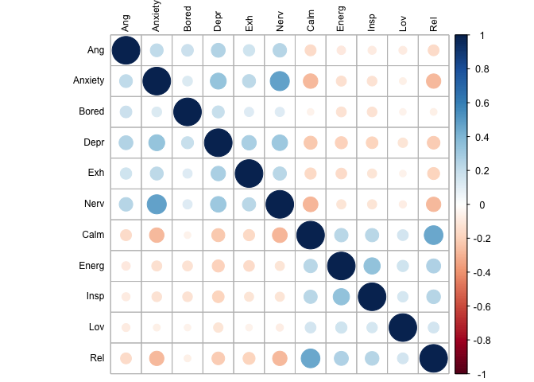

Factor analysis within-person
================
Anne Margit
6/15/2020

This is the confirmatory factor analysis of within-person emotion
scores, using person-mean centered scores

``` r
load("data_long_min3.Rdata")
load("data_means.Rdata")
```

``` r
data_long_min3 <- as_tibble(data_long_min3)
data_factor <- data_long_min3 %>% select(X, Wave, Ang, Anxiety, Bored, Calm, Content, Depr, Energ, Exc, Exh, Insp, Lov, Nerv, Rel)
```

``` r
data_factor_pmeans <- data_factor %>%
  group_by(X) %>%
  mutate_at(
    c("Ang", "Anxiety", "Bored", "Calm", "Content", "Depr", "Energ", "Exc", "Exh", "Insp", "Lov", "Nerv", "Rel"),
    funs(mean), na.rm=TRUE)
```

    ## Warning: `funs()` is deprecated as of dplyr 0.8.0.
    ## Please use a list of either functions or lambdas: 
    ## 
    ##   # Simple named list: 
    ##   list(mean = mean, median = median)
    ## 
    ##   # Auto named with `tibble::lst()`: 
    ##   tibble::lst(mean, median)
    ## 
    ##   # Using lambdas
    ##   list(~ mean(., trim = .2), ~ median(., na.rm = TRUE))
    ## This warning is displayed once every 8 hours.
    ## Call `lifecycle::last_warnings()` to see where this warning was generated.

``` r
data_factor_new <- left_join(data_factor, data_means, by="X")
```

This dataframe data\_within contains the raw scores - person means
Excited and Content are only measured on baseline, so better to delete
those

``` r
data_within <- data_factor_new %>%
group_by(X) %>%
  transmute(Wave = Wave,
    Ang = Ang.x - Ang.y,
         Bored = Bored.x - Bored.y,
         Anxiety = Anxiety.x - Anxiety.y,
         Calm = Calm.x - Calm.y,
         Content = Content.x - Content.y,
         Depr = Depr.x - Depr.y,
         Energ = Energ.x - Energ.y,
         Exc = Exc.x - Exc.y,
         Exh = Exh.x - Exh.y,
         Insp = Insp.x - Insp.y,
         Lov = Lov.x - Lov.y,
         Nerv = Nerv.x - Nerv.y,
         Rel = Rel.x - Rel.y)
```

Without excited and content

``` r
data_within2 <- data_factor_new %>%
group_by(X) %>%
  transmute(Wave = Wave,
    Ang = Ang.x - Ang.y,
         Bored = Bored.x - Bored.y,
         Anxiety = Anxiety.x - Anxiety.y,
         Calm = Calm.x - Calm.y,
         Depr = Depr.x - Depr.y,
         Energ = Energ.x - Energ.y,
         Exh = Exh.x - Exh.y,
         Insp = Insp.x - Insp.y,
         Lov = Lov.x - Lov.y,
         Nerv = Nerv.x - Nerv.y,
         Rel = Rel.x - Rel.y)
```

``` r
save(data_within2, file = "data_within2.Rdata")
```

``` r
round(cor(data_within2[,c("Ang", "Anxiety", "Bored", "Depr","Exh","Nerv","Calm","Energ", "Insp", "Lov","Rel")],use= "pairwise.complete.obs"),2)
```

    ##           Ang Anxiety Bored  Depr   Exh  Nerv  Calm Energ  Insp   Lov   Rel
    ## Ang      1.00    0.22  0.18  0.25  0.17  0.24 -0.16 -0.10 -0.09 -0.08 -0.16
    ## Anxiety  0.22    1.00  0.13  0.33  0.22  0.48 -0.28 -0.13 -0.13 -0.06 -0.27
    ## Bored    0.18    0.13  1.00  0.19  0.11  0.11 -0.06 -0.13 -0.12 -0.06 -0.06
    ## Depr     0.25    0.33  0.19  1.00  0.28  0.32 -0.22 -0.19 -0.18 -0.12 -0.21
    ## Exh      0.17    0.22  0.11  0.28  1.00  0.23 -0.17 -0.15 -0.11 -0.06 -0.19
    ## Nerv     0.24    0.48  0.11  0.32  0.23  1.00 -0.29 -0.11 -0.11 -0.07 -0.27
    ## Calm    -0.16   -0.28 -0.06 -0.22 -0.17 -0.29  1.00  0.24  0.23  0.15  0.46
    ## Energ   -0.10   -0.13 -0.13 -0.19 -0.15 -0.11  0.24  1.00  0.35  0.17  0.26
    ## Insp    -0.09   -0.13 -0.12 -0.18 -0.11 -0.11  0.23  0.35  1.00  0.15  0.25
    ## Lov     -0.08   -0.06 -0.06 -0.12 -0.06 -0.07  0.15  0.17  0.15  1.00  0.16
    ## Rel     -0.16   -0.27 -0.06 -0.21 -0.19 -0.27  0.46  0.26  0.25  0.16  1.00

``` r
corrplot(cor(data_within2[,c("Ang", "Anxiety", "Bored", "Depr","Exh","Nerv","Calm","Energ", "Insp", "Lov","Rel")], use="pairwise.complete.obs"), order = "original", tl.col='black', tl.cex=.75)
```

<!-- -->

``` r
model <- '
f1 =~ Ang + Anxiety + Bored + Depr + Exh + Nerv 
f2 =~ Calm + Energ + Insp + Lov + Rel 

# latent variable variances
f1 ~~ 1*f1
f2 ~~ 1*f2

# latent variable covariances
f1 ~~ f2

# manifest variable variances (uniquenesses)
  Ang ~~ Ang
  Anxiety ~~ Anxiety
  Bored ~~ Bored
  Depr ~~ Depr
  Exh ~~ Exh
  Nerv ~~ Nerv
  Calm ~~ Calm
  Energ ~~ Energ
  Insp ~~ Insp
  Lov ~~ Lov
  Rel ~~ Rel

#manifest variable means 
  Ang ~ 1
  Anxiety ~ 1
  Bored ~ 1
  Depr ~ 1
  Exh ~ 1
  Nerv ~ 1
  Calm ~ 1
  Energ ~ 1
  Insp ~ 1
  Lov ~ 1
  Rel ~ 1
'
```

``` r
fit <- cfa(model, data = data_within2, std.lv=TRUE, missing="fiml")
```

``` r
summary(fit, standardized=TRUE, fit.measures=TRUE)
```

    ## lavaan 0.6-6 ended normally after 26 iterations
    ## 
    ##   Estimator                                         ML
    ##   Optimization method                           NLMINB
    ##   Number of free parameters                         34
    ##                                                       
    ##                                                   Used       Total
    ##   Number of observations                         42668       78016
    ##   Number of missing patterns                       173            
    ##                                                                   
    ## Model Test User Model:
    ##                                                       
    ##   Test statistic                              5265.441
    ##   Degrees of freedom                                43
    ##   P-value (Chi-square)                           0.000
    ## 
    ## Model Test Baseline Model:
    ## 
    ##   Test statistic                             59925.511
    ##   Degrees of freedom                                55
    ##   P-value                                        0.000
    ## 
    ## User Model versus Baseline Model:
    ## 
    ##   Comparative Fit Index (CFI)                    0.913
    ##   Tucker-Lewis Index (TLI)                       0.888
    ## 
    ## Loglikelihood and Information Criteria:
    ## 
    ##   Loglikelihood user model (H0)            -392721.167
    ##   Loglikelihood unrestricted model (H1)    -390088.447
    ##                                                       
    ##   Akaike (AIC)                              785510.335
    ##   Bayesian (BIC)                            785804.816
    ##   Sample-size adjusted Bayesian (BIC)       785696.764
    ## 
    ## Root Mean Square Error of Approximation:
    ## 
    ##   RMSEA                                          0.053
    ##   90 Percent confidence interval - lower         0.052
    ##   90 Percent confidence interval - upper         0.055
    ##   P-value RMSEA <= 0.05                          0.000
    ## 
    ## Standardized Root Mean Square Residual:
    ## 
    ##   SRMR                                           0.036
    ## 
    ## Parameter Estimates:
    ## 
    ##   Standard errors                             Standard
    ##   Information                                 Observed
    ##   Observed information based on                Hessian
    ## 
    ## Latent Variables:
    ##                    Estimate  Std.Err  z-value  P(>|z|)   Std.lv  Std.all
    ##   f1 =~                                                                 
    ##     Ang               0.259    0.004   62.998    0.000    0.259    0.417
    ##     Anxiety           0.443    0.004  123.956    0.000    0.443    0.654
    ##     Bored             0.143    0.004   32.238    0.000    0.143    0.225
    ##     Depr              0.342    0.003  100.103    0.000    0.342    0.543
    ##     Exh               0.283    0.004   71.622    0.000    0.283    0.397
    ##     Nerv              0.442    0.004  123.334    0.000    0.442    0.652
    ##   f2 =~                                                                 
    ##     Calm              0.410    0.003  119.617    0.000    0.410    0.649
    ##     Energ             0.276    0.004   76.336    0.000    0.276    0.435
    ##     Insp              0.278    0.004   73.386    0.000    0.278    0.418
    ##     Lov               0.138    0.003   40.789    0.000    0.138    0.278
    ##     Rel               0.433    0.004  122.444    0.000    0.433    0.664
    ## 
    ## Covariances:
    ##                    Estimate  Std.Err  z-value  P(>|z|)   Std.lv  Std.all
    ##   f1 ~~                                                                 
    ##     f2               -0.617    0.006 -111.016    0.000   -0.617   -0.617
    ## 
    ## Intercepts:
    ##                    Estimate  Std.Err  z-value  P(>|z|)   Std.lv  Std.all
    ##    .Ang               0.022    0.003    6.536    0.000    0.022    0.036
    ##    .Anxiety           0.000    0.003    0.035    0.972    0.000    0.000
    ##    .Bored            -0.006    0.004   -1.543    0.123   -0.006   -0.010
    ##    .Depr              0.000    0.003    0.060    0.952    0.000    0.000
    ##    .Exh               0.000    0.003    0.071    0.943    0.000    0.000
    ##    .Nerv              0.000    0.003    0.075    0.940    0.000    0.000
    ##    .Calm             -0.000    0.003   -0.086    0.932   -0.000   -0.000
    ##    .Energ            -0.000    0.003   -0.041    0.967   -0.000   -0.000
    ##    .Insp             -0.000    0.003   -0.052    0.958   -0.000   -0.000
    ##    .Lov              -0.011    0.003   -4.068    0.000   -0.011   -0.022
    ##    .Rel              -0.000    0.003   -0.100    0.921   -0.000   -0.000
    ##     f1                0.000                               0.000    0.000
    ##     f2                0.000                               0.000    0.000
    ## 
    ## Variances:
    ##                    Estimate  Std.Err  z-value  P(>|z|)   Std.lv  Std.all
    ##     f1                1.000                               1.000    1.000
    ##     f2                1.000                               1.000    1.000
    ##    .Ang               0.318    0.003  117.318    0.000    0.318    0.826
    ##    .Anxiety           0.263    0.003  102.318    0.000    0.263    0.573
    ##    .Bored             0.383    0.003  111.084    0.000    0.383    0.949
    ##    .Depr              0.279    0.002  120.075    0.000    0.279    0.705
    ##    .Exh               0.426    0.003  134.653    0.000    0.426    0.842
    ##    .Nerv              0.265    0.003  102.593    0.000    0.265    0.575
    ##    .Calm              0.231    0.002   99.054    0.000    0.231    0.578
    ##    .Energ             0.328    0.003  129.336    0.000    0.328    0.811
    ##    .Insp              0.366    0.003  130.908    0.000    0.366    0.825
    ##    .Lov               0.228    0.002  123.382    0.000    0.228    0.923
    ##    .Rel               0.237    0.002   95.417    0.000    0.237    0.559

Factor loadings for within-person factor analysis based on person-mean
centered deviation scores

``` r
parameterEstimates(fit, standardized=TRUE) %>% 
  filter(op == "=~") %>% 
  select('Latent Factor'=lhs, Indicator=rhs, B=est, SE=se, Z=z, 'p-value'=pvalue, Beta=std.all) %>% 
  kable(digits = 3, format="pandoc", caption="Factor Loadings")
```

| Latent Factor | Indicator |     B |    SE |       Z | p-value |  Beta |
| :------------ | :-------- | ----: | ----: | ------: | ------: | ----: |
| f1            | Ang       | 0.259 | 0.004 |  62.998 |       0 | 0.417 |
| f1            | Anxiety   | 0.443 | 0.004 | 123.956 |       0 | 0.654 |
| f1            | Bored     | 0.143 | 0.004 |  32.238 |       0 | 0.225 |
| f1            | Depr      | 0.342 | 0.003 | 100.103 |       0 | 0.543 |
| f1            | Exh       | 0.283 | 0.004 |  71.622 |       0 | 0.397 |
| f1            | Nerv      | 0.442 | 0.004 | 123.334 |       0 | 0.652 |
| f2            | Calm      | 0.410 | 0.003 | 119.617 |       0 | 0.649 |
| f2            | Energ     | 0.276 | 0.004 |  76.336 |       0 | 0.435 |
| f2            | Insp      | 0.278 | 0.004 |  73.386 |       0 | 0.418 |
| f2            | Lov       | 0.138 | 0.003 |  40.789 |       0 | 0.278 |
| f2            | Rel       | 0.433 | 0.004 | 122.444 |       0 | 0.664 |

Factor Loadings

With Lavaan package based on raw scores

``` r
model2 <- '
level: 1
f1 =~ Ang + Anxiety + Bored + Depr + Exh + Nerv 
f2 =~ Calm + Energ + Insp + Lov + Rel 

level: 2
f1 =~ Ang + Anxiety + Bored + Depr + Exh + Nerv 
f2 =~ Calm + Energ + Insp + Lov + Rel 
'
```

``` r
fit2 <- cfa(model2, data = data_long_min3, std.lv=TRUE, missing="fiml", cluster="X")
```

``` r
summary(fit2, standardized=TRUE, fit.measures=TRUE)
```

    ## lavaan 0.6-6 ended normally after 39 iterations
    ## 
    ##   Estimator                                         ML
    ##   Optimization method                           NLMINB
    ##   Number of free parameters                         57
    ##                                                       
    ##                                                   Used       Total
    ##   Number of observations                         15988       78016
    ##   Number of clusters [X]                          7773            
    ##                                                                   
    ## Model Test User Model:
    ##                                                       
    ##   Test statistic                              5721.688
    ##   Degrees of freedom                                86
    ##   P-value (Chi-square)                           0.000
    ## 
    ## Model Test Baseline Model:
    ## 
    ##   Test statistic                             57041.814
    ##   Degrees of freedom                               110
    ##   P-value                                        0.000
    ## 
    ## User Model versus Baseline Model:
    ## 
    ##   Comparative Fit Index (CFI)                    0.901
    ##   Tucker-Lewis Index (TLI)                       0.873
    ## 
    ## Loglikelihood and Information Criteria:
    ## 
    ##   Loglikelihood user model (H0)            -218071.751
    ##   Loglikelihood unrestricted model (H1)    -215210.907
    ##                                                       
    ##   Akaike (AIC)                              436257.502
    ##   Bayesian (BIC)                            436695.238
    ##   Sample-size adjusted Bayesian (BIC)       436514.097
    ## 
    ## Root Mean Square Error of Approximation:
    ## 
    ##   RMSEA                                          0.064
    ##   90 Percent confidence interval - lower         0.063
    ##   90 Percent confidence interval - upper         0.065
    ##   P-value RMSEA <= 0.05                          0.000
    ## 
    ## Standardized Root Mean Square Residual (corr metric):
    ## 
    ##   SRMR (within covariance matrix)                0.033
    ##   SRMR (between covariance matrix)               0.070
    ## 
    ## Parameter Estimates:
    ## 
    ##   Standard errors                             Standard
    ##   Information                                 Observed
    ##   Observed information based on                Hessian
    ## 
    ## 
    ## Level 1 [within]:
    ## 
    ## Latent Variables:
    ##                    Estimate  Std.Err  z-value  P(>|z|)   Std.lv  Std.all
    ##   f1 =~                                                                 
    ##     Ang               0.320    0.009   34.729    0.000    0.320    0.461
    ##     Anxiety           0.391    0.010   38.355    0.000    0.391    0.572
    ##     Bored             0.186    0.011   17.127    0.000    0.186    0.262
    ##     Depr              0.360    0.010   37.212    0.000    0.360    0.553
    ##     Exh               0.292    0.010   29.386    0.000    0.292    0.394
    ##     Nerv              0.385    0.011   34.671    0.000    0.385    0.560
    ##   f2 =~                                                                 
    ##     Calm              0.385    0.012   33.273    0.000    0.385    0.582
    ##     Energ             0.322    0.014   22.463    0.000    0.322    0.479
    ##     Insp              0.315    0.015   21.552    0.000    0.315    0.452
    ##     Lov               0.167    0.008   20.655    0.000    0.167    0.303
    ##     Rel               0.400    0.011   37.302    0.000    0.400    0.585
    ## 
    ## Covariances:
    ##                    Estimate  Std.Err  z-value  P(>|z|)   Std.lv  Std.all
    ##   f1 ~~                                                                 
    ##     f2               -0.520    0.015  -34.278    0.000   -0.520   -0.520
    ## 
    ## Intercepts:
    ##                    Estimate  Std.Err  z-value  P(>|z|)   Std.lv  Std.all
    ##    .Ang               0.000                               0.000    0.000
    ##    .Anxiety           0.000                               0.000    0.000
    ##    .Bored             0.000                               0.000    0.000
    ##    .Depr              0.000                               0.000    0.000
    ##    .Exh               0.000                               0.000    0.000
    ##    .Nerv              0.000                               0.000    0.000
    ##    .Calm              0.000                               0.000    0.000
    ##    .Energ             0.000                               0.000    0.000
    ##    .Insp              0.000                               0.000    0.000
    ##    .Lov               0.000                               0.000    0.000
    ##    .Rel               0.000                               0.000    0.000
    ##     f1                0.000                               0.000    0.000
    ##     f2                0.000                               0.000    0.000
    ## 
    ## Variances:
    ##                    Estimate  Std.Err  z-value  P(>|z|)   Std.lv  Std.all
    ##    .Ang               0.379    0.007   55.578    0.000    0.379    0.787
    ##    .Anxiety           0.315    0.007   46.441    0.000    0.315    0.673
    ##    .Bored             0.469    0.008   61.463    0.000    0.469    0.932
    ##    .Depr              0.294    0.006   47.294    0.000    0.294    0.694
    ##    .Exh               0.464    0.008   58.763    0.000    0.464    0.845
    ##    .Nerv              0.324    0.007   46.244    0.000    0.324    0.686
    ##    .Calm              0.290    0.008   38.596    0.000    0.290    0.662
    ##    .Energ             0.349    0.008   45.294    0.000    0.349    0.771
    ##    .Insp              0.386    0.008   48.065    0.000    0.386    0.795
    ##    .Lov               0.275    0.005   60.477    0.000    0.275    0.908
    ##    .Rel               0.307    0.008   40.842    0.000    0.307    0.658
    ##     f1                1.000                               1.000    1.000
    ##     f2                1.000                               1.000    1.000
    ## 
    ## 
    ## Level 2 [X]:
    ## 
    ## Latent Variables:
    ##                    Estimate  Std.Err  z-value  P(>|z|)   Std.lv  Std.all
    ##   f1 =~                                                                 
    ##     Ang               0.655    0.012   56.788    0.000    0.655    0.732
    ##     Anxiety           0.886    0.011   78.943    0.000    0.886    0.922
    ##     Bored             0.477    0.014   34.426    0.000    0.477    0.493
    ##     Depr              0.778    0.011   71.244    0.000    0.778    0.860
    ##     Exh               0.722    0.012   59.971    0.000    0.722    0.769
    ##     Nerv              0.848    0.011   77.656    0.000    0.848    0.937
    ##   f2 =~                                                                 
    ##     Calm              0.792    0.010   80.806    0.000    0.792    0.973
    ##     Energ             0.597    0.013   46.685    0.000    0.597    0.724
    ##     Insp              0.569    0.014   41.365    0.000    0.569    0.660
    ##     Lov               0.446    0.014   32.309    0.000    0.446    0.446
    ##     Rel               0.802    0.010   81.270    0.000    0.802    0.965
    ## 
    ## Covariances:
    ##                    Estimate  Std.Err  z-value  P(>|z|)   Std.lv  Std.all
    ##   f1 ~~                                                                 
    ##     f2               -0.757    0.008  -98.932    0.000   -0.757   -0.757
    ## 
    ## Intercepts:
    ##                    Estimate  Std.Err  z-value  P(>|z|)   Std.lv  Std.all
    ##    .Ang               1.997    0.012  170.424    0.000    1.997    2.232
    ##    .Anxiety           2.326    0.012  188.695    0.000    2.326    2.421
    ##    .Bored             2.175    0.013  173.802    0.000    2.175    2.250
    ##    .Depr              2.003    0.012  172.069    0.000    2.003    2.214
    ##    .Exh               2.362    0.012  191.269    0.000    2.362    2.514
    ##    .Nerv              2.208    0.012  187.634    0.000    2.208    2.440
    ##    .Calm              3.105    0.011  288.605    0.000    3.105    3.813
    ##    .Energ             2.700    0.011  246.928    0.000    2.700    3.277
    ##    .Insp              2.535    0.011  222.029    0.000    2.535    2.939
    ##    .Lov               3.423    0.012  278.879    0.000    3.423    3.427
    ##    .Rel               2.918    0.011  264.808    0.000    2.918    3.509
    ##     f1                0.000                               0.000    0.000
    ##     f2                0.000                               0.000    0.000
    ## 
    ## Variances:
    ##                    Estimate  Std.Err  z-value  P(>|z|)   Std.lv  Std.all
    ##    .Ang               0.372    0.011   35.106    0.000    0.372    0.464
    ##    .Anxiety           0.139    0.008   18.303    0.000    0.139    0.151
    ##    .Bored             0.707    0.016   42.932    0.000    0.707    0.757
    ##    .Depr              0.214    0.008   26.712    0.000    0.214    0.261
    ##    .Exh               0.361    0.012   31.380    0.000    0.361    0.409
    ##    .Nerv              0.100    0.007   14.250    0.000    0.100    0.122
    ##    .Calm              0.036    0.006    5.807    0.000    0.036    0.054
    ##    .Energ             0.323    0.010   33.712    0.000    0.323    0.476
    ##    .Insp              0.420    0.011   37.005    0.000    0.420    0.565
    ##    .Lov               0.799    0.016   49.992    0.000    0.799    0.801
    ##    .Rel               0.048    0.006    7.911    0.000    0.048    0.070
    ##     f1                1.000                               1.000    1.000
    ##     f2                1.000                               1.000    1.000

``` r
parameterEstimates(fit2, standardized=TRUE) %>% 
  filter(op == "=~") %>% 
  select('Latent Factor'=lhs, Indicator=rhs, B=est, SE=se, Z=z, 'p-value'=pvalue, Beta=std.all) %>% 
  kable(digits = 3, format="pandoc", caption="Factor Loadings")
```

| Latent Factor | Indicator |     B |    SE |      Z | p-value |  Beta |
| :------------ | :-------- | ----: | ----: | -----: | ------: | ----: |
| f1            | Ang       | 0.320 | 0.009 | 34.729 |       0 | 0.461 |
| f1            | Anxiety   | 0.391 | 0.010 | 38.355 |       0 | 0.572 |
| f1            | Bored     | 0.186 | 0.011 | 17.127 |       0 | 0.262 |
| f1            | Depr      | 0.360 | 0.010 | 37.212 |       0 | 0.553 |
| f1            | Exh       | 0.292 | 0.010 | 29.386 |       0 | 0.394 |
| f1            | Nerv      | 0.385 | 0.011 | 34.671 |       0 | 0.560 |
| f2            | Calm      | 0.385 | 0.012 | 33.273 |       0 | 0.582 |
| f2            | Energ     | 0.322 | 0.014 | 22.463 |       0 | 0.479 |
| f2            | Insp      | 0.315 | 0.015 | 21.552 |       0 | 0.452 |
| f2            | Lov       | 0.167 | 0.008 | 20.655 |       0 | 0.303 |
| f2            | Rel       | 0.400 | 0.011 | 37.302 |       0 | 0.585 |
| f1            | Ang       | 0.655 | 0.012 | 56.788 |       0 | 0.732 |
| f1            | Anxiety   | 0.886 | 0.011 | 78.943 |       0 | 0.922 |
| f1            | Bored     | 0.477 | 0.014 | 34.426 |       0 | 0.493 |
| f1            | Depr      | 0.778 | 0.011 | 71.244 |       0 | 0.860 |
| f1            | Exh       | 0.722 | 0.012 | 59.971 |       0 | 0.769 |
| f1            | Nerv      | 0.848 | 0.011 | 77.656 |       0 | 0.937 |
| f2            | Calm      | 0.792 | 0.010 | 80.806 |       0 | 0.973 |
| f2            | Energ     | 0.597 | 0.013 | 46.685 |       0 | 0.724 |
| f2            | Insp      | 0.569 | 0.014 | 41.365 |       0 | 0.660 |
| f2            | Lov       | 0.446 | 0.014 | 32.309 |       0 | 0.446 |
| f2            | Rel       | 0.802 | 0.010 | 81.270 |       0 | 0.965 |

Factor Loadings
